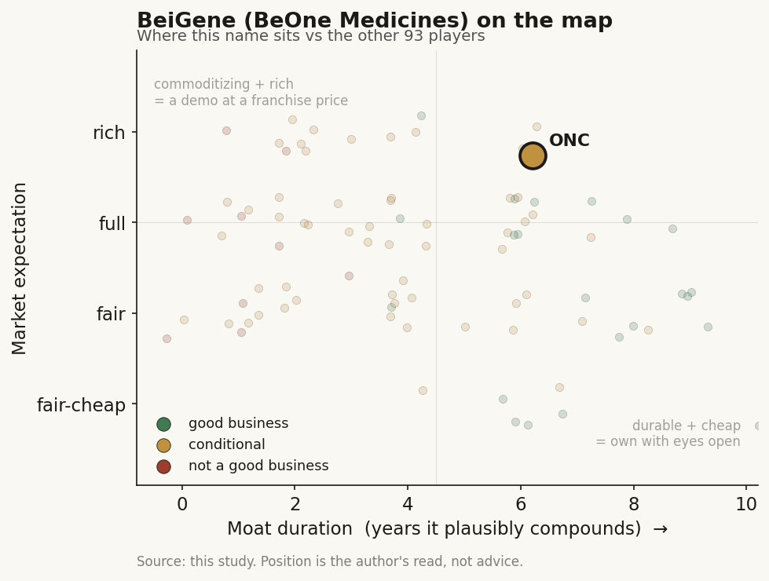

# BeiGene (ONC / NASDAQ (China))

> **The read.** A China-origin oncology company that just crossed into GAAP profit on one dominant drug (Brukinsa, ~70% of revenue), priced at ~68x earnings and ~5x sales as a global-scale growth compounder. The "AI-augmented discovery" label is thin - the real, proven edge is speed-and-cost of in-China clinical execution, not an AI platform. Good business, single-product concentration, and a geopolitics discount that is both the risk and the cheapness.

**Snapshot**

| | |
|---|---|
| Listing | ONC / Nasdaq (ADS = 13 ordinary shares); also HKEX 06160, Shanghai STAR 688235 |
| Region | China-origin, redomiciled Switzerland (Basel) Q2'25; ops in China + New Jersey |
| Value-chain layer | L9c-L9e (candidate selection through owned clinical development + global commercial) |
| Archetype | drug-owner (integrated discover-develop-commercialize oncology) |
| Size | ~$33bn market cap (6-Jul-26) |
| Revenue (latest) | Q1'26 $1.51bn, +35% YoY; FY26 guide $6.3-6.5bn |
| Moat verdict | conditional - a real commercial/execution moat on Brukinsa, NOT an AI moat |
| Expectation | full |
| Evidence quality | high on financials; low on the "AI-native" framing |

## What it is
A commercial-stage, oncology-focused biopharma founded in Beijing in 2010 (as BeiGene), rebranded BeOne Medicines and redomiciled to Switzerland in 2025 [disclosed]. It discovers, develops, manufactures, and now sells its own cancer drugs globally - a fully integrated drug-owner, not a discovery tool vendor. It is triple-listed (Nasdaq ADS "ONC", Hong Kong 06160, Shanghai STAR 688235). Its defining asset is Brukinsa (zanubrutinib), a BTK inhibitor that has become the revenue leader in its class in the US [reported].

> Flag: the "AI-augmented discovery" framing is [unverified] as a differentiator. BeOne uses computational chemistry and biomarker/AI partnerships (e.g., a mantle-cell-lymphoma biomarker collaboration) like most large biopharma [reported], but there is no disclosed proprietary AI discovery platform driving its pipeline. Profile it as a China-origin integrated oncology company whose edge is clinical speed and cost, with AI as a tool, not the thesis.

## Business model - how it makes money
Archetype 04 in its purest form - own the drug, book the product sales. Revenue is almost entirely product sales of self-developed or in-licensed oncology medicines, sold direct in the US/Europe/China [disclosed]:

- **Brukinsa (zanubrutinib, BTK inhibitor).** The engine. Q1'26 global sales $1.1bn, +38% YoY, of which US $761m (+35%) [disclosed]. ~70%+ of total revenue. Won share head-to-head on a differentiated safety/efficacy profile vs the incumbent BTK class.
- **Tevimbra (tislelizumab, PD-1 checkpoint inhibitor).** Q1'26 $206m [disclosed]. A lower-priced global PD-1 expanding across solid-tumor indications and geographies.
- **In-licensed portfolio (Amgen-partnered products in China).** Q1'26 $142m [disclosed]. Distribution economics, thinner margin.

The economics: capital-**hungry** - this is a real drug company with global salesforces, in-house manufacturing (China + Hopewell, NJ), and a >$2bn/yr R&D budget - but now self-funding, having crossed into GAAP profit. FY25 was the first full-year net income ($286.9m) [disclosed]; Q1'26 delivered GAAP net income $227.4m and EPS $2.05/ADS [disclosed]. Gross margins are high (small-molecule + biologic oncology, ~80%+ [estimate]); the swing factor is operating leverage as revenue outgrows a large but now-flattening SG&A/R&D base.

## Financial summary

| | FY24 | FY25 | Q1'26 | FY26 guide |
|---|---|---|---|---|
| Total revenue | ~$3.8bn | $5.34bn | $1.51bn (+35% YoY) | $6.3-6.5bn |
| - Brukinsa (global) | - | - | $1.1bn (+38%; US $761m) | - |
| - Tevimbra | - | - | $206m | - |
| - In-licensed (Amgen) | - | - | $142m | - |
| GAAP net income | loss | +$286.9m | +$227.4m | - |
| GAAP EPS (per ADS) | loss | positive | $2.05 | - |
| GAAP operating income | - | - | - | $750-850m guide |
| R&D expense | ~$1.95bn | ~$2.15bn | up YoY | - |
| TTM net income | - | - | ~$513m | - |

Prices/figures as of Q1'26 report + 6-Jul-2026 unless tagged. Note the ADS ratio: one ADS = 13 ordinary shares, so ~1.445bn ordinary shares ~ 111m ADS; EPS quoted per ADS.

## Value-chain position and competition
Spans candidate selection (L9c) through owned clinical development (L9e) and into global commercialization - the full integrated stack. What flows in: internal medicinal-chemistry programs plus in-licensed assets; what flows out: approved, self-marketed drugs and the cash they generate. Unlike an Isomorphic or a Tempus, there is no data-licensing or model-vendor annuity - value is captured entirely in the owned drug.

Competition, by layer:
- **Brukinsa's class (BTK inhibitors):** the incumbent branded BTK franchises it has been taking US share from [reported], plus next-gen BTK degraders/non-covalent agents (BeOne's own BGB-16673 is a BTK degrader - it is partly racing itself into the next modality).
- **Tevimbra's class (PD-1/PD-L1):** a crowded global checkpoint field where BeOne competes largely on price and breadth of indications, not best-in-class efficacy.
- **China-origin global oncology peers:** other China innovators pushing self-developed assets into US/EU trials at lower cost - the cohort BeOne leads on commercial scale but that validates the "cheap fast clinic" model broadly.

Edge: a proven ability to run large global registrational trials faster and cheaper than Western peers, and to out-execute an incumbent commercially with a differentiated molecule. That is a real, demonstrated capability - it is just an execution-and-commercial edge, not a data-network or AI moat.

## Moat
Three candidate moats, tested honestly:
- **Brukinsa commercial franchise - REAL but single-product (~5-8yr).** A differentiated, on-market drug taking share with patent protection is a genuine moat while it lasts. But it is one drug at ~70% of revenue, and BTK degraders/non-covalent competitors (including BeOne's own) point at eventual class rotation. Durable, not permanent; patent-cliff-dated.
- **Speed-and-cost clinical execution - REAL, replicable (~0-3yr as exclusivity).** The ability to run trials cheaply and fast in China is a true operating advantage, but it is a capability the entire China-innovator cohort is now copying - an edge in degree, not a defensible barrier.
- **AI-native discovery - NOT ESTABLISHED (~0yr).** No disclosed proprietary AI platform; AI/computational work is table-stakes tooling. Do not underwrite an AI moat here [unverified].

Net: the durable moat is the Brukinsa franchise plus a repeatable pipeline-generation machine (the same engine that produced Brukinsa is now advancing sonrotoclax, BGB-16673, a CDK4 inhibitor, a B7-H4 ADC, and a GPC3 bispecific). Estimated durable-compounding duration ~5-8 years, contingent on the next one or two owned assets landing before Brukinsa's growth matures.

## Core variables
1. **[CORE] Brukinsa durability and the second act.** ~70% of revenue rests on one drug. The whole thesis is whether the pipeline (sonrotoclax in CLL, BGB-16673 the BTK degrader, plus the solid-tumor entrants) converts a one-drug story into a franchise before BTK class rotation and eventual patent erosion bite. This is the master variable.
2. **[CORE] Operating-leverage / margin trajectory.** The bull case is not more revenue - it is that a >$2bn R&D base and heavy SG&A now sit largely built, so revenue growth drops to the bottom line. FY26 GAAP operating income guide of $750-850m on $6.3-6.5bn revenue is the number that either confirms or breaks the "profitable compounder" re-rate.
3. **[CORE] Geopolitics / the BIOSECURE discount.** A China-origin listing carries a policy-risk discount [reported]; the Swiss redomicile and dual China + NJ manufacturing are explicit attempts to de-risk it. Whether that discount narrows (re-rating tailwind) or widens (federal-procurement/supply-chain restriction, listing pressure) is exogenous and can move the multiple more than the fundamentals.

Below the line as noise: quarter-to-quarter Tevimbra indication approvals; the corporate-name change itself; individual early-pipeline readouts before they reach registrational scale.

## Bear case / key risks
A one-drug company wearing a platform multiple. Strip out Brukinsa and there is no profitable business yet - Tevimbra is a me-too PD-1 competing on price, and the in-licensed line is distribution margin. At ~68x earnings and ~5x forward sales, the market is paying for a durable multi-drug oncology franchise that, today, is a single blockbuster plus a hopeful pipeline. The "AI-augmented discovery" story is [unverified] and should not support any premium. Layered on top: a genuine geopolitical tail - a China-origin drugmaker is exposed to BIOSECURE-style federal-procurement restriction, export/IP-transfer limits, and US-listing pressure, none of which the company controls.

Falsification watch: (1) Brukinsa US growth decelerates sharply or a BTK degrader (rival or its own) cannibalizes the franchise before the pipeline scales - the concentration risk crystallizes; (2) FY26 operating income lands below the $750m floor, breaking the operating-leverage/profitable-compounder narrative; (3) a hard BIOSECURE designation or supply-chain restriction hits, re-widening the discount the Swiss move was meant to close.

## The expectation read
ADS ~$280, market cap ~$33bn, P/E ~68x, ~5x FY26E sales (6-Jul-26). That multiple prices BeOne as a global-scale, durably profitable oncology compounder - i.e., the market believes Brukinsa keeps taking share, the pipeline delivers a genuine second and third franchise, operating leverage drives GAAP income sharply higher off the now-built cost base, and the geopolitical discount narrows as the Swiss/global repositioning takes hold.

Where the belief looks soft: ~70% single-product concentration means the "franchise" is still mostly one drug; the profit is one full year old; the AI-native framing is unsupported; and the policy discount is priced as a headwind that fades rather than a tail that could re-open. The premium is the market extrapolating one proven blockbuster and one proven execution engine into a diversified, de-risked global oncology platform before the pipeline has confirmed it.

## Verdict
Good business - a real, cash-generative oncology franchise with a proven discover-develop-commercialize engine - but priced (~68x, ~5x sales) as a diversified global compounder when it is still ~70% one drug, one year into profitability, and carrying an exogenous geopolitics discount. The "AI-native" label does not hold up and should be dropped from the thesis. Confidence: HIGH on the financials (revenue, product splits, GAAP profit, guidance all disclosed and current); MEDIUM on the verdict, which hinges on two unresolved rate-of-change variables (pipeline conversion of the one-drug story into a franchise, and whether the BIOSECURE discount narrows or widens) plus a LOW-confidence dismissal of the AI framing on absence of disclosure.
