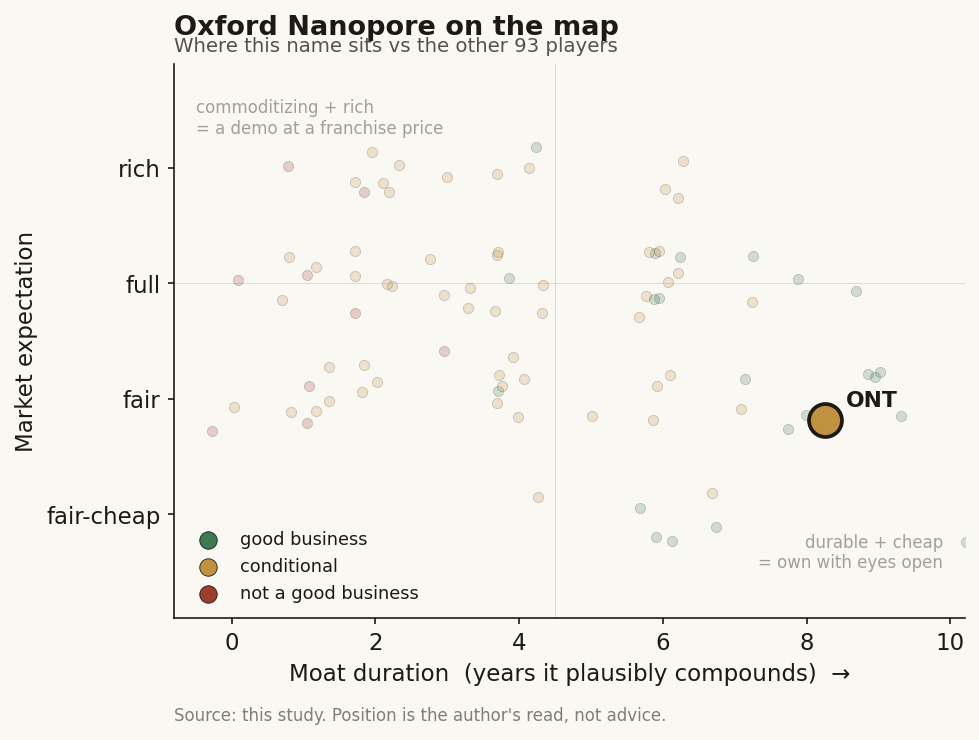

# Oxford Nanopore (ONT / LSE (UK))

> **The read.** A genuine platform monopoly - the only nanopore, real-time, long-read sequencing maker on Earth - but still a pre-profit hardware-plus-consumables business trading at ~5x sales on a ~24% grower that is a full two years from adjusted-EBITDA breakeven; the moat is real, the timeline and the cash burn are the whole risk, and the AI (Dorado basecalling) is a feature of the razor, not a separate value layer.

**Snapshot**

| | |
|---|---|
| Listing | ONT / London Stock Exchange (Main Market) |
| Region | EU (UK-listed, Oxford-based) |
| Value-chain layer | L2 - sequencing-platform node (instrument + flow-cell consumable + on-device AI basecalling) |
| Archetype | razor-and-blade hardware (instrument sale + recurring flow-cell/kit consumable), NOT per-test lab and NOT software |
| Size | ~GBP 1.17-1.22bn market cap (early Jul 2026); EV ~GBP 0.96bn (net cash) [reported] |
| Revenue (latest) | FY25 (to 31-Dec-25) GBP 223.9m, +24.2% CC / +22.2% reported [disclosed] |
| Moat verdict | conditional-durable - a sole-source technology platform, capped by a still-unproven path to profit |
| Expectation | fair-to-full (~5x EV/sales on a ~24% grower, but pre-profit) |
| Evidence quality | high on FY25 financials + guidance; med on segment margins and true clinical mix (UK non-US listing, less granular disclosure than US peers) |

## What it is
A UK sequencing-technology company that invented and is the sole commercial maker of nanopore sequencing - reading a DNA or RNA strand directly, in real time, by measuring the tiny electrical-current changes as the molecule passes through a protein pore. That raw current signal is meaningless without an AI model to translate it into bases; the "basecaller" (Dorado, open-source, GPU-accelerated) is the neural network that does the reading. So the L2 node here is genuinely AI-native at its core - the sequencer is a sensor and the AI is what turns the sensor into data. Portfolio spans the pocket-sized MinION (plugs into a laptop USB port) up to the high-throughput PromethION. It is not a lab that runs tests for you (that is Tempus/Exact/Caris at L3-L5); it sells the machine and the disposable flow cells, and the customer runs their own sequencing.

## Business model - how it makes money
Razor-and-blade, not per-test and not SaaS:

- **Instruments (the razor).** One-time sale of sequencing devices - MinION/GridION at the low end, PromethION at the high end. Lower margin, gets the platform onto the bench.
- **Consumables + kits (the blade - the recurring engine).** Every run burns a single-use flow cell plus library-prep kits. This is the annuity: once a lab standardizes on nanopore, it re-orders flow cells for every experiment. PromethION (the high-throughput flow cells) was the fastest-growing line at +43.1% in FY25; MinION was roughly flat (+2.4%); "Other" (kits, services) +12.0% [disclosed].

**Growth quality - the debate.** FY25 revenue GBP 223.9m, +24.2% constant currency, slightly ahead of the top of guidance - and, crucially, broad-based: over 20% CC growth in every region, and growth across every end-market and product line [disclosed]. By customer end-market: Clinical +59.9%, BioPharma +30.4%, Applied Industrial +27.2%, Research +15.1% [disclosed] - the mix is shifting off pure academic research toward applied/clinical, which is the higher-value, stickier demand. This is a clean ~24% compounder with a widening consumable annuity underneath it. The caution: it is still a mid-cap hardware business, not a hyperscaler, and ~10-15% of 2024 revenue was flagged as maximum NIH exposure [disclosed] - US public-science funding is a real swing factor.

**Incremental ROIC / cash conversion.** Capital-hungry and pre-profit. Adjusted EBITDA was a loss of GBP (86.7)m in FY25, improved from GBP (117.9)m in FY24; reported loss GBP (145.2)m (broadly flat, absorbing GBP 22.6m of restructuring) [disclosed]. Gross margin 58.6% (adjusted 59.4%), up 110bps, with the FY26 guide stepping to ~62% on flow-cell recycling and a new pricing model [disclosed]. Cash and liquid investments GBP 302.8m at year-end, down from GBP 403.8m - i.e. it burned ~GBP 100m of the balance sheet in one year [disclosed]. Management reaffirms adjusted-EBITDA breakeven in FY27 and cash-flow-positive in FY28 [disclosed]. So: a real gross-margin business, but the path to a self-funding P&L is still two years of promises away, and the balance sheet is the clock.

## Financial summary

| Metric | FY24 | FY25 | FY26 guide |
|---|---|---|---|
| Revenue | ~GBP 183m | GBP 223.9m | +21-25% CC |
| Revenue growth (CC) | +23.3% | +24.2% | +21-25% |
| Gross margin | 57.5% | 58.6% (adj 59.4%) | ~62% |
| Adjusted EBITDA | GBP (117.9)m | GBP (86.7)m | loss, narrowing |
| Reported loss | GBP (146.2)m | GBP (145.2)m | - |
| Cash + liquid investments | GBP 403.8m | GBP 302.8m | - |

FY25 end-market mix: Clinical +59.9%, BioPharma +30.4%, Applied Industrial +27.2%, Research +15.1%. Product mix: PromethION +43.1%, MinION +2.4%, Other +12.0%. Figures as of the FY25 annual results (year to 31-Dec-2025) [disclosed].

## Value-chain position and competition
This is an L2 node - the sequencing platform itself - one layer upstream of the diagnostics labs (L3-L5) that consume sequencing output. What flows in: a raw biological sample and consumables. What flows out: base-called reads (via Dorado). The value is captured in the flow-cell annuity and the switching cost of a standardized workflow, not in an interpretive/reimbursed call. Nanopore's structural differentiators versus the incumbents: real-time streaming data, ultra-long reads, native detection of base modifications (methylation) without extra chemistry, and portability (a USB-stick sequencer). The AI/basecalling sits inside the razor - Dorado is what makes a nanopore read accurate - so unlike the AI-native drug-discovery names, there is no separate "AI product" to re-rate; the model is a component of the instrument.

Competition:
- **Illumina** - the short-read incumbent that dominates the broader sequencing market on cost-per-base and accuracy for high-throughput, short-read applications. It is the 800-lb gorilla of the category, but it plays a *different* game (short read, batch, centralized) than nanopore (long read, real-time, distributed).
- **PacBio (PACB)** - the other long-read player, HiFi chemistry, higher raw accuracy per read but batch-based, no real-time, no native long-read-plus-methylation portability. ONT and PacBio are the long-read duopoly; ONT is the only *nanopore* one.
- **No direct nanopore competitor.** This is the crux: nobody else sells a commercial nanopore sequencer. The moat is a genuine sole-source technology platform, protected by two decades of pore/enzyme/chemistry/basecaller IP.

Edge: the only real-time, long-read, portable, modification-native platform, with a growing consumable annuity and a shift toward stickier clinical/applied demand. New optionality: a Cepheid (Danaher) partnership for automated infectious-disease sequencing, a bioMerieux collaboration (AmPORE-TB for drug-resistant tuberculosis), and the first registered IVD product (GridION Dx) - early steps into regulated clinical channels.

## Moat
Two candidate moats, and they split cleanly:
- **Sole-source technology platform - CONFIRMED (~7-10 yr).** No one else makes a commercial nanopore sequencer. The moat is the stack of pore engineering, motor enzymes, sensing electronics, and the Dorado basecaller trained on proprietary signal data - two decades of compounding IP that a new entrant must re-build from scratch. Reinforced by workflow switching cost: once a lab standardizes on nanopore for long-read/real-time work, re-ordering flow cells is the default. This is a real, durable platform monopoly within its niche.
- **AI/basecalling as a standalone moat - REFUTED (~0 yr as a separate layer).** Dorado is open-source, and academic groups already publish basecallers that beat it on specific tasks (e.g. a 2026 direct-RNA basecaller reporting a ~6% accuracy edge on human RNA) [reported]. The AI matters because it is welded to the proprietary hardware and signal data - not because the model itself is defensible. The value is the *sensor plus data plus model together*, captured through the flow cell, not the algorithm alone.

Net: the durable moat is the nanopore platform monopoly and the consumable annuity, roughly 7-10 years of technology lead. The cap is not competitive - it is financial: the moat only compounds into shareholder value if the business reaches self-funding profitability before the cash runway or dilution forces the issue.

## Core variables
1. **[CORE] Path to profit - adjusted-EBITDA breakeven (FY27) and cash-flow positive (FY28).** The entire equity case is a bet on this timeline. Revenue is compounding at ~24% and gross margin is stepping to ~62%; the question is whether operating-cost discipline (guide: opex +0-5%) closes a ~GBP 87m adjusted-EBITDA loss in two years without another capital raise. The GBP 303m cash balance, burning ~GBP 100m/yr, is the clock.
2. **[CORE] Consumable-annuity growth and mix (PromethION + clinical/applied).** The re-rating rests on the recurring flow-cell revenue - specifically PromethION (+43.1%) and the clinical (+59.9%) / applied mix shift off lower-value research demand. This is the line that proves the razor-and-blade annuity is real and stickening, not just instrument placements.
3. **[CORE] Gross-margin trajectory toward ~62%+.** Margin is the swing between "compounding hardware annuity" and "capital-hungry instrument maker." Flow-cell recycling and the new pricing model are guided to lift GM ~340bps in FY26; delivery here is what makes the breakeven math work.

Below the line as noise: the Gordon Sanghera -> Francis Van Parys CEO handover (2-Mar-2026); the ~$25bn management-identified TAM (a top-down number, not a near-term revenue driver); individual clinical partnership headlines (Cepheid, bioMerieux) before they convert to material consumable pull-through; short-term GBP/USD currency swings.

## Bear case / key risks
A sole-source technology platform that is still, five years after IPO, not profitable - and the equity has told that story: floated in September 2021 at 425p (~GBP 4.5bn peak), the shares now sit near ~120p, a ~70% de-rate, because the market repriced a growth-hardware promise that keeps pushing profitability out [reported]. Three legs to the bear: (1) **Cash clock** - GBP 303m of liquidity, burning ~GBP 100m/yr, with breakeven not promised until FY27 and cash-positive not until FY28; any revenue miss or margin slip inside that window risks a dilutive raise near a depressed price. (2) **Funding-cycle exposure** - a meaningful slice of revenue is academic/public-science demand (up to 10-15% NIH exposure disclosed), which is cyclical and policy-driven, not defensive. (3) **A giant next door** - Illumina dominates the broader sequencing market on cost and scale; if short-read economics or a rival long-read approach closes nanopore's real-time/long-read advantage in the applications that matter, the niche monopoly narrows.

Falsification watch: (1) FY26/FY27 adjusted-EBITDA loss fails to narrow on schedule, or a capital raise is announced - the "path to profit" thesis breaks; (2) consumable/PromethION growth decelerates below the low-20s, signalling the annuity is instrument-led not re-order-led; (3) gross margin stalls below ~60%, proving the pricing-model/recycling tailwinds were one-off, not structural.

## The expectation read
Shares near ~120p, market cap ~GBP 1.17-1.22bn, enterprise value ~GBP 0.96bn net of cash (early Jul 2026) [reported]. On FY25 revenue of GBP 223.9m that is roughly ~5x EV/sales (~4x forward on the FY26 guide) for a ~24%-CC grower with ~59% gross margin and a credible line of sight to ~62%. That multiple is neither cheap nor euphoric - it is the market paying a fair-to-full price for a genuine platform monopoly while explicitly *withholding* the software/AI premium the US AI-native names carry. What the price assumes: that ONT executes the FY27 breakeven / FY28 cash-positive plan without a dilutive raise, that the consumable annuity keeps compounding in the low-20s, and that the clinical/applied mix shift makes the revenue stickier. Where the belief looks soft: the entire re-rate is a *timeline* bet on profitability that has already slipped once from the IPO story, funded by a shrinking cash balance - so the market is not overpaying for AI hype (it isn't, here), it is underwriting execution over the next 24 months. No buy/sell call - the read is that the platform is real and the price is reasonable, but the risk is concentrated entirely in the cash-clock-versus-breakeven race.

## Verdict
Good business - a genuine, sole-source nanopore platform monopoly with a real consumable annuity and an AI basecaller welded to the hardware - conditionally, and priced fairly rather than richly (~5x EV/sales) precisely because the market is not paying it a software multiple. The moat (7-10 years of platform IP) is real; the risk is financial and temporal: it is still pre-profit, burning ~GBP 100m/yr against ~GBP 303m of cash, with breakeven a promised FY27 and self-funding a promised FY28. Confidence: HIGH on the FY25 financials, guidance, and the sole-source moat (all disclosed and current); MEDIUM on segment-margin granularity and true clinical revenue quality (UK non-US listing gives less line-item disclosure than US peers); the verdict hinges on one unresolved rate-of-change - does the ~24% top line and ~62% GM close an GBP 87m EBITDA gap before the cash clock forces dilution.
