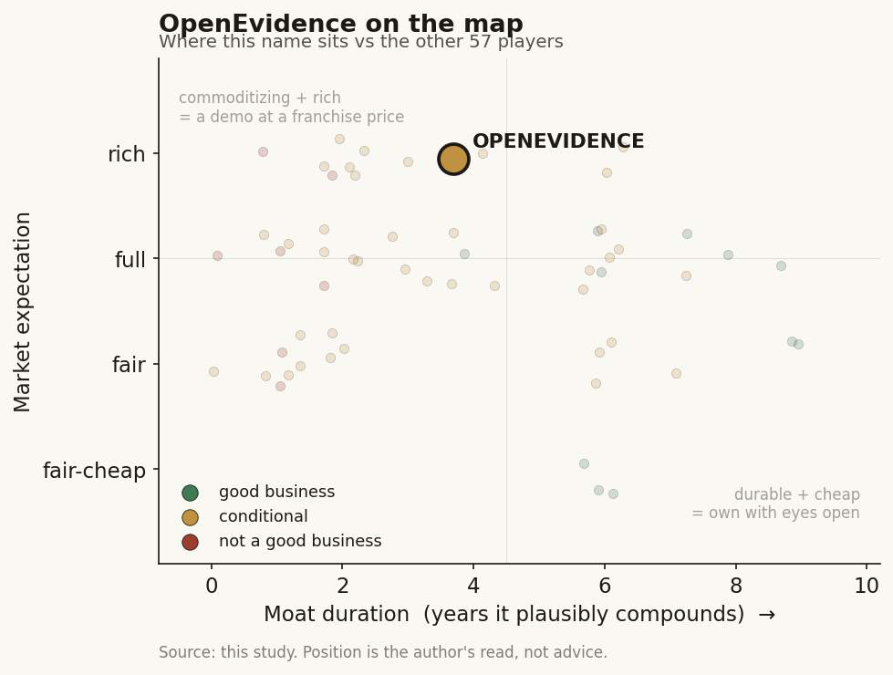

# OpenEvidence (private)

> **The read.** A real, category-defining clinical-answer platform with a genuine licensed-corpus + physician-habit moat that clears the "owns a scarce input" bar - but the scarce input is rented and the model commoditizes, so at ~80x run-rate the ~$12bn mark already prices near-perfect execution.

**Snapshot**

| | |
|---|---|
| Listing | private |
| Region | US |
| Value-chain layer | L6 clinical-workflow / knowledge layer |
| Archetype | AI-services / CDS (pharma-funded SaaS variant) |
| Size | $12.0bn last private valuation (Jan 2026) |
| Revenue (latest) | ~$150m annualized exiting 2025 (from ~$7.9m in 2024, ~1,800% YoY) |
| Moat verdict | conditional |
| Expectation | rich |
| Evidence quality | med |

## What it is
A clinical decision-support (CDS) search engine - "ChatGPT for doctors" - that returns citation-linked answers synthesized from licensed peer-reviewed literature (NEJM, JAMA, Cochrane, society guidelines). Free to verified clinicians; monetized by pharma advertising. It sits at value-chain layer L6, archetype AI-services / CDS (a variant of the SaaS archetype, but the payer is pharma, not the provider).

## Business model - how it makes money
Freemium B2B2C, pharma-ad-funded. Free to clinicians; revenue comes from targeted pharmaceutical/device advertising placed against clinical queries. The whole model rests on the value of a verified-physician-at-point-of-decision impression: CPMs are quoted at $70-$1,000+ vs $5-15 for consumer social, against a ~$20-25bn US digital pharma ad market TAM anchor. It is capital-light in the classic sense (no wet lab, no reimbursement, no inventory) but not zero-marginal-cost - per-query LLM inference is a real COGS and content licensing is a fixed toll. Cash conversion is strong at ~90% gross margin. Enterprise health-system subscriptions are "in development" - a second, provider-paid leg not yet material.

## Financial summary
No public financials (private). The funding and revenue-physics table:

| Round | Date | Amount | Valuation | Lead(s) |
|---|---|---|---|---|
| Series A | Feb 2025 | $75m | $1.0bn | Sequoia [reported] |
| Series B | Jul 2025 | $210m | $3.5bn | GV, Kleiner Perkins [disclosed] |
| Series C | Oct 2025 | $200m | $6.1bn | GV; + Sequoia, Blackstone, Thrive, Coatue, BOND, Craft [reported] |
| Series D | Jan 2026 | $250m | $12.0bn | Thrive Capital + DST Global [disclosed] |

Roughly $700m raised since a 2022 founding, almost all inside a ~12-month sprint [reported]. Founder/CEO Daniel Nadler (Harvard PhD; prior founder of Kensho, sold to S&P Global 2018) + co-founder Zack Ziegler. Valuation went 1.0 -> 3.5 -> 6.1 -> 12.0bn in ~11 months - a ~12x re-rate. Backers are top-decile crossover/growth (Sequoia, GV, Thrive, DST, Coatue, Blackstone). Revenue: ~$150m annualized exiting 2025 (from ~$7.9m in 2024, ~1,800% YoY), ~90% gross margin [reported]. At $12bn on ~$150m annualized run rate, the multiple is ~80x run-rate revenue - priced as a category-defining platform, not a services business.

## Value-chain position and competition
Sits at the L6 clinical-workflow / knowledge layer, on top of L0 rails (it announced a Microsoft collaboration to reach clinicians inside enterprise workflows [disclosed]). Inbound: licensed full-text corpus (NEJM/JAMA/Cochrane/NCCN/society guidelines) + a frontier LLM it rents. Outbound: to the clinician, a cited answer at the point of care; to pharma, a targeted, measurable impression on a verified prescriber. It captures no reimbursement dollar - it monetizes attention, sitting beside the payer/provider economics rather than inside them. What is scarce and flows through it: (a) the licensed corpus, (b) the verified-physician audience + engagement graph.

Content incumbents: UpToDate (Wolters Kluwer), Elsevier ClinicalKey, DynaMed - paid, subscription, non-generative. Pure-play AI copilots: Glass Health, Hippocratic AI. Platform threat: Epic / Oracle Health (own the EHR screen) and, above all, OpenAI / Google / Microsoft (could build an equivalent generalist medical answer). Its edge is threefold and real: (1) licensed premium corpus (NEJM/JAMA are exclusive-ish content the generalist chatbots cannot legally train on or cite cleanly); (2) physician habit / distribution - ~40% of US physicians, ~757k verified clinicians, ~18-20m consults/month, ~65k new verified registrations/month [reported]; (3) a novel monetization (pharma ad, free to the doctor) that removed the pricing-friction that gates UpToDate. First-mover in a winner-take-most attention market.

## Moat
Lands on the workflow-embedding / distribution verdict, CONDITIONAL, and OpenEvidence is explicitly on the durable / "owns a scarce input" side of that split. The unifying test: does the vendor own a scarce input the platform beside/above it cannot cheaply replicate? Here, partly yes - the licensed NEJM/JAMA corpus + the physician-habit / verified-audience asset is a content-licensing + distribution moat a generalist agent (Epic's or OpenAI's) cannot cheaply clone. That qualifying condition is why OpenEvidence is graded above the pure ambient-scribe cohort (Abridge/Ambience/Suki), which owns neither model nor distribution.

But durability is bounded on two axes. (1) The licensed corpus is rented, not owned - the moat is only as durable as exclusivity in the NEJM/JAMA/Cochrane contracts, which can be renegotiated or matched (publishers can license to a rival, or build their own). (2) The model below commoditizes (~1yr) and the distribution beside/above (Microsoft/Epic/OpenAI) can attempt envelopment. So the durable core is the habit + licensed-content + measurement-graph triple, not the model and not the app shell. Is the moat real for a private at this stage? Real but unproven at price - because the product is free, there is no NRR-at-price to audit; the switching cost is habit, not a signed multi-year contract. The single cleanest falsification would be a publisher licensing the same corpus to a big-tech medical agent, or physicians defaulting to a bundled EHR/foundation-model answer. Estimated duration of protected compounding: ~3-5 years, contingent on renewing content exclusivity and staying ahead on the physician-habit loop.

## Core variables
1. **Content-license exclusivity / renewal.** The corpus is the scarce input; if NEJM/JAMA/Cochrane license the same text to OpenAI/Google or a publisher-built rival, the moat's load-bearing leg goes. This is the single variable that decides whether the audience is defensible or merely early.
2. **Physician-habit durability vs platform substitution.** Does the ~40%-of-US-physicians / ~18m-consult-per-month engagement hold once a bundled EHR answer or a big-tech medical agent reaches good-enough? Free product = zero contractual switching cost, so retention is the whole thesis.
3. **Ad-model integrity / take-rate durability.** Can it grow the pharma-ad dollar (into the ~$20-25bn pool) without eroding physician trust or drawing HIPAA/promotional-ethics regulation? The revenue quality - and the 90% GM - lives or dies here.

(Noise discarded from the full set: ad-load tolerance, big-tech entry timing, enterprise-subscription attach, inference COGS.)

## Bear case / key risks
A free feature monetized by ads, priced as a platform, sitting between two owners it doesn't control. (1) Content dependency: the defensible input (NEJM/JAMA text) is licensed, not owned - the publishers hold the leverage and can arm a competitor. (2) Envelopment from above: OpenAI/Google/Microsoft (trillion-dollar, and OE already partners with Microsoft - the same "landlord becomes competitor" pattern seen with Epic vs the scribes) can ship a good-enough cited medical answer; Epic owns the screen. (3) No switching cost: free to the doctor means habit is the only lock-in; a better free tool wins instantly. (4) Revenue-quality tail-risk: the entire run rate is one revenue stream (pharma ads embedded in clinical decisions) - the Outcome Health parallel (an ad-in-the-workflow healthcare unicorn that ended in fraud charges) is the cautionary base rate [reported]; ad targeting on clinical engagement data invites HIPAA / promotional-ethics scrutiny. (5) Valuation: ~80x run-rate on a services/attention business prices near-perfect execution and durable exclusivity - leaving no margin for a license reset or a big-tech entrant.

## The expectation read
At $12bn on ~$150m annualized run rate, the ~80x run-rate multiple prices OpenEvidence as a category-defining winner-take-most platform with durable content exclusivity - not as the pharma-ad-funded services business its P&L currently is. Because the product is free, the market is paying for the physician-habit loop and the licensed-corpus exclusivity as if both were owned and permanent. That belief looks soft precisely where the moat is rented: a single publisher licensing the same corpus to a big-tech medical agent, or a bundled EHR/foundation-model answer reaching good-enough, would reset both the exclusivity premium and the ~90% gross margin the mark assumes. The price leaves no margin for a license reset or an envelopment from above.

## Verdict
Conditional durable value-capturer, B / B-plus, medium confidence. More than a demo - real revenue, real 40%-physician distribution, a genuine licensed-corpus + habit moat that clears the "owns a scarce input" bar - but the scarce input is rented and the model is commoditizing, so the ~3-5yr moat hinges on renewing content exclusivity and out-running big-tech envelopment; at ~80x run-rate the price already assumes it wins. Good business at a rich expectation: durable enough to matter, not yet durable enough to justify the mark.
