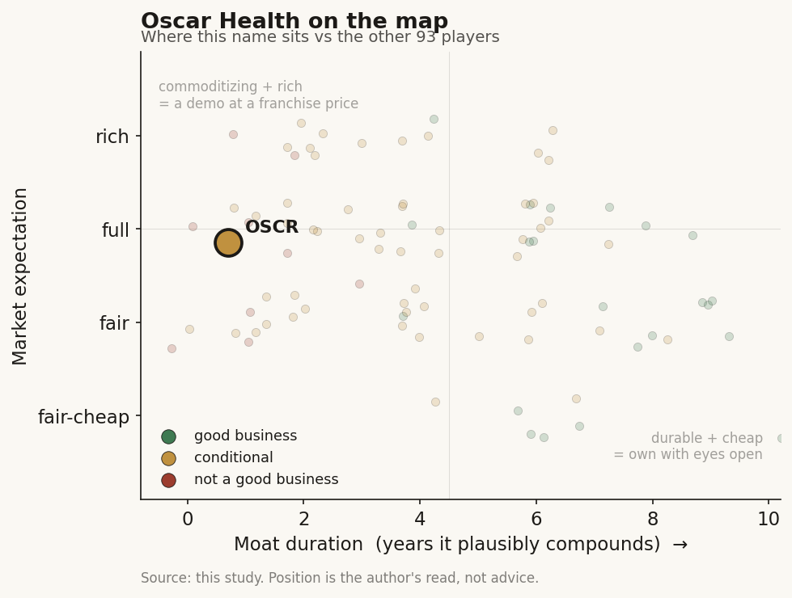

# Oscar Health (OSCR / NYSE)

> **The read.** A real turnaround at a pure individual-market insurer where AI is a genuine SG&A-cost lever but not an MLR lever - the ratio that decides the P&L moves on pricing, morbidity, and risk-adjustment, none of which a chatbot touches. The stock now prices a durable margin recovery into the teeth of a subsidy cliff that just took away the tailwind that grew it.

**Snapshot**

| | |
|---|---|
| Listing | OSCR / NYSE |
| Region | US |
| Value-chain layer | payer - individual-market (ACA) health insurer with a B2B tech-platform bolt-on |
| Archetype | risk-bearing insurer (premium in, claims out) wearing an "insurtech" label |
| Size | ~$9.7bn market cap (~$32.05, ~303m shares, 5-Jul-26) [reported] |
| Revenue (latest) | Q1'26 $4.6bn, +53% YoY; FY26 guide $18.7-19.0bn [disclosed] |
| Moat verdict | weak - a subscale ACA carrier; tech is efficiency, not lock-in |
| Expectation | full - prices a durable margin recovery |
| Evidence quality | high (segment splits, MLR, guidance all disclosed) |

## What it is
A health-insurance company that sells individual (ACA marketplace) plans and calls itself technology-first. It is not a diagnostics or drug-discovery node - it sits at the payer layer, taking premium and paying medical claims, with a small B2B software arm (+Oscar) that licenses its tech stack to other carriers and providers. The AI framing is real in operations but does not change what the business fundamentally is: a risk-bearing insurer whose profit is the thin gap between premiums collected and claims paid.

## Business model - how it makes money
One dominant engine and one aspirational one:

- **Insurance (essentially all revenue).** Collect premium, pay claims. Profit = premium - claims (the medical loss ratio, MLR) - admin (SG&A). Oscar is the largest carrier dedicated to the individual/ACA market (~23m lives nationally), ~3.2m members Q1'26 (+56% YoY) [disclosed]. Revenue is regulated: the ACA forces insurers to spend at least ~80% of premium on care (rebate floor), so the lever that matters is pricing the risk correctly, not squeezing the claim.
- **+Oscar / B2B tech (immaterial today).** Licenses the Campaign Builder / platform stack to other payers and providers. Q1'25 B2B services revenue was ~$4.3m and shrank YoY; a major tech customer was lost. This is the "insurtech" story that justifies a tech multiple - and it is a rounding error against $11.7bn of insurance revenue.

**Where AI actually lands.** On the SG&A line, not the MLR line. Oswell (member-facing health agent) completes ~86% of member questions; agentic care-guide bots cut response times ~67% at peak; a real-time drug-pricing tool flags abandonment risk. These are genuine capabilities and they show up: SG&A ratio hit 15.2% in Q1'26, a company-record low, ~60bps better YoY, credited partly to "technology and AI initiatives" [disclosed]. But SG&A is ~16% of premium; MLR is ~83%. AI is trimming the small line.

## Financial summary

| | FY2024 | FY2025 | Q1'26 | FY26 guide |
|---|---|---|---|---|
| Revenue | $9.2bn | $11.7bn | $4.6bn (+53%) | $18.7-19.0bn |
| Net income (loss) | - | -$443.2m | +$679m | - |
| Diluted EPS | - | -$1.69 | +$2.07 | - |
| MLR | 81.7% | 87.4% | 70.5% | 82.4-83.4% |
| SG&A ratio | - | - | 15.2% | 15.8-16.3% |
| Earnings from operations | - | - | $704m | $250-450m |
| Members | - | - | 3.2m | - |

Figures disclosed; prices as of 5-Jul-2026. Note the Q1 shape: Q1'26's 70.5% MLR is seasonally the year's low (deductibles unmet, favorable ~$68m prior-period development) - management's own full-year guide is 82.4-83.4%, ~1,200bps higher. Q1's record $679m profit is front-loaded; the full year is guided to $250-450m of operating earnings.

## Value-chain position and competition
Oscar sits at the payer layer of the health-insurance chain: member -> premium -> Oscar -> provider network -> claims paid. It is upstream of no one and downstream of employers/exchanges. The +Oscar arm reaches sideways toward being a tech-enabler for other payers, but that leg is not scaling.

Competition:
- **Scale incumbents:** UnitedHealth, Elevance, Centene, CVS/Aetna - vastly larger, diversified across Medicare/Medicaid/commercial, with real bargaining power over providers. Oscar is a single-market specialist against them.
- **ACA-marketplace peers:** Centene (Ambetter) is the individual-market volume leader; Oscar is a distant challenger. The 2025 morbidity shock that pushed Oscar's MLR to 87.4% hit the whole ACA pool.
- **Insurtech cohort:** Clover, Bright Health (failed), Alignment - the "tech-first insurer" category has a graveyard. Being a better software shop did not save the ones that mispriced risk.

Edge: a cleaner tech stack and lower admin cost than legacy carriers - real, but it is an operating-efficiency edge, not a structural moat. It does not stop a member from switching for $1 of premium, and it does not change the claims that arrive.

## Moat
Thin.
- **Cost/efficiency edge - REAL but not a moat (~0-2 yr).** The AI-driven SG&A advantage is genuine and measurable (15.2% ratio). But admin efficiency is copyable, it is the small line, and it confers no customer lock-in. ACA members are famously price-sensitive and re-shop annually.
- **Scale/network - ABSENT.** Oscar lacks the provider-bargaining and diversification of the incumbents; its entire book sits in the single most volatile, most politically exposed corner of US health insurance.
- **Data-network flywheel - UNPROVEN.** The +Oscar B2B thesis (sell the stack to others) is the only path to a real platform moat, and it is shrinking, not compounding.

Net: no durable moat. This is a well-run subscale insurer in a hard, regulated, price-competitive market. Estimated durable-advantage duration ~0-2 years - it is an execution story, not a franchise.

## Core variables
1. **MLR - and what actually moves it.** This is the whole P&L. It moved from 81.7% (2024) to 87.4% (2025) on market morbidity and risk-adjustment transfers, then guided back to 82.4-83.4% for 2026 on repricing (double-digit rate increases) and disciplined enrollment. None of that is AI - it is actuarial pricing and the risk pool. The honest question the brief asks: does AI lower MLR? On the evidence, no - AI lowers SG&A. MLR is set by how well Oscar priced the risk and how sick its members turn out to be.
2. **The subsidy cliff (dominant, exogenous).** Enhanced premium tax credits expired 31-Dec-2025; the House passed a 3-year extension 8-Jan-2026 (230-196) but the Senate failed to reach 60 votes, and they lapsed [reported]. KFF estimates marketplace premiums more than double on average without them; the Urban Institute estimates ~4.8m more uninsured. For a carrier that is 100% individual-market, this is the single largest 2026-2027 variable - it directly threatens the membership that drove +56% growth. Oscar's own guidance assumes it prices and shrinks through this; the risk is adverse selection (healthy members drop, the pool gets sicker, MLR breaks the guide).
3. **Membership vs profitability trade.** Management's stated 2026 posture is "balancing membership and profitability" - i.e. it may shed members to protect margin. Growth and margin are now in tension in a way they were not during the subsidy-fueled expansion.

Below the line as noise: the +Oscar B2B revenue line; quarterly SG&A basis points; the Lucie marketplace launch; ICHRA optionality (real long-term, tiny today).

## Bear case / key risks
An insurtech label on a subscale ACA insurer at the worst possible moment in the subsidy cycle. Three-quarters-plus of the cost base is medical claims Oscar does not control, priced off a risk pool that just delivered a 570bps MLR blowout in a single year (2025). The AI that the story leans on demonstrably touches the ~16% SG&A line, not the ~83% MLR line - so the "AI lowers our loss ratio" implication is largely marketing; the loss ratio moved on pricing and morbidity. The enhanced subsidies that grew membership from ~1m to ~3m have now expired with no extension, threatening adverse selection precisely as the company tries to hold a low-80s MLR. And the one path to a real tech moat (+Oscar) is shrinking, with a marquee customer lost.

Falsification watch: (1) FY2026 MLR lands above the 83.4% top of guide - the recovery is not durable and repricing did not hold; (2) membership falls sharply post-subsidy-expiry AND the residual pool is sicker (adverse selection confirmed); (3) +Oscar B2B revenue keeps shrinking - the platform/AI-enabler thesis is dead and this is just an insurer. Conversely, the bull is proven if FY2026 delivers the guided operating profit WITH stable membership through the cliff.

## The expectation read
Shares ~$32.05, market cap ~$9.7bn, ~303m shares (5-Jul-26); the stock is up ~82% over the trailing year and jumped ~14% on the proposed subsidy-extension headline alone - a tell that the market knows the subsidy is the swing factor. On FY26 guidance ($18.7-19.0bn revenue, $250-450m operating earnings), the market is buying a durable return to profitability and margin normalization off the 2025 disaster - and paying a premium that implies the AI-driven efficiency story is a structural, compounding edge rather than a one-time cost reset.

Where the belief looks soft: the profit engine (MLR) is actuarial and exogenous, not technological; Q1's record profit is seasonally front-loaded against a full-year guide four-fifths lower; and the entire book sits in the individual market at the exact moment its subsidy support was pulled and not restored. The premium is the market paying for a tech-enabled margin story whose central metric AI does not actually control.

## Verdict
Real business, real operating turnaround, real AI - but the AI is a genuine SG&A-efficiency capability mislabeled as an MLR lever, and the moat is thin. Priced full for a durable margin recovery into a subsidy cliff that just removed the tailwind, so the expectation is demanding rather than fair. This is a well-run subscale ACA insurer, not a defensible tech platform; the answer to "does AI lower the medical-loss ratio or is it a story?" is: AI is real on the admin line and a story on the MLR line. Confidence: HIGH on the facts (MLR path, segment economics, subsidy status, valuation all disclosed/current); MEDIUM on the verdict, which hinges on one exogenous variable (the subsidy/adverse-selection outcome) that could break the margin guide either way.
