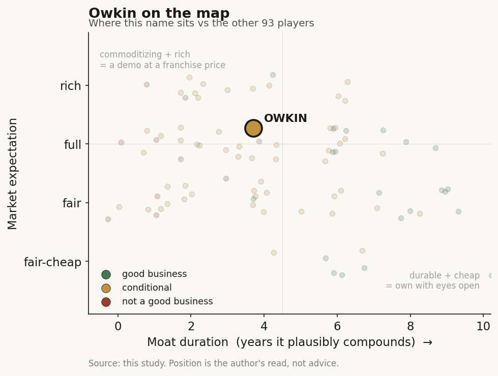

# Owkin (private (France/US))

> **The read.** The EU's Tempus-for-pharma - an AI-for-pharma platform pivoting from a federated-data flywheel to selling agentic "AI scientist" software to big pharma - with a real, scarce distribution asset (BMS/Sanofi/AstraZeneca/MSD on the cap table and on contracts) but a moat that is renting, not owning: it spun the diagnostics and the foundation model into separate companies, so what is left is a services-heavy R&D engine priced on a ~$1bn unicorn mark set in 2021 that its own numbers no longer clearly support. Size for the pharma-access optionality, not for a durable software annuity.

**Snapshot**

| | |
|---|---|
| Listing | private (no traded stub; exposure via secondary/pre-IPO markets or Sanofi/BMS as strategic holders) [reported] |
| Region | EU (Paris HQ + New York; French-American) |
| Value-chain layer | L5-L7 (multimodal clinico-genomic data -> AI tooling -> pharma R&D applications) |
| Archetype | data-platform / AI-tool vendor (federated data annuity pivoting to agentic-software licensing) |
| Size | ~$1bn valuation, "unicorn" since Nov-2021 [reported]; not re-marked publicly since |
| Revenue (latest) | not disclosed; revenue is pharma-partnership cash (upfront + milestones), no product P&L [disclosed - undisclosed] |
| Moat verdict | conditional - real pharma distribution/access, but the data flywheel is the refuted discovery form and the software layer is commoditizing |
| Expectation | full-to-rich (a 2021 unicorn mark on a business it has since carved down) |
| Evidence quality | med (private; partnerships disclosed, financials are not) |

## What it is
A French-American AI biotech founded 2016 in Paris by Thomas Clozel (oncologist) and Gilles Wainrib (AI professor), ~250 staff (2026) [reported]. Its original idea was federated learning - train models across many hospitals' patient data without the data ever leaving the hospital (open-sourced as Substra; scaled in the 10-pharma MELLODDY consortium) [disclosed]. That privacy-preserving access to fragmented European hospital data is what earned it the "EU Tempus-for-pharma" label: like Tempus (TEM), it turns multimodal clinico-genomic data into products for pharma - but where Tempus owns a US reimbursement-gated lab that generates the data, Owkin brokers access to data it does not own, across borders and privacy regimes. In 2024-26 it repositioned hard from "federated data company" to "AI Scientist" software vendor, selling agentic co-pilots (K Navigator, K Pro) built on its own biological reasoning model (OwkinZero, a 32bn-param model trained on ~10m curated biomedical Q-A pairs) [reported].

## Business model - how it makes money
One engine, several wrappers, no product P&L:

- **Strategic pharma R&D partnerships (the core).** Multi-year deals with big pharma: upfront cash + milestones + occasional royalty back-ends, in exchange for AI-driven target ID, patient subgrouping, biomarker discovery and trial de-risking. Signed: Sanofi (2021, a EUR 90m / ~$103.6m oncology collaboration alongside a $180m equity check) [disclosed]; BMS (2022, trial-design); MSD (2023, digital-pathology dx in the EU); Servier (2023); AstraZeneca (2024 gBRCA pre-screen, expanded 2026 to a 3-year K Pro license); Sanofi again (Jun-2026, a 5-year K Pro license to build purpose-built AI agents) [disclosed]. This is services-and-license revenue, not recurring SaaS seats.
- **Agentic software licensing (the pivot).** K Pro / K Navigator sold as multi-year licenses to pharma. This is the layer Owkin now leads with and the one it wants an eventual IPO priced on.
- **What it no longer keeps.** It spun the diagnostics arm out as **Waiv** (Mar-2026, $33m raise, took MSIntuit CRC + RlapsRisk BC) and incubated its **Bioptimus** foundation-model unit as a separate company (2024, later ~$76m funded). Management frames this as a "network of businesses" [reported]; read plainly, the two pieces most likely to carry a durable moat - the owned diagnostic revenue line and the frontier foundation model - now sit in other cap tables.

**Capital intensity / cash conversion.** Capital-medium and lumpy. Not a capital-hungry drug owner (no owned trials to fund) and not a capital-light SaaS annuity either - it is a services-heavy engine whose "revenue" is negotiated pharma cash that arrives in chunks. No disclosed margins, burn, or runway [unverified].

## Financial summary
Private; no P&L disclosed. Profiled on funding/backers/deals, tagged by provenance.

| Item | Detail | Tag |
|---|---|---|
| Total raised | "over $255-334m" across sources; company/Wikipedia say >$255m, trackers cite ~$321-334m | [reported - range] |
| Valuation | ~$1bn, "unicorn" on Sanofi's Nov-2021 $180m investment; **not re-marked publicly since** | [reported] |
| Sanofi (2021) | $180m equity + EUR 90m (~$103.6m) oncology collaboration | [disclosed] |
| BMS (2022) | equity investor + clinical-trial-design collaboration | [disclosed] |
| Other backers | GV (Google Ventures), Fidelity, Bpifrance, Otium, MACSF, Bridford, Key Ventures among ~22 investors | [reported] |
| Waiv spin-out (Mar-2026) | $33m led by OTB Ventures + Alpha Intelligence Capital; took MSIntuit CRC + RlapsRisk BC | [disclosed] |
| Bioptimus (2024) | incubated then separated; ~$76m funded (H-Optimus, M-Optimus histology/multimodal models) | [reported] |
| Revenue | not disclosed; pharma-partnership cash only, no product sales line | [disclosed - undisclosed] |
| IPO | targeted 2026, market-and-pipeline-contingent | [reported] |

## Value-chain position and competition
Sits L5 (multimodal clinico-genomic data, assembled via federated access to hospital cohorts + the ~$50m MOSAIC spatial-omics cancer atlas) -> L6 (AI tooling: OwkinZero, K models) -> L7 (pharma R&D applications: target ID, subgrouping, trial design). What flows in: partner targets, hospital data access, NVIDIA compute, model weights. What flows out: AI-derived hypotheses, patient-stratification, and licensed agent software - value is meant to accrue in the pharma partner's pipeline, not in an owned asset. This is the "picks-and-shovels for drug discovery" seam, same L7 position as Tempus's Insights leg - but Owkin brokers access rather than owning the data-generating lab.

Competition splits three ways:
- **The US data-platform incumbent it is measured against:** Tempus (TEM) + Caris (CAI) - both own the reimbursement-gated lab that generates the data and sell the by-product to pharma; Owkin does not own that generation step, which is the whole difference.
- **The "AI scientist" / agentic-software cohort:** the fast-commoditizing layer - Anthropic (Claude for Healthcare, which Owkin integrates rather than competes with), OpenEvidence, plus in-house pharma-built agents. Selling a co-pilot to a customer that can build its own is the structurally weak position.
- **RWE / federated-data rivals:** Flatiron, Komodo, Truveta on the US side; Owkin's edge is European hospital access under GDPR, a genuinely scarce and hard-to-replicate distribution asset.

Edge, honestly stated: the scarce thing is the pharma relationships (four of the top pharmas on contracts, two on the cap table) plus GDPR-compliant federated access to European hospital data. The model layer (OwkinZero, K Pro) is the commoditizing part.

## Moat
Two candidate moats, both qualified:
- **Federated data flywheel - CONDITIONAL, and mostly the refuted form (~0-3yr).** Federated learning is a real privacy/access advantage in fragmented, GDPR-bound Europe - that access is scarce. But as a *discovery* flywheel it is the same mechanism the sector has seen break: marginal data value decays at the frontier, and the data only compounds if the data itself is the sold product with the buyer bearing efficacy risk. Owkin feeds the data into partner discovery, so it largely inherits the refuted version, not the durable data-licensing annuity Tempus books.
- **Pharma distribution / access - THE ONLY CREDIBLE MOAT, but it is renting not owning (~3-5yr).** Sanofi, BMS, AstraZeneca and MSD on multi-year contracts, two of them on the cap table, is a real and scarce access asset most techbio peers lack. But license/services relationships are exactly the cheap staged options a large partner can envelop or in-source; they let Owkin take more shots, they do not compound per shot.

Net: the durable moat is the pharma-access + GDPR-federated-data position, capped by the fact that Owkin sells to customers who can build the software leg themselves and has already spun the two most moat-eligible pieces (owned dx, foundation model) into other companies. Estimated durable-compounding duration ~3-5 years, contingent on renewals converting to recurring license revenue rather than one-off project cash.

## Core variables
1. **[CORE] Partnership renewal / conversion to recurring license.** Does the K Pro pivot turn lumpy negotiated pharma cash into renewing, multi-year software revenue - the thing an IPO would be priced on - or does it stay a project-services book? The 2026 Sanofi 5-yr and AstraZeneca 3-yr K Pro licenses are the tell to watch; committed upfront cash matters more than headline "collaboration value."
2. **[CORE] What is actually left inside Owkin post-carve-outs.** With Waiv (diagnostics revenue) and Bioptimus (foundation model) separated, the durable-asset question is whether the remaining agentic-software + data-access core can carry a ~$1bn+ mark on its own, or whether the value migrated to the spin-outs.
3. **[CORE] The 2021 mark vs a 2026 re-rate.** The $1bn unicorn valuation is a 2021 print, struck before the AI-scientist software layer commoditized and before the carve-outs. Any IPO or new round re-marks it - up if the K Pro license book is real and recurring, down if it is services dressed as software.

Below the line as noise: MOSAIC atlas headlines; NVIDIA/Anthropic integration announcements; individual biomarker wins; the "biological superintelligence" framing.

## Bear case / key risks
A 2021 unicorn mark on a business the company itself has since carved down. The two pieces most likely to hold a moat - owned diagnostics (now Waiv) and the frontier foundation model (now Bioptimus) - sit in other cap tables, leaving a services-heavy R&D engine and a software layer (K Pro / OwkinZero) that competes directly with in-house pharma agents and general foundation models that are commoditizing in real time. The "revenue" is negotiated pharma-partnership cash, lumpy and non-recurring, with no disclosed margins, burn, or runway; the pivot to "AI scientist" licensing is the third repositioning (federated data -> foundation models -> agentic software) in a few years, which reads as a company chasing a defensible layer it has not yet found. The federated-data flywheel is the sector's refuted discovery form. And the core moat - four top pharmas on contracts - is precisely the cheap staged option a large partner can in-source once the workflow is proven.

Falsification watch: (1) a marquee pharma license lapses or is not renewed - the recurring-software thesis breaks; (2) a new round or IPO re-marks the company below the 2021 ~$1bn - confirming the mark was stale; (3) pharma partners publicly build the same agents in-house, proving the software layer is not defensible.

## The expectation read
The ~$1bn "unicorn" mark is a Nov-2021 print [reported] and has not been publicly re-marked. It prices Owkin as a durable AI-for-pharma platform - a federated-data moat plus a licensable "AI scientist" that big pharma will keep paying for. Where the belief looks soft: the data flywheel is largely the refuted discovery form, not the durable data-licensing annuity Tempus books; the software layer is commoditizing against models the pharma customers can build themselves; and the two most moat-eligible pieces (owned dx, foundation model) have been spun into separate companies, so the entity carrying the ~$1bn mark is thinner than it was in 2021. The premium is the market paying for pharma-access optionality and an IPO narrative, not yet for a proven recurring-software annuity. No product P&L is disclosed, so the mark rests on deal headlines rather than economics.

## Verdict
Conditional - the EU's Tempus-for-pharma, with a real and scarce pharma-access / GDPR-federated-data asset, but a moat that rents rather than owns and a ~$1bn mark set in 2021 that its own carve-outs (Waiv, Bioptimus) and the commoditizing software layer no longer clearly support. Size for the pharma-distribution optionality, not for a durable software annuity, until the K Pro license book proves it recurs and a fresh round re-marks the company on 2026 economics. Confidence: HIGH on the framing (data flywheel is the refuted form, software layer commoditizing, moat is access not ownership); MEDIUM on the ~$1bn mark (stale, private, undisclosed financials); LOW on the terminal IPO outcome, which hinges on whether project cash converts to recurring license revenue.
