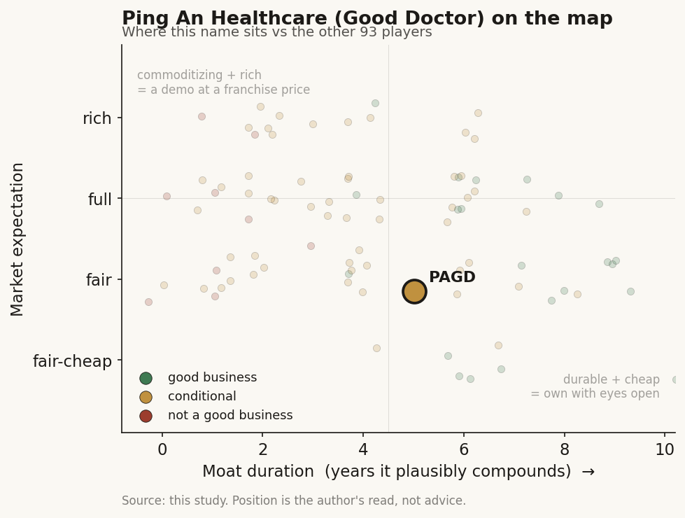

# Ping An Healthcare (Good Doctor) (1833 / HKEX (China))

> **The read.** A just-turned-profitable China telehealth platform that has quietly stopped being a consumer app and become the health-services arm of its insurance parent - real scale and a captive channel, but the moat is the parent, not the AI, and roughly 60% of revenue leans on one related group. Priced as a small-cap turnaround, not a growth platform. [reported]

**Snapshot**

| | |
|---|---|
| Listing | 1833 / HKEX (Hong Kong-listed China operator) |
| Region | China (ex US and Taiwan) |
| Value-chain layer | regional consumer-health-AI platform (telehealth + AI triage + health-services aggregator) |
| Archetype | platform / channel-and-services (insurance-enabled healthcare aggregator, not a drug or device owner) |
| Size | ~HK$16bn market cap (~US$2bn); share HK$9.19, 52-wk HK$7.38-24.40 (early Jul-2026) [reported] |
| Revenue (latest) | FY25 RMB5.47bn, +13.7% YoY; net profit attributable RMB379.5m, +366% YoY [disclosed] |
| Moat verdict | conditional - the moat is the Ping An channel, not the technology |
| Expectation | fair (cheap-to-fair for a de-risked small-cap; NOT priced as an AI platform) |
| Evidence quality | med (audited HK filings; but heavy related-party mix and non-US disclosure gaps) |

## What it is
A Chinese online-healthcare platform - telehealth consultations, AI triage, an in-house and contracted doctor network, plus health-product commerce and elder-care services - that has repositioned from a consumer "see a doctor on your phone" app into the healthcare-services arm of Ping An Group, China's largest insurer. It routes members from Ping An's insurance and banking base into medical consultations, checkups, chronic-disease management, and pharmacy fulfilment. It does not own drugs, hospitals, or a proprietary frontier model in the Isomorphic sense - it is a channel and services aggregator sitting on top of China's fragmented provider system.

## Business model - how it makes money
Management now reports around three engines, and the mix is the whole story:

- **F-end - commercial-insurance enablement (~60% of revenue).** FY25 revenue RMB3.30bn, +11.0% YoY [disclosed]. This is the core: bundling health services (consultations, checkups, care management) into insurance and financial products sold through Ping An Group's channels. High-visibility, recurring, but structurally a **related-party annuity** - the parent is both the largest shareholder and the largest customer.
- **B-end - corporate health management (~24% of revenue).** FY25 revenue RMB1.31bn, +40.6% YoY - the fastest leg, and the one growth story that is at least partly independent [disclosed]. Employee-health programs sold to companies; 6,700+ paying corporate clients (+83% YoY) [reported]. GMV ~RMB3.63bn.
- **C-end / consumer (residual).** The original direct-to-consumer telehealth and health-mall business, now de-emphasised after years of losses; management steers users toward the higher-value F- and B-end products rather than chasing standalone app monetisation.

**Growth quality - the debate.** The turnaround is real: FY25 net profit attributable RMB379.5m (+366% YoY) and adjusted net profit RMB414.0m (+161%) [disclosed], after years of heavy losses. But the profit came as much from cost discipline and mix-shift up the value curve as from top-line acceleration (revenue only +13.7%). The genuinely independent growth is the B-end (+40.6%); the larger F-end (+11%) is a captive channel that grows roughly with the parent.

**AI contribution is small and honest.** Management discloses that AI contributed **~4.5% of gross profit** in FY25 [disclosed] - a useful cost lever, not yet a profit engine. AI Doctor reached nearly 12m annual users, and the in-house "Ping An Medical Master" multimodal model is cited at 95.1% diagnostic accuracy across 11,300+ diseases [company/reported - vendor-stated, un-replicated]. Q4'25 consultation cost fell ~45% YoY on AI enablement [reported]. Treat the AI as a margin tool, not the thesis.

## Financial summary

| | FY25 | Growth |
|---|---|---|
| Total revenue | RMB5.47bn | +13.7% YoY |
| - F-end (commercial-insurance enablement) | RMB3.30bn | +11.0% YoY |
| - B-end (corporate health management) | RMB1.31bn | +40.6% YoY |
| Net profit attributable to owners | RMB379.5m | +366.1% YoY |
| Adjusted net profit | RMB414.0m | +161.3% YoY |
| AI share of gross profit | ~4.5% | - |
| AI Doctor annual users | ~12m | - |
| Paying corporate clients | 6,700+ | +83.1% YoY |

Figures as of FY25 results (reported Mar-2026); prices as of early-Jul-2026 unless tagged. Gross-margin and cash-balance detail is thinner than for US names - a non-US disclosure gap, flagged. [unverified: consolidated gross margin, net cash]

## Value-chain position and competition
Position: a **regional aggregator/channel** layer - it sits between insurance/enterprise demand and China's fragmented supply of doctors, hospitals, checkup centres, and pharmacies (5,100+ hospital partners, ~240,000 pharmacies, 4,400+ checkup providers, ~50,000 in-house/contracted doctors [reported]). It does not sit on the drug-discovery or device chains at all - this is services and distribution, not R&D.

Competition:
- **Alibaba Health (241.HK) and JD Health (6618.HK):** far larger, e-commerce-pharmacy-led. Alibaba Health did RMB16.7bn revenue in a single half (H1 FY26, +17%) with net profit RMB1.27bn [reported]; JD Health grew revenue ~25% in early 2025 [reported]. Both dwarf Ping An on GMV and consumer reach. Ping An's differentiation is **not scale - it is the insurance channel**: it monetises through medical-and-insurance synergy rather than selling boxes of medicine.
- **Public hospitals + the national system:** the true substitute for most Chinese patients; telehealth is a convenience/triage layer on top, not a replacement.
- **Positioning edge:** the only one of the three built inside a top-tier insurer, giving it a captive, high-intent, higher-value member funnel the e-commerce players must buy.

## Moat
Two candidate moats, and they split cleanly:
- **The Ping An channel - CONFIRMED, but it is the parent's moat, not the company's (~durable while related).** ~60% of revenue flows from insurance-enablement tied to a parent that owns ~52-53% of the shares and is also the anchor customer. That is a genuine, durable, hard-to-replicate distribution advantage - and simultaneously the concentration risk. The moat is rented from the group.
- **AI / technology - REFUTED as a moat (~0 yr).** The in-house model and AI triage are real cost levers (~4.5% of gross profit, ~45% consultation-cost reduction) but not defensible: Alibaba, JD, Tencent, Baidu and the national hospital system all field comparable medical LLMs. The AI narrows cost; it does not lock in customers.

Net: the durable edge is the captive insurance funnel, which is inseparable from Ping An Group. Estimated durable-compounding duration is high **only so long as the parent relationship holds** - which makes this a bet on the group's health strategy, not on standalone platform economics.

## Core variables
1. **[CORE] F-end concentration and the parent relationship.** ~60% of revenue is related-party insurance-enablement. Is this a durable annuity or a single-customer dependency? The share offer that lifted Ping An Group past 52% (no privatisation stated) [reported] tightens the tie - good for stability, bad for independence. The whole cash base rests here.
2. **[CORE] B-end independent growth.** The +40.6% corporate-health leg is the only proof the company can grow away from the parent's balance sheet. If B-end keeps compounding at 30%+ and mixes up, the "not just a captive subsidiary" case gets real; if it fades, this is a group cost-centre with a listing.
3. **[CORE] Margin durability of the turnaround.** FY25 profit is young (first sustained profitability after heavy losses) and partly cost-cut driven. Does adjusted net profit keep climbing on operating leverage + AI cost reduction, or was FY25 a one-off mix/cost inflection?

Below the line as noise: AI Doctor user counts (vanity scale, ~4.5% of gross profit); elder-care city expansion; single-quarter consultation-cost percentages.

## Bear case / key risks
A subsidiary wearing a platform label. Roughly 60% of revenue is insurance-enablement sold through - and largely to - a parent that controls the board and the shares, so "revenue growth" is substantially the parent's health strategy, not independent demand. The AI is a cost tool, not a moat: every large Chinese tech and insurance group has a medical model. Standalone consumer telehealth never worked (years of losses forced the pivot). Disclosure is thinner than US peers - consolidated gross margin and net-cash detail are not cleanly surfaced [unverified], and related-party transactions cloud "organic" growth. And it competes for consumer mindshare against Alibaba Health and JD Health, both several times its size. Falsification watch: (1) F-end growth stalls or a related-party pricing reset compresses it - the annuity thesis breaks; (2) B-end deceleration below ~20% - the independence story fails; (3) profit reverses in any half - the turnaround was cost-timing, not structural.

## The expectation read
Share HK$9.19, market cap ~HK$16bn (~US$2bn), against a 52-week range of HK$7.38-24.40 - the stock has round-tripped from a 2024 special-dividend/offer spike back toward the low end [reported]. On ~RMB414m adjusted net profit (~HK$450m), the market is paying a mid-30s trailing earnings multiple for a newly profitable, insurer-anchored services business - full on trailing profit, but modest against the ~US$2bn revenue base (~0.8x sales) and a still-early margin curve. Crucially, the price does **not** embed an AI-platform re-rate: unlike the US AI-native names, nobody is paying here for "AI solved healthcare." The expectation is a **de-risked-subsidiary turnaround** - that F-end stays captive-stable and B-end compounds - which is close to fair. The upside case is that B-end independence + AI operating leverage earn it a growth multiple; the downside is that it re-rates to "insurance cost-centre with a listing." What the price assumes is continuity of the parent relationship, not a technology breakout. (No buy/sell view.)

## Verdict
A real, now-profitable regional healthcare platform whose moat is the Ping An insurance channel rather than its AI - which makes it a good business only conditionally, because ~60% of revenue and the entire durable edge are rented from the parent. Priced as a de-risked small-cap turnaround (fair, not cheap on trailing profit; not carrying an AI premium), the honest read is: own it for the captive-channel annuity and B-end optionality, not for a technology moat that does not exist here. Confidence: MEDIUM-HIGH on the FY25 facts (revenue, segment mix, profit turnaround all disclosed in audited HK filings); MEDIUM on the verdict, gated on B-end independence and F-end related-party durability; LOWER on balance-sheet granularity (a genuine non-US disclosure gap, flagged not papered over).
