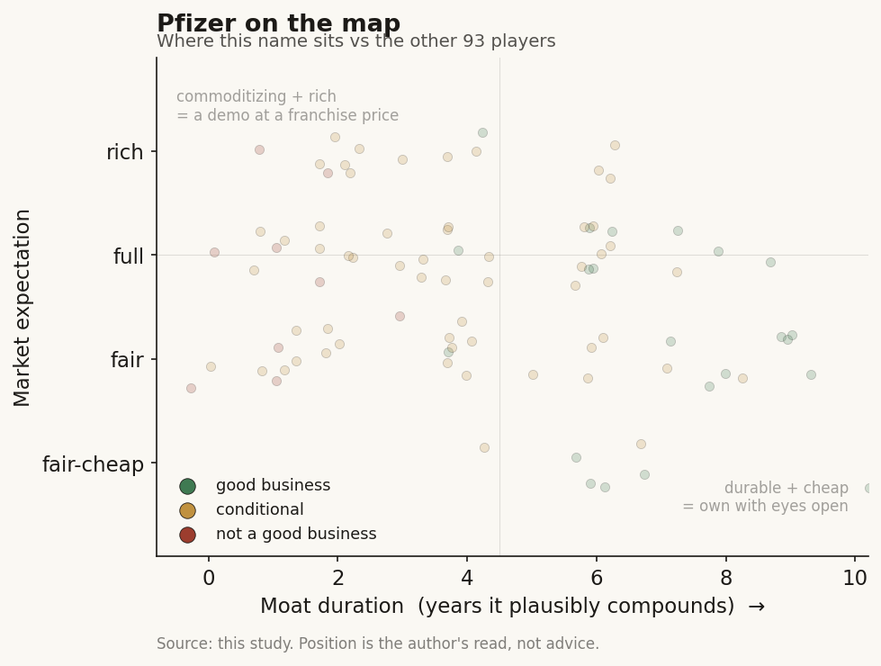

# Pfizer (PFE / NYSE)

> **The read.** The textbook incumbent case: a $62bn-revenue pharma that rents AI from the frontier labs rather than being one, and keeps the value because it owns the two things AI cannot manufacture - the reimbursed molecule and the balance sheet that buys it. AI is a cost-and-cycle-time lever inside a machine whose bottleneck is Phase II biology and whose real capital goes to deals, not GPUs. Good business, cheaply priced, but for patent-cliff reasons that AI does not fix.

**Snapshot**

| | |
|---|---|
| Listing | PFE / NYSE |
| Region | US |
| Value-chain layer | L9 incumbent (owns the whole discovery-to-market chain; rents the AI layer) |
| Archetype | pharma-incumbent (diversified drug-owner; the party that funds AI and captures the drug) |
| Size | ~$139bn market cap; stock ~$24 (2-Jul-26) [reported] |
| Revenue (latest) | FY2025 $62.6bn, -2% reported / +6% operational ex-COVID [disclosed] |
| Moat verdict | wide on the franchise (reimbursed molecules + distribution + balance sheet); AI is not the moat |
| Expectation | cheap - priced for the patent cliff, not for AI upside |
| Evidence quality | high (large-cap, fully disclosed) |

## What it is
One of the largest diversified pharmaceutical companies in the world - discovery, development, manufacturing, and global commercial distribution of medicines and vaccines across oncology, vaccines, internal medicine, and specialty. For this study it matters as the archetypal **AI buyer, not AI builder**: Pfizer does not sell an AI product and is not trying to become a model company. It funds AI, embeds it inside R&D and commercial operations, and keeps the economics of the drug that comes out the other end. It sits at L9 - the incumbent that owns the entire chain the AI-discovery startups are trying to sell into.

## Business model - how it makes money
Sell patented molecules at high gross margin, defend them with IP + regulatory approval + payer reimbursement + a global salesforce, and replace them as patents expire. The whole model is a race between **new approvals and the patent cliff** - Pfizer faces roughly $17-18bn of revenue exposed to loss of exclusivity through the late 2020s (Eliquis, Ibrance, Xeljanz, Vyndaqel and others) [reported], which is the single fact that governs the stock.

Where AI fits, and where it does not:
- **AI is a cost-and-speed lever, not a revenue line.** It compresses the discovery and content-approval cycle and trims R&D dollars per candidate. It does **not** move the binding constraint - Phase II efficacy, where ~60% of clinical failures and most of the spend sit, and where no AI lab has yet raised the base rate. So AI improves the front of the funnel that is already cheap; the expensive back half is untouched.
- **The incumbent funds the AI and keeps the drug.** When Pfizer licenses a frontier model (Chai, Boltz, XtalPi), the AI vendor takes a fee and Pfizer takes the asset, the trial, the approval, and the lifetime revenue. This is the study's central point in one company: the value-capture is at L9, not at the model layer.

Capital allocation, not GPU spend, is the real AI-era decision. Pfizer's growth engine is **M&A** - $43bn for Seagen (oncology, closed 2023) and a $10bn move for Metsera (obesity, 2025) [disclosed]. The balance sheet is the moat the startups do not have.

## Financial summary
Top-line scale only - this is an incumbent, not a growth story to model line by line.

| | FY2025 | FY2026 guide |
|---|---|---|
| Revenue | $62.6bn (-2% reported; +6% operational ex-Comirnaty/Paxlovid) | $59.5-62.5bn [disclosed] |
| Adjusted R&D | ~$10.0-11.0bn | $10.5-11.5bn [disclosed] |
| Adjusted diluted EPS | $3.00-3.15 (guided) | $2.80-3.00 [disclosed] |
| Dividend yield | - | ~7% at ~$24 (2-Jul-26) [reported] |
| Market cap | - | ~$139bn (2-Jul-26) [reported] |

AI/deal figures worth tagging: **Metsera** ~$10bn all-in ($47.50/share cash upfront, ~$4.9bn initial enterprise value, plus a CVR up to $22.50/share) [disclosed]; internal AI (Amazon/PACT genAI program) reported at ~16,000 scientist-hours saved per year and ~55% lower infra cost [reported - vendor case study, not audited]. No disclosed standalone "AI capex" line - AI spend is folded inside the R&D and SG&A budgets, which is itself the point: for an incumbent, AI is opex inside a $10-11bn R&D line, not a separate build.

## Value-chain position and competition
Pfizer occupies **L9 - the full discovery-to-market incumbent** - and deliberately rents the upstream AI layers rather than owning them:
- **L9b-L9c (structure / candidate generation):** licensed in. Boltz strategic collaboration (Jan 2026) for biomolecular AI foundation models and generative small-molecule/biologics workflows; Chai Discovery license (2026) for early access to Chai-3 plus a custom model trained on Pfizer's own data; XtalPi expansion (2025) for next-gen molecular modeling [disclosed].
- **L9e (owned clinical development + approval + distribution):** owned outright. This is where value is captured and where the incumbent is unassailable by a model company.
- **Commercial / L-commercial:** its own internal generative-AI platform, **Charlie**, for marketing content creation, clinical fact-checking, and regulatory-risk flagging - the one place Pfizer built rather than bought, because the asset is Pfizer's own approved-content corpus [reported].

Competition is other large-pharma incumbents running the identical playbook - Lilly, Novartis, J&J, Merck, AstraZeneca - all buying AI-discovery access (see Isomorphic's Lilly/Novartis/J&J biobucks) and all funding, not becoming, the AI. The AI-drug-discovery startups (Isomorphic, Xaira, Recursion, Iambic) are **suppliers and targets**, not competitors, to a company at Pfizer's layer.

## Moat
Split the two moats cleanly:
- **The franchise moat - WIDE (~10-15+ yr per asset, staggered).** Patent + regulatory approval + payer reimbursement + global distribution + a balance sheet that can absorb a $10-43bn acquisition. None of this is AI-erodable. A startup with a better model still has to run the trials, win the approval, build the salesforce, and get paid by payers - or sell the asset to someone like Pfizer.
- **The AI layer - NOT a moat for Pfizer, and not meant to be (~0 yr of exclusivity).** The models Pfizer licenses are the same models available to every large-pharma rival, and the open-source frontier (Boltz clones, Chai, OpenFold-class) commoditizes them within ~a year. Pfizer's AI edge is not the model; it is the **proprietary data and the pipeline the model feeds** - internal chemistry, trial, and approved-content corpora that rivals cannot see. Charlie is defensible only because the training data is Pfizer's.

Net: the durable moat is the incumbent franchise; AI is a shared efficiency tool that slightly widens the cost gap versus a startup but does not create new exclusivity. The study's thesis holds here in its cleanest form - **the value pools at the party that owns the reimbursed molecule and the capital, not the party that owns the model.**

## Core variables
1. **[CORE] Patent-cliff replacement, not AI.** The stock is governed by whether the pipeline + M&A (oncology from Seagen, obesity from Metsera) replaces the ~$17-18bn of late-decade LOE exposure. AI changes the cost of getting there at the margin; it does not change this number. This is the master variable.
2. **[CORE] Deal execution and the balance sheet.** Because growth is bought, the variable is whether Metsera-class acquisitions land clinically (Metsera's monthly-shot Phase 2 data already drew a share dip on readout) and whether the ~7% dividend stays covered while Pfizer keeps buying. Capital allocation is the real AI-era lever here, not GPU count.
3. **[CORE] Does AI actually bend R&D productivity?** The falsifiable claim is that embedded AI (Boltz/Chai/XtalPi in discovery, Charlie in commercial) shows up as either lower R&D-per-approval or faster cycle time. If it only saves scientist-hours inside a flat $10-11bn R&D line while the Phase II wall is unmoved, AI is a rounding-error efficiency story, not a re-rating catalyst.

Below the line as noise: the specific model vendor of the month; "AI cut discovery to 30 days" headlines (front-of-funnel, not the binding constraint); AI-marketing productivity claims that do not touch the pipeline.

## Bear case / key risks
The bear case has almost nothing to do with AI. It is the patent cliff: ~$17-18bn of revenue rolling to generics through the late 2020s, a pipeline and two big acquisitions (Seagen, Metsera) that must replace it on time and on-data, and an obesity entry (Metsera) that is late to a market Lilly and Novo already own and whose early monthly-shot data underwhelmed. The ~7% dividend yield is the market pricing real doubt about forward earnings coverage, not generosity. On AI specifically, the risk is the opposite of the hype: AI is **shared, commoditizing, and aimed at the cheap half of the funnel** - it will not rescue the cliff, and if management or the market ever prices AI as a growth driver rather than a cost lever, that expectation is unsupported by the biology.

Falsification watch: (1) pipeline + M&A visibly fails to close the LOE gap and 2027-28 revenue steps down - the thesis that the franchise moat carries the stock weakens; (2) a Metsera/obesity clinical setback strands the largest recent bet; (3) conversely, if AI genuinely lifts Pfizer's Phase II success rate on a real sample, the whole "AI is only front-of-funnel" frame - and this profile's core claim - would need revisiting.

## The expectation read
At ~$24 and ~$139bn market cap on ~$62bn revenue with a ~7% yield (2-Jul-26), the market is **not** paying for AI at all - it is pricing the patent cliff and a shrinking earnings base, roughly a high-single-digit forward earnings multiple typical of a de-rated incumbent facing LOE. That is the tell for the entire study: the biggest single funder of healthcare AI in this cohort gets **zero AI premium**, because the value AI creates flows into the drug, and the drug's value is capped by the cliff and the reimbursement system, not unlocked by the model. The belief embedded in the price is simply "managed decline, adequately funded" - so the asymmetry is that successful deal-driven replacement (Seagen/Metsera working) re-rates it on *pharma* fundamentals, while AI is upside the market is not currently paying for and probably should not.

## Verdict
**Good business, cheaply priced - but as a patent-cliff pharma, not as an AI story. Pfizer is the study's cleanest example of the incumbent that funds the AI and keeps the drug: it rents commoditizing models from the frontier labs, embeds them as an opex efficiency lever inside a $10-11bn R&D line, and captures all the value at L9 because it owns the reimbursed molecule, the trial, the approval, the distribution, and the balance sheet the startups lack. AI does not move the binding constraint (Phase II biology) or the governing variable (LOE replacement via M&A). Confidence: HIGH on the framing (incumbent captures value, AI is a shared cost lever, ~7% yield = cliff pricing not AI pricing) and on the disclosed financials; MEDIUM on whether deal-driven replacement closes the patent-cliff gap on schedule.**
