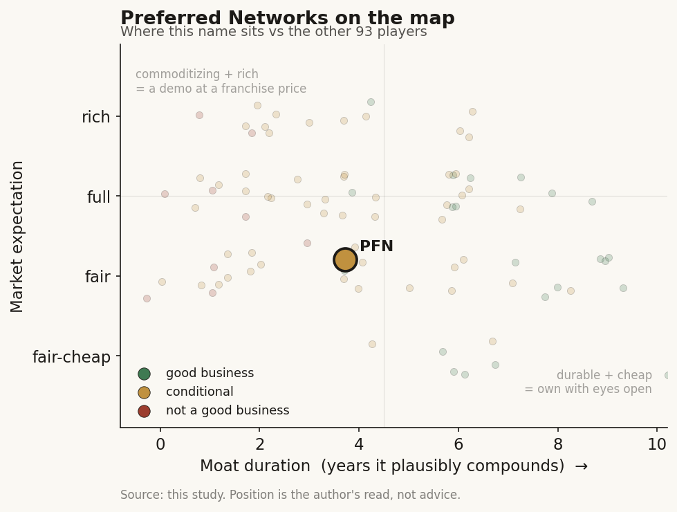

# Preferred Networks (private (Japan))

> **The read.** Japan's flagship AI lab is a real, vertically integrated engineer - its own chips, compute, LLM and solutions under one roof - but healthcare is one vertical inside an industrial-AI conglomerate, not the business. As a healthcare-AI name it is an option, not a thesis: the drug-discovery work is a services/tooling capability with no owned pipeline, no disclosed pharma economics, and a 2025 down-round that halved the mark. Own it as sovereign-AI infrastructure with a life-sciences wing, not as a drug-discovery bet.

**Snapshot**

| | |
|---|---|
| Listing | private (Japan) - unlisted; no traded stub, IPO repeatedly deferred |
| Region | Japan (Tokyo, Otemachi) |
| Value-chain layer | L1-L7 vertically integrated (AI chips -> compute -> foundation model -> vertical solutions incl. life-sciences) |
| Archetype | industrial-AI platform / national champion (tooling + solutions, no owned drug pipeline) |
| Size | est. ~158bn yen (~$1.0-1.1bn) post-2025 down-round [reported - Nikkei]; peak mark was ~350bn yen [reported] |
| Revenue (latest) | ~8.5bn yen (FY ended Jan-2021, last disclosed); current not disclosed [disclosed / then dark] |
| Moat verdict | conditional - real full-stack engineering + national-champion status; healthcare moat unproven |
| Expectation | fair (private mark already reset down 50%+) |
| Evidence quality | low - private Japanese filer, no recent audited financials, healthcare segment undisclosed |

## What it is
Preferred Networks (PFN) is Japan's best-known independent AI lab, founded March 2014 by two University of Tokyo computer scientists (CEO Toru Nishikawa, COO Daisuke Okanohara) as a spin-out of Preferred Infrastructure [disclosed]. It is unusual for being vertically integrated across the whole AI stack: it designs its own AI accelerators (the MN-Core series, and the MN-3 supercomputer that topped the Green500 energy-efficiency list in June 2020), runs its own large compute clusters, trains its own Japanese-language foundation models (PLaMo, latest PLaMo 3.0 Prime, June 2026, via subsidiary Preferred Elements), and sells vertical AI solutions across manufacturing, robotics, materials, energy and life sciences [disclosed]. Healthcare is one of several verticals - the life-sciences arm does AI drug discovery, medical-image analysis and omics - not the core of the company.

## Business model - how it makes money
A diversified, project-and-product house rather than a single-product SaaS or a drug owner:

- **AI semiconductors + compute (the strategic bet).** The MN-Core series (next-gen launch targeted 2027) and the compute infrastructure subsidiary (Preferred Computing Infrastructure, est. Jan-2025) are where the 2024-25 capital is going. This is the leg PFN is asking investors to fund - vertically integrated AI silicon as a Japanese alternative to buying foreign GPUs [disclosed].
- **Foundation models (PLaMo).** Japanese-optimized LLMs sold to corporates; PLaMo 3.0 Prime (June 2026) was pitched at "less than half" the price of comparable English-model offerings [reported]. Distribution via cloud marketplaces.
- **Vertical solutions incl. life sciences (where healthcare lives).** Materials simulation (Matlantis, a JV with ENEOS: Preferred Computational Chemistry), robotics (Preferred Robotics), plant automation, and **AI drug discovery** - a proprietary molecular-design platform (structure-based drug discovery fused with deep-learning generative models, docking, FEP) run as a service/capability, not an owned pipeline [disclosed].
- **Healthcare economics: undisclosed.** PFN does not break out life-sciences revenue. The known anchors are a comprehensive partnership with Chugai Pharmaceutical (Roche group), who invested ~700m yen in 2018, plus omics and medical-imaging work [disclosed]. There is no disclosed owned drug asset, no milestone/royalty book, and no segment P&L - so the healthcare leg is a capability with unquantified monetization.

**Cash conversion.** The last public financials (FY ended 31-Jan-2021) showed revenue ~8.5bn yen with small positive operating income (~1bn yen) [disclosed] - modest and profitable then, but five years stale. Since, PFN has been raising heavily and spending on silicon and compute, and the company has gone effectively dark on financials, so current burn/profitability is [unverified].

## Financial summary
Private; only stale and partial figures exist. Real numbers only, tagged.

| Item | Detail |
|---|---|
| Last disclosed revenue | ~8.5bn yen, FY ended 31-Jan-2021; op. income ~1.0bn yen [disclosed - then no updates] |
| Peak valuation | ~350bn yen (~$2.4bn at the time), 2019-era mark [reported] |
| Current valuation | ~158bn yen (down ~50%+), 2024-25 down-round [reported - Nikkei, Mar-2025] |
| Dec-2024 round | 19bn yen first close, led by SBI Group; investors incl. Development Bank of Japan, Mitsubishi Corp, Sekisui House, Wacom + bank debt [disclosed] |
| Apr-2025 extension | +5bn yen (content-industry investors incl. Kodansha, TBS, Toei Animation), total ~24bn yen [disclosed] |
| Jun-2025 extension | further undisclosed amount (Shin-Etsu Chemical, Sumisei Innovation Fund) [disclosed - amount not stated] |
| Anchor investors (historic) | Toyota (~10.5bn yen, largest external holder), NTT, FANUC, Chugai, ENEOS [disclosed] |
| Headcount | ~280-340 [estimate - third-party trackers] |
| Healthcare / life-sciences revenue | NOT disclosed [disclosed - company: not broken out] |

Figures as of the cited dates; the valuation and headcount are third-party/press estimates, not audited disclosures.

## Value-chain position and competition
PFN is the rare player that spans L1-L7 in one company: AI chips (L1-L2) -> compute clusters (L2-L3) -> foundation model (L4-L5) -> vertical applications (L6-L7), with drug discovery, medical imaging and omics as one of the L7 application slots. In the healthcare frame, the relevant seam is narrow: PFN sits at the tooling/services layer of drug discovery (molecular design, docking, FEP, protein-structure generative models) and at medical-image AI - it hands designed candidates or reads back to a pharma or clinical partner and does not carry an asset into the clinic itself. Flow: partner target or dataset in -> generative design / simulation on PFN compute -> candidate or analysis out. Value is captured as a service fee or a partnership, not a milestone/royalty or a per-test reimbursement.

Competition, by leg:
- **Full-stack / sovereign-AI peers:** the closest analog is a national-champion AI stack, not a healthcare name - it competes for Japanese enterprise and government AI budgets against the SoftBank-led Noetra consortium (Sony, NEC, Honda) and foreign GPU-plus-model stacks (NVIDIA + OpenAI/Anthropic). Its edge is genuine domestic vertical integration; its disadvantage is scale versus global hyperscalers.
- **AI drug-discovery peers (the healthcare seam):** as a tools/services drug-discovery shop it overlaps with Schrodinger (physics-based design software), Isomorphic/Xaira/Iambic (frontier design labs), and in-house pharma tooling - but PFN is a generalist AI house dabbling in the vertical, not a dedicated techbio, and discloses far less.
- **Regional healthcare-AI cohort:** among ex-US/ex-Taiwan Asian AI names it is the deepest engineering shop, but Lunit (Korea, imaging), Airdoc (China, retinal) and the Taiwan imaging cohort are the pure-play healthcare-AI expressions; PFN is not.

Edge: a genuinely rare full-stack (silicon-to-model-to-solution) capability with national-champion status and blue-chip corporate backers (Toyota, NTT, FANUC, Chugai). That is scarce. But in the healthcare-AI value chain specifically, that edge is diffuse - the drug-discovery capability is real engineering with no proven, quantified value capture.

## Moat
Two candidate moats, and they do not both help the healthcare thesis:
- **Full-stack engineering + national-champion status - REAL but general (~3-5 yr, not healthcare-specific).** Owning chips, compute, model and solutions is genuinely hard to replicate and gives Japan a sovereign-AI option; blue-chip strategic investors (Toyota, NTT, FANUC) create sticky industrial relationships. This is a real competitive asset - for the company. It does not, by itself, confer a healthcare moat.
- **Drug-discovery data/network - UNPROVEN as a moat (~0 yr demonstrated).** The molecular-design platform is credible engineering (validated on COVID Mpro and herbicide targets [disclosed]), but there is no owned pipeline, no disclosed pharma-economics annuity, and the generative-design frontier is commoditizing fast (open structure/design models caught the frontier within ~1 year across the cohort). PFN has no disclosed data-network advantage in life sciences that a dedicated techbio lacks.

Net: the durable moat is the full-stack industrial-AI franchise, capped at ~3-5 years by the pace of the field and by scale disadvantage versus hyperscalers; the healthcare-specific moat is presently unproven. Estimated durable-compounding duration ~3-5 years on the company franchise; effectively undemonstrated on the healthcare leg alone.

## Core variables
1. **[CORE] MN-Core silicon and the sovereign-AI bet.** The 2024-25 capital is aimed at AI chips and compute; the next-gen MN-Core (2027) and whether PFN's stack wins meaningful Japanese enterprise/government AI budgets is the master variable for the whole company. Healthcare rides on this, not the reverse.
2. **[CORE] Healthcare monetization - does the drug-discovery leg ever become a disclosed, quantified business?** Today it is a capability with no owned asset and no segment P&L. The thesis for a healthcare-AI investor only exists if PFN either books recurring pharma-services revenue at scale or takes an owned/co-owned asset with milestone economics - neither is disclosed. Until then the leg is optionality, not value.
3. **[CORE] Financial re-disclosure and the private mark.** The 2025 down-round to ~158bn yen [reported] deliberately accepted a cheaper mark to widen the investor base; whether the next raise/IPO re-rates up or confirms the reset - and whether PFN resumes disclosing financials - determines whether any of this is verifiable at all.

Below the line as noise: individual PLaMo pricing headlines; the MHI defence-AI and Toyota physical-AI partnerships (real but not healthcare); Green500 rankings; single research-paper demos on drug targets.

## Bear case / key risks
For a healthcare-AI investor, PFN is barely a healthcare name. It is a private, industrial-AI conglomerate where drug discovery is one undisclosed vertical among many, with no owned pipeline, no milestone/royalty book, and no segment financials to verify any healthcare value at all. The last audited-scale figures are from FY2021 (~8.5bn yen revenue); the company has since gone dark, raised repeatedly, and took a ~50%+ down-round in 2024-25 - the market's own signal that the prior ~350bn yen mark was over-hoped [reported]. Its core bet is capital-hungry AI silicon competing against global hyperscalers and a rival domestic consortium, a hard, cash-intensive fight where scale is against it. The generative-design capability that would anchor a healthcare thesis is commoditizing across the cohort, and PFN discloses less about it than dedicated techbios do. There is no traded stub, so there is no clean way to own the healthcare exposure even if the thesis were sound.

Falsification watch: (1) the next raise or an IPO prices below ~158bn yen, confirming the reset is structural, not a one-off - the "champion re-rates" hope breaks; (2) MN-Core fails to win share against foreign GPU stacks by the 2027 next-gen launch, hollowing the strategic bet; (3) the healthcare leg is quietly deprioritized or never surfaces as a disclosed revenue line - proving it was always a capability, not a business.

## The expectation read
The last private mark, ~158bn yen (~$1.0-1.1bn), was set in a deliberate 2024-25 down-round from a ~350bn yen peak [reported]. That reset is the honest signal: the market already took ~50%+ out of the prior over-hoped valuation and invited a broader investor base in at a cheaper price. So the private mark is closer to fair than to full for the company as a whole - but it is a mark on a vertically integrated AI-silicon-and-solutions bet, NOT on a healthcare franchise. For a healthcare-AI reader, essentially none of the ~158bn yen is a disclosed, monetized drug-discovery or medical-AI business; the healthcare leg is unpriced optionality inside an industrial-AI valuation. Where the belief looks soft: there is no recent financial disclosure to verify anything, no owned healthcare asset, and no traded instrument - so the "expectation" is really a private consensus that PFN can win Japan's sovereign-AI build, with healthcare as a free option on top.

## Verdict
Real, rare full-stack AI engineer and a national champion - but as a healthcare-AI name it is an option, not a thesis: drug discovery is one undisclosed vertical inside an industrial-AI conglomerate, with no owned pipeline, no disclosed pharma economics, no recent financials, and no traded stub. The private mark is fair-to-cheap for the company after a deliberate 50%+ down-round, but that mark prices a sovereign-AI silicon bet, not a healthcare franchise. Own it as Japanese AI infrastructure with a life-sciences wing; do not own it for the healthcare-AI story. Confidence: MEDIUM on the company framing (full-stack, national champion, down-round all reported); LOW on anything healthcare-specific and LOW on the valuation, both capped by a private Japanese filer that has stopped disclosing financials and never broke out life sciences.
