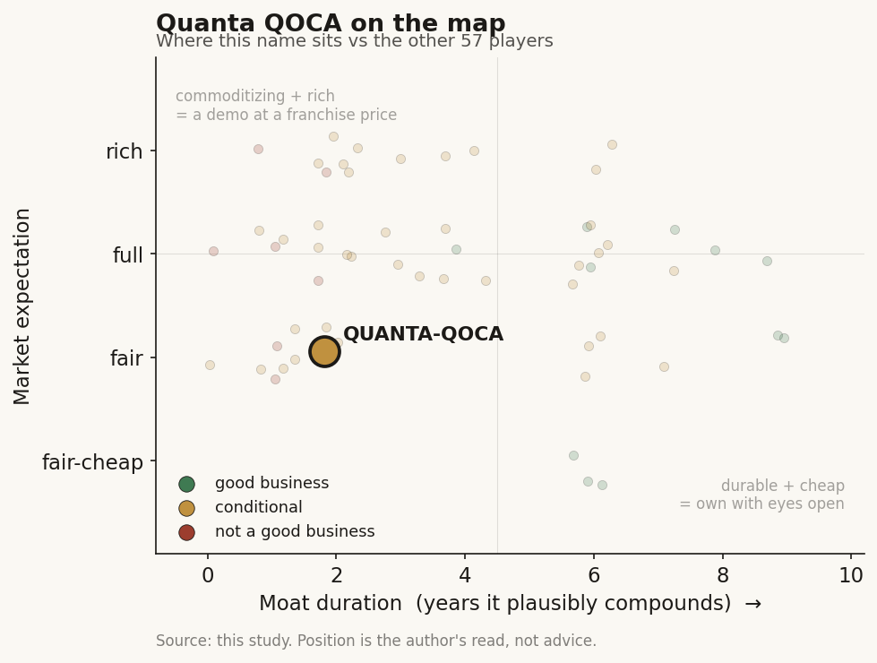

# Quanta QOCA (2382 TT)

> **The read.** A genuine, largest-coverage Taiwan medical cloud sitting inside a NT$2.1tn AI-server ODM - but the healthcare leg is undisclosed, immaterial, and founder-declared non-commercial, so QOCA is a positioning marker, not an investable healthcare-AI pure-play.

**Snapshot**

| | |
|---|---|
| Listing | 2382.TW / TWSE (上市) |
| Region | Taiwan |
| Value-chain layer | L1 (medical-cloud data/compute source) + L7-L8 (enterprise health-data platform / NHI-data integration) |
| Archetype | data-platform / infra |
| Size | ~NT$1.4-1.7 trillion market cap (~US$45-55bn) |
| Revenue (latest) | Parent FY2025 NT$2.12 trillion, +50.2% YoY (AI-server-driven); QOCA healthcare revenue none disclosed |
| Moat verdict | conditional - real-but-state-captured data position; durable compute moat priced as semis, not healthcare |
| Expectation | fair (as an AI-server ODM; healthcare leg carries no priced expectation) |
| Evidence quality | low (on the healthcare read); high on the parent |

## What it is
廣達電腦 (Quanta Computer) - the world's largest notebook ODM and now the dominant AI-server contract manufacturer - running **QOCA (Quanta for Medical Care AI)**, its ~NT$10bn (100億) smart-healthcare program. QOCA aim is a low-code medical-AI cloud that founder 林百里 (Barry Lam) frames as a decade-long personal mission, explicitly "為你服務，不是拿來做生意" (to serve, not to do business). It is the compute/cloud/data-platform layer beneath hospitals' own AI, not a diagnostic-AI product.

## Business model - how it makes money
Quanta's actual business model is **AI-server / notebook ODM at ~5-7% gross margin** - hyperscalers and OEMs pay for hardware; healthcare is a rounding error. QOCA's *intended* model is the ABCD stack: **A**lgorithm (Quanta AI lab) · **B**ig data (Quanta Research Institute) · **C**loud (subsidiary 雲達 QCT) · **D**evice (medical product division) - sold as a customized medical-cloud platform to hospitals (hospital pays capex/opex + integration), with QOCA aim positioned as the low-code layer that lets under-resourced hospitals build "本地自主" (locally-autonomous) AI apps.

NHI-reimbursement dependence is **low/indirect** - QOCA is infrastructure sold to hospitals and the state, not a per-scan 特材 claiming an NHI point value. The single-payer chokepoint gates QOCA's *customers'* AI-adoption economics, not QOCA's own sale - but the deeper truth is that there is barely a "sale" to gate: the flagship deployments are donations and mission-driven, founder-declared non-commercial. Who pays today is effectively **Quanta's own balance sheet**, cross-subsidized by the AI-server engine. Growth quality on the healthcare leg is therefore unmeasurable; the parent's cash conversion and ~80% dividend payout are the AI-server ODM's, not QOCA's.

## Financial summary
Parent (public, fully disclosed) - AI-server-driven, NOT healthcare:

| Metric | FY2025 | Q1'26 |
|---|---|---|
| Revenue | NT$2.12 trillion (+50.2% YoY) | NT$809.2bn (single-quarter record, +66.6% YoY) |
| Gross margin | 6.98% (−0.87pp YoY) | 4.78% |
| Net income | NT$74.98bn (+25.5%) | - |
| EPS | NT$19.45 (record) | NT$5.50 |
| Cash dividend | NT$15.6/sh (~80% payout) | - |

- **Listing / share count:** paid-in capital NT$38,626,274,320; shares outstanding **3,862,627,432** (~3.86bn) at NT$10 par.
- **Share price / market cap:** ~NT$372-437 across 1H26 (NT$437 intraday high Apr 2026; ~NT$375 more recently). **Market cap ~NT$1.4-1.7 trillion (~US$45-55bn)** - a mega-cap, ~2,300x the size of the two listed TW healthcare-AI pure-plays combined (<NT$600m).
- **AI-server mix:** ~75% of server revenue; guided triple-digit growth in 2026.
- **Healthcare (QOCA) financials:** **none disclosed** - no segment, no standalone revenue line. Quanta Research Institute president 張嘉淵 states "醫學不是生意 (medicine is not business)"; Lam concedes healthcare "支出、收入非常不平衡" (spending and income very unbalanced). Treat QOCA revenue as immaterial-to-nil inside a NT$2.1tn top line.
- **Hospital centres / NHIA (role, not financials):** QOCA aim was donated (~NT$18m unit value) to 臺大醫院 NTUH (Oct 2019); users include the **健保署 NHIA** (integrating ~3.5m de-identified records) and 13+ precision-medicine hospitals - cited as Taiwan's largest-coverage medical cloud. These are *users/recipients*, not consolidated entities.

## Value-chain position and competition
In the TW map QOCA occupies **L1 (sits on the patient/clinical-data source - it owns the medical cloud the data lands in) + L7-L8 (enterprise health-data platform + NHI-data integration layer)**, archetype data-platform / infra. Data flow: hospital EMR / genomic / imaging data → QOCA aim cloud (storage + compute + low-code model-build) → hospital-built or third-party AI runs on Quanta compute → result back into the hospital workflow; separately, NHIA claims/records integrate onto the QOCA platform. It is the **compute-and-cloud rail under other people's AI** - a buyer-and-enabler more than a SaMD owner. It sits *beneath* the SaMD pure-plays (Ever Fortune, Acer Medical, Amcad, aetherAI - the last ~15% Quanta-held) and beside EBM's imaging rail; its real leverage (AI-server compute) is captured as **semis/ODM economics, not healthcare-AI**.

Competition:
- **vs TW names:** not a per-scan competitor to the SaMD cohort - QOCA is the rail/platform they could run on, and Quanta is a ~15% shareholder in aetherAI, so it is partly upstream investor, partly platform. Its true peers are the other large-cap-parent infra plays: **Foxconn CoDocator** (2317, multimodal medical foundation model on own compute), **ASUS AICS** (2357, clinical-documentation / ICD-coding), **Wistron Medical** (3231, medtech ODM + smart-care AI). All four share the same profile - infra-scale-into-healthcare with economics buried in the parent and no standalone disclosure.
- **What is actually deployed (product specifics, not a single monolith):** QOCA is a three-application stack, not one product - **AI medical-cloud platform (QOCA aim)** for imaging + structured-data model-build, **AI remote-medicine platform**, and **AI home-care platform** [reported]. Named live deployments span cardiology (a Taipei City Hospital cardiac-detection system flagged as reading "multiple heart conditions in 20 seconds" and surfacing ~30% mid-to-high-risk in screening events [reported]), lung-cancer early detection (a low-dose-CT risk model co-developed with MIT and Chang Gung [reported]), a Chang Gung Linkou neonatal-critical-care ambulance tele-link, and a Taichung Veterans General Hospital remote-care centre described as the nation's largest [reported]. Own AIoT devices include ECG units, temperature patches, and wireless stethoscopes, plus the ~67g 12-lead ECG device from Quanta subsidiary **QT Medical (宇心生醫)** [reported]. This is a real, multi-node clinical footprint - but still no standalone revenue attaches to any of it.
- **vs US/global players selling into TW:** the medical-cloud layer competes with the hyperscalers Quanta otherwise *builds servers for* - Microsoft Azure health rails, Google Cloud (the "AI照護網" partnership, 5-6m chronic patients from Mar 2026), AWS HealthLake/HealthScribe - plus Epic/Oracle on the EMR side. QOCA's structural edge is **data-residency + domestic trust**: the 醫療機構電子病歷辦法 defaults health-record storage to Taiwan soil, favoring a domestic cloud over foreign hyperscaler centralization, and Quanta's compute + hospital relationships + NHIA integration are hard for a foreign cloud to replicate onshore. That edge is real for the *rail*; it is not an equity-moat.

## Moat
**Conditional - QOCA's data position is REAL but NOT INVESTABLE.** It sits on the largest-coverage medical cloud and integrates NHIA records, but (a) the NHI dataset is **state-captured, not company-captured** - the 全民健保資料管理條例 (三讀 2025-12-02: opt-out right, 30-day freeze, NT$10m fines, two-stage on-site validation) means no listed TW name can build a Tempus-style proprietary RWE annuity off it; the exclusivity is the state's and the hospitals', not Quanta's equity's. (b) The hospital cloud is a genuine workflow/switching-cost asset - once a hospital builds its AI apps on QOCA aim, migration is costly - but it is **undisclosed, unmonetized, and contested** by the hyperscalers Quanta builds servers for and by MOHW's own funded hospital platforms. (c) The one durable Quanta moat - AI-server compute scale - is priced as **semis/ODM, not healthcare** (do not pay a healthcare-AI multiple for it). Net: a real-but-state-captured data position + an unproven, unmonetized hospital-cloud switching cost + a durable-but-non-healthcare compute moat. TW-data moats are often real-but-not-investable, and QOCA is the textbook case - the founder himself says it is not run as a business.

## Core variables
1. **Does QOCA ever become a P&L line, or stay a mission/donation?** The entire equity-relevance question is whether Quanta commercializes the medical cloud (recurring platform/compute toll on the TW hospital + NHIA base) or keeps it as a founder-driven, cross-subsidized, non-commercial program. Every primary signal - donations, "醫學不是生意", "支出收入非常不平衡", "我要再做5年" - points to the latter. Currently un-underwriteable from the outside (no segment disclosure).
2. **NHI reimbursement / adoption rate-of-change (indirect).** QOCA benefits *indirectly* if the NHI single-payer expands paid AI adoption (暫時性支付, 健保沙盒, the year-end CT-ICH cost-effectiveness read) - more hospital AI needing a cloud/compute rail. But the payment gate lands on QOCA's *customers*, not QOCA, and even a favorable NHI decision changes a rounding error inside a NT$2.1tn top line.
3. **Export ability beyond Taiwan.** QOCA aim's data/trust/residency edge is domestic; overseas the medical cloud faces the global hyperscalers on their turf and foreign medical-device/data regimes. No disclosed material overseas QOCA revenue. Absent export, it is a domestic, sub-scale, mission-run platform regardless of parent size.

The key inversion: for the parent equity, the CORE variable is **AI-server compute cycle** (Vera Rubin ramp, hyperscaler capex, GM dilution) - healthcare is immaterial to the 2382 investment case. QOCA is a strategic/optionality/brand item, not a valuation driver.

## Bear case / key risks
- **QOCA is not a business by the founder's own account** - donations + "醫學不是生意" + admitted expense/income imbalance; there is no disclosed revenue, segment, or unit economics to underwrite. As a healthcare-AI investment, it is uninvestable on its own terms.
- **Economics buried in a NT$2.1tn parent whose real driver is AI servers at ~5-7% GM** - you cannot buy QOCA; buying 2382 is buying the AI-server ODM cycle (and its margin-dilution risk: GM 6.98% FY25 → 4.78% Q1'26), with healthcare as an immaterial call option.
- **Data moat is state/hospital-captured** (全民健保資料管理條例, opt-out + NT$10m fines) - no proprietary RWE annuity accrues to this equity; the largest-coverage-cloud claim confers coverage, not capture.
- **The hospital-cloud switching cost is unproven and contested** - hyperscalers (whom Quanta serves as ODM), Epic/Oracle, and MOHW-funded hospital platforms all want that layer; QOCA's edge is domestic residency/trust, not a defended franchise.
- **No standalone disclosure, no healthcare segment, no sell-side coverage of QOCA** - any healthcare-AI thesis on 2382 rests on narrative, not numbers.

## The expectation read
The 2382 multiple prices the AI-server ODM cycle - triple-digit-guided AI-server growth against a thin, diluting ~5-7% gross margin - and effectively assigns **zero priced expectation to the healthcare leg**. That is the correct read: with no QOCA segment, revenue, or unit economics disclosed, and the founder framing it as mission not business, there is no healthcare narrative embedded in the price to be soft or rich. The belief that looks soft is the reverse - any thesis that treats QOCA's largest-coverage-cloud and NHIA integration as latent, monetizable optionality, when the data position is state-captured and the flagship deployments are donations. If you own 2382, you own the compute cycle; the healthcare cloud is a strategic marker, not a valuation lever.

## Recent developments (2025-2026)
The 2025-2026 flow confirms the thesis rather than overturning it: the healthcare leg took its clearest step yet toward commercialization, but the numbers that move 2382 remain 100% AI-server. Coverage of the QOCA leg remains thin - these are press and platform signals, not disclosed financials.

- **ECG-AI technology transfer + first commercialization step (Aug 1, 2025) [reported].** Quanta, the National Defense Medical Center, and Tri-Service General Hospital signed a three-party "ECG AI interpretation platform" cooperation agreement; Tri-Service's AIoT centre formally transferred its trained ECG-reading AI model to Quanta in 2025. The training corpus is >1.5m ECG records, growing ~500k/yr [reported]. Founder Barry Lam framed it as "one of QOCA's main products" and "the first step." Quanta holds exclusive commercial rights to the ECG-AI model during the (undisclosed-length) contract [reported]; full commercialization plus medical-device certification is put at 3+ years out [reported]. This is the first primary signal of an intended *paid* product rather than a pure donation - notable, but still years from a P&L line and still unquantified.
- **QOCA platform rebrand to "Quokka" + consolidated three-pillar positioning (Oct 21, 2025) [reported].** At a trade-association smart-healthcare forum Quanta unveiled a "Quokka" mascot/brand for the QOCA platform and re-presented it as one integrated, all-ages "human-centered" care system spanning medical-cloud, remote-medicine, and home-care applications. A branding/marketing push (with a named marketing lead presenting) is a modest tell that Quanta wants QOCA read as a productized platform, not only an internal research program - though the founder's "serve, not do business" framing still stands elsewhere.
- **Security disclosure: 6 CVEs in QOCA aim (public Jan 5, 2026) [disclosed].** Taiwan's TVN/TWCERT published six vulnerabilities in QOCA aim v2.7.5 and earlier - CVE-2025-15235/15236/15237/15238/15239 (Medium, CVSS 4.3-6.5; missing-authorization, path-traversal, SQL-injection) and CVE-2025-15240 (High, CVSS 8.8; arbitrary file upload enabling server-side remote code execution). Fix: upgrade to v2.7.6+ [disclosed]. Reported by a third-party researcher (DEVCORE). For a platform holding de-identified NHIA and hospital data, a set of authenticated-but-serious flaws is a live operational/reputational risk on exactly the data-trust edge QOCA sells; the patch existed at disclosure, but it underlines that the "domestic trust" moat is only as good as the platform's security posture.
- **Parent Q3-2025 print + guidance (call Nov 12, 2025) [reported/disclosed].** Q3-2025 revenue NT$495.26bn, EPS NT$4.26, gross margin 6.85%; 9M-2025 revenue NT$1.48tn (+49.5% YoY, a same-period record) [reported]. AI servers reached ~70% of server revenue; GB300 shipped in Q3 with customers accelerating the GB200->GB300 migration; ASIC-server racks began shipping in 2025 and are guided to multiply in 2026; AI order visibility now extends into 2027, with 2026 AI revenue guided to triple-digit growth and AI >80% of server revenue [reported]. Management flagged **power supply** as the single most critical constraint on capacity expansion. Every driver here is compute, not healthcare - reinforcing that 2382 is an AI-server-cycle equity with QOCA as a non-priced option.
- **Parent monthly revenue momentum (2026) [disclosed].** May-2026 monthly revenue was NT$311.48bn, +94.38% YoY - a same-period record, consistent with the triple-digit AI-server ramp and with the ~NT$372-437 1H26 share-price range already in this profile.

Net read: the healthcare leg advanced from "donation-only" toward "intended product" (the ECG-AI transfer and the Quokka rebrand), picked up a real security-hygiene risk (the CVEs), and remains financially invisible inside a parent whose 2025-2026 story is entirely AI-server. Nothing here converts QOCA into an investable healthcare-AI line; it strengthens the "positioning marker with a slowly maturing, still-unmonetized option" read. Coverage of the QOCA leg remains thin by design.

## Verdict
**Positioning marker, NOT an investable healthcare-AI pure-play.** QOCA is the largest-coverage TW medical cloud and a genuine L1/L7-L8 data-platform rail (NHIA integration, NTUH donation, 13+ hospitals), but its economics are undisclosed, immaterial, and founder-declared non-commercial inside a NT$2.1tn AI-server ODM whose actual investment case is the compute cycle, not healthcare. The data position is real but state-captured and un-investable, and the one durable Quanta moat is priced as semis, not healthcare-AI. Confidence: HIGH on the parent (fully-disclosed mega-cap: NT$2.12tn FY25 rev, EPS NT$19.45, 3.86bn shares), LOW on everything that matters for a healthcare-AI read - zero QOCA segment disclosure, no standalone revenue/margin/unit economics, no coverage of the healthcare leg. Do not underwrite any healthcare-AI thesis on 2382; treat QOCA as an exposure/optionality/brand marker only. Good business (the parent) at a fair expectation; the healthcare leg is a non-priced option. Deliberately thin-evidence name, flagged as such.
