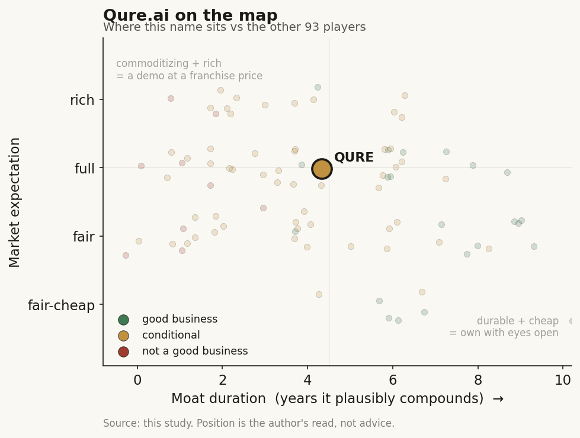

# Qure.ai (private (India))

> **The read.** The clearest global-south leader in radiology-image AI - a real, scarce distribution asset (4,500+ sites in 100+ countries, the widest FDA-cleared chest-X-ray footprint, and a WHO-cited TB screen most Western AI vendors cannot reach) attached to a genuinely capital-light per-scan model - but a small, still-private business (~$23m revenue, last priced ~$267m) whose whole re-rate rests on converting millions of $1-5 screens and one marquee pharma partnership into a durable, higher-value clinical annuity before a crowded field of chest-X-ray AI rivals commoditizes the read. Conditional value-capturer, evidence thinner than a US filer.

**Snapshot**

| | |
|---|---|
| Listing | private (no traded stub; exposure via pre-IPO/secondary markets or later India/US IPO) [reported] |
| Region | India (Mumbai HQ + New York; deployed across the global south) |
| Value-chain layer | Imaging L5a/L6 - interpretive screening (chest X-ray / CT SaMD) + the care-pathway workflow around it |
| Archetype | SaMD / screening - per-scan software fees + subscription/enterprise bundles, extending into a pharma/CRO life-sciences leg |
| Size | ~$267m implied valuation (Nov-2024 priced round) [reported]; not publicly re-marked since |
| Revenue (latest) | FY25 (yr-end Mar-2025) ~INR 190Cr (~$23m), up from ~$16.4m FY24 (~40% growth) [reported] |
| Moat verdict | conditional - distribution breadth + regulatory lead + a TB franchise are real, but the screen itself is commoditizing |
| Expectation | fair-to-full |
| Evidence quality | med-low (private; funding/clearances disclosed, financials are Indian-filing / third-party-database figures, not audited software KPIs) |

## What it is
An Indian medical-AI company built on one idea: in most of the world there are far too few radiologists to read the X-rays and CT scans being taken, so software that reads the image can act as the *first* reader, not just a second opinion. Founded 2016 by Prashant Warier and Pooja Rao; headquartered in Mumbai with a New York office [reported]. Its flagship products are **qXR** (AI that flags abnormalities on chest X-rays - TB, lung nodules, and other findings), **qER** (AI triage of non-contrast head CT for stroke/bleed), and a lung-cancer suite (**qCT / qQuant / qTrack** - nodule detection, volumetric quantification, and pathway tracking). qXR became the first FDA-certified AI chest-X-ray tool in 2018 [reported]; qER cleared in 2020. It sits one layer above the scanner - the interpretive screening layer (L5a) plus the care-pathway workflow (L6), not the imaging hardware.

## Business model - how it makes money
Two engines, tilting from a public-health screening base toward a higher-value clinical and pharma leg:

- **Per-scan / screening software (the core).** A chest X-ray or CT is captured at a hospital, imaging centre, mobile screening van, ministry-of-health program, or NGO site, run through Qure's model, and returned as a structured read. Pricing is a pay-per-use model of roughly **$1-5 per scan** depending on modality [reported], sold direct to hospitals or via subscription/enterprise bundles, ministries of health, and public-health non-profits. In the US, lung and neuro products are billable under CMS-issued CPT codes (e.g. 0721T, 0727T) [reported], which is what gives the model a stable domestic revenue path rather than a pure aid-funded one. This is a high-volume, low-price-per-scan annuity - closer to a metered software service than a reimbursement-gated lab.
- **Pharma / life-sciences leg (the intended margin step-up).** Qure sells into drug development and med-device partners: AI-based patient identification and enrichment for clinical trials, and volumetric quantification (qQuant) as a reproducible imaging endpoint [reported]. The signature deal is the **AstraZeneca** lung-cancer partnership - AI-enabled chest-X-ray screening that reached **5 million scans across 20+ countries and flagged ~50,000 high-risk cases** [reported, company/partner-reported] - and a **Microsoft** partnership (Nov-2025) to distribute the lung-cancer suite in the US [disclosed]. This is the leg that could convert a low-price screen into a higher-value, stickier clinical product.

**Growth quality - the whole debate.** Revenue is small but growing fast (~$16.4m FY24 to ~$23m FY25, ~40% [reported]) and genuinely global - the emerging-market/global-south footprint is real distribution, not slideware. Margins are structurally software-like because the customer owns the scanner and Qure sells the read. The re-rate case is that the pharma leg and the US lung/neuro CPT-coded products carry the mix toward higher value; the bear case is that a $1-5 screen in a radiologist-scarce market is exactly where pricing power is weakest, and chest-X-ray AI is a crowded category.

**Incremental economics / cash.** Capital-light by design - no lab, no reagent toll, no scanner capex; Qure sells software on top of hardware it does not own. Profitability is **[unverified]** at the group level - Indian-entity filings and third-party databases show revenue but not a clean, audited group P&L or gross margin; management has not publicly disclosed EBITDA or a dated breakeven. Total external funding is ~$123-156m across 9 rounds (sources vary) [reported], including a **$65m Series D (Sep-2024, led by Lightspeed and 360 One)** [disclosed] and a Jan-2026 grant round; runway is real against a small burn, but the numbers a US-listed peer would report (ARR, NRR, segment margins) are not disclosed.

## Financial summary
Private; Indian-filing / third-party-database figures, tagged. Real numbers only.

| Item | Detail |
|---|---|
| Revenue FY24 (yr-end Mar) | ~$16.4m [reported] |
| Revenue FY25 (yr-end Mar) | ~INR 190Cr (~$23m), ~+40% YoY [reported] |
| Group profitability | **[unverified]** - no audited group P&L / EBITDA / gross-margin disclosed |
| Total external funding | ~$123-156m over 9 rounds, 48 investors (sources vary) [reported] |
| Series D | **$65m**, Sep-2024, led by **Lightspeed** + **360 One** [disclosed] |
| Last priced valuation | ~INR 2,230Cr (~$267m), Nov-2024 [reported]; not publicly re-marked since |
| Deployment scale | **4,500+ sites, 100+ countries** [reported] |
| Regulatory footprint | **26 FDA clearances across 9 products**, 65+ CE-certified indications [reported] |
| Public-health status | cited twice in **WHO TB screening guidelines**; qXR WHO-recommended for TB screening/triage [disclosed] |

Figures are company/database-reported and mostly unaudited at the group level; treat the valuation and revenue as approximate [unverified].

## Value-chain position and competition
Qure sits at **L5a interpretive screening** (the model that reads the chest X-ray or CT and raises the flag) and **L6 workflow** (delivering that read inside a hospital, screening program, or care pathway). Flow: a scanner (hardware Qure does not need to own) captures an image -> the image enters Qure's model -> a screening/triage report comes back -> de-identified signal pools back into one of the largest real-world chest-X-ray training corpora, spanning conditions and populations most Western datasets under-represent. It is "software one level above the scanner" - the same picks-and-shovels logic as a diagnostics platform, with the capital-heavy imaging hardware deliberately left to the customer.

Competition, split by where they sit:
- **Chest-X-ray / broad-triage AI rivals - Annalise.ai (comprehensive CXR second-read, also pushing into the global south), Aidoc (31 FDA clearances, 1,600+ hospitals, US enterprise care-coordination), Lunit (oncology screening, OEM-embedded), Viz.ai (US stroke triage).** The chest-X-ray AI category has multiple cleared, clinically comparable players; Qure's claim is breadth of clearances (the widest chest-X-ray indication set) and reach into markets the US-focused vendors do not serve, not being alone on the read itself.
- **The scanner/OEM and hospital-IT stacks** (GE, Siemens, Philips, PACS vendors) that own the modality and can bundle or envelop a screen into hardware or workflow the site already bought - the same envelopment risk that squeezes every triage-AI app.
- **Regional reference points** - Lunit (Korea), Airdoc (China retinal), and Taiwan imaging-AI names - useful for pricing precedent; Qure is the best-distributed of the ex-US/ex-China cohort in the global south specifically, anchored by the TB franchise.

Edge: the widest FDA-cleared chest-X-ray indication set, a WHO-cited TB screen, a very wide multi-country install base, and a marquee pharma partnership (AstraZeneca) plus US distribution (Microsoft) that most emerging-market AI peers lack. Its disadvantage is small absolute scale, a core screen rivals can match on the clearance, and low price per scan in exactly the markets where it is strongest.

## Moat
- **Distribution + regulatory breadth - REAL but a lead, not a lock (~2-4 yr edge).** 4,500+ sites, 100+ countries, the widest chest-X-ray FDA clearance set, and a global-south footprint built over a decade is a genuine head start and switching friction inside deployed screening programs. But clearance gates the shelf, not the price; chest-X-ray AI is crowded with clinically comparable rivals (Annalise, Aidoc, Lunit). The barrier is a first-mover lead being repriced toward table stakes.
- **TB / public-health franchise - REAL and genuinely scarce.** Being cited twice in WHO TB screening guidelines and embedded in national TB programs (India, Nigeria, Lesotho and others, often Unitaid/PATH-funded) is a differentiated, hard-to-replicate position in a disease burden the West largely ignores. But public-health screening is low-price and grant/tender-funded - a strong *access* asset, a weak *pricing* asset.
- **Data-network / dataset breadth - CONDITIONAL, real but not yet decisively compounding.** A very large, diverse real-world chest-X-ray corpus (spanning populations and conditions) makes the next model better - a genuine flywheel in principle. The problem is monetization: a better model does not automatically command a higher price when the clearance is commoditizing and the buyer is a cost-constrained ministry or an NGO. Widens only if the pharma leg and US CPT-coded products turn data breadth into a higher-value, stickier clinical product.

Net: the durable assets are distribution breadth plus the WHO TB franchise plus a large diverse dataset - genuinely differentiated today - but the core screen is commoditizing and the higher-value pharma/US leg is early. Estimated durable-compounding duration is a conditional ~3-5 years, contingent on the pharma and US-clinical mix growing faster than the screen commoditizes.

## Core variables
1. **[CORE] Pharma / US-clinical mix-shift.** Can the AstraZeneca-style pharma partnerships, trial-enrichment work, and US CPT-coded lung/neuro products (with Microsoft distribution) grow into a higher-value, recurring leg - or do they stay one marquee deal plus a low-price public-health screen? This is the entire re-rate: a $1-5 screen is low-value and contested; an embedded pharma pathway or a US-reimbursed clinical product is higher-value and stickier. If this stalls, Qure is a broadly-deployed but low-price screen vendor.
2. **[CORE] Price per scan vs commoditization.** The core read sells for $1-5 in radiologist-scarce markets while Annalise, Aidoc, and Lunit hold comparable chest-X-ray clearances. Does volume-times-price scale into a real business, or does a crowded, cleared field plus cost-constrained public buyers keep per-scan economics structurally thin?
3. **[CORE] Path to disclosed profitability / next mark.** Revenue grew ~40% to ~$23m, but group profitability is [unverified] and the last priced valuation (~$267m, Nov-2024) is stale. Does the company reach and disclose durable profitability - and does the next round or an IPO re-mark it up (validating the model) or flat/down (confirming the small-scale, low-price read)?

Below the line as noise: individual country/ministry tender wins; specific FDA-clearance-count milestones; the "X million scans" and "widest chest-X-ray crown" framing (real but low-price); short-run secondary-market share chatter.

## Bear case / key risks
A small company selling a low-price, commoditizing screen in the markets where pricing power is weakest. Revenue is ~$23m and the core product sells for $1-5 per scan, often to grant- or tender-funded public buyers; multiple rivals (Annalise, Aidoc, Lunit) hold comparable chest-X-ray clearances, so clearance is drifting from moat to table stakes. Group profitability is [unverified] - no audited P&L, EBITDA, or gross margin is publicly disclosed, and the numbers that exist are Indian-entity filings and third-party databases, thinner than a US filer. The higher-value pharma/US-clinical leg is early and, so far, concentrated in one marquee partnership (AstraZeneca) plus a new distribution deal (Microsoft) - real, but not yet a diversified recurring annuity. The last valuation mark (~$267m) is over a year old. If the screen commoditizes faster than the pharma/US leg scales, Qure is a widely-deployed, low-price software vendor with an admirable public-health mission and no durable pricing power.

Falsification watch: (1) per-scan price or screen volume growth stalls while a rival wins share - the core commoditizes; (2) the pharma/US-clinical mix fails to diversify beyond the AstraZeneca deal - the re-rate thesis stalls; (3) the next funding round or IPO prices flat/down to the ~$267m mark - the market confirms the low-price read; (4) a public-health funding cycle (Unitaid/tender) turns down and strands the screening base below viable per-unit economics.

## The expectation read
At a last-priced ~$267m (Nov-2024) on ~$23m FY25 revenue, the implied multiple is roughly ~10-12x sales [estimate] - a rich mark for a small business growing ~40% whose core product sells for $1-5 a scan and whose group profitability is undisclosed. The price appears to assume the asset-light model works: that the widest chest-X-ray clearance set, a WHO-cited TB franchise, and a global-south distribution lead convert - via the AstraZeneca pharma pathway and US CPT-coded products - from a low-price public-health screen into a durably profitable clinical-AI platform, and that first-mover breadth stays a real edge rather than commoditizing.

Where the belief looks soft: the core screen is cheap and contested, rivals hold comparable clearances, group profitability is [unverified], the valuation mark is stale, and the higher-value pharma leg is still concentrated in one flagship deal. The multiple is defensible relative to a cash-burning pre-revenue name precisely because the model is genuinely capital-light and the distribution/TB position is scarce - but it still prices a mix-shift and a durable moat the company has only begun to demonstrate.

## Verdict
Conditional value-capturer - the clearest global-south leader in radiology-image AI, with a genuinely scarce distribution footprint (4,500+ sites, 100+ countries), the widest FDA-cleared chest-X-ray indication set, a WHO-cited TB franchise, and a capital-light per-scan model, but a small (~$23m), still-private business whose core screen is commoditizing as rivals win comparable clearances, and whose re-rate rests on converting a $1-5 screen and one marquee pharma partnership into a durable, higher-value clinical annuity. Good, capital-light business model and a real public-health moat at a fair-to-full expectation; not yet a proven compounder. Confidence: MEDIUM on the facts (funding, clearances, deployment scale, and the AstraZeneca/Microsoft partnerships are disclosed, though revenue is unaudited and group profitability is [unverified]); MEDIUM-LOW on the verdict, which hinges on two unresolved rate-of-change variables (pharma/US mix-shift and screen commoditization) that could break either way, and is capped by thinner-than-US-filer disclosure for a private Indian company.
