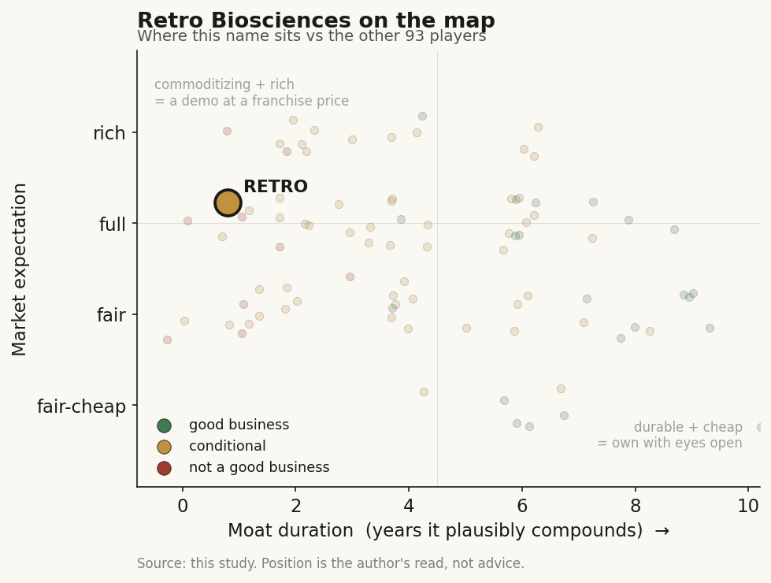

# Retro Biosciences (private)

> **The read.** A well-connected, well-narrated pre-clinical longevity option - not yet a durable value-capturer; the headline AI edge is rented from OpenAI, and everything gates on the unchanged ~40% Phase-II wall.

**Snapshot**

| | |
|---|---|
| Listing | private |
| Region | US (South San Francisco) |
| Value-chain layer | L9a (target/biology selection) / L9c (candidate selection) |
| Archetype | drug-owner (milestone / own-pipeline) |
| Size | $1.8bn pre-money valuation (2026 initial close) |
| Revenue (latest) | pre-revenue |
| Moat verdict | conditional (leans refuted) |
| Expectation | full |
| Evidence quality | med |

## What it is
A longevity biotech aiming to add ~10 healthy years to human lifespan via cellular reprogramming, autophagy, and plasma-inspired therapeutics - an own-pipeline drug developer, not a tool vendor. Notable for being seeded solely by Sam Altman and for a 2025 OpenAI protein-engineering collaboration (GPT-4b micro) that redesigned the Yamanaka reprogramming factors. It sits ON a modality (reprogramming) rather than selling it.

## Business model - how it makes money
Archetype 04 - milestone/own-pipeline biotech. No product revenue today; value is a probability-weighted string of clinical readouts, monetized eventually via pharma partnerships, licensing/royalties, and (for a winner) a durable therapy annuity. Capital-HUNGRY once assets hit the clinic - the three-statement is an R&D-opex burn line, so the only balance-sheet variables that matter are cash and runway, not margin/ROIC (undefined pre-product). Notable capital discipline on the input side (built its first lab in ~2 months for ~$200k vs a typical ~$15m/multi-year build) - real, but it lowers burn, it does not change the ~40% Phase-II efficacy wall that governs whether any asset is worth anything.

## Funding / valuation / backers
| Item | Detail |
|---|---|
| Seed | ~$180m, April 2022, entirely from Sam Altman - its only angel; Altman said he "emptied his bank account" across Retro + Helion [reported]. Total raised sat at ~$180m for ~three years [reported]. |
| 2025 ambition vs reality | Through 2025 the company was targeting ~$1bn at a $5bn valuation, pitched as "the greatest pharma market of all time" [reported]. That is NOT what cleared. |
| Latest round | Initial close at a $1.8bn PRE-money valuation, led by 4P Capital, announced ~22 May 2026 [disclosed: company blog; reported: press]. Round size undisclosed; other participants unnamed. The gap reads directly - $5bn target -> $1.8bn close is a material step-down in ambition, in a "biotech bust" tape [reported]. |
| Structural partners (non-equity) | Multiply Labs ~$85m cell-therapy manufacturing (May 2024); Murdoch Children's Research Institute ~$35m research/licensing (May 2025) [reported]. |
| Headcount | ~60 (May 2026) [reported]. |

Provenance tags on load-bearing numbers: [disclosed] company/primary · [reported] press/secondary · [estimate] derived · [unverified].

## Value-chain position and competition
Sits at L9a (target/biology selection - which aging mechanism to attack: autophagy, reprogramming, plasma) and L9c (candidate selection) as a vertically-integrated developer sitting ON a modality (reprogramming), not selling the modality. What flows IN: the reprogramming toolkit + AI-designed proteins (the "model/enzyme," an increasingly commodity input - RetroSOX/RetroKLF came from OpenAI's GPT-4b micro, not Retro-proprietary IP). What flows OUT (intended): owned clinical/pre-clinical assets - RTR242 (oral autophagy restart / lysosomal-function restart, first-in-human in ~15 months from indication selection [disclosed], ~8 participants dosed mid-December 2025 in a randomized double-blind placebo-controlled healthy-volunteer study in Adelaide, Australia [reported]); iMG / RTR888 (iPSC-derived microglial progenitors, CNS, pre-clinical [disclosed]); iHSC / RTR890 (iPSC-derived hematopoietic stem cells, blood disorders, pre-clinical [disclosed]); a tissue-reprogramming program (AAV-delivered reprogramming factors for in-vivo rejuvenation, targeting osteoarthritis and age-related hearing loss, pre-clinical [disclosed]); and an AI-designed-protein-therapeutics program (pre-clinical [disclosed]). Value forms one layer down from the tool, in the owned asset - the same "the model is the door, not the moat" structure as Isomorphic and the gene-editing cohort.

Competitively, a crowded, extremely well-capitalized field: Altos Labs (~$3bn+ raised), Calico (Alphabet, ~$3.5bn+ - but its lead ALS drug FAILED Jan 2025; its AbbVie partnership ended in late 2025 [reported]), NewLimit (~$247m, also reprogramming; first target is alcohol-related liver disease, clinic "in the next few years" per co-founder Jacob Kimmel [reported]), BioAge (public, halted its obesity program Dec 2024) [reported]. Against those balance sheets Retro is a minnow (~$180m + an undisclosed 2026 close). The sharper competitive fact by mid-2026 is that Retro is NOT first to the clinic on the reprogramming modality it is named for: Life Biosciences cleared a US IND and dosed its first human in June 2026 with ER-100, an in-vivo AAV-delivered partial-epigenetic-reprogramming therapy using OCT4/SOX2/KLF4 (the same Yamanaka-factor family Retro's GPT-4b-micro work redesigned) for optic neuropathies - the first-ever epigenetic-reprogramming therapy in humans [reported]. So the modality diffuses exactly as the Ch5 test predicts, and a rival owns the "first-in-human reprogramming" flag. Retro's edge is (i) speed - clinical-stage in ~3 years, cheap-and-fast lab builds; (ii) the Altman/OpenAI axis - privileged AI access (GPT-4b micro delivered a >50-fold jump in reprogramming-marker expression, iPSC generation compressed ~3 weeks -> ~7 days [disclosed]); (iii) breadth - independent shots across autophagy, reprogramming, cell therapy and plasma. Note that Retro's own clinical entry (RTR242) is an autophagy small molecule, NOT a reprogramming asset; its reprogramming programs (iHSC, tissue-reprogramming) remain pre-clinical, so the marquee AI-plus-reprogramming story is not yet the thing being tested in humans. The AI result is a genuine efficiency win at the L9b generation step - but that is the cheap, already-solvable half of the funnel.

## Moat
Ch5 Moat 3 (pharma-distribution / own-pipeline), verdict CONDITIONAL - and here it leans toward the refuted end. The moat is NOT a compounding one: it is binary optionality gated on the ~40% Phase-II efficacy wall unchanged for ~30 years, where ~90% of failure and ~93% of clinical spend sit. Retro's differentiators fail the Ch5 "does it own a scarce input the platform cannot cheaply replicate?" test on two axes: (a) the AI reprogramming model is OpenAI's, not Retro's - the scarce input is owned upstream by the platform partner, exactly the envelopment risk Ch5 flags; and (b) reprogramming science diffuses (Altos, NewLimit, academic labs run the same playbook). What Retro genuinely owns is the clinical asset (RTR242 et al.) - real, but pre-revenue and efficacy-gated. Is the moat real for a private at this stage? No - not yet. There is no durable moat until an asset clears Phase-II efficacy visibly above the ~40% base (zero longevity/reprogramming drugs have, and aging is not even an FDA-recognized indication). Today it is access + optionality + speed, not duration of compounding.

## Core variables
1. **RTR242 Phase-I readout (the master binary).** Autophagy pill in Alzheimer's; CEO signals data ~Aug 2026, "no dose-limiting toxicities" so far [reported]. First real efficacy signal - re-rates the whole company.
2. **Cash runway vs next inflection.** ~$180m + an undisclosed 2026 close against a multi-program clinical burn; a 2023 co-founder estimate put runway to ~2030 [reported], but that pre-dates moving three programs into humans. Runway-vs-catalyst is the survival variable for any archetype-04 name.
3. **Does the AI/reprogramming edge translate to in-vivo efficacy?** The 50x gain is at generation (in-vitro marker expression); the wall is Phase-II human efficacy. Whether the OpenAI axis moves the base rate - not just the lab timeline - is the whole thesis.

(Second-order, held below the line: plasma-dilution program; manufacturing scale via Multiply; indication regulatory path for "aging"; the valuation-mark trajectory.)

## Bear case / key risks
An access-and-narrative story priced on a demo, structurally identical to the AI-drug-discovery failures. (1) Wrong phase: the celebrated 50x win is at cheap in-vitro generation; it has bought zero points of Phase-II efficacy, and no reprogramming/longevity asset has ever cleared that wall - "selection solved, biology unsolved." (2) The scarce input is rented: the AI edge belongs to OpenAI/Altman, who can redirect it; Retro's own IP moat is thin. (3) Out-capitalized: Altos (~$3bn+) and Calico (~$3.5bn+) dwarf it, and even Calico's deep pockets produced a Phase-III ALS failure - capital does not buy the biology. (4) The valuation tell: targeting $5bn and closing at a $1.8bn pre-money is a down-shift in ambition; the mark is a venture mark, not cash-flow-proven, struck into a biotech bust. (5) No reimbursement anchor and no recognized indication - aging isn't an approvable endpoint, so even success routes through a proxy disease (Alzheimer's) that has humbled far better-funded pipelines. Falsification that breaks the bear: a longevity/reprogramming asset clearing Phase-II efficacy above the ~40% base - none exists as of mid-2026.

## The expectation read
The $1.8bn pre-money mark implies the market is still paying for optionality and the Altman/OpenAI narrative rather than de-risked biology. The belief looks soft in two places: first, the mark itself is a step-down from the $5bn target, so the venture market has already partly repriced the story toward reality; second, nothing in the price reflects a Phase-II efficacy datapoint because none exists - the valuation rests entirely on pre-clinical/Phase-I signals and access, not on any asset clearing the ~40% wall. A full expectation on a demo-and-access basis, with the first real test (RTR242, ~Aug 2026) still ahead.

## Recent developments (2025-2026)

- **First-in-human dosing, mid-December 2025 [reported].** RTR242 (oral autophagy/lysosomal-function restart) dosed ~8 participants in a randomized, double-blind, placebo-controlled Phase-I safety study in HEALTHY VOLUNTEERS at an early-phase clinical unit in Adelaide, Australia, with exploratory biomarkers tied to autophagy and lysosomal biology [reported]. This is Retro's first clinical-stage asset; indication-selection to first dose ran ~15 months [disclosed]. Read it as a clean safety/PK narrative, not efficacy.
- **$1.8bn pre-money close, announced 22 May 2026 [disclosed: company blog; reported: press].** Initial close of the next round, led by 4P Capital; round size and other participants undisclosed [disclosed]. The company had spent late 2025 pitching ~$1bn at a $5bn valuation [reported: STAT, Dec 2025], so $5bn target -> $1.8bn close is a material step-down in ambition, struck into a "biotech bust" tape. CEO Joe Betts-LaCroix said the RTR242 trial is going "super good" with "no dose-limiting toxicities" and higher-dose/efficacy-marker data expected "around August" 2026 [reported].
- **Pipeline codenames firmed up (all pre-clinical) [disclosed: company pipeline page].** iMG / RTR888 (iPSC-derived microglial progenitors, CNS); iHSC / RTR890 (iPSC-derived hematopoietic stem cells, blood disorders); a tissue-reprogramming program (AAV-delivered reprogramming factors, targeting osteoarthritis and age-related hearing loss); and an AI-designed-protein-therapeutics program. Note: as of mid-2026 the company's own pipeline page labels RTR242 "pre-clinical" while press and the fundraise post describe an active first-in-human study - the label appears to lag the trial; treat RTR242 as early-clinical [unverified reconciliation].
- **Competition moved first on the reprogramming flag [reported].** Life Biosciences cleared a US IND and dosed its first human in June 2026 with ER-100 (in-vivo AAV OCT4/SOX2/KLF4 partial-reprogramming for optic neuropathies) - the first-ever epigenetic-reprogramming therapy in humans, and it beat Retro to the clinic on the exact modality Retro is named for. NewLimit still guides to clinic "in the next few years" (first target alcohol-related liver disease) [reported]; Calico's AbbVie partnership ended in late 2025 [reported].
- **Structural partners (unchanged/confirmed).** Multiply Labs ~$85m cell-therapy manufacturing (May 2024) and Murdoch Children's Research Institute ~$35m iPSC-derived HSC research/licensing (May 2025) remain the non-equity partners; Retro also references an in-house cGMP cell-therapy manufacturing facility [disclosed].

Net: the two firm updates - a first-in-human safety study now dosing and a $1.8bn mark that is a down-shift from the $5bn target - do not change the thesis. The first real efficacy datapoint (RTR242, ~Aug 2026) is still ahead, the AI edge is still OpenAI's, and a competitor now holds the first-in-human reprogramming flag. Nothing here clears the ~40% Phase-II wall.

## Verdict
DEMO/OPTIONALITY, not a durable value-capturer - a well-connected, well-narrated pre-clinical option gated on the unchanged ~40% Phase-II wall, with its headline AI edge owned by OpenAI, not Retro. Good business at a fair/full expectation? Not yet a moat, priced full on narrative. CONVICTION: HIGH that it is not-yet-a-moat (the archetype and the OpenAI-owned-input facts are firm); LOW on ultimate program success (the Aug-2026 RTR242 readout is the first real datapoint).
