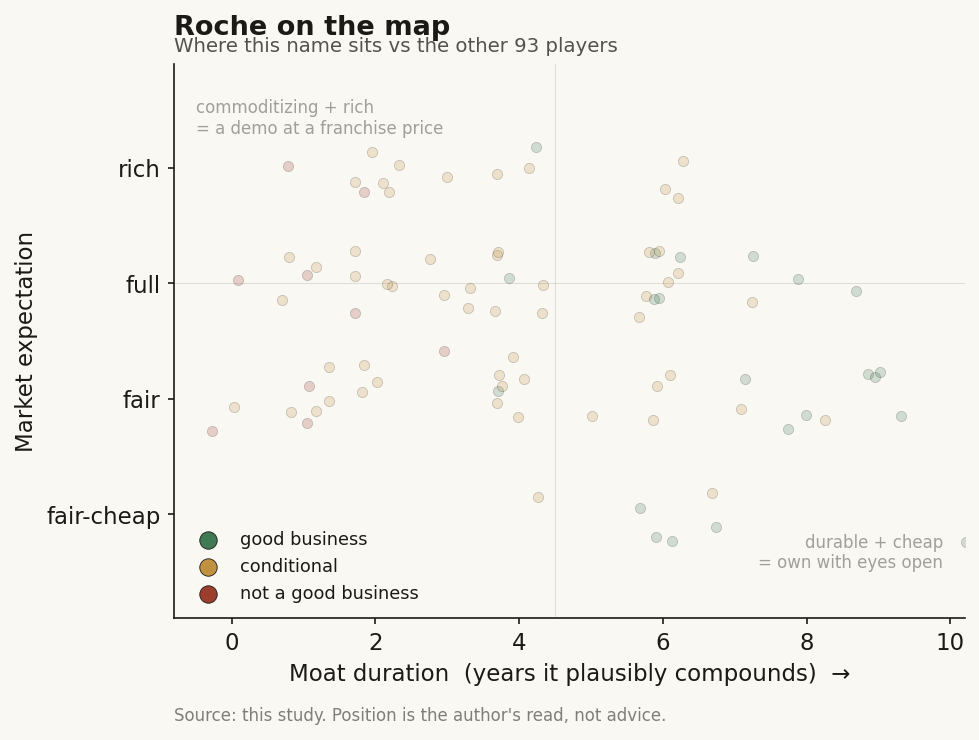

# Roche (RHHBY / Six (Switzerland))

> **The read.** The incumbent that looks most like a data platform - it already owns the two best oncology data assets (Flatiron for outcomes, Foundation Medicine for genomics) plus Genentech's discovery engine and the largest disclosed GPU footprint in pharma. But at ~$330bn on a CHF 61.5bn revenue base, none of that is what you are buying. The value-chain point of the whole study lives here in its purest form: Roche funds the AI, keeps the data, keeps the drugs, and captures the value - AI is a margin lever and a moat-deepener, not the story.

**Snapshot**

| | |
|---|---|
| Listing | RHHBY (ADR) / ROG (Six Swiss Exchange) |
| Region | EU (Switzerland) |
| Value-chain role | pharma incumbent - the funder / data-owner / value-keeper of the healthcare-AI chain |
| Archetype | diversified big-pharma (Pharma + Diagnostics) with an owned clinico-genomic data spine |
| Size | ~$330bn market cap (Jun-26); ADR ~$53 [reported] |
| Revenue (latest) | FY25 CHF 61.5bn, +7% CER (+2% CHF) [disclosed] |
| AI relevance | small to the P&L today; large to the moat - Roche is the closest thing to a data platform among incumbents |
| Moat verdict | strong - but the moat is franchise + the fused Flatiron/Foundation data asset, not AI models |
| Expectation | fair-to-full - priced on the pipeline, not on AI |
| Evidence quality | high |

## What it is
A Swiss diversified healthcare company in two divisions: Pharmaceuticals (CHF 47.7bn FY25, driven by Ocrevus, Hemlibra, Vabysmo, Phesgo, Xolair) and Diagnostics (CHF 13.8bn) [disclosed]. Inside it sit three assets that make Roche the incumbent the study frames as "most like a data platform": **Genentech** (its US biotech engine, where the internal AI lives), **Flatiron Health** (curated real-world oncology outcomes data, acquired 2018 for ~$1.9bn / ~$2.1bn fully diluted) [disclosed], and **Foundation Medicine** (comprehensive genomic profiling) [disclosed]. AI matters to this study not because it moves Roche's P&L - it does not, yet - but because Roche already owns the raw material the AI labs are trying to rent: linked clinical-outcome + genomic data on millions of cancer patients, generated inside its own diagnostics and trials.

## Business model - how it makes money
Roche discovers, develops, manufactures, and sells patented biologics and small molecules, and separately sells diagnostics instruments, assays, and (increasingly) software. It captures value at every layer a pure-play AI lab never touches: the ~40% Phase II efficacy wall (it runs the trials), regulatory approval, manufacturing, payer contracting, and a global commercial machine.

That is the study's key point, in its cleanest incumbent form. When Roche engages an external AI lab it structures the deal as **upfront + milestones + royalties** and keeps the asset: Recursion (2021) took a $150m upfront for the option to run up to ~40 programs over a decade; Roche owns whatever advances [disclosed]. The AI partner bears discovery risk and is paid in options; Roche keeps the drug.

- **AI as a tool and a moat, not a product.** Roche does not sell a foundation model. It uses AI to make its own discovery, trials, and pathology cheaper and faster, and it feeds AI with data no competitor can assemble.
- **The data twist that sets Roche apart.** Unlike a Lilly, Roche already bought the two best oncology data assets outright. Flatiron (outcomes) fused with Foundation Medicine (genomics) is a proprietary clinico-genomic corpus - the exact input a Tempus or a Flatiron rival sells. Roche owns it and keeps it internal.
- **Capital-heavy where it counts.** The spend is trials, manufacturing, and commercial - not compute. Even the largest AI commitment is small next to that.

## Financial summary
Top-line scale, with the AI/deal figures kept in proportion so the reader sees how small they are against the base.

| Item | Figure |
|---|---|
| FY25 revenue | CHF 61.5bn, +7% CER / +2% CHF [disclosed] |
| - Pharmaceuticals | CHF 47.7bn, +9% CER [disclosed] |
| - Diagnostics | CHF 13.8bn, +2% CER [disclosed] |
| FY25 Group R&D | CHF 12.2bn, -3% (Pharma R&D ~CHF 10.4bn) [disclosed] |
| FY25 IFRS net income | CHF 13.8bn, +58% [disclosed] |
| Market cap | ~$330bn (Jun-26); ADR ~$53 [reported] |
| Growth drivers | Ocrevus, Hemlibra, Vabysmo, Phesgo, Xolair [disclosed] |
| **AI deal / data / capex figures (kept in scale)** | |
| Flatiron Health (real-world outcomes data) | acquired 2018, ~$1.9bn / ~$2.1bn fully diluted [disclosed] |
| Foundation Medicine (genomic profiling) | acquired outright; fused with Flatiron into a clinico-genomic corpus [disclosed] |
| Recursion partnership | $150m upfront, up to ~40 programs over a decade, milestones + royalties (2021) [disclosed] |
| Genentech-NVIDIA collaboration | multi-year "lab-in-a-loop" on DGX Cloud + BioNeMo (2023); terms undisclosed [disclosed] |
| NVIDIA AI Factory (Mar-2026) | +2,176 Blackwell GPUs -> >3,500 total, the largest disclosed pharma GPU footprint; cost undisclosed, ~$65m+ on the new chips alone [estimate] |
| Navify Digital Pathology | >20 AI algorithms from ~8 partners integrated; first computational-pathology companion Dx (TROP2) got FDA Breakthrough, Apr-2025 [disclosed] |

Scale check: the entire disclosed AI-hardware step-up (~$65m+ [estimate]) is roughly 0.5% of one year's R&D and ~0.02% of market cap. Flatiron, the biggest AI-relevant purchase Roche ever made, cost ~$1.9bn once - about three weeks of revenue. AI here is financed out of pocket change.

## Value-chain position and competition
Roche sits at the top of both the drug-discovery chain and the diagnostics chain, and it is the one incumbent that also owns the **data layer** between them. Map the flows:

- **Money flows out** to AI labs (Recursion, and NVIDIA for compute) as small upfronts + large contingent milestones + hardware.
- **Data flows in and stays in.** Foundation Medicine generates genomic profiles; Flatiron generates linked real-world outcomes; Roche's own trials and diagnostics generate more. Fused, this is the corpus a Tempus/Flatiron-type vendor sells - Roche keeps it as an internal moat and a trial-design edge.
- **AI capacity flows in** three ways: licensed discovery platforms (Recursion), owned compute (the NVIDIA AI Factory, >3,500 Blackwell GPUs, the largest disclosed in pharma), and an internal "lab-in-the-loop" at Genentech that cycles wet-lab data through predictive models.
- **Finished drugs, trials, manufacturing, distribution, and the data itself stay inside Roche.**

Competition for the *AI-funder / data-owner* role is the other cash-rich incumbents doing the identical thing - Lilly (Isomorphic, Insilico, TuneLab, owned supercomputer), Novartis, J&J, Sanofi - each funding the same handful of AI labs and building the same owned compute. On the *data* axis Roche's rivals are the data-platform pure-plays it structurally resembles: Tempus and Caris (clinico-genomic), Flatiron's external RWE peers (Komodo, Truveta), and Foundation's diagnostic peers (Guardant, Natera). The difference is Roche owns the data outright and does not have to monetize it through a reimbursement-gated lab. The fight that actually decides Roche's value, though, is the pharma pipeline and patent cliffs - not AI.

## Moat
Roche's moat is wide and real, and it splits into three layers - only the middle one is AI-specific.
- **Franchise + scale + distribution - STRONG (~10-15 yr).** Patent-protected biologics, manufacturing scale, entrenched payer/prescriber relationships, and the balance sheet to run any trial. This is what a ~$330bn valuation rests on.
- **The fused clinico-genomic data asset - REAL and scarce (data-network, ~5-10 yr).** Flatiron outcomes x Foundation genomics x Roche trials is a multimodal corpus rivals cannot cheaply replicate, and it is the one incumbent asset that genuinely looks like a data platform. It compounds with every profiled patient and every trial. But it is a moat because Roche *owns* it, not because Roche's models are better than anyone's.
- **AI models as a moat - WEAK / not the point.** Discovery models commoditize (open clones caught the frontier within ~a year at far lower cost). Roche's edge is proprietary data + owned compute + the trials AI cannot run - incumbency, not algorithms.

Net: durable ~10-15-year franchise moat, with a genuinely scarce ~5-10-year data-network layer that is the best AI-relevant asset any incumbent holds. The models themselves are table stakes.

## Core variables
1. **[CORE] Pipeline + patent-cliff trajectory.** This is ~everything: Vabysmo, Ocrevus follow-ons, the obesity entrants (CT-388 and orals), and the next-decade cliff on the older biologics. AI does not move this needle in the forecast window.
2. **[CORE] Does the owned data asset actually shorten cost-per-approved-drug?** The whole incumbent-AI thesis, and Roche's sharpest version of it: does fusing Flatiron + Foundation + trials into "lab-in-the-loop" measurably raise Phase II success or speed discovery? Roche cites an oncology molecule designed ~25% faster [disclosed]; systemic P&L proof is [unverified].
3. **[CORE] Milestone conversion, not headline biobucks.** The Recursion "up to ~40 programs" is an option ceiling. What matters is cash actually paid as molecules advance - and, either way, Roche's downside is a small upfront and it keeps every asset that works.

Below the line as noise: GPU counts, the "largest pharma AI footprint" framing, individual pathology-algorithm integrations, and which specific AI lab "wins." For a CHF 61.5bn company these are strategy line-items, not valuation drivers.

## Bear case / key risks
The bear case has almost nothing to do with AI. It is pipeline concentration and patent cliffs: a company priced near $330bn on a maturing biologics book faces biosimilar erosion on the older franchises, a crowded and late entry into obesity against Lilly and Novo, diagnostics-division softness (CHF sales down 3%), FX drag (revenue +7% CER became +2% in CHF), and US drug-pricing politics. Any pipeline disappointment dwarfs anything AI could add or subtract.

On AI specifically the risk is the incumbent's inverse of the pure-plays': not that Roche's AI fails, but that it *over-builds compute for narrative reasons* (a 3,500-GPU footprint is a headline, not yet a proven ROI), or that its owned data advantage proves harder to convert into approved drugs than the slide decks imply. A licensed molecule that hits the ~40% Phase II wall just stops earning milestones - Roche loses a small upfront, nothing more.

Falsification watch: (1) patent-cliff / obesity-share erosion - the real thesis breaks here, AI irrelevant; (2) the Flatiron+Foundation corpus measurably de-risks a pivotal program - the one path where AI stops being a rounding error and the data-platform framing pays off; (3) a data-platform pure-play (Tempus/Caris) or an RWE rival replicates the fused-corpus edge cheaply - the only way Roche's most distinctive AI asset erodes.

## The expectation read
At ~$53 (ADR) and ~$330bn (Jun-26), the market prices Roche as a mature, high-margin pharma-plus-diagnostics compounder navigating a patent cliff - roughly a market-multiple large-cap-pharma valuation, not a growth or AI multiple. **Essentially none of that price is AI.** The AI deals, the data acquisitions, and the GPU build-out together commit a fraction of one year's R&D and are financed out of free cash flow; the deals are structured so Roche's downside is a handful of small upfronts. The expectation embedded in the stock is that the pipeline offsets the cliff and the dividend holds - not that AI discovers the next blockbuster.

So the AI read is asymmetric and cheap, and slightly better than a pure funder's: Roche pays option premiums, keeps every asset that works, and - uniquely among incumbents - already owns the data corpus the AI labs are trying to rent. Whether AI "moves" a ~$330bn company: not in the numbers today, and not in the price. If it ever does, it shows up as *lower cost-per-approved-drug* and *sharper trial design* over a decade - a slow margin tailwind, not a re-rating.

## Verdict
Good business, wide moat - and, among the incumbents, the one whose moat most resembles a data platform, because Roche already owns Flatiron, Foundation Medicine, and Genentech's discovery engine outright. But the moat that carries the ~$330bn valuation is the franchise, scale, and pipeline; the fused clinico-genomic data asset is a genuinely scarce AI-relevant edge, and the models are table stakes. Roche is the study's purest illustration of the thesis: the incumbent funds the AI, buys or builds the data and the compute, keeps the drugs and the trials, and captures the value - all for well under 1% of R&D. Confidence: HIGH on the facts (revenue, R&D, deal terms, data assets, GPU footprint all disclosed and current); HIGH on the framing (AI is a tool and a moat-deepener here, the pipeline is the story); the one genuinely open question is variable 2 - whether the owned data corpus ever measurably lowers cost-per-approved-drug, which is unobservable for years.
