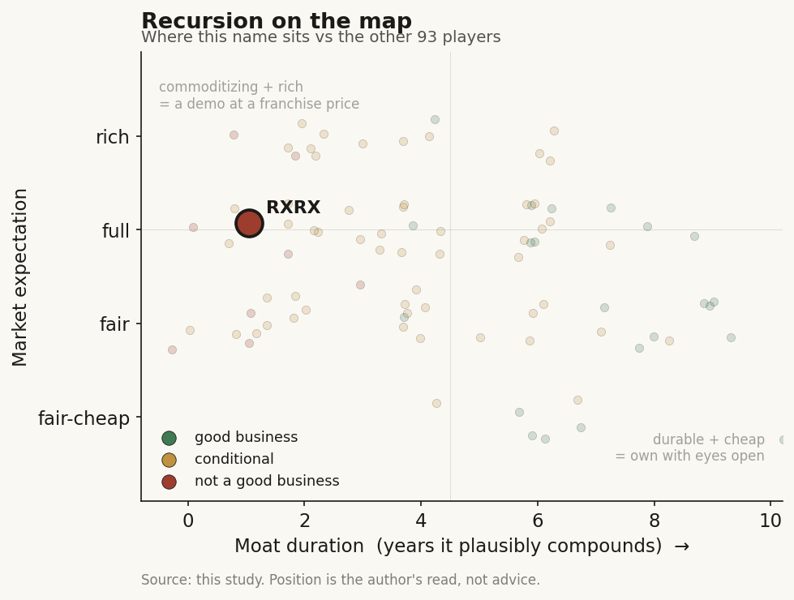

# Recursion (RXRX)

> **The read.** A capital-hungry, pre-revenue own-pipeline optionality book whose signature moat - the data flywheel - is the sub-sector's clearest refutation; at roughly 30x milestone-lumpy sales the expectation still capitalizes a flywheel-to-drug link the evidence has not proven.

**Snapshot**

| | |
|---|---|
| Listing | RXRX / Nasdaq |
| Region | US |
| Value-chain layer | L9a (target-ID) + L9c-L9e (selection through owned clinical development) |
| Archetype | drug-owner (milestone + royalty / own-pipeline, pre-revenue optionality) |
| Size | ~$2.02bn market cap (~$1.35bn EV) |
| Revenue (latest) | $74.7m FY2025 (+27%), milestone recognition - not recurring |
| Moat verdict | commoditizing (data flywheel refuted) |
| Expectation | full |
| Evidence quality | high |

## What it is
A clinical-stage "techbio" that runs a large automated wet-lab (the "Recursion OS" / phenomics flywheel - millions of cellular perturbation images) to map biology, pick targets, and design molecules it then carries into its own trials. It sells pharma partnerships (milestones + royalties) on top of an owned pipeline, and absorbed Exscientia (~$630m, closed Nov 2024) to consolidate the space. It is the Ch5 poster child for the refuted drug-discovery data-flywheel: the field's largest automated-lab flywheel married to among the field's weakest clinical output.

## Business model - how it makes money
Two revenue lines, both non-product: (i) collaboration/milestone payments from pharma partners, and (ii) grant/other. It is pre-product - near-zero commercial drug revenue.

- **Incremental ROIC is undefined/deeply negative** - capital-hungry at the clinic. Growth is not organic compounding; it is discrete re-ratings on data events, funded by dilution and biobucks. Cash conversion is negative by construction.
- Gross margin is not the metric - this is a pre-revenue optionality book with no margin line to disperse. The 3-statement is dominated by R&D opex and a burn line; the biotech rule applies - look only at cash and runway, not margins/ROIC.
- Cash / burn are the only balance-sheet variables that matter: cash, equivalents & restricted **$753.9m** at Dec-31-2025, falling to **$665.2m** at Q1'26. FY2026 operational cash-burn guide **< $390m**, runway stated **into early 2028** without new financing. That is roughly one funded shot-window before the pipeline must deliver a re-rating catalyst or return to market.

## Financial summary

| Metric | FY2024 | FY2025 | Q1'26 |
|---|---|---|---|
| Total revenue | $58.8m | $74.7m (+27%) | $6.5m (vs $14.7m a year earlier; ~60% below ~$16m consensus) |
| R&D | - | $475.3m | - |
| G&A | - | $176.6m | - |
| Net loss | $463.7m | $644.8m (widened ~39%) | $117.5m (narrowed from $202.5m; cash opex cut ~30% YoY) |
| Cash + equiv. + restricted | - | $753.9m (Dec-31-2025) | $665.2m |

FY2025 revenue is essentially all collaboration/milestone recognition, not recurring. The loss widened ~39% as revenue grew 27% - the anti-operating-leverage tell.

## Value-chain position and competition
A vertically-integrated developer sitting ON the discovery stack, not a tool/reagent vendor. **L9a**: target identification from the phenomics + genomics maps. **L9b** (structure/generation) is the commoditizing picks layer it also touches - but that layer carries no NPV (open Boltz/Chai/Protenix clones matched the AF3 frontier within ~1yr at >1000x lower cost). **L9c-L9e**: value forms in the owned clinical asset the platform enables - candidate selection (L9c), preclinical (L9d), owned clinical development (L9e). What flows out: (i) to pharma partners, de-risked targets/candidates in exchange for staged milestone cash; (ii) to its own P&L, the binary NPV of internal programs if they clear the efficacy wall. The central inversion: the company is priced as if it owns the selection/efficacy step (L9c-L9e value) while its cheapest, most defensible activity is the generation step (L9b) that carries no value.

Competes with (i) frontier AI-discovery labs - Isomorphic (Alphabet-backed, deeper pharma relationships), Xaira, Insilico, Generate; (ii) Absci (ABSI) on the "own-the-asset" thesis at micro-cap scale; (iii) ultimately legacy pharma's own discovery engines, which hit the same ~40% Phase-II wall. Its differentiator is scale of the wet-lab flywheel - among the largest automated perturbational datasets in the field, plus the widest partner roster (Roche/Genentech, Sanofi, Bayer, Merck KGaA). But that edge is exactly what Ch5 refutes: the largest flywheel has not bought a clinical lead. Recursion cut its three lead legacy programs in May 2025; REC-994 met safety but showed no meaningful clinical benefit. Revealed preference is the tell - rivals (Isomorphic) are now building wet labs, so the "compute-first" edge is being copied while the data edge fails to compound into output.

The realized partner cash makes the point in dollars: cumulative upfront + progress milestones are ~$500m+ across all partners combined [disclosed], of which Roche/Genentech is ~$213m and Sanofi ~$134m [disclosed] - both against multi-billion-dollar headline potentials, i.e. the ~1-3-cents-on-the-headline-dollar realization the moat section flags. Roche/Genentech has accepted 6 phenomaps and initiated one small-molecule program off phenomap insights to date [disclosed]; the arrow from "map accepted" to "program funded" stays thin.

## Moat
**Ch5 Moat-4 (data flywheel), drug-discovery version: refuted. Duration of compounding ~0-1 year.** The loop "more data → better model → better drug → more customers → more data" is broken here on the book's own four counts: (1) marginal data value decays to ~zero (public clones caught the frontier); (2) the largest flywheel owner has among the worst clinical output - Recursion is the named counter-example; (3) it compounds the wrong variable (L9b generation / Phase-I chemistry, ~80-90% clearance) and cannot move Phase-II efficacy (~40%, unchanged in ~30 years) where ~90% of failure and ~93% of spend live; (4) the customer arrow is priced as cheap optionality, not conviction - biobuck upfronts sit in a ~1.2-3.0% band, and the Recursion/Roche deal converted only ~$7m against an up-to-$12bn headline.

What could survive is workflow/integration lock-in (the L4-to-L9 loop) as a switching-cost moat - durable while it lasts, but that is not a widening data-scale advantage and is not what the multiple prices. The one moat that would count - an owned asset clearing Phase-II above the base - is unproven; that condition is unobservable before ~2028-29. Net: commoditizing, not durable.

## Core variables
1. **Lead-program clinical readout (the master binary).** Does an owned asset clear a value-inflection readout above the base? The near-term watchlist (per Q1'26, quarter ended Mar-31-2026): REC-4881 (MEK1/2, FAP) - Phase-2 TUPELO showed ~43% median polyp-burden reduction at Week 13 deepening to ~53% at Week 25 [disclosed], with FDA engagement opened on a possible registrational path and an update guided 2H26; REC-1245 (RBM39 degrader, solid tumors/lymphoma) - no dose-limiting toxicities across ~16 patients, Phase-1 escalation data 2H26 [disclosed]; REC-617 (CDK7, ovarian) - early combination data now guided 1H27 (pushed out from the earlier read), after a single confirmed platinum-resistant ovarian partial response in the monotherapy dose-escalation. One readout re-rates the name; everything else is second-order.
2. **Cash runway vs next catalyst (pre-product survival).** ~$665m and burn <$390m/yr → into early 2028. The question is whether a value-inflection lands before dilution/return to market is forced. This is a runway-vs-catalyst race, not a margin story.
3. **Realized Phase-II PoS for AI-discovered molecules (the wall).** AI clears Phase-I (~80-90% vs ~52% historic) but the edge vanishes at Phase-II efficacy (~40%); zero AI-origin drugs approved as of 2026. Whether Recursion's assets break this base is the whole thesis.

Noise held below the line: quarterly milestone-revenue prints - $6.5m Q1'26 vs $14.7m - swing on recognition timing, not business health; the $20bn+ headline milestone potential is a biobuck ceiling ~30-80x above realized cash and should not be capitalized; partner-count and phenomap-accepted tallies; SBC and the Exscientia integration one-offs; ARK/index flow.

## Bear case / key risks
It is a pre-revenue own-pipeline book with the sub-sector's clearest refuted moat. (i) The flywheel that justifies the premium is empirically broken - the biggest data engine produced among the weakest clinical output and cut its lead programs. (ii) Revenue is lumpy milestone recognition dressed as growth: FY25 +27% to $74.7m yet the loss widened to $644.8m, and Q1'26 revenue fell ~60% below consensus - anti-operating leverage, the opposite of compounding. (iii) The headline $20bn+ partnership potential overstates realized value by ~30-80x; only ~$500m of upfront/milestone cash has actually paid across all partners combined. (iv) Capital intensity is brutal and funding is binary: R&D ~$475m/yr against a runway into early 2028 means a single stretch of null readouts can strand programs and close the financing window at once. (v) The precedent is on its own tape: Exscientia killed DSP-1181, was rescued into Recursion; the model layer commoditizes in ~1yr. What breaks the bear: an owned asset posting durable Phase-II efficacy visibly above the ~40% base - the single event that would convert "more shots on goal" into "better odds per shot." Zero such data exists today.

## The expectation read
At ~$3.80, market cap ~**$2.02bn** on ~531m shares, against TTM revenue ~$66m, the stock trades at roughly **~30x sales** on revenue that is milestone recognition, not a durable stream. Net of ~$665m cash, the enterprise is priced near **~$1.35bn** - i.e. the market is paying that for the platform + pipeline optionality, having already faded the name from its ~$5.1bn 2021 peak. What the price implies the market believes: that the phenomics flywheel + partner roster will eventually convert into approved, royalty-bearing assets worth a multiple of today's EV - a data-scale-compounds-into-drugs thesis. Where that belief looks soft: the flywheel-to-output link is precisely the one Ch5 refutes with Recursion as the exhibit; ~30x sales on lumpy milestone revenue gives no valuation cushion if the next readouts are null; and the $20bn+ biobuck optionality being implicitly capitalized has historically realized at ~1-3 cents on the headline dollar. The EV is best read as a book of out-of-the-money call options on owned programs plus a not-yet-proven platform - the cash floor is real, but the premium above it rests on a flywheel that has not yet compounded into a single Phase-II win.

## Recent developments (2025-2026)
Nothing in the 2025-26 tape changes the moat verdict; the news is a cost-and-focus reset plus a fuller catalyst calendar, not a flywheel-to-drug proof point. The reader-relevant updates, dated and tagged:

- **May-2025 - pipeline pruning.** Recursion cut its three lead legacy programs; REC-994 met safety but showed no meaningful clinical benefit [reported]. This is the event the moat section cites as the flywheel's clearest refutation on its own tape.
- **Nov-2024 close - Exscientia consolidated.** The ~$630m all-stock Exscientia acquisition closed, folding a second AI-discovery shop (whose own DSP-1181 had failed) into the platform [reported] - space-consolidation, not capability that has yet produced a clinical lead.
- **FY2025 (year ended Dec-31-2025).** Revenue $74.7m (+27%) on collaboration/milestone recognition; net loss $644.8m (widened ~39%); cash + equivalents + restricted $753.9m at year-end [disclosed]. The loss-widening-while-revenue-grows pattern is the anti-operating-leverage tell already in the financials above.
- **Feb-2026 - Sanofi milestone.** A 5th Sanofi milestone triggered a $4m payment on a first-in-class oncology series [disclosed]; cumulative Sanofi upfront + milestones ~$134m, cumulative Roche/Genentech ~$213m, all-partner cumulative ~$500m+ [disclosed]. Real cash, but small versus the multi-billion headline potentials - the biobuck-realization gap the bear case sizes at ~30-80x.
- **Q1'26 (quarter ended Mar-31-2026) - cost discipline, revenue miss.** Revenue $6.5m (vs $14.7m a year earlier; ~60% below the ~$16m consensus) [disclosed]; net loss narrowed to $117.5m from $202.5m; cash operating expense cut ~30% YoY to ~$85m [disclosed]. Cash + equivalents + restricted $665.2m at quarter-end; FY2026 operational cash-burn guide < $390m; runway reiterated into early 2028 [disclosed]. The story here is the burn coming down, not the top line going up.
- **Catalyst calendar broadened.** Beyond the three named leads, the wholly-owned book now carries several defined near-term reads: REC-4539 (LSD1, first patient dosed Apr-2026, monotherapy data 2H27), REC-3565 (MALT1, monotherapy data 1H27), plus 2H26 go/no-go decisions on REC-7735 (PI3Ka H1047R-selective) and REC-102 (ENPP1) [disclosed]. More shots on goal - but the same ~40% Phase-2 efficacy wall applies to each, so a broader calendar widens the runway-vs-catalyst race without changing the odds per shot.
- **Index flow.** RXRX was added to multiple Russell indices around the Jun-2026 reconstitution, a mechanical flow event (a reported ~8% pop) unrelated to fundamentals [reported] - noise, held below the line.

Net for the case study: the 2025-26 record is consistent with Ch5's reading - the largest data flywheel in the field spent the period cutting failed leads, trimming burn, and collecting small biobuck milestones, while the one event that would break the bear (an owned asset clearing Phase-2 above the ~40% base) remains unobserved and now clusters into 2H26-1H27 readouts.

## Verdict
A capital-hungry, pre-revenue own-pipeline optionality book whose signature moat (the data flywheel) is the sub-sector's clearest refutation - a weak/binary business, and at ~30x milestone-lumpy sales / ~$1.35bn EV the expectation still capitalizes a flywheel-to-drug link the evidence has not proven, so not obviously cheap for the risk. Confidence: high on the moat verdict and the cash/burn figures; the swing factor is the 2026-28 owned-asset readouts, which are genuinely binary and could break the bear if any clears Phase-II above base.
