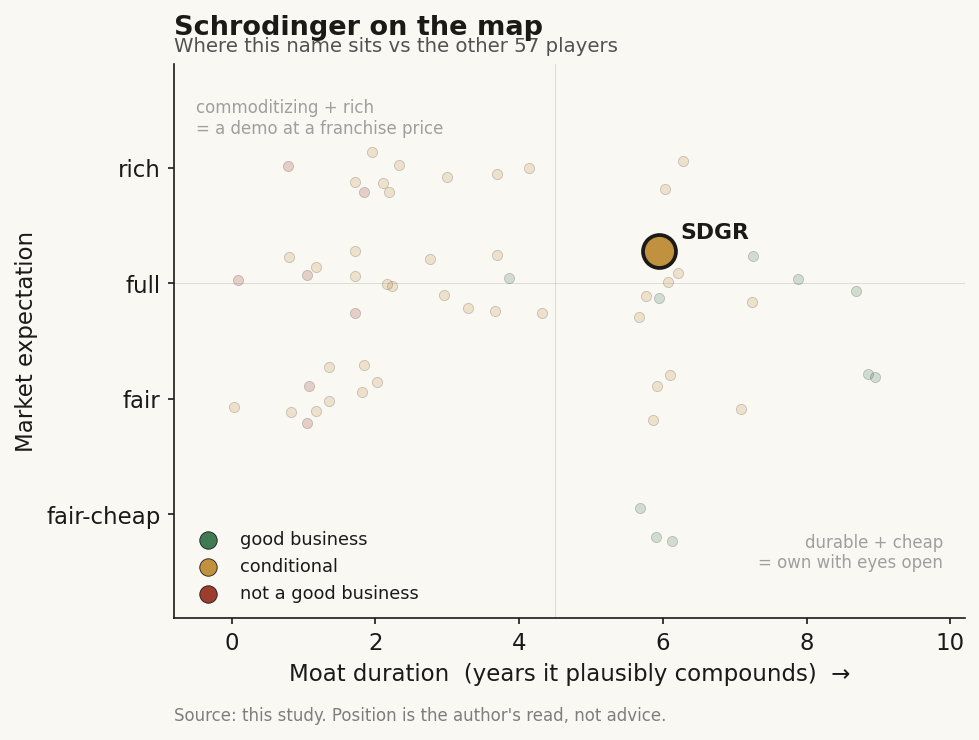

# Schrodinger (SDGR)

> **The read.** A genuinely good, capital-light software business with a real code-ownership moat (~5-8yr), strapped to a now-de-risked option-value pipeline, priced at an expectation the most recent prints (11% software growth, 81%->69% GM) have not yet earned - net cash is the downside floor.

**Snapshot**

| | |
|---|---|
| Listing | SDGR / Nasdaq |
| Region | US |
| Value-chain layer | L9b/L9c - physics-based selection/scoring engine |
| Archetype | picks-and-shovels (software ~78%) + drug-owner/option-value (~22%) |
| Size | ~$1.2bn market cap (~$16.3/sh, ~74M shares) |
| Revenue (latest) | FY25 total $255.9m, +23.3% |
| Moat verdict | conditional - durable on software (~5-8yr), weak/binary on pipeline |
| Expectation | full |
| Evidence quality | high |

## What it is
Physics-based molecular-simulation software (free-energy perturbation, active-learning) sold to pharma/biotech/materials, bolted to a drug-discovery arm that runs both partnered programs and (until 2025) its own clinical pipeline. A dual-engine company: (a) a licensed computational-chemistry platform (Maestro/FEP+) - genuine recurring software - and (b) a drug-discovery engine that co-discovers molecules for partners and banks milestones/royalties/equity. As of Jul 2026: ~$1.2bn market cap, ~$16.3/sh, ~74M shares, net cash ~31% of cap, no debt [reported]. The rare AI-drug-discovery name that carries a real, paid, capital-light software P&L underneath the option-value story.

## Business model - how it makes money
Two archetypes under one roof:

- **Software leg (~78% of rev) - SaaS/licensing.** FY25 software revenue ~$199.5m, +10.6% YoY; total FY25 rev $255.9m, +23.3% [disclosed]. ACV growth targeted 10-15%/yr through 2028; 100% retention among customers with >$0.5m ACV [disclosed]. This is the durable, capital-light, buyer-is-beneficiary leg. **Gross-margin caveat - the one number in motion:** software GM was ~81% in Q4'25 but has stepped DOWN to 69% in Q1'26 (vs 80% PY) as the company shifts on-prem licenses to *hosted* licensing [disclosed] - a mix change that trades headline GM for revenue visibility.
- **Drug-discovery leg (~22%) - milestone/royalty option-value.** FY25 drug-discovery revenue $56.4m, +107% (lumpy, partner-driven, NOT recurring); Q1'26 $22.9m vs $10.2m PY [disclosed]. Plus non-P&L option value: a ~$110m+ Nimbus/Takeda TYK2 distribution already banked with up to ~$100m more tied to sales milestones [reported]; equity stakes in partner/spinout biotechs.

**Growth quality.** Consolidated FY25 net loss ~$60m/quarter run-rate scale; TTM operating burn was ~$157m - but the **May-2025 pivot changed the cash physics**: abandoning independent clinical development beyond Phase 1 (+7% RIF) cuts ~$70m/yr, and Q1'26 operating cash *outflow* was only $14.8m against $406.4m cash/securities [disclosed]. Incremental ROIC on the *software* leg is high (capital-light, ~75-80% GM historically); the drug-discovery leg was capital-HUNGRY and is now being de-risked into partnerships. Cash conversion: software is SaaS-clean; the blended P&L is still loss-making, but burn has collapsed post-pivot - runway extends well into 2027+ [estimate].

## Financial summary

| Metric | FY25 | Q1'26 | PY comp |
|---|---|---|---|
| Total revenue | $255.9m (+23.3%) | - | - |
| Software revenue | $199.5m (+10.6%) | - | - |
| Software gross margin | ~81% (Q4'25) | 69% | 80% (PY) |
| Drug-discovery revenue | $56.4m (+107%) | $22.9m | $10.2m (PY) |
| Operating cash outflow | ~$157m TTM burn | $14.8m | ~$40m/qtr (pre-pivot) |
| Cash / securities | - | $406.4m | - |
| Net cash | ~31% of cap, no debt | - | - |

Nimbus/Takeda TYK2: ~$110m+ distribution banked, up to ~$100m more tied to sales milestones [reported]. May-2025 pivot (+7% RIF) cuts ~$70m/yr. All figures company-disclosed FY25/Q1'26 unless tagged [reported]/[estimate].

## Value-chain position and competition
The **physics-based selection/scoring engine** - L9b (structure/pose generation) reaching into **L9c (candidate selection/prioritization, the value-bearing layer)** via FEP+ free-energy ranking. What flows THROUGH it: pharma R&D teams push candidate libraries in, the platform ranks binding affinity / ADMET, and the output is a shortlist that (in theory) fails-fast cheaper. Unlike pure L9b generators, Schrodinger's pitch is that physics-based FEP does the *selection* step - the layer the framework says actually carries NPV. It sells picks-and-shovels (software, ~78%) AND owns/co-owns assets (drug-discovery, ~22%): a picks-vendor and an asset-owner in one ticker.

- **Software:** vs Certara (CERT, profitable, ~3.5x sales), OpenEye/Cadence, and open-source (RDKit, academic FEP), and increasingly the ML-structure cohort (AlphaFold3 + open clones Boltz/Chai). Edge: a 30-yr physics codebase + validated FEP+ accuracy + a sticky installed base (100% >$0.5m-ACV retention) - a genuine, if slow-growing, software moat.
- **Drug discovery:** vs Recursion (RXRX, ~26x sales), Insilico, XtalPi, Isomorphic - the ML-first cohort. Schrodinger's differentiator is *physics not just data* (works without proprietary wet-lab data scale), which is exactly why its software leg survives the "data-flywheel refuted" verdict.
- **Edge, honestly:** best-in-class at the L9c *selection/scoring* step (the valuable half), weak at owning clinical outcomes (the pivot concedes this).

## Moat
Two moats, two verdicts:

- **Software = code-ownership / embedded-workflow (CONDITIONAL, durable end).** This is NOT the refuted "raw-data flywheel" - the value is a validated physics engine embedded in pharma discovery workflow, with switching cost (retrained chemists, integrated pipelines) and 100% high-ACV retention. Closest to an *owned scarce input the platform can't cheaply replicate*. **Duration ~5-8 years**, capped by (a) open-source/ML erosion of the accuracy premium and (b) the hosted-transition GM compression.
- **Drug-discovery = option value (CONDITIONAL->WEAK).** Owned/partnered assets gated by the unchanged ~40% Phase-II biology wall. The May-2025 pivot is an explicit admission that the durable moat is NOT the owned pipeline - it is milestone/royalty optionality. **Duration: binary, not compounding.**
- **Net:** the durable moat is the software code-ownership (~5-8yr); the drug-discovery leg is priced optionality, not a compounding moat.

## Core variables
1. **Software ACV growth AND gross-margin path through the hosted transition.** Does ACV compound at the guided 10-15% while GM stabilizes (not keep sliding from 81%->69%)? This is the whole software-multiple thesis. If ACV decelerates below ~10% OR GM keeps compressing, the durable leg de-rates.
2. **Cash-burn trajectory post-pivot vs partnership milestone inflows.** Q1'26 burn $14.8m (from ~$40m/qtr) is the single most important change; the variable is whether milestone/royalty inflows (Nimbus tail + new partner deals for SGR-1505/SGR-3515) arrive before cash matters - with $406m and ~$60m/yr burn, this is a *quality* question, not a survival one.
3. **Whether physics-based selection out-earns ML-first over time** (the L9c edge realizing as partner-program value / royalties, not just software seats).

*(Second-order, held below the line: individual clinical readouts now that the company is NOT developing them independently; materials-science TAM; equity-stake mark-to-market.)*

## Bear case / key risks
The software leg is a **good but SLOW ~11%-growth business wearing an AI-drug-discovery multiple**, and the GM is now moving the WRONG way (81%->69% on the hosted shift) - so even the durable leg's quality is softening as it grows. The 23% headline growth is flattered by the +107% drug-discovery leg, which is *lumpy milestone revenue, not recurring* - strip it and the compounding engine grows ~11%. The drug-discovery optionality that justified the premium was just *walked back*: management abandoned independent clinical development (May 2025), an explicit concession that the owned-asset moat hits the ~40% Phase-II wall like everyone else - Schrodinger is now a milestone-taker dependent on partners' priorities and timelines. Net cash (~31% of cap) is a floor, but it also means ~2/3 of the market cap is being paid for a low-double-digit-growth software business at ~4-5x sales while a profitable comparable (Certara) trades at ~3.5x. The re-rate case rests on physics-selection value that has not yet shown up as royalty cash.

## The expectation read
At ~$1.2bn cap / ~4-5x TTM sales with ~$400m net cash, the market is paying an EV of roughly ~$0.8bn - about ~4x software revenue - for the platform, and assigning modest value to the drug-discovery optionality. Versus Certara at ~3.5x sales (profitable), SDGR's premium implies the market believes (a) software ACV re-accelerates toward the high end of 10-15% AND holds margin through the hosted transition, and (b) the physics-selection edge eventually monetizes as partner royalties. **Where that belief looks soft:** software has grown ~11%, not 15%+; GM is compressing, not expanding; and the drug-discovery re-rate catalyst was *removed* by the pivot to partnerships. The bull read requires the software leg to prove it is a 15% compounder at stable ~75%+ GM - which the last two prints do not yet show. (No buy/sell view - this is the implied-expectation gap only.)

## Verdict
A genuinely good, capital-light software business (real code-ownership moat, ~5-8yr) strapped to a now-de-risked option-value pipeline - priced at a full expectation (software re-accelerates to 15% at stable margin) that the most recent data (11% growth, 81%->69% GM) has not yet earned; net cash is the downside floor. Confidence: MEDIUM-HIGH on the facts (all figures company-disclosed FY25/Q1'26), MEDIUM on the expectation read (hinges on ACV/GM trajectory that is currently ambiguous).
