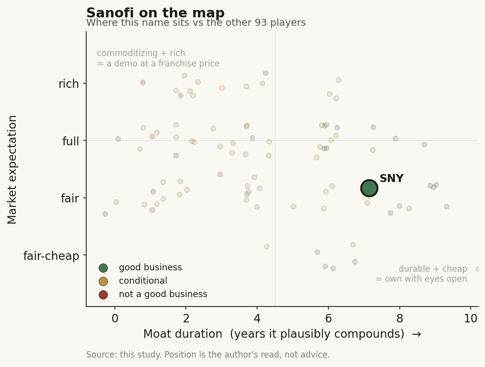

# Sanofi (SNY / NASDAQ (France))

> **The read.** The loudest "all in on AI" incumbent in pharma - a company-wide internal decision tool used by 20,000 staff daily, plus five-plus external AI-discovery deals - and the clearest illustration of the study's rule that the incumbent funds the AI and keeps the value. At ~$103bn on ~$44bn of sales, none of that AI is in the P&L or the price. The stock is a Dupixent-concentration-versus-pipeline bet with an AI efficiency call attached, not an AI story.

**Snapshot**

| | |
|---|---|
| Listing | SNY / NASDAQ (ADR); ordinary shares on Euronext Paris |
| Region | EU (France; Paris HQ) |
| Value-chain role | pharma incumbent - funder / value-keeper of the drug-discovery AI chain |
| Archetype | diversified big-pharma; buys AI as tool + cheap option, owns the assets |
| Size | ~$103bn market cap (2-Jul-26); ADR ~$43 [reported] |
| Revenue (latest) | FY25 net sales EUR 43.63bn, +9.9% cc [disclosed] |
| AI relevance | small to the P&L today; internal decision-tool at scale + R&D optionality |
| Moat verdict | strong, but the moat is franchise / scale / distribution - not AI |
| Expectation | fair-to-full - priced on Dupixent + pipeline vs the cliff, not on AI |
| Evidence quality | high |

## What it is
A French diversified pharmaceutical company, one of the largest in the world by sales, now run as a focused biopharma business after agreeing to sell a controlling stake in its Opella consumer-health unit (closed 2025). Its actual business is patented biologics and small molecules across immunology, oncology, rare disease, neurology, and vaccines - dominated by Dupixent (dupilumab), an anti-inflammatory biologic partnered with Regeneron. AI matters to this study not because it moves the P&L - it does not, yet - but because Sanofi has been the most vocal incumbent on AI, declaring itself "all in" in 2023, wiring a company-wide AI decision tool into daily operations, and signing a string of AI-discovery and AI-development deals. It is a textbook version of the archetype the case study turns on: the incumbent that builds the internal capability, writes the checks to the AI labs, and keeps the finished drugs, the trials, and the distribution for itself.

## Business model - how it makes money
Sanofi sells patented medicines it discovers, develops through its own clinical trials, manufactures, and distributes through its own global commercial machine. It captures value at every layer a pure-play AI lab does not touch: the ~40% Phase II efficacy wall (it runs the trials), regulatory approval, manufacturing scale-up (including biologics and vaccines), payer contracting, and a worldwide salesforce.

That is the key point of the case study. When Sanofi signs an AI-discovery deal, it structures it as **milestone + royalty**: a small upfront, large payments only if a molecule actually advances, tiered royalties on sales, and Sanofi owns the rights to whatever comes out. The AI partner bears the discovery risk and gets paid in options; Sanofi keeps the asset. The incumbent funds the AI and keeps the value.

- **AI as a tool, not a product.** Sanofi does not sell AI. It uses AI two ways: internally to make its own decisions and discovery cheaper and faster, and externally by buying discovery capacity as staged options.
- **The distinctive piece is the internal tool.** plai - an agentic decision app built with AI vendor Aily Labs - aggregates 1bn-plus internal data points and is used by ~20,000 employees daily [reported], sitting in the governance meetings where molecule-progression decisions are made. That is deeper internal deployment than most incumbents disclose.
- **Capital-heavy where it counts.** The spend is trials, manufacturing, business development, and commercial - not compute. Even the largest AI commitments are small next to that.

## Financial summary
Top-line scale, with the AI / deal figures kept in proportion so the reader sees how small they are.

| Item | Figure |
|---|---|
| FY25 net sales | EUR 43.63bn, +9.9% cc [disclosed] |
| FY25 R&D spend | ~EUR 8.0bn, +8.8% YoY [estimate - off disclosed FY24 EUR 7.4bn and disclosed +8.8%] |
| FY25 business operating income | EUR 12.15bn, +11.9% cc [disclosed] |
| FY25 business EPS | EUR 7.83, +15.0% cc [disclosed] |
| Dupixent (largest product) | EUR 15.71bn, +25.2% - ~36% of net sales [disclosed] |
| Market cap | ~$103bn (2-Jul-26); ADR ~$43, ~19x trailing earnings, ~5.6% dividend yield [reported] |
| 2026 guidance | sales high-single-digit % growth cc; business EPS slightly faster; EUR 1bn buyback [disclosed] |
| **AI deal / internal figures (kept in scale)** | |
| plai (with Aily Labs) | internal agentic decision app, ~1bn+ data points, ~20,000 daily users [reported] |
| OpenAI + Formation Bio | first-in-class three-way AI collaboration (May-2024); custom drug-development models + the Muse patient-recruitment tool; terms undisclosed [disclosed] |
| Insilico Medicine | ~$21.5m upfront/nomination, up to $1.2bn milestones + tiered royalties [disclosed] |
| Exscientia | $100m upfront, up to ~$5.2bn milestones, up to 15 oncology/immunology programs [disclosed] |
| BioMap | $10m upfront, >$1bn milestones - AI biologics discovery [disclosed] |
| Owkin | $180m equity + $90m three-year discovery partnership (2021) [disclosed] |

Scale check: the external AI-deal milestone ceilings combined (~$7.4bn-plus, nearly all contingent and years away) are ~15% of one year's sales - but the **cash actually committed** across those upfronts is roughly ~$130m plus the Owkin equity, i.e. well under 0.5% of annual sales and a low-single-digit % of R&D. AI is a strategic bet financed out of pocket change, not a line item that moves the company.

## Value-chain position and competition
Sanofi sits at the top of the drug-discovery chain as the **funder and value-keeper**. Map the flows:

- **Money flows out** to AI labs (Insilico, Exscientia, BioMap, Atomwise, Owkin) as small upfronts + large contingent milestones.
- **AI capacity flows in** two ways: (1) **licensed / partnered platforms** - it rents Insilico's generative-chemistry engine, Exscientia's design/personalized-medicine platform, and BioMap's protein foundation model for biologics; the OpenAI + Formation Bio tie-up fine-tunes models on Sanofi's proprietary data to build development agents; (2) **owned internal capability** - plai, the Aily-built decision app embedded in daily governance, which makes Sanofi a data *user* at scale rather than only a platform tenant.
- **Finished drugs, trials, manufacturing, and distribution stay inside Sanofi.**

Competition for the *AI-funder* role is the other cash-rich incumbents doing the identical thing: Novartis (Isomorphic, Generate, Schrodinger), Lilly and J&J (Isomorphic), and the same names funding Insilico, Recursion, Xaira, and peers. The competitive fight that actually decides Sanofi's value, though, is not AI - it is (1) whether Dupixent, which is ~36% of sales, keeps growing and how steeply it erodes at loss of exclusivity late this decade, and (2) whether the newer launches (Sarclisa, Beyfortus, Altuviio, ALTUVIIIO, Tzield) and pipeline fill the gap. AI is a shared industry tool; the moat is the franchise.

## Moat
Sanofi's moat is real and wide - but it is **not** an AI moat, and that distinction is the whole point.
- **Franchise + scale + distribution - STRONG (~5-9 yr, concentration-sensitive).** A dominant anti-inflammatory biologic (Dupixent), a global vaccines franchise, and rare-disease and oncology positions, all behind patents, biologic manufacturing complexity, and a worldwide commercial machine. This is what a ~$103bn valuation rests on - but its duration is shortened by Dupixent concentration and a US patent cliff building late this decade, so the moat has to be continuously re-earned through the pipeline.
- **AI as a moat - WEAK / not the point.** The discovery models Sanofi licenses are commoditizing (open clones caught the frontier within ~a year at far lower cost). Its AI edge, to the extent it has one, is **proprietary data + the ability to run the trials AI cannot** - i.e. incumbency, not algorithms. plai is the most distinctive AI-specific asset, and even it is a decision-support and productivity aid, not a profit engine.

Net: durable-but-concentration-sensitive ~5-9-year franchise moat; AI widens the funnel, speeds internal decisions, and buys cheap options but does not itself compound value. The incumbent's real moat is the part of the chain the AI labs cannot reach.

## Core variables
1. **[CORE] Dupixent trajectory and its eventual cliff.** ~36% of sales in one product. How long it keeps compounding (+25% in FY25) and how steeply it erodes at loss of exclusivity sets the revenue line and the multiple far more than anything AI does. This is the master variable.
2. **[CORE] R&D productivity - does AI actually lower cost-per-approved-drug?** The whole incumbent-AI thesis. Watch whether AI-sourced molecules (Insilico/Exscientia/BioMap) convert milestones into real INDs and Phase progress, and whether plai + the OpenAI/Formation Bio tooling measurably shorten decisions, discovery, and trials. Today this is unproven at the P&L level [unverified].
3. **[CORE] Milestone conversion, not headline biobucks.** The "up to $1.2bn / $5.2bn / >$1bn" numbers are option ceilings. What matters is cash actually paid as molecules advance - and, for Sanofi the payer, whether that cash buys approved assets or lapses cheaply. Either way the downside is capped and the assets are Sanofi's.

Below the line as noise: which specific AI lab "wins," the count of external AI deals signed, the "first biopharma powered by AI" framing, and the plai daily-user number. For a ~$44bn-sales company, these are strategy line-items, not valuation drivers.

## Bear case / key risks
The bear case has almost nothing to do with AI. It is concentration plus the cliff: ~36% of sales sit in a single product (Dupixent) shared with a partner (Regeneron), and the US market faces a large industry patent cliff late this decade. The thesis breaks if Dupixent stumbles on safety, competition, or pricing, or if the newer launches and pipeline fail to fill the hole as exclusivity rolls off. US drug-pricing politics (IRA Medicare negotiation, tariffs) can compress the franchise. Any of those dwarfs anything AI could add or subtract.

On AI specifically the risk is the opposite of the pure-plays': not that Sanofi's AI fails, but that it *over-invests in a commoditizing tool for narrative reasons* - the "all in on AI" branding runs ahead of measurable P&L payback - or that a licensed molecule hits the same ~40% Phase II wall everyone hits, in which case Sanofi simply stops paying milestones and loses only a small upfront. The AI spend is not where a Sanofi investor loses money.

Falsification watch: (1) a Dupixent setback or steeper-than-expected erosion that the pipeline cannot fill - the actual thesis breaks here, AI irrelevant; (2) an AI-sourced Sanofi molecule reaches pivotal-stage success and materially de-risks a franchise - the one path where AI stops being a rounding error; (3) plai or the internal tooling produces a documented, sustained cut in cost-per-approved-drug or cycle time - the only AI-specific edge worth watching.

## The expectation read
At ~$43 and ~$103bn (2-Jul-26; ~19x trailing earnings, ~5.6% yield), the market is pricing a durable, high-margin biopharma franchise carrying real concentration risk - roughly a below-peer large-cap-pharma multiple that already discounts the Dupixent dependence and the coming cliff, offset by a heavy dividend. **Essentially none of that price is AI.** The external AI deals commit well under 0.5% of annual sales in real cash; they are financed out of free cash flow and structured so Sanofi's downside is a handful of small upfronts. The expectation embedded in the stock is that Dupixent keeps growing and the newer launches plus pipeline replace it through the cliff - not that AI discovers the next blockbuster or that plai re-rates the multiple.

So the AI read is asymmetric and cheap: Sanofi pays option premiums, keeps every asset that works, and owes little if they do not, while running the industry's most-publicized internal-AI deployment at modest cost. Whether AI "moves" a ~$103bn company: not in the numbers today, and not in the price. If it ever does, it shows up as *lower cost-per-approved-drug* and faster pipeline turns over a decade - a slow margin/replacement-rate tailwind that would help exactly the variable that matters (out-running the cliff), not a re-rating.

## Verdict
Good business, wide-but-concentration-sensitive moat - but the moat is the medicines franchise, scale, and distribution, not AI. Sanofi is the study's loudest illustration of the thesis: the incumbent goes "all in on AI" in the branding, deploys a company-wide internal decision tool used by 20,000 staff daily, funds five-plus external AI relationships, structures the deals as cheap staged options, and keeps the drugs, the trials, and the value. AI is a sensible, low-cost efficiency-and-optionality bet that is immaterial to the P&L and to the ~$103bn valuation today. Confidence: HIGH on the facts (sales, EPS, Dupixent, deal terms, plai usage all disclosed or reported and current); HIGH on the framing (AI is a tool/option here, the Dupixent-concentration-versus-pipeline race is the story); the only genuinely open question is variable 2 - whether AI, and plai in particular, ever measurably lowers cost-per-approved-drug, which is unobservable for years.
