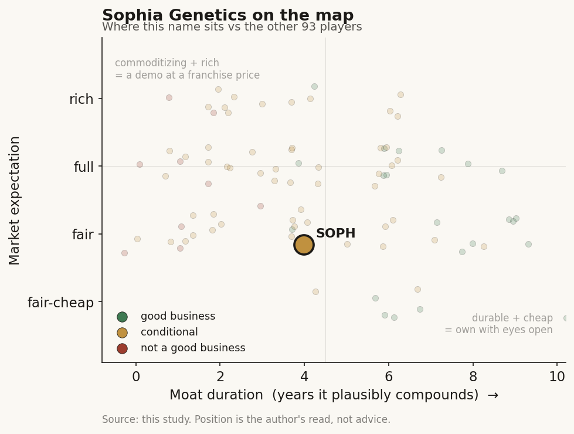

# Sophia Genetics (SOPH / NASDAQ (Switzerland))

> **The read.** A genuinely asset-light genomics-SaaS platform - a small Tempus with no wet lab - so the ~75%-GM software economics are real, not aspirational; but at ~$21.7m/quarter and still burning, the whole thesis is whether a decentralized hospital network compounds into a data moat before the cash (~$65m) runs thin, and management has not yet proven it can grow fast enough to reach breakeven on its own steam.

**Snapshot**

| | |
|---|---|
| Listing | SOPH / Nasdaq (Swiss-domiciled, Lausanne HQ) |
| Region | EU (ex-US, ex-Taiwan) |
| Value-chain layer | L5-L6 - AI-bioinformatics software layer (analysis, not sequencing) |
| Archetype | data-platform SaaS (pay-per-analysis + biopharma services; no owned lab) |
| Size | ~$477m market cap (28-Jun-26) [reported] |
| Revenue (latest) | Q1'26 $21.7m, +22% YoY (+14% cc); FY26 guide $92-94m (~20-22%) |
| Moat verdict | conditional - real network/data flywheel, small and unproven at scale |
| Expectation | fair-to-full |
| Evidence quality | med (clean US-filed numbers; thinner non-US disclosure on unit economics) |

## What it is
A cloud-native software company that lets hospitals and labs analyze their own genomic and multimodal data through one shared platform, SOPHiA DDM (Data-Driven Medicine). Founded 2011 as an EPFL (Lausanne) spin-out; IPO'd on Nasdaq in July 2021 at $18 (~$234m raised) [disclosed]. The key structural fact: unlike Tempus or Caris, Sophia runs almost no wet lab of its own. Hospitals do their own sequencing on their own machines; Sophia's software standardizes, computes, and interprets the output, and pools de-identified insights across a decentralized network. It sits one layer up from the sequencer - the analysis/interpretation layer (L5-L6), not the reagent or the assay.

## Business model - how it makes money
Two engines, both software-shaped:

- **Clinical platform (the core, most of revenue).** Pay-per-analysis SaaS: the hospital installs SOPHiA DDM for free and pays per genomic analysis run through it. Q1'26 platform volume +16% to ~108,000 analyses (a record); US volume +28%, Asia-Pacific +31%. 537 core genomic customers (up 47 YoY), annualized churn <1%, net dollar retention 117% (up from 103%) [disclosed]. This is a recurring, usage-metered annuity - closer to true SaaS than Tempus's reimbursement-gated lab.
- **BioPharma / applications.** Sponsored deployments, evidence-generation projects, and newer modalities (liquid biopsy: ~100 customers across 30+ countries, ~3,000 analyses in Q1'26, +100% off a tiny base). Contributes modestly today; the intended second leg.

**Growth quality.** Adjusted gross margin ~75.4% (Q1'26), roughly flat YoY and structurally software-like because there is no reagent/sequencer toll to pay - the hospital owns that cost. But the constant-currency number matters: +22% reported was only +14% cc, so a chunk of headline growth is a weaker dollar, not more analyses. Net dollar retention jumping 103% -> 117% is the single best sign the same customers are running more through the platform.

**Incremental economics / cash.** Capital-light by design - no CLIA lab, no receivables tied to payer reimbursement. But it is not yet profitable: adjusted EBITDA loss -$9.2m in Q1'26 (a ~3% YoY improvement), operating cash use -$15.1m, cash and equivalents $65.4m [disclosed]. Management guides to adjusted-EBITDA breakeven around end-2026 and positive adjusted EBITDA in H2 2027. The gap between the software margin (good) and the cash burn (still real) is the whole tension.

## Financial summary

| | FY24 | FY25 | Q1'26 | FY26 guide |
|---|---|---|---|---|
| Revenue | $65.2m | $77.3m | $21.7m | $92-94m |
| Revenue growth | +4% | +19% | +22% YoY (+14% cc) | ~20-22% |
| Adjusted gross margin | - | 74.2% | 75.4% | - |
| Adjusted EBITDA | - | -$41.5m | -$9.2m | -$29 to -$32m |
| IFRS net loss | - | -$79.0m | -$19.3m | - |
| Operating cash | - | - | -$15.1m | - |
| Cash and equivalents | - | - | $65.4m | - |
| Net dollar retention | - | - | 117% | - |
| Core genomic customers | - | - | 537 | - |

Reports on IFRS. Figures as of Q1'26 report; market cap/price as of 28-Jun-2026 [reported].

## Value-chain position and competition
Sophia sits at the L5-L6 AI-bioinformatics software layer: it does not sequence, it interprets. Flow: hospital sequences its own sample -> raw data enters SOPHiA DDM -> the platform standardizes, calls variants, and returns an actionable report -> de-identified signal pools back into the network (2m+ cumulative genomic profiles analyzed since inception; 350k+ patient profiles uploaded annually) [disclosed]. It is "picks-and-shovels" one level above the picks - the software that makes a hospital's own sequencer useful. That is the same "sold twice" logic as Tempus (a service to the customer, a data asset as by-product), but with the capital-heavy lab deliberately left out.

Competition, split by where they sit:
- **The vertically integrated US labs - Tempus (TEM), Caris (CAI), Foundation Medicine, Guardant, Natera.** These own the wet lab and bill payers; Sophia sells them (or their smaller peers) the software instead. Sophia's edge is asset-light global reach into hospitals that want to keep testing in-house; its disadvantage is far smaller scale and no proprietary assay franchise.
- **Decentralized-software / interpretation peers - Illumina's DRAGEN/informatics stack, Qiagen (QCI), Fabric/GeneDx tooling, various EU bioinformatics vendors.** The interpretation layer is contested and partly commoditized by the sequencer vendors themselves.
- **Marquee validation:** MSK-IMPACT and MSK-ACCESS assays offered "powered with SOPHiA DDM" (with Memorial Sloan Kettering and AstraZeneca), plus US health-system wins (Mount Sinai, NYU Langone) and a Complete Genomics sequencer integration [disclosed]. These lend clinical credibility a small EU vendor otherwise lacks.

Edge: a genuinely global, decentralized install base (hospitals in 70+ countries) feeding one pooled data network - a small-scale data flywheel that a single-lab competitor cannot replicate without going asset-heavy.

## Moat
- **Data-network flywheel - CONDITIONAL, real but small (~3-6 yr if it compounds).** Every analysis run through DDM enriches the shared knowledge base, which makes the next hospital's variant calls better - a true network effect, and the one thing that scales without capital. The 117% NDR and <1% churn say the flywheel is turning inside the existing base. The problem is magnitude: 2m cumulative profiles is a fraction of what an integrated US player generates, and the interpretation layer is squeezed from above by sequencer vendors bundling their own informatics. Widens only if volume compounds fast enough to make the pooled data decisively better than a standalone tool.
- **Switching cost / embedded workflow - PARTIAL.** Once a hospital validates DDM into its clinical workflow, ripping it out is painful (hence <1% churn). Real but modest - it protects the installed base, it does not by itself win new logos against Illumina/Qiagen.
- **Regulatory/clearance - NOT a differentiated moat.** CE-marking and clearances gate the shelf; they are table stakes, not a durable barrier.

Net: the durable asset is the decentralized data network, and it is genuinely differentiated versus the asset-heavy labs - but it is small and unproven at scale, so estimated durable-compounding duration is a conditional ~3-6 years, contingent on volume growth staying above ~15-20% and NDR holding above ~110%.

## Core variables
1. **[CORE] Analysis-volume growth (constant currency).** The engine. +16% volume and +14% cc revenue in Q1'26 - decent, not explosive. This must accelerate (US +28%, APAC +31% are the bright spots) for the flywheel to matter and for breakeven to arrive before the cash does. FX-flattered headline growth is the trap to watch.
2. **[CORE] Path to breakeven vs the $65m cash balance.** Adjusted EBITDA loss -$9.2m/qtr improving only ~3% YoY; guide is breakeven "around end-2026." With ~$65m cash and ~$15m/qtr operating burn, the runway is real but not infinite - hitting the breakeven timeline without a raise is the binary that decides dilution.
3. **[CORE] Land-and-expand (NDR) durability.** 103% -> 117% NDR is the whole quality of the story. If it holds or climbs, this is a compounding SaaS annuity; if it fades back toward ~105%, it is a slow-growth utility that will struggle to out-earn its burn.

Below the line as noise: liquid-biopsy analyses off a ~3,000/qtr base; individual hospital logo announcements; the exact FY26 revenue point inside the $92-94m band; the founder-to-new-CEO executive transition (announced, monitor but not thesis-defining).

## Bear case / key risks
A small, still-loss-making software vendor sitting in a squeezed middle. It has neither the scale/data of an integrated US player (Tempus/Caris generate far more profiles from owning the lab) nor immunity from the sequencer vendors (Illumina, Qiagen) who can bundle interpretation for free. Growth is only mid-teens in constant currency; the +22% headline is partly a weak dollar. It has never turned a profit, guides to breakeven only "around end-2026," and holds ~$65m against ~$15m/qtr operating burn - a runway measured in quarters, not years, if the timeline slips. A single delayed breakeven or a growth stall likely forces a dilutive raise from a $477m market cap. Non-US disclosure is also thinner - segment-level unit economics and true recurring-vs-project revenue split are harder to verify than for a US-domiciled peer.

Falsification watch: (1) constant-currency growth decelerates below ~10% - the data-network thesis stalls; (2) NDR rolls back toward ~105% - the SaaS-annuity framing breaks; (3) breakeven slips past 2027 and cash falls below ~$40m without a financing plan - dilution risk becomes acute; (4) Illumina/Qiagen make on-instrument interpretation good enough to commoditize DDM's core.

## The expectation read
Shares ~$5.75, market cap ~$477m, ~71.8m shares (Jun-26) [reported]. That is roughly ~5x EV/FY26E sales (net of ~$65m cash) on ~20% reported / ~14% cc growth - not a cheap value multiple, not the double-digit sales multiple the profitable US integrateds carry. The price seems to assume the asset-light software model works: that ~75% gross margin plus a compounding data network gets the company to breakeven on schedule and then to durable SaaS-like profitability, without a dilutive raise, and that mid-teens constant-currency growth reaccelerates as US and APAC scale.

Where the belief looks soft: growth is only mid-teens after stripping FX, the data network is small versus the integrated players it is priced alongside, and breakeven is still a forward promise funded by a finite cash balance. The multiple is more reasonable than Tempus's precisely because the model is genuinely asset-light - but it still prices execution the company has not yet delivered.

## Verdict
Good business model - a real, asset-light genomics-SaaS platform with software-grade margins and a genuine (if small) decentralized data-network moat - but not yet a proven compounder: mid-teens constant-currency growth and a still-live cash burn mean the whole thesis rests on reaching breakeven before dilution and on the data flywheel getting decisively better with scale. The expectation is fair-to-full rather than cheap. Confidence: MEDIUM-HIGH on the facts (revenue, margins, NDR, cash, guidance all US-filed and current); MEDIUM on the verdict, which hinges on two unresolved rate-of-change variables (constant-currency volume growth and the breakeven timeline vs cash) that could break either way.
