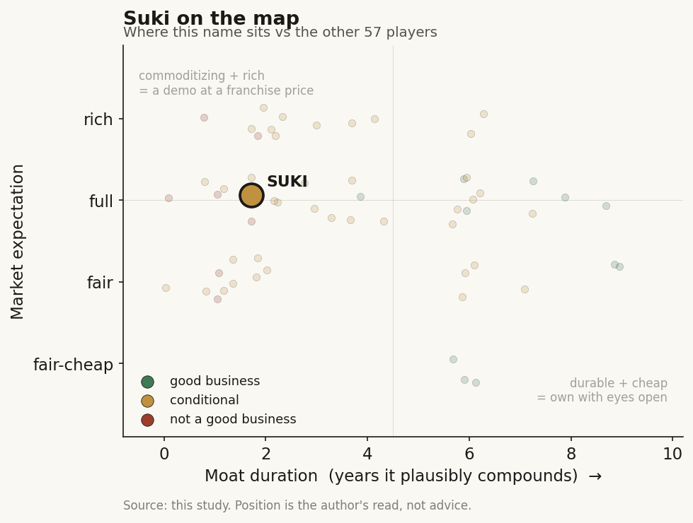

# Suki (private)

> **The read.** A credible ambient-scribe with the right platform bet, but a feature sandwiched between a commoditizing LLM below and the EHRs above - no durable moat is banked at a ~$0.4-0.5bn mark.

**Snapshot**

| | |
|---|---|
| Listing | private |
| Region | US |
| Value-chain layer | L6 clinical-workflow (draft the note from the encounter) |
| Archetype | workflow (archetype 02, SaaS / per-provider) with a B2B2B platform pivot |
| Size | ~$0.4-0.5bn last private valuation (one source cites $400m; ~$500m post-Series-D) |
| Revenue (latest) | private - subscription "low hundreds of $/provider/mo" |
| Moat verdict | conditional (direct scribe refuted; platform leg unproven) |
| Expectation | full |
| Evidence quality | med |

## What it is
Voice AI assistant for clinicians - ambiently listens to the patient encounter and drafts the structured note back into the EHR, plus voice commands, coding, and Q&A ("Siri/Alexa for doctors"). Founded 2017 (Punit Singh Soni, Karthik Rajan), Redwood City. Flagship is Suki Assistant.

## Business model - how it makes money
Two revenue lines, both archetype-flavored:

- **Direct SaaS (archetype 02):** per-provider-per-month subscription to Suki Assistant, "low hundreds of $/provider/mo." The buyer (health system/clinician) is the beneficiary; no reimbursement code needed. Capital-light on the balance sheet (no wet lab, no inventory) - but per-encounter LLM inference is a real, usage-scaling COGS, and enterprise + EHR-integration selling is heavy, so *realized* incremental ROIC is squeezed from both ends.
- **Suki Platform / "Suki for Partners" (B2B2B, the strategic pivot):** SDK + APIs licensing the ambient-documentation/dictation/form-fill engine to other health-IT and EHR vendors, who embed it and resell under their own brand. This is the deliberate move from selling a seat to being an *embedded input* - the more defensible economics of the two, and the reason to look at Suki differently from a pure scribe.

ROI claims (vendor-supplied, not audited): notes ~72% faster; ~9x year-1 ROI; ~41% average documentation-time cut.

## Financial summary
Private - funding table (provenance: [disclosed] primary · [reported] secondary):

| Round | Date | Amount | Lead / note |
|---|---|---|---|
| Series D | Oct 2024 | ~$70m [disclosed] | led by Hedosophia |
| Series C | Dec 2021 | ~$55m [reported] | |
| Series B | 2020 | ~$20m [reported] | |
| Total raised | - | ~$168m [reported] | |
| Valuation | post-Series-D | ~$500m [reported] (one source cites $400m [reported]) | treat mark as ~$0.4-0.5bn, unaudited venture mark |

Backers: Venrock (Bryan Roberts on board), Flare Capital, March Capital, Breyer Capital, inHealth Ventures, First Round; **Zoom Ventures** strategic investment (Jan 2025); Marc Benioff named as an angel [reported]. For scale, this is a fraction of the peers' marks - Abridge ~$5.3bn (Jun'25) and ~$2.75bn (Feb'25 Series D), Ambience ~$1.25bn (Jul'25) [disclosed]. Suki is ~10x smaller by mark.

## Value-chain position and competition
The **L6 clinical-workflow layer** - draft the note from the encounter - sits ON TOP of the L0 EHR/cloud rails (Epic, Oracle Health, athenahealth, MEDITECH) and the commoditizing LLM below that supplies transcription. **What flows in:** the encounter audio + EHR context. **What flows out:** a structured note, order staging, and coding suggestions written back into the EHR. It captures **no reimbursement dollar directly** - value is gated by (a) system adoption and (b) rented access to the clinician inside the EHR.

Competition: share estimate ~10% of ambient scribe [reported: Becker's, estimate] behind Abridge (~30%) and Ambience (~13%); also Microsoft DAX/Dragon Copilot (600+ systems), Nabla, Commure, Amazon HealthScribe, and a budget tail (Freed, Heidi).

**Its distinct edge (real, and different from peers):** the **partner/embed channel**. Suki is the engine behind **athenahealth's native "Ambient Notes"** (powered by Suki since Nov 2024; GA to athena's whole network May 2025; named a "Preferred Solution Partner" Jan 2025; 60,000+ encounters in beta; 450+ practices / 3,400 MAU on athena combined, +50% in six months) [disclosed]. Plus MEDENT, Azalea Health, Sevocity ("Sevocity Ambient Listening, powered by Suki," Jun 2026), WellSky, HealthEdge, AvaSure. Rather than fight Abridge for marquee academic systems, Suki is becoming the white-label ambient layer inside *other people's* EHRs and care platforms. The flip side: transcription-to-note itself commoditizes toward the underlying LLM every vendor rents; Suki's direct product is not distinguished on raw ASR quality.

## Moat
- **Direct-scribe leg - Moat 2 (workflow embedding / distribution), verdict CONDITIONAL, and REFUTED as applied to the pure L6 scribe.** Suki is named explicitly in the Ch5 fragile cohort. It owns neither the model below (commoditizing LLM) nor the distribution beside/above (rented from Epic / athenahealth). The 4 Feb 2026 Epic native AI Charting launch (~$80/provider/mo, into orders + diagnoses; Epic 42% acute share, 55% of beds) is platform envelopment made live - the landlord became the competitor. Duration on the rented slot: ~1-3 years (contract cycle), not durable.
- **The unifying Ch5 test:** *does the vendor own a scarce input the platform above/beside it cannot cheaply replicate?* For the direct scribe, **no** - so it commoditizes. The **platform leg is the only part that could pass**, IF the SDK becomes the embedded default across enough non-Epic vendors that switching away carries real integration cost. But that is a distribution head-start on rails Suki still rents, not ownership of the payment rail (Waystar/Cohere), a licensed corpus (OpenEvidence), or claims-to-cash plumbing - the three forms that actually survive in Ch5.
- **Is the moat real for a private at this stage?** Not yet. The platform pivot is the right *direction* (toward being an input rather than a seat), but at ~$0.4-0.5bn and pre-scale there is no audited NRR-at-price, and its two biggest embed partners (athenahealth, and by extension any EHR vendor) can insource or swap the engine the same way Epic did - Suki's partner IS a potential enveloper. Verdict: **direction-of-travel toward a moat, no moat banked.**

## Core variables
1. **Platform-leg attach + embed durability (the whole differentiated thesis).** Does "Suki for Partners" become the *default embedded voice layer* across athenahealth, MEDENT, Sevocity, WellSky et al. with real switching cost - or does each partner insource once ambient AI is table stakes? The athenahealth relationship is simultaneously the biggest asset and the biggest single-point risk (a partner who could replace the engine).
2. **NRR-at-price post-Epic (the archetype-02 decisive number).** Unobservable while private. Can Suki hold price and retention once Epic's ~$80 native option and athena's own bundling reset the anchor? Growth to date reads as seat-count, not price.
3. **Realized unit economics: price vs inference COGS.** Capital-light on paper, but per-encounter inference is a variable COGS and enterprise/EHR-integration sell is heavy. If price compresses toward the Epic/athena anchor while inference stays real, "capital-light" does not convert to high realized ROIC.

*(Second-order, held below the line: nursing/specialty expansion (Suki for Nurses consortium, Oct 2025); coding/CDI up-stack; share vs Abridge/Ambience; VC-mark risk vs the ~$5.3bn/$1.25bn peers.)*

## Bear case / key risks
A **feature sandwiched by the two layers it depends on**, at a fraction of the peers' scale. (1) **Commoditization from below** - transcription-to-note is a rented frontier-LLM capability; no durable model IP. (2) **Envelopment from above, twice over** - Epic shipped native AI Charting (Feb 2026, ~$80, into orders/diagnoses); and Suki's own flagship embed partner, athenahealth, owns the "Ambient Notes" customer relationship and could substitute the engine, so even the differentiated platform channel routes through a counterparty that can become the competitor. (3) **No reimbursement anchor** - unlike the diagnostics chain there is no CPT/coverage moat; nothing gates a switch but integration friction the platform controls. (4) **Sub-scale and unproven at price** - ~$0.4-0.5bn mark vs ~$5.3bn/$1.25bn peers, no audited NRR, ROI figures are vendor-supplied. The platform pivot is the right idea but is being executed on rented rails against partners who can insource. **What breaks the bear:** the first ambient-AI NRR-at-price disclosure showing durable >110-120% retention through 2026-27 despite Epic, AND evidence the SDK is embedded deeply enough across non-Epic vendors that partners *don't* insource - i.e. the platform leg genuinely becomes a switching-cost input.

## The expectation read
The ~$0.4-0.5bn mark implies the market is paying for the platform-embed optionality, not for the direct scribe - which the Ch5 test refutes as a rented ~1-3yr slot. Priced against ~$5.3bn/$1.25bn peers, Suki carries a ~10x-smaller mark, so the embed thesis is not richly capitalized; but with no audited NRR-at-price, seat-count-led growth, and the flagship partner able to insource, the belief embedded in even this modest mark looks soft precisely where it matters - durable retention through Epic/athena envelopment. Full, resting on an unproven platform leg.

## Verdict
**Feature-plus-a-credible-platform-bet, NOT yet a durable value-capturer.** The direct scribe is a Ch5-refuted rented L6 slot (~1-3yr duration); the B2B2B embed pivot is the one thing that could turn it into an owned input, but at ~$0.4-0.5bn, pre-scale, with no audited NRR-at-price and its own key partner (athenahealth) able to envelop it, no moat is banked. **Confidence: high** on "no durable moat today"; **medium** on the platform leg (real direction, unproven durability, single-partner concentration risk).
