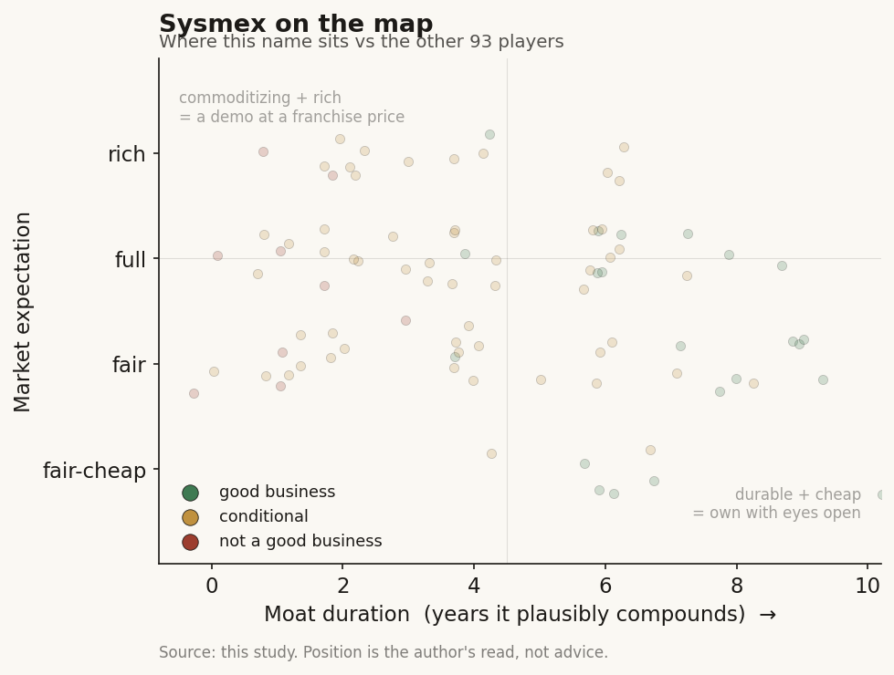

# Sysmex (6869 / TSE (Japan))

> **The read.** A rare thing in this case study: a real, profitable, cash-generating diagnostics compounder with a ~50% global hematology share and a razor-and-blade reagent annuity - not a promise. The "AI + genomics" story is a thin, optional topping on a ~90%-plus blood-and-body-fluids testing business, and the stock is cheap right now for a specific, non-AI reason (China price cuts + a profit reset), which is exactly what makes it the honest control case for the AI names.

**Snapshot**

| | |
|---|---|
| Listing | 6869 / Tokyo Stock Exchange (Prime) |
| Region | Japan (ex-US / ex-Taiwan) |
| Value-chain layer | L3-L4 - diagnostics instrument + reagent anchor (Japan node) |
| Archetype | razor-and-blade IVD (installed analyzers pull a multi-year reagent annuity) |
| Size | ~ JPY 890bn market cap (~$5.9bn at JPY 150/USD), ~609.7m shares, ~JPY 1,464 [reported, mid-2026] |
| Revenue (latest) | FY-Mar-2026 net sales JPY 500.0bn, -1.7% YoY (+5.1% ex-China); FY-Mar-2025 was a record JPY 508.6bn [disclosed] |
| Moat verdict | strong - installed-base + reagent lock-in, ~50% category share; AI/genomics is optionality not the moat |
| Expectation | fair-to-cheap (priced on a China/profit reset, not on an AI story) |
| Evidence quality | med-high on the core IVD numbers; low on genomics unit economics (not broken out) |

## What it is
A Kobe-based in-vitro diagnostics (IVD) company that is the world's largest maker of hematology analyzers - the machines that produce a "complete blood count" (the routine blood test almost every hospital patient gets). It sells the instruments, then sells the reagents, calibrators, and service those instruments consume for years afterward. It has ~50% of the global hematology market [estimate, third-party market research], operates in 190-plus countries, and has grown revenue and profit for most of the last two decades. The "AI + genomics" angle - AI-assisted cell-image reading, cancer genome profiling, a blood test for Alzheimer's - is real and growing, but it is a small, adjacent extension of a very large, boring, high-quality testing business. In this case study Sysmex is the incumbent-diagnostics control: what a durable, cash-generating diagnostics moat actually looks like, against which the US AI-native names are priced.

## Business model - how it makes money
Classic razor-and-blade IVD, one node with two linked revenue forms:

- **Instruments (the razor).** Hematology, hemostasis (coagulation), urinalysis, and immunochemistry (HISCL) analyzers placed into hospital and commercial labs. Lower-margin, sometimes near-cost, but each placement is a multi-year annuity hook. Installed hematology base is >65,000 analyzers [reported, 2024]; the global service network maintains 600,000-plus instruments [reported].
- **Reagents + service (the blades).** The recurring consumables and maintenance that every placed instrument pulls, estimated at ~60-65% of group sales [estimate, third-party; Sysmex does not headline a single clean reagent ratio]. This is the high-margin, sticky, predictable core. Switching an analyzer means requalifying the whole lab workflow, so displacement is slow and rare - the source of the moat.

**Growth quality.** Steady, real, and cash-backed - the opposite of the pre-revenue AI names. Not hyper-growth: the core testing market grows low-to-mid single digits with volume, mix, and menu expansion. Sysmex has historically compounded faster than that by taking share and adding higher-value tests (hemostasis, immunochemistry, gene/flow).

**Incremental economics.** Capital-moderate: it carries real factories, an instrument installed base, receivables, and a global service org - heavier than software, far lighter and far more profitable than a reimbursement-gated US lab. It is GAAP-profitable and dividend-paying (targets a ~40% payout plus buybacks) [disclosed]. This is the structural difference from Tempus or Isomorphic in the same case study: Sysmex already prints the cash the AI names are still promising.

## Financial summary

| | FY-Mar-2025 (record) | FY-Mar-2026 (latest) | FY-Mar-2027 (guide) |
|---|---|---|---|
| Net sales | JPY 508.6bn | JPY 500.0bn (-1.7% YoY; +5.1% ex-China) | return to growth [disclosed] |
| Operating profit | JPY 87.6bn | JPY 51.8bn (~59% of prior yr) | return to growth |
| Net profit | JPY 53.7bn | JPY 35.4bn (~66% of prior yr) | - |
| Goodwill impairment | - | JPY 11.2bn (three subsidiaries) | - |
| Recurring reagent/service | ~60-65% of sales [estimate] | ~60-65% [estimate] | - |
| Dividend policy | progressive, ~40% payout + buyback | same | same |

FX assumptions in guidance ~JPY 150/USD, JPY 160/EUR. Figures [disclosed] from FY results unless tagged. The one-year profit drop is the whole story of the current price: China's healthcare cost-containment (volume-based procurement / reagent price cuts) and distributor de-stocking hit hematology and hemostasis, and management took an ~JPY 11.2bn goodwill write-down and declared a "return to roots" reset. Ex-China, the base grew +5.1%.

## Value-chain position and competition
Sits at **L3-L4** of the diagnostics chain: the instrument-plus-reagent anchor that a hospital lab is built around. Upstream it buys optics, fluidics, antibodies, and sequencing/flow components; downstream it feeds the clinician's decision. It is the Japan node of global diagnostics - one of the few non-US, non-China companies that genuinely leads a global IVD category outright. Its forward extension toward "AI + genomics" is where it touches this case study's frontier: AI-assisted digital cell morphology, cancer genome profiling, and blood-based CNS biomarkers (below).

Competition, by battlefield:
- **Hematology (its stronghold, ~50% share):** Beckman Coulter (owned by Danaher), Mindray (fast-rising, price-aggressive, strong in China and emerging markets - a real long-run threat), Siemens Healthineers, Abbott. Sysmex's edge is menu breadth on one platform, reagent lock-in, and the largest installed base.
- **Hemostasis / coagulation:** Werfen (Instrumentation Laboratory), Stago, Roche - a genuine growth leg where Sysmex is guiding for +20% EMEA / +70% Americas local-currency next year off a low base [disclosed].
- **Genomics / oncology:** here it is a small challenger, not a leader - competing against far larger sequencing and cancer-genomics players (Illumina ecosystem, Guardant, Foundation, and Japan-local peers) with a narrow, mostly Japan-centric footprint.

## Moat
The moat is in the core IVD business, and it is strong and well-earned:
- **Installed-base + reagent lock-in - CONFIRMED (~10-15+ yr).** >65,000 hematology analyzers, ~50% global share, ~60-65% recurring reagent/service revenue, and a switching cost measured in lab-requalification pain. This is a genuine, durable, cash-compounding moat of the boring kind - the kind the AI-native names in this study are trying to manufacture and have not yet proven.
- **AI (digital morphology) - REINFORCING, not standalone.** Via a long CellaVision alliance (extended to 2038) and the DI-60, AI-assisted cell-image classification deepens the hematology razor-and-blade rather than opening a new profit pool. It widens the existing moat; it is not itself the moat.
- **Genomics / CNS biomarkers - OPTIONALITY, unproven as a moat (~0-3 yr of proven durability).** OncoGuide cancer genome profiling, OSNA molecular nodal staging, and the Eisai-partnered HISCL blood test for brain amyloid-beta (Japan's first blood biomarker approved as an IVD for dementia) are real, differentiated, and interesting - but small, largely Japan-scoped, and not yet material or disclosed as their own P&L. Treat them as call options, not the base case.

Net: a strong, durable IVD moat (call it 10-15+ years of compounding on the reagent annuity), with an AI/genomics topping that is a free-ish option rather than the thing you are buying.

## Core variables
1. **[CORE] China trajectory.** China's volume-based procurement and reagent price cuts drove the FY-Mar-2026 profit reset. Whether China stabilizes (and at what margin) is the single biggest swing factor - the +5.1% ex-China base shows the rest of the company is fine.
2. **[CORE] Reagent-annuity durability + share vs Mindray.** The whole thesis is the sticky, high-margin consumables stream and ~50% share. The live risk is Mindray (and price competition) chipping the installed base in emerging markets over years. Watch placements and reagent mix, not one quarter.
3. **[CORE] Hemostasis + genomics as the growth legs.** Can hemostasis deliver the guided US/EMEA ramp, and can the genomics/CNS-biomarker options (Alzheimer blood test, cancer genome profiling) scale beyond Japan? Upside optionality; not required for the base case.

Below the line as noise: quarterly FX swings; Japan instrument-replacement timing; the one-off goodwill impairment; any single AI product headline.

## Bear case / key risks
The bear case is not "the AI is fake" - it is "the core is maturing and getting squeezed." Hematology is a mature, ~50%-share category, so structural growth is low-single-digit volume plus share and menu - and China just proved the margin is politically exposed to national price-cutting, with Mindray applying the same pressure globally on price. A one-year -41% operating-profit drop and a JPY 11.2bn write-down show the earnings are not immune. The "AI + genomics" narrative that draws this company into the case study is, honestly, a small and mostly-Japan slice that is not separately disclosed - if you are buying Sysmex *for* the AI/genomics, you are overpaying for optionality on a business that is ~90%-plus routine blood testing. Disclosure is also thinner and slower than a US filer: segment/reagent economics are estimated by third parties, not cleanly broken out, so the genomics unit economics here are [unverified].

Falsification watch: (1) China does not stabilize and the price-cut model spreads to other single-payer markets - the annuity margin re-rates down; (2) Mindray visibly takes hematology share / placements year over year - the moat is eroding, not just cyclical; (3) hemostasis misses the guided ramp and genomics stays sub-scale - there is no second growth engine, just a slower first one.

## The expectation read
At ~JPY 890bn / ~$5.9bn on FY-Mar-2026 sales of JPY 500bn, the stock is priced like what it currently is: a high-quality but cyclically-dinged diagnostics compounder in a China air-pocket - not like an AI story. The price embeds a China/profit reset and a "return to growth" next year; it does *not* appear to embed much value for the genomics or Alzheimer-biomarker optionality. That asymmetry is the point of including it here: where the US AI-native names (Tempus, Isomorphic) are priced for a data-platform or drug-discovery future they have not delivered, Sysmex is priced for a diagnostics present it visibly already earns - with the AI/genomics as a lightly-valued free option. The belief you are underwriting is boring: that ~50% hematology share and a ~60-65% reagent annuity survive Mindray and Chinese price policy. No buy/sell call - but the *shape* of the expectation is the inverse of the frontier names, which is exactly why it belongs in the study.

## Verdict
A genuinely good business - profitable, cash-generative, dividend-paying, with a real and durable ~50%-share reagent-annuity moat - trading cheap for a specific non-AI reason (China price cuts and a one-year profit reset), where the "AI + genomics" that qualifies it for this case study is honest optionality rather than the engine. Confidence: HIGH on the core IVD moat and the cyclical read (share, installed base, recurring mix, the China cause all disclosed/well-sourced); LOW on the genomics unit economics and the AI/CNS-biomarker payoff, which are small, Japan-weighted, and not separately disclosed [unverified]. The clean control case for the study: this is what a proven diagnostics moat looks like next to unproven AI-native promises.
