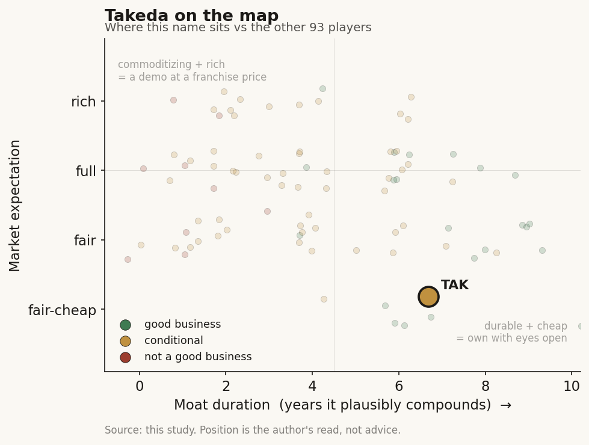

# Takeda (TAK / NYSE (Japan))

> **The read.** Japan's largest pharma and a textbook incumbent in this study's frame: it funds the AI-drug-discovery chain (two 2026 deals with a combined ceiling near $2.3bn) and keeps the drugs, trials, and distribution for itself. It even has a completed proof point - an AI-designed molecule it bought for $4bn and drove to positive Phase III. But against a ~JPY 4.5tn (~$28bn) revenue base, AI is a strategy line-item and an efficiency lever, not the story. The stock is a mature, patent-cliff-managing pharma franchise with an AI call option attached.

**Snapshot**

| | |
|---|---|
| Listing | TAK / NYSE (ADR; primary: Tokyo 4502) |
| Region | Japan |
| Value-chain role | pharma incumbent - funder / value-keeper of the drug-discovery AI chain |
| Archetype | diversified big-pharma; rents AI as tool + cheap staged option, owns the assets |
| Size | ~$50-52bn market cap (Jun-26) [reported] |
| Revenue (latest) | FY2025 (ended Mar-26) JPY 4,505.7bn (~$28bn), -1.7% YoY AER [disclosed] |
| AI relevance | small to the P&L today; efficiency + optionality; one completed AI-molecule proof point |
| Moat verdict | conditional - the moat is franchise / scale / distribution, not AI algorithms |
| Expectation | fair-to-cheap - priced on the pipeline and the patent cliff, not on AI |
| Evidence quality | high |

## What it is
A Tokyo-headquartered, US-listed (NYSE ADR, one ADR = one-half a Tokyo common share) global pharmaceutical company - Japan's largest by revenue, and one of the more active incumbent adopters of AI in early discovery. Its actual business is medicines across four areas: gastrointestinal and inflammation (GI), rare diseases, plasma-derived therapies (immunology), and oncology plus neuroscience and vaccines. AI matters to this study not because it moves the P&L - it does not, yet - but because Takeda is a clean illustration of the case study's thesis from a non-US, Japanese vantage: the incumbent writes the checks to the AI labs, licenses the platforms, and keeps the finished drugs, the trials, and the distribution for itself.

## Business model - how it makes money
Takeda sells patented small molecules and biologics it discovers, develops through its own clinical trials, manufactures, and distributes through its own global commercial machine. It captures value at every layer a pure-play AI lab does not touch: the ~40% Phase II efficacy wall (it runs the trials), regulatory approval, manufacturing scale-up, payer contracting, and a worldwide salesforce.

That is the key point of the case study. When Takeda signs an AI-discovery deal, it structures it as **option + milestone + royalty**: a small upfront, large payments only if a molecule advances, and Takeda holds exclusive worldwide rights to whatever comes out. The AI partner bears the discovery risk and is paid in options; Takeda keeps the asset. The incumbent funds the AI and keeps the value.

- **AI as a tool, not a product.** Takeda does not sell AI. It uses AI to make its own discovery, target identification, and molecular design cheaper and faster, and buys external AI capacity as staged options. Management frames this as a shift to an "AI-native discovery model" integrating automation, robotics, and generative AI [disclosed].
- **The completed proof point.** Zasocitinib (a TYK2 inhibitor) was designed on Schrodinger's physics-based computational platform at Nimbus, acquired by Takeda in Dec-2022 for $4bn upfront (plus up to $2bn sales milestones), and posted positive best-in-class Phase III plaque-psoriasis data in Dec-2025 [disclosed]. This is the thesis realized: an incumbent bought a computationally-designed asset and carried it through the trials that create the value.
- **Capital-heavy where it counts.** The spend is trials, manufacturing, commercial, and business development - not compute. Even the largest AI commitments are small next to the ~JPY 730bn (~$5bn) annual R&D line.

## Financial summary
Top-line scale, with the AI/deal figures kept in proportion so the reader sees how small they are.

| Item | Figure |
|---|---|
| FY2025 revenue (ended Mar-26) | JPY 4,505.7bn (~$28bn), -1.7% YoY AER [disclosed] |
| FY2025 reported net profit | JPY 191.8bn; core net profit JPY 814.1bn [disclosed] |
| FY2025 core operating profit | JPY 1,172.5bn [disclosed] |
| R&D spend (core) | ~JPY 730bn (~$5bn), ~16% of revenue [disclosed] |
| Market cap | ~$50-52bn (Jun-26) [reported] |
| FY2026 revenue outlook | JPY 4,640.0bn (core); core EPS ~JPY 472, mid-teens % decline [disclosed] |
| Growth driver | Growth and Launch Products (>half of revenue) offsetting VYVANSE loss-of-exclusivity [disclosed] |
| **AI deal figures (kept in scale)** | |
| Insilico Medicine | announced Jul-2026; up to ~$600m per program (milestones) + tiered royalties; ~$60m in near-term/initiation payments; Takeda gets exclusive worldwide rights; uses Insilico's Pharma.AI platform across multiple therapeutic areas [disclosed] |
| Iambic Therapeutics | announced Feb-2026; up to $1.7bn (upfront + milestones) + royalties; oncology and GI/inflammation; uses Iambic's NeuralPLexer protein-ligand structure model; Takeda keeps the assets [disclosed] |
| Nimbus (Schrodinger-designed) | Dec-2022 acquisition, $4bn upfront + up to $2bn sales milestones; delivered positive Phase III (zasocitinib) Dec-2025 [disclosed] |
| Recursion | AI-enabled discovery collaboration since 2017 (extended 2019); evaluated molecules across 60+ indications [disclosed] |

Scale check: the two 2026 AI deal ceilings combined (~$2.3bn) are almost all contingent and years away - the near-term cash actually committed on Insilico is ~$60m, roughly 0.2% of one year's revenue. Even the completed $4bn Nimbus purchase - a genuine capital outlay - is one deal against a ~$28bn annual revenue base. The recurring external-AI cash is a rounding error next to the ~$5bn annual R&D line. AI is a strategic bet financed out of pocket change.

## Value-chain position and competition
Takeda sits at the top of the drug-discovery chain as a **funder and value-keeper**. Map the flows:

- **Money flows out** to AI labs (Insilico, Iambic, historically Recursion) as small upfronts + large contingent milestones + technology-access fees, and, in the Nimbus case, as an outright $4bn purchase of a computationally-designed asset.
- **AI capacity flows in** two ways: (1) **partnered / licensed discovery** - target identification and molecular design from Insilico's Pharma.AI and Iambic's NeuralPLexer platform; (2) **internal AI-native discovery** - an in-house Data Sciences Institute and R&D data-and-AI organization (under R&D president Andrew Plump) redesigning discovery workflows around generative AI, automation, and robotics rather than treating AI as an add-on [disclosed].
- **Finished drugs, trials, manufacturing, and distribution stay inside Takeda.**

Competition for the *AI-funder* role is the other cash-rich incumbents doing the identical thing: Lilly (Isomorphic, Insilico, owned compute), AstraZeneca (Modella acquisition, Tempus/Pathos, CSPC), Novartis, J&J, Pfizer, Merck, Sanofi, Novo Nordisk, Bayer - all licensing platforms and funding labs. Takeda's differentiator inside this pack is thin: it is a fast follower, not a leader, and unlike AstraZeneca it has not (yet) bought an AI company outright to own the models and staff. The competitive fight that actually decides Takeda's value is not AI - it is managing the VYVANSE and coming ENTYVIO patent cliffs and delivering the Growth and Launch pipeline (including zasocitinib) against the same peer set. AI is a shared industry tool; the moat is the franchise.

## Moat
Takeda's moat is real but narrower than the mega-cap peers - and it is **not** an AI moat, which is the whole point.
- **Franchise + scale + distribution - REAL but under patent-cliff pressure (~5-10 yr).** A broad, patent-protected GI, rare-disease, plasma, and oncology portfolio, global trial and manufacturing capacity, entrenched payer/prescriber relationships, and the balance sheet to fund any Phase III. But near-term the franchise is defending against loss-of-exclusivity (VYVANSE now, ENTYVIO ahead), so the moat is being spent down and rebuilt rather than widening.
- **AI algorithms as a moat - WEAK / not the point.** Discovery models commoditize (open clones caught the AlphaFold frontier within ~a year at far lower cost). Takeda rents these platforms; it does not own a proprietary data or model asset the way an oncology-data holder might. Its edge, to the extent it has one, is the ability to run the trials and own the assets AI cannot reach - incumbency, not algorithms.

Net: a ~5-10-year franchise moat that is currently being defended through a patent cliff, not compounded. AI widens the discovery funnel and buys cheap options but does not itself compound value. The incumbent's real moat is the part of the chain the AI labs cannot reach - and Takeda holds a smaller, more cliff-exposed version of it than AZ or Lilly.

## Core variables
1. **[CORE] Patent-cliff management + Growth/Launch pipeline delivery.** This is ~everything: replacing VYVANSE and (ahead) ENTYVIO revenue with the Growth and Launch Products, above all zasocitinib's commercial ramp and label breadth. AI does not move this needle in the forecast window; execution and launches do.
2. **[CORE] R&D productivity - does AI actually lower cost-per-approved-drug?** The whole incumbent-AI thesis. Watch whether AI-sourced targets (Insilico, Iambic) convert into real INDs and Phase progress, and whether the internal AI-native workflow measurably shortens discovery. Today this is unproven at the P&L level [unverified] - zasocitinib is one completed data point, not a repeatable rate.
3. **[CORE] Milestone conversion, not headline biobucks.** The "up to $600m / up to $1.7bn" numbers are option ceilings. What matters is cash actually paid as molecules advance - and, for Takeda the payer, whether that cash buys approved assets or lapses cheaply after a small upfront.

Below the line as noise: which specific AI lab or model "wins," the Pharma.AI vs NeuralPLexer distinction, GPU counts, and the AI-native framing generally. For a ~JPY 4.5tn-revenue company, these are strategy line-items, not valuation drivers.

## Bear case / key risks
The bear case has almost nothing to do with AI. It is the patent cliff and margin: VYVANSE loss-of-exclusivity already dragged FY2025 revenue -1.7%, FY2026 guidance points to a mid-teens % core-EPS decline, and ENTYVIO exclusivity erosion looms - so the near-term story is a shrinking base being defended, with a leveraged balance sheet from the 2019 Shire acquisition still being paid down. Any pipeline, launch, or pricing setback (US Medicare negotiation, tariffs, Japanese price cuts) dwarfs anything AI could add or subtract.

On AI specifically the risk is the opposite of the pure-plays': not that Takeda's AI fails, but that it *rents a commoditizing tool for narrative reasons* while peers with proprietary data build a harder-to-copy edge - or that a licensed molecule hits the same ~40% Phase II wall everyone hits, in which case Takeda simply stops paying milestones and loses only a small upfront. The AI spend is not where a Takeda investor loses money.

Falsification watch: (1) a launch or patent-cliff setback derails the Growth and Launch replacement story - the actual thesis breaks here, AI irrelevant; (2) a second and third AI-sourced Takeda molecule reaches pivotal-stage success (beyond the one-off zasocitinib) and materially de-risks a franchise - the one path where AI stops being a rounding error; (3) Takeda acquires or builds a proprietary AI/data asset (as AZ did with Modella) rather than only renting - the only route to an AI-specific moat worth watching.

## The expectation read
At ~$50-52bn (Jun-26), and with FY2026 guidance pointing to a mid-teens % core-EPS decline, the market is pricing a mature, cliff-managing pharma - a value-and-yield franchise being asked to prove its Growth and Launch Products (led by zasocitinib) can outrun VYVANSE and ENTYVIO erosion. That is why the expectation reads fair-to-cheap rather than full: the multiple embeds skepticism about the pipeline replacing the cliff, not enthusiasm about AI. **Essentially none of the price is AI.** The two 2026 AI deals commit a small fraction of annual revenue, are financed out of cash flow, and are structured so Takeda's downside is capped at the upfronts.

So the AI read is asymmetric and cheap: Takeda pays option premiums, keeps every asset that works (zasocitinib proves the loop can close), and owes little if they do not. Whether AI "moves" a ~JPY 4.5tn company: not in the numbers today, and not in the price. If it ever does, it shows up as *lower cost-per-approved-drug* and a faster refill of the pipeline behind the cliff over a decade - a slow productivity tailwind, not a re-rating.

## Verdict
Good business but a defensive one - a wide-ish franchise moat currently being spent down through a patent cliff, not compounded, and the moat is the GI/rare-disease/plasma/oncology franchise plus distribution, not AI. Takeda is the case study's clean Japanese example of the incumbent funding the AI and keeping the value: it rents discovery platforms (Insilico, Iambic) as cheap staged options, runs an internal AI-native discovery effort, and already has one completed proof point (the Schrodinger-designed, Takeda-owned zasocitinib through Phase III) - while keeping the drugs, the trials, and the value. AI is a sensible, low-cost efficiency-and-optionality bet that is immaterial to the P&L and to the ~$50bn valuation today. Confidence: HIGH on the facts (revenue, R&D, deal terms, market cap all disclosed and current); HIGH on the framing (AI is a tool/option here, the patent cliff and pipeline are the story); the genuinely open questions are variable 1 (does the pipeline outrun the cliff) and variable 2 (does AI ever measurably lower cost-per-approved-drug), the latter unobservable for years.
