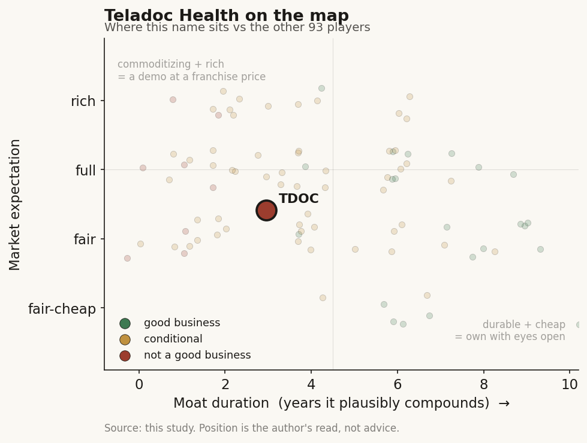

# Teladoc Health (TDOC / NYSE)

> **The read.** A scaled but shrinking virtual-care incumbent trading at ~0.65x sales for a reason: revenue is flat-to-down, both segments have distinct headwinds, and the "AI" is operational glue (matching, note-taking, engagement nudges) bolted onto a distribution-and-services business - not a defensible AI product. Cheap on paper, but the market is pricing decline, not a re-rate, and it is roughly right until growth turns.

**Snapshot**

| | |
|---|---|
| Listing | TDOC / NYSE |
| Region | US |
| Value-chain layer | Consumer-telehealth - virtual-care distribution + services |
| Archetype | services-at-scale (employer/health-plan channel + a D2C therapy marketplace) |
| Size | ~$1.7bn market cap (6-Jul-26) |
| Revenue (latest) | Q1'26 $613.8m, -2% YoY; FY26 guide $2.48-2.58bn (roughly flat) |
| Moat verdict | weak - distribution/switching-cost on the employer side, none on D2C |
| Expectation | low - priced for stagnation/decline |
| Evidence quality | high (all segment splits, cash, debt, guidance disclosed) |

## What it is
The company that made "see a doctor on your phone" a category. Two businesses under one roof: **Integrated Care** - virtual primary/urgent care, chronic-condition management (the Livongo diabetes/hypertension programs), and mental-health services sold to employers and health plans on a per-member basis - and **BetterHelp** - a direct-to-consumer online-therapy marketplace sold on subscription. It sits at the consumer-telehealth layer: the distribution-and-services front end of care, upstream of the payers who fund it and the clinicians who deliver it.

## Business model - how it makes money
Two engines with opposite customers and opposite problems:

- **Integrated Care (~64% of revenue).** Sold B2B2C: employers and health plans pay access/PMPM fees plus visit fees to put Teladoc in front of ~101m US members. Q1'26 revenue $395.4m, +2% YoY; adjusted-EBITDA margin 14.2%. The moat, such as it is, lives here - enterprise contracts, integration into benefits stacks, switching cost. But the model is mid-shift from flat subscription access toward visit-based pricing (~70% of memberships now visit-based [reported]), which trades predictable revenue for pay-per-use and pressures the top line.
- **BetterHelp (~36% of revenue).** Direct-to-consumer therapy subscriptions, acquired via paid digital marketing. Q1'26 revenue $218.4m, -9% YoY; adjusted-EBITDA margin just 0.9%; paying users 361k, -9% YoY. This is a customer-acquisition-cost treadmill with no switching cost - churn is high and marketing spend sets the ceiling. The fix underway is bolting on insurance reimbursement (targeting a $125m+ annualized insurance run-rate by end-2026 [reported]) to escape pure cash-pay.

**Growth quality.** Poor and honest about it. FY25 revenue fell 2% to $2.53bn; FY26 guide is flat ($2.48-2.58bn). Integrated Care grows low-single-digits; BetterHelp is shrinking. US membership was 101.2m in Q1'26, -1% YoY - the base is not even expanding.

**Incremental economics / cash conversion.** Consolidated adjusted EBITDA $58.2m in Q1'26 (flat), but GAAP net loss was -$63.8m and free cash flow was -$26.3m (a Q1 seasonal outflow). The company has stopped the catastrophic bleeding - FY25 net loss narrowed to -$200m from -$1.0bn in FY24 - but that improvement is mostly the absence of fresh multi-billion goodwill write-offs, not operating leverage.

## Financial summary

| | FY24 | FY25 | Q1'26 | FY26 guide |
|---|---|---|---|---|
| Revenue | $2.57bn | $2.53bn (-2%) | $613.8m (-2% YoY) | $2.48-2.58bn |
| - Integrated Care | - | $1,579.6m (+3%) | $395.4m (+2%) | - |
| - BetterHelp | - | $950.4m (-9%) | $218.4m (-9%) | - |
| Adj EBITDA | - | - | $58.2m | $267-306m |
| GAAP net loss | -$1,001.2m | -$200.3m | -$63.8m | - |
| Free cash flow | - | - | -$26.3m (seasonal) | - |
| Cash and equivalents | - | - | $750.7m | - |
| Total debt (converts) | - | - | $995.8m | - |
| Shares outstanding | - | - | 180.4m | - |

Figures as of Q1'26 report; price/market cap 6-Jul-26.

## Value-chain position and competition
Teladoc is the distribution-and-services front end of virtual care - it owns the member relationship and the visit, and pays the clinicians (largely a contracted/employed provider network) who actually deliver it. It is not a diagnostics or drug node; its asset is a member panel (~101m) plus the longitudinal engagement data those visits and chronic-care programs generate. The cash sits in the enterprise channel (Integrated Care); the volatility sits in D2C (BetterHelp).

Competition, by segment:
- **Enterprise virtual care:** Amwell (health-system/payer infrastructure), Included Health (navigation + virtual primary care), and increasingly Amazon (One Medical / Amazon Clinic) commoditizing low-acuity visits. Teladoc's edge is scale and incumbency, not technology.
- **D2C mental health:** BetterHelp competes with Hims & Hers, cerebral-style players, and a long tail of app-based therapy - a marketing-arms-race with zero lock-in.
- **Chronic care (Livongo):** Omada Health (public 2025), Vida, and the disease-management arms of the big payers. Livongo was the crown jewel; it is now a modestly growing program (chronic-care enrollment 1.20m, +4% YoY) rather than a category-defining franchise.

Edge: the incumbent's distribution and the switching cost of being embedded in an employer's benefits stack. That is real but shallow, and it does not exist at all on the D2C side.

## Moat
Two very different situations:
- **Integrated Care - NARROW, real but shallow (~2-4 yr).** Enterprise contracts, benefits-stack integration, and the hassle of ripping out a member-facing vendor create genuine switching cost. But renewals reprice, competitors (Amwell, Included, Amazon) are credible, and the shift to visit-based pricing erodes the sticky subscription annuity. This is a distribution moat, not a product moat.
- **BetterHelp - NONE (~0 yr).** A cash-pay marketplace with high churn and paid-acquisition dependence has no structural moat; its "growth" strategy is now defensive (add insurance to lower CAC). Whoever spends most on ads and matches best wins the month.

Net: a weak, distribution-based moat on ~two-thirds of revenue and no moat on the rest. Durable-compounding duration is short and conditional on retaining enterprise share while the pricing model resets.

## Core variables
1. **Integrated Care revenue trajectory through the visit-based transition.** Can the enterprise book hold members and grow low-single-digits AS it swaps subscription access for pay-per-visit? This is the segment that funds the company; if the mix shift turns +2% into flat-or-down, the whole equity story is decline, not stabilization.
2. **BetterHelp stabilization via insurance.** Does the insurance pivot (targeting $125m+ run-rate) arrest the -9% bleed and lift a 0.9% margin, or does it just cannibalize cash-pay at lower unit economics? Half the revenue base hangs on this working.
3. **Cash generation vs the 2027 convert wall.** $750.7m cash against ~$996m of convertible notes, with FCF only marginally positive across a full year. The refinancing/dilution question is live; profitability must become real GAAP cash before the notes come due.

Below the line as noise: the Catapult (at-home diagnostics) and UpLift (in-network therapy) tuck-ins; Telecare/Australia international expansion; quarterly membership wobble of +/-1%.

## Bear case / key risks
A no-growth incumbent in a commoditizing category. Revenue is flat-to-down, both segments are impaired in different ways (enterprise repricing to lower-visibility visit fees; D2C shrinking on a CAC treadmill), and the balance sheet carries ~$1bn of converts against thin free cash flow. The Livongo chronic-care asset - once the AI story - has been written down by $6.6bn since acquisition and is now a slow-growing program, not a moat. Amazon and well-funded rivals can undercut low-acuity virtual visits indefinitely. The improving net loss is largely the absence of new impairments, not operating leverage.

Falsification watch: (1) Integrated Care revenue rolls negative as visit-based pricing bites - the last growth leg breaks; (2) BetterHelp keeps declining despite insurance, proving the D2C model is structurally unfixable; (3) FCF stays near zero into the 2027 convert maturity, forcing dilution or distressed refinancing.

## The expectation read
Shares ~$9.36, market cap ~$1.7bn (6-Jul-26), against ~$2.5bn of revenue - roughly **0.65x sales**, near a 52-week range of $4.40-9.77. That multiple is not pricing an AI platform or a re-rate; it is pricing a stagnating services business with a solvable-but-unsolved balance sheet. The bull case is narrow: stabilize Integrated Care, fix BetterHelp with insurance, convert adjusted EBITDA ($267-306m guided) into real cash, refinance the converts, and the equity re-rates off a depressed base. The bear case is simply that flat revenue and a shrinking half of the business justify a sub-1x multiple, and the market is right.

Where the belief looks soft in EITHER direction: bulls need BOTH segments to inflect at once, which has not happened in three years of trying; bears must contend with a genuinely large member panel, positive adjusted EBITDA, and enough cash to reach the convert wall without immediate distress. This is a show-me situation, not a broken one.

**Real AI vs marketing.** Mostly marketing-adjacent, honestly framed by management. The AI here is operational, not clinical: BetterHelp uses AI to match users to therapists, suggest goals, and help therapists prep/document sessions; Integrated Care uses AI to stratify members by risk and route care teams; Livongo's "AI nudges" improve diabetes engagement. All useful, none defensible - these are efficiency and personalization layers on a services business, not an FDA-cleared algorithm or a proprietary data-network product that competitors cannot replicate. To management's credit, the CEO explicitly frames AI as "arm our care providers, not replace" them and warns against getting ahead of the technology - which is the correct, non-hyped posture, but it also confirms there is no AI moat to underwrite.

## Verdict
Scaled, real, and cheap - but not a good business today: flat-to-declining revenue, a no-moat D2C half on a marketing treadmill, a shallow distribution moat on the enterprise half being eroded by its own pricing reset, and AI that is operational glue rather than a defensible product. The ~0.65x-sales multiple is a fair reflection of stagnation, not a mispricing; the equity only works if BOTH segments inflect and cash converts ahead of the 2027 converts - a show-me bet the company has not yet earned. Confidence: HIGH on the facts (segment splits, cash, debt, guidance, AI usage all disclosed/current); MEDIUM on the verdict, which turns on whether the visit-based and insurance transitions stabilize revenue - a genuinely two-sided, unresolved question.
