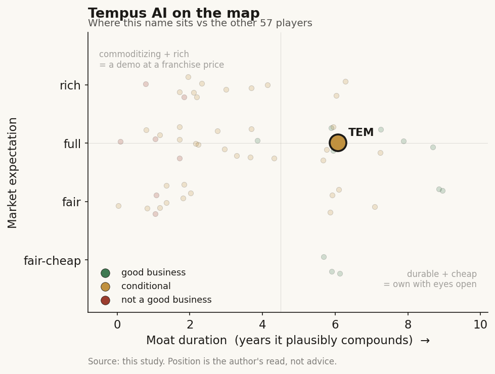

# Tempus AI (TEM)

> **The read.** Good business with a real data-network moat, but priced as a software platform when three-quarters of it is a reimbursement-gated lab - a demanding expectation until the ~73%-GM data leg proves it can compound and GAAP FCF arrives ahead of dilution.

**Snapshot**

| | |
|---|---|
| Listing | TEM / Nasdaq |
| Region | US |
| Value-chain layer | L5 - AI-bioinformatics anchor |
| Archetype | data-platform (per-test lab + data-licensing annuity under one roof) |
| Size | ~$9.1bn market cap (1-Jun-26) |
| Revenue (latest) | Q1'26 $348.1m, +36.1% YoY; FY26 guide $1.59-1.60bn (~25%) |
| Moat verdict | conditional - durable data-network annuity, table-stakes lab clearances |
| Expectation | full-to-rich |
| Evidence quality | high |

## What it is
A precision-oncology company that runs a clinical genomics lab and, on top of the data that lab generates, sells de-identified multimodal clinico-genomic data and AI tooling to pharma. One node, two archetypes - a per-test lab with a data-licensing annuity bolted on. It sits at the L5 AI-bioinformatics anchor, the single seam where a diagnostics platform becomes picks-and-shovels for drug discovery.

## Business model - how it makes money
Two engines with opposite economics:

- **Diagnostics (~75% of revenue).** Per-test clinical lab: NGS profiling + hereditary + MRD assays billed to payers. Q1'26 revenue $261.1m, +34.7% YoY; non-GAAP GM 62.3%. Reimbursement-gated, working-capital-heavy, pays a reagent/sequencer toll upstream (L1/L2). Oncology NGS ASP ~$1,740 (Q1'26), guided toward >$2,300.
- **Data & Applications (~25%).** Data-licensing annuity: de-identified data + Lens/Insights tooling to 19 of top-20 pharma + 250+ biotech. Q1'26 revenue $87.0m, +40.5% (Insights +44.1%); non-GAAP GM 73.1%. Capital-light. ~126% NRR (YE25), >$1.1bn remaining TCV, >$2bn contracts signed to date.

**Growth quality - the whole debate.** Headline 36% is flattered by the Feb-2025 Ambry acquisition (~$600m, +$300m 2025 rev); organic oncology volume was +7% ex-Ambry pre-acquisition base; steady-state guide is ~25% - very good, not hyperscaler. The ~73%-GM leg that justifies a software multiple is only a quarter of revenue and its NRR has already slipped 140%→126%.

**Incremental ROIC / cash conversion.** Capital-hungry where the cash is (the lab: reagents, CLIA, receivables) and capital-light where the re-rating is (data). Adj EBITDA just crossed zero (Q3'25 +$1.5m, Q4'25 +$12.9m, Q1'26 -$2.8m seasonally, FY26 ~$65m) but GAAP net loss was -$125.9m in Q1'26 alone - because adj EBITDA excludes ~$200m/yr SBC ($56.3m in Q1'26) plus $32m mark-to-market. Cash $643.8m; profitability is optical, funded historically by convertibles. Cash conversion is not yet SaaS-clean - it is a lab crossing breakeven on adjusted metrics.

## Financial summary

| | FY25 | Q1'26 | FY26 guide |
|---|---|---|---|
| Revenue | $1,272m | $348.1m | $1.59-1.60bn |
| Revenue growth | +83% | +36.1% YoY | ~25% |
| - Diagnostics | +112% (on Ambry) | $261.1m, +34.7% YoY | - |
| - Data & Applications | - | $87.0m, +40.5% YoY | - |
| Non-GAAP gross margin | - | 65.0% consolidated (Dx 62.3% / Data 73.1%) | - |
| Adj EBITDA | -$7m | -$2.8m (seasonal) | ~$65m |
| GAAP net loss | - | -$125.9m | - |
| SBC | - | $56.3m (~$200m/yr run-rate) | - |
| Cash | - | $643.8m | - |

Prices/figures as of Q1'26 report + 1-Jun-2026 unless tagged.

## Value-chain position and competition
The L5 AI-bioinformatics anchor, back-integrated to L3/L4 (assay + CLIA lab) and forward to L6/L7 (Lens/Next apps + Insights pharma-RWE). The L7 leg is the seam where a diagnostics platform becomes picks-and-shovels for drug discovery - the single node joining the diagnostics chain to the drug-discovery chain, and the one place a per-test business hosts a data annuity. Flow: samples → sequence → structured multimodal data (500+ PB, 45m+ patient records, 4.5m+ samples sequenced, 5,000+ connected providers) → sold twice (a test to the payer, the by-product data to pharma). The cash engine sits downstream in the reimbursement-gated lab; the re-rating rests on the capital-light data leg upstream.

Competition:
- **Profitable twin, Caris (CAI):** FCF-positive at ~75% GM while TEM is still crossing zero; both guiding ~25% 2026 growth; Caris has an MCED launch TEM lacks. The cleaner expression of the same thesis.
- **Per-assay category leaders:** Natera (Signatera MRD), Guardant (liquid), Foundation (CGP, most comparable to xT) - TEM is not best-in-class per test.
- **L7 RWE rivals:** Flatiron, Komodo, Truveta.

Edge: multimodal breadth + the integrated L4→L7 loop (diagnostics feeds data feeds applications) - a data-network moat, not a per-test win and not a reimbursement monopoly. New optionality: AZ/Pathos oncology foundation model, a SoftBank Japan JV (~$191m, 50/50; $95m licensing paid to TEM), an 18% Personalis stake for tumor-informed MRD, and a claimed ~4-5k-GPU compute base.

## Moat
Two moats apply, and they split:
- **Data-flywheel - CONFIRMED, but only in its data-licensing form (~5-10 yr).** The flywheel is refuted for drug discovery (public model clones caught the frontier in ~1yr) but survives intact here because the data IS the sold product and the pharma buyer bears the efficacy risk - it never has to climb the ~40% Phase-II wall. Widens with scale (multimodal breadth + outcome labels). The erosion tell is already live: NRR 140%→126%.
- **Reimbursement-clearance - REFUTED as a moat (~0 yr on grant).** FDA clearance for xT CDx / cardio algos gates the shelf, not the revenue; the real barrier is the coverage/ASP build, which is conditional and can price down (sector precedent: autonomous-DR CPT -14% over two years).

Net: the durable moat is the data-network annuity, capped by exclusivity erosion; the lab's clearances are table stakes. Estimated durable-compounding duration ~5-8 years on the data leg, contingent on NRR holding above ~100%.

## Core variables
1. **Data & Applications growth AND retention.** Is the profitable ~73%-GM leg the one actually compounding? +44.1% Insights, but NRR 140%→126% and growth is punctuated by lumpy negotiated contracts (AZ/Pathos $200m/3yr) - licensing lumpiness, not recurring seats. The whole software multiple rests here.
2. **Diagnostics ASP path (reimbursement rate-of-change).** ~$1,740 → >$2,300 as xT migrates from LDT (~$2,900) to xT CDx ($4,500) + xF FDA + broader commercial coverage (2027 timing). This turns the capital-hungry Dx leg from margin-dilutive toward self-funding - and can go the wrong way under CMS budget-neutrality.
3. **Cash-flow crossover vs dilution/SBC.** Does the mix-shift to Data + the ASP step-up reach real GAAP FCF before ~$200m/yr SBC and convertible leverage force more dilution - the exact bar Caris has already cleared?

Below the line as noise: MRD/xM ramp off a small base (~6,500 tests/qtr); SoftBank/Personalis/compute optionality; quarterly hereditary comps; the "AI drug-discovery compute leader" framing.

## Bear case / key risks
A lab company wearing a software multiple. Three-quarters of revenue is a ~62%-GM, reimbursement-gated, working-capital-heavy clinical lab whose incremental economics look nothing like software and whose ASP can be repriced down by CMS. The ~73%-GM data leg that justifies the re-rate is only ~25% of revenue, its NRR is already decelerating (140%→126%), and its "growth" is punctuated by lumpy negotiated pharma contracts dressed as ARR. The headline is flattered by Ambry (organic ~25%, not 36%). Profitability is optical: adj EBITDA crossed zero only by excluding ~$200m/yr SBC; GAAP loss was -$125.9m in Q1'26.

Falsification watch: (1) Data-leg NRR rolls below ~100% or a marquee pharma contract lapses - the software-multiple thesis breaks; (2) an MRD/ASP reimbursement setback strands the Dx leg below self-funding; (3) Caris keeps compounding at similar growth WITH positive FCF and ~75% GM - proving the profitable version already exists at a lower cost of capital.

## The expectation read
Shares $50.47, market cap ~$9.1bn, 174.5m shares (1-Jun-26). That is ~6.2x EV/2026E sales - down from a ~10x 2025 average, a discount to Guardant/Natera despite similar ~25% top-line. The multiple implies the market is buying the data-platform re-rate - that the 500-PB moat and ~30-40% Data growth compound the mix toward software economics, that ASP inflection self-funds the lab, and that TEM is an AI-drug-discovery beneficiary (the bull $100-120 PTs price ~10-11.5x forward EV/sales; the $35 bear prices ~3.5x on sub-15% CGP growth).

Where the belief looks soft: the monetizable, capital-light slice is small (~25%) and its retention is decelerating; the cash engine is still the toll-paying lab; GAAP FCF is unproven; and a profitable, self-funding peer (Caris) already demonstrates the model at a lower cost of capital. The premium is largely the market paying for a promise the peer has already delivered.

## Verdict
Good business, real data-network moat - but priced as a software platform when three-quarters of it is a reimbursement-gated lab, so the expectation is demanding rather than fair until the ~73%-GM data leg proves it can compound (NRR back above ~100%) and GAAP FCF arrives ahead of dilution. Confidence: MEDIUM-HIGH on the facts (segment splits, ASP path, NRR, cash, valuation all disclosed/current); MEDIUM on the verdict, which hinges on two unresolved rate-of-change variables (Data NRR trajectory and reimbursement ASP conversion) that could still break either way.
