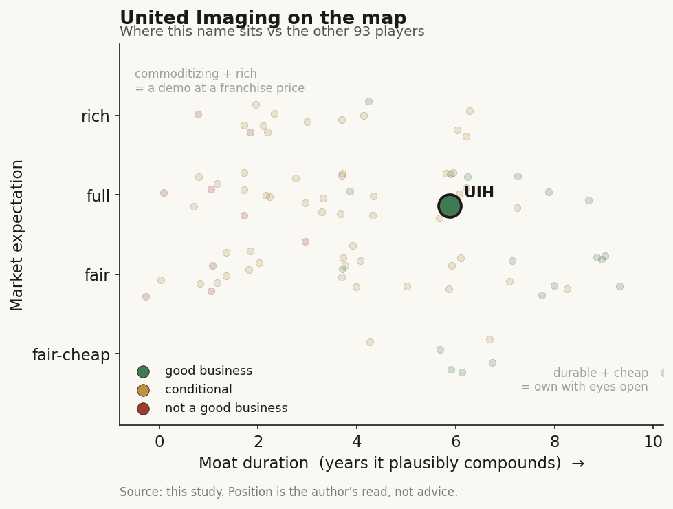

# United Imaging (688271 / STAR (China))

> **The read.** China's genuine #1-tier imaging OEM - a real, share-taking GE/Siemens/Philips challenger at home with native AI (uAI) baked into the box - but priced as a high-growth compounder (~45-50x forward earnings) when the business is a capital-heavy, procurement-cycle-driven, hardware-first equipment maker whose overseas TAM is the exact market most exposed to a China-medtech backlash. Good business, demanding expectation, and the AI is a differentiator not yet a moat.

**Snapshot**

| | |
|---|---|
| Listing | 688271 / Shanghai STAR Market (China A-share) |
| Region | China (ex-US, ex-Taiwan) |
| Value-chain layer | Imaging L1/L2 hardware rail + L5a (on-scanner / native AI) + L6 (reading workflow, uAI) |
| Archetype | infra / capital-equipment toll with an embedded native-AI software layer |
| Size | ~CNY 92bn market cap (~$13.5bn) [reported, Jun-26] |
| Revenue (latest) | FY2024 CNY 10.30bn; 9M'25 CNY 8.86bn, +27.4% YoY [disclosed] |
| Moat verdict | conditional - domestic policy/installed-base position ~5-7 yr; AI layer commoditizing |
| Expectation | full-to-rich (priced ~45-50x forward on a recovery-and-export story) |
| Evidence quality | med (segment/geographic splits partial; A-share disclosure thinner than a US OEM) |

## What it is
Shanghai United Imaging Healthcare - the domestic champion of Chinese medical imaging, and the first credible full-line challenger to the GE/Siemens/Philips ("GPS") oligopoly inside China. It builds the whole modality stack - CT, MRI (MR), PET/CT and PET/MR molecular imaging, X-ray (XR), ultrasound, and radiotherapy (RT) - and layers its own native AI, the uAI platform, onto the scanner at the point of image capture. Founded 2011, IPO'd on Shanghai's STAR board in August 2022. It is a hardware-and-service equipment franchise with an AI label, not a software pure-play - the same shape as GEHC, one tier down in scale and installed base [disclosed].

## Business model - how it makes money
A razor-and-blade capital-equipment toll, China-style:

- **Equipment sales (the core).** Big-ticket scanners sold to hospitals - a capex sale, reimbursement-independent at the point of purchase but heavily gated by China's hospital procurement cycle, provincial budgets, and the 2024-25 large-scale equipment-renewal ("device update") stimulus. FY2024 equipment revenue was CNY 8.45bn, down 14.9% YoY [disclosed] - the pothole from an anti-corruption procurement freeze and a stimulus air-pocket that the 9M'25 rebound (+27.4%) is now filling.
- **Service and software (the growing tail).** Maintenance contracts, parts, and uAI software attached to the installed base - higher-margin, more recurring, and the leg management is pushing. Service revenue hit records in H1'25 [reported].
- **Native AI (uAI).** Deep-learning reconstruction (HYPER DLR), auto-positioning, lesion flags and 60+ clinical AI applications via United Imaging Intelligence (UII). This is a differentiator embedded in the box, not a separately-metered SaaS line - it sells more scanners and defends price, it does not yet sell as an annuity.

Growth quality: capital-heavy (it manufactures scanners; R&D was CNY 2.26bn in FY2024, ~22% of revenue - unusually high, a genuine engineering commitment [disclosed]) and cyclical (top line swings with Chinese procurement policy, not GDP-plus steadiness). Gross margin ~48% (H1'25 47.9%) [reported] - healthy for hardware, below a software business. Profit is volatile: 9M'25 net profit ex-nonrecurring +127% YoY off a depressed 2024 base [disclosed] - a recovery, not a steady compounder.

## Financial summary

| Metric | FY2024 | 9M'25 |
|---|---|---|
| Revenue | CNY 10.30bn | CNY 8.86bn, +27.4% YoY |
| Net profit (attrib.) | CNY 1.26bn | - |
| Net profit ex-nonrecurring | - | CNY 1.05bn, +126.9% YoY |
| Gross margin | ~47-48% [estimate] | 47.9% (H1'25) |
| R&D spend | CNY 2.26bn (+17.8% YoY, ~22% of rev) | - |
| Overseas revenue | CNY 2.27bn (+35% YoY, ~22% of rev) | +42% YoY (9M'25) |
| Equipment revenue | CNY 8.45bn (-14.9% YoY) | - |

Figures company-disclosed; USD conversion at ~6.80 CNY/USD (Jul-26). A-share segment detail is thinner than a US OEM discloses - treat modality-level splits as [unverified].

## Value-chain position and competition
United Imaging owns the imaging hardware rail (an L1/L2 equivalent - it makes the box and controls the DICOM stream at capture) and has migrated up into L5a native on-scanner AI (reconstruction, positioning, quantification) and L6 reading workflow (the uAI Clinical Portal, 60+ apps). It sells the scanner, then the AI that speeds acquisition and reads, then the multi-year service contract. Flow: hardware -> image -> native-AI enhancement -> service annuity - the GEHC playbook, executed as the domestic insurgent rather than the global incumbent.

Competition splits by geography:
- **At home (China):** the "GPS" incumbents - Siemens Healthineers, GE HealthCare, Philips - still anchor the premium installed base, but United Imaging has taken clear share on price-performance plus subsidy/localization alignment. It was #1 in China PET/CT (~32% share, 2020) and reached ~23% of the China CT market (2021) [reported, dated]; domestic peers Mindray and Neusoft compete on the value tier. It has launched genuine world-firsts - the 5.0T uMR Jupiter MRI and the total-body uEXPLORER PET/CT - so this is not a pure copy-and-undercut story.
- **Abroad (the export thesis):** the same GPS names, but now United Imaging is the challenger with no installed base and a China-origin trust discount. It runs a Houston US HQ (R&D since 2013), 100+ PET/CT installs in North America, FDA clearance for uMR Jupiter 5T and uAI HYPER DLR, 49 FDA 510(k) clearances and 20+ FDA-cleared AI-enabled devices, and sells in 85+ countries [disclosed]. US local manufacturing (Houston, tripling) is a deliberate tariff/geopolitics hedge.

Edge: full-line breadth, world-first high-field hardware, ~22%-of-revenue R&D, and home-market policy tailwinds (domestic-procurement preference, equipment-renewal stimulus). Limit: overseas it is the low-trust newcomer against entrenched service networks, and its premium (3.0T+ MR, 64-slice+ CT) installed base is still far below GPS.

## Moat
Two moats apply, both conditional and geographically split - not the durable compounding kind:
- **Domestic policy + installed-base position - CONDITIONAL (~5-7 yr, China only).** China's push for domestic medical-equipment substitution, provincial procurement preference, and the equipment-renewal stimulus give United Imaging a real, protected runway at home. This is a policy-and-distribution moat, not a technology monopoly - it holds while the industrial-policy tailwind and the growing installed base (service lock-in) persist, and it does not travel abroad.
- **Native-AI (uAI) embedding - REAL DIFFERENTIATOR, WEAK MOAT (~1-3 yr).** Baking AI into the scanner at capture is a genuine product edge and, like GEHC's, sits on a scarce input (the DICOM stream the OEM owns). But the AI itself commoditizes: deep-learning reconstruction and lesion-flag apps are cleared by the dozen across every OEM, and imaging volume does not compound into un-cloneable model IP. The clearance count (20+ AI devices, 49 510(k)s) gates the shelf, not the revenue - the same "clearance is table stakes" verdict the study applies to GEHC.

Net: the durable edge is home-market policy plus installed-base service lock-in (~5-7 yr, China-bounded); the AI is a ~1-3 yr product differentiator that the field is already matching. Estimated durable-compounding duration is real but narrow and policy-dependent.

## Core variables
1. **[CORE] China procurement cycle + equipment-renewal stimulus.** The single master variable. FY2024's -14.9% equipment pothole and the 9M'25 +27.4% snap-back both trace to Chinese hospital-procurement policy (anti-corruption freeze, then the device-update stimulus). The whole top line, and the recovery narrative the multiple is paying for, ride on this cycle continuing - and it can reverse when the stimulus laps.
2. **[CORE] Overseas revenue conversion vs the China-medtech trust discount.** Overseas is the growth engine (+42% YoY in 9M'25, ~22% of revenue and rising) and the entire "global compounder" case. But it is the exact market where a China-origin imaging OEM faces national-security scrutiny, BIOSECURE-style rhetoric, tariff risk, and hospital procurement reluctance. This variable can be throttled by policy independent of product quality.
3. **[CORE] Margin/profit durability through the cycle, not the rebound quarter.** 9M'25 net profit +127% flatters off a crushed 2024 base; Q3'25 net profit was only CNY 0.09bn despite +75% revenue [disclosed] - seasonality and mix make the bottom line lumpy. The question is normalized through-cycle margin and whether the service/software mix lifts it, not the recovery headline.

Below the line as noise: individual product launches and world-first hardware bragging rights (real, but not the P&L driver); single AI-app clearances; quarter-to-quarter FX.

## Bear case / key risks
Strip the AI narrative and United Imaging is a ~48%-gross-margin, capital-heavy imaging-equipment maker whose revenue is hostage to Chinese hospital-procurement policy and whose profit is volatile (net profit fell in FY2024, then snapped +127% off that base - not compounding, cycling). The domestic moat is industrial policy, which can shift; the AI moat is refuted by the same logic that refutes GEHC's - clearance is table stakes and imaging volume does not compound into un-cloneable IP. The growth leg the multiple is paying for - overseas - is precisely the market most exposed to a China-medtech backlash: national-security scrutiny of Chinese scanners handling patient data, BIOSECURE-adjacent rhetoric, tariffs, and a structural trust discount no product spec fixes. At ~45-50x forward earnings [estimate] it is priced as a secular compounder while behaving like a policy-driven cyclical with a geopolitically-capped export TAM.

Falsification watch: (1) the equipment-renewal stimulus laps and China orders roll over - the recovery multiple breaks; (2) a US/EU national-security or procurement action explicitly targets Chinese imaging OEMs - the overseas engine stalls; (3) through-cycle net margin fails to hold above the mid-teens as the mix-shift-to-services story underdelivers.

## The expectation read
At ~CNY 112, ~CNY 92bn market cap (~$13.5bn), TTM EPS ~CNY 2.31 [reported, Jun-26], the stock trades ~45-50x forward earnings [estimate] - a growth-compounder multiple, and a large premium to the ~12-13x forward P/E on which the global #2 (GEHC) trades. Sell-side price targets cluster ~CNY 137-218 (avg ~167) [reported], i.e. the Street is underwriting the recovery-plus-export story. The implied belief: the China procurement cycle keeps recovering, overseas keeps compounding 30-40%+, the service/AI mix lifts margin, and the geopolitical export cap never binds.

Where the belief looks soft: three of those four legs are policy-dependent (China stimulus, overseas trust discount, domestic-substitution preference), and the AI leg that would justify a software-like multiple is a commoditizing differentiator, not an annuity. The stock is ~30% off its 52-week high (CNY 164.50 -> ~CNY 112), so some cyclicality is already in - but a ~45-50x multiple leaves little margin for either the stimulus lapping or the export TAM being geopolitically throttled. The premium pays for a secular compounder; the business is a policy-driven cyclical with a real but geographically-bounded moat.

## Verdict
**Good business - a genuine, share-taking GE/Siemens/Philips challenger at home with real engineering (world-first 5.0T MR, total-body PET) and native AI baked into the box - but the expectation is demanding, not fair: it is priced ~45-50x forward as a secular compounder when it is a capital-heavy, procurement-cycle-driven equipment maker whose overseas growth engine (the multiple's justification) is the market most exposed to a China-medtech backlash, and whose AI is a differentiator not yet a moat. Confidence: HIGH on the framing (China #1-tier OEM, hardware-first, AI commoditizes - the same verdict the study reaches on GEHC); MEDIUM on the precise financials (A-share disclosure is thinner; modality splits and forward margin are partly [unverified]); MEDIUM on the multiple, which hinges on two policy variables (China stimulus persistence and overseas geopolitical access) that can break either way.**
