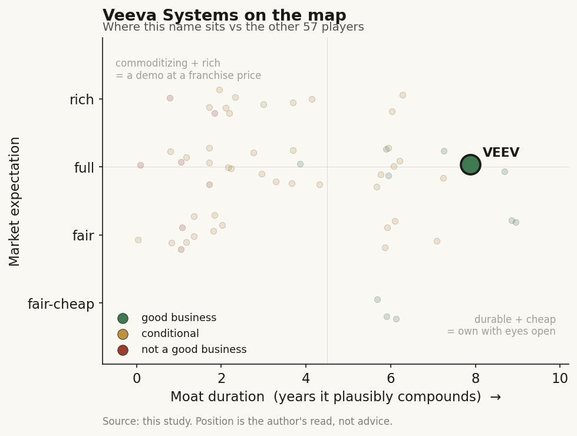

# Veeva Systems (VEEV)

> **The read.** Best-in-study business - GAAP-profitable, net-cash, ~45% non-GAAP margins, >100% cash conversion, and the durable owned-workflow / data-licensing survivor whose one envelopment risk it removed itself - now at a full expectation that prices durability more than growth.

**Snapshot**

| | |
|---|---|
| Listing | VEEV / NYSE |
| Region | US |
| Value-chain layer | L7 - pharma system-of-record / industry-cloud |
| Archetype | data-platform (02 SaaS core + 03 data-licensing hybrid) |
| Size | ~$31bn market cap (EV ~$24bn) |
| Revenue (latest) | $3,195.3m FY2026, +16% YoY |
| Moat verdict | durable |
| Expectation | full |
| Evidence quality | high |

## What it is
The system-of-record software vendor for the life-sciences industry - a vertical (industry-specific) cloud that runs pharma's regulated content and processes end-to-end: clinical trials (eTMF, CTMS, EDC), regulatory submissions (RIM), quality/manufacturing (QMS), safety/pharmacovigilance, plus the commercial stack (Vault CRM, medical, and the OpenData/Link reference-data assets). It owns the pharma workflow and the data that flows through it - not a clinical-decision or reimbursement-gated product. Fiscal year ends Jan 31; "FY2026" = year ended 31 Jan 2026.

## Business model - how it makes money
Two lines: **Subscription** $2,684.2m (~84% of revenue) - per-seat/per-module SaaS, the recurring annuity; and **Professional Services & Other** $511.1m - implementation/config, deliberately run near break-even to pull subscription. FY2026 total revenue $3,195.3m, +16% YoY; Q4'26 $836.0m (+16%). Within subscription, **R&D Solutions (~$1,420m) has now overtaken Commercial Solutions (~$1,252m)** - the growth engine migrated from the mature CRM franchise to clinical/regulatory/quality, which de-risks the single-product-dependency the company started with.

The archetype is the durable hybrid: a **02 SaaS core** (buyer = beneficiary, no reimbursement code gates the dollar, capital-light) with a **03 data-licensing leg** bolted on (OpenData/Link/Compass reference and RWD sold into the same pharma buyers) - buyer = beneficiary, no reimbursement wall, capital-light, software-grade gross margin, the opposite of the reimbursement-gated diagnostics chain.

Growth quality is best-in-cohort and real profit, not optical: GAAP operating income $916.4m (28.7% margin); non-GAAP operating income $1,433.8m (44.9% margin); GAAP net income $908.9m - deeply, GAAP-profitably so, which almost nothing else in this healthcare-AI universe is. Subscription non-GAAP gross margin ~86.7%; blended GAAP gross margin ~75%. Rule-of-40 ≈ 61 (16% growth + 45% non-GAAP op margin).

Capital intensity / cash conversion is an outlier: no wet lab, no reagents, no inventory, no payer adjudication on its own P&L. Operating cash flow $1,415.2m - a ~44% OCF margin - and OCF *exceeds* even non-GAAP operating income, i.e. cash conversion >100% (negative working capital from annual prepaid subscriptions). Balance sheet is ~$6.6-7.3bn cash & short-term investments against ~$0.1bn debt - net cash ~$7.2bn - so incremental ROIC is very high and entirely self-funded: no dilution, no converts, no burn line. The cleanest 3-statement in the study.

## Financial summary

| Metric (FY2026, year ended 31 Jan 2026) | Figure |
|---|---|
| Total revenue | $3,195.3m (+16% YoY) |
| - Subscription | $2,684.2m (~84%) |
| - Professional Services & Other | $511.1m |
| Q4'26 revenue | $836.0m (+16%) |
| R&D Solutions subscription | ~$1,420m |
| Commercial Solutions subscription | ~$1,252m |
| Subscription non-GAAP gross margin | ~86.7% |
| Blended GAAP gross margin | ~75% |
| GAAP operating income | $916.4m (28.7% margin) |
| Non-GAAP operating income | $1,433.8m (44.9% margin) |
| GAAP net income | $908.9m |
| Operating cash flow | $1,415.2m (~44% OCF margin) |
| Cash & short-term investments | ~$6.6-7.3bn |
| Debt | ~$0.1bn |
| Net cash | ~$7.2bn |
| Rule-of-40 | ≈ 61 |
| FY2027 revenue guide | ~12% growth |

## Value-chain position and competition
The **pharma system-of-record / industry-cloud** node (L7): what flows through it is the regulated content and process data of drug development and commercialization - the trial master file, the regulatory dossier, the quality event, the safety case, the field-force interaction, and the reference data (KOL/HCP/product) that ties it together. It sits horizontally *across* pharma's own workflow (R&D → quality → regulatory → commercial), and it is the seam where a workflow-SaaS company also becomes a data-licensing vendor to the same customers. It does not touch the payer or the clinician's reimbursement dollar - its counterparty is the pharma/biotech enterprise itself, which pays for the system it runs on.

Competes with: in clinical/regulatory, Oracle Health Sciences (Argus/Siebel CTMS), Medidata (Dassault), IQVIA's tech stack, and point tools; in quality/QMS, MasterControl and Sparta; in commercial, its own legacy plus Salesforce Life Sciences Cloud (the ex-partner, now a direct competitor after Veeva left the Salesforce platform); in reference/RWD, IQVIA OneKey and Definitive Healthcare on the OpenData side. Salesforce's own life-sciences push is the most-watched flank precisely because Veeva rented Salesforce's platform for 15 years.

Its edge: it is the only broad, purpose-built industry cloud for life sciences - depth of pre-configured regulated workflow, validated-environment compliance (GxP/21 CFR Part 11), and an install base of essentially every large pharma across multiple Vault modules. Switching cost is the cost of re-validating a regulated system-of-record, which is severe. Not a per-code monopoly and not a horizontal-software play - the edge is vertical workflow ownership plus regulatory switching cost.

## Moat
**Ch5 Moat-2 (Workflow embedding/distribution), DURABLE side - the named survivor that "owns the workflow, not rents a slot."** Veeva owns a scarce input - the pharma system-of-record and its regulated data - that no platform above/beside can cheaply replicate. Crucially, the envelopment threat that guts the ambient-scribe cohort (Epic becoming the competitor) does not apply here - Veeva's landlord risk was Salesforce, and Veeva removed that dependency by building its own platform (Vault CRM), migrating off Salesforce rather than being enveloped by it. It also appears on the durable side of Ch5 Moat-4 (data-licensing flywheel) via OpenData/Compass - data as the sold product, buyer bears no efficacy risk.

Durable vs commoditizing: durable - the regulated-workflow switching cost and validated-environment lock-in are genuine, and unlike a scribe the core function is not a commoditizing LLM capability. The AI features layered on top (Vault AI agents) are table-stakes, not the moat; the moat is the system-of-record incumbency.

Estimated duration: **~7-10 years** of protected compounding - the upper end of the Ch5 owned-workflow band, because the switching cost is regulatory (re-validation, not just re-integration) and the customer set is structurally captive. Capped by (a) Salesforce/Oracle re-entry at the commercial layer and (b) the maturity ceiling of a finite ~$20bn-TAM industry.

## Core variables
- **CORE 1 - Vault CRM migration completion (the identity/execution swing).** Veeva left the Salesforce platform and rebuilt CRM on its own Vault; 115+ live Vault CRM deployments, ~14 of the top-20 pharma expected to land on Vault CRM. Pricing is similar to legacy, near-term COGS higher during transition, long-term COGS lower on Vault. This both removes the platform-dependency risk and proves Veeva can own its own stack - a clean win removes the only real envelopment overhang; a stumble (customer defection to Salesforce at renewal) would be the falsification.
- **CORE 2 - R&D-solutions durability and mix-shift.** R&D subscription (~$1,420m) now exceeds Commercial (~$1,252m) - the growth is coming from clinical/regulatory/quality, the stickier, harder-to-displace, less-commercially-contested modules. Whether R&D keeps compounding double-digit *at price* is what carries the total-company growth rate now that CRM is a migration story, not a growth story.
- **CORE 3 - TAM-ceiling / deceleration.** Life sciences is a finite vertical; growth has stepped from ~mid-20s% historically to ~16% (FY2026) and a ~12% FY2027 guide. The core variable is whether module-attach + data-licensing + AI-attach extends the runway, or whether Veeva is approaching penetration and re-rates toward a mature-software grower.

(Noise held below the line: quarterly billings/RPO ticks, individual module launches, Vault AI agent announcements, FX on the ~45% ex-US revenue.)

## Bear case / key risks
It is a superb business bumping into the ceiling of a finite vertical while its multiple still prices open-ended growth. (1) **Deceleration is structural, not cyclical** - growth has walked from mid-20s% to ~16% actual and a ~12% FY2027 guide; a vertical cloud eventually saturates its one industry, and Veeva already runs across essentially every large pharma, so incremental growth must come from module-attach and price, not new logos. (2) **The commercial layer is contested by a scorned ex-partner** - Salesforce, which Veeva just left, is building its own Life Sciences Cloud and has both the platform and the motive; the CRM migration, while de-risking the platform dependency, is *also* the exact renewal window where a customer could defect. (3) **Growth is single-vertical and single-currency-of-value** - no reimbursement tailwind, no new-market optionality of the kind a horizontal SaaS name has; when pharma R&D budgets tighten, Veeva's TAM tightens with them. (4) **Valuation carries the burden** - at ~34x trailing / ~21x forward P/E and ~9x sales for a ~12-16% grower, the multiple assumes the deceleration halts and margins keep expanding; a low-double-digit grower does not obviously deserve a high-single-digit sales multiple once the growth-story premium fades. The falsification event: a Vault CRM customer defection at renewal, *or* R&D-solutions growth rolling toward high-single-digits - either would confirm the vertical is maturing and collapse the growth premium toward a mature-software multiple.

## The expectation read
At ~$193/share, ~$31bn market cap, EV ~$24bn (the ~$7bn net cash is a real cushion), the stock trades ~**34x trailing GAAP P/E, ~21x forward P/E, ~9.4x price/sales and ~6.7x EV** on the FY2027 revenue guide. What the tape implies: the market is pricing Veeva as a durable-compounder industry cloud - a business that stays a mid-teens grower with 45% non-GAAP margins and >100% cash conversion for years, i.e. it is paying a premium software multiple for the durability of the moat, not for near-term growth (12% guide would not, alone, support 9x sales).

Where the belief looks soft, both ways: the *bull* soft spot is that ~21x forward earnings on a GAAP-profitable, net-cash, 45%-margin, ~100%-cash-conversion monopoly-adjacent vertical cloud is not demanding if the ~7-10yr owned-workflow moat holds and R&D-solutions keeps the growth rate in the teens - quality this clean rarely trades cheaply and the migration removes the one structural overhang. The *bear* soft spot is that ~9x sales / ~34x trailing prices open-ended compounding into a business already guiding to ~12% in a finite vertical with a motivated ex-partner attacking the commercial flank - if growth settles at low-double-digits, the multiple is full-to-rich and re-rates toward a mature grower. The disagreement is almost entirely CORE-2 (R&D-solutions durability) × CORE-3 (TAM ceiling); the migration (CORE-1) is the swing factor that decides whether the moat overhang clears cleanly. The multiple is the residual of how long the reader believes the mid-teens growth persists.

## Verdict
Best-in-study business - GAAP-profitable, net-cash, ~45% non-GAAP margins, >100% cash conversion, and the Ch5 durable owned-workflow / data-licensing survivor whose one envelopment risk (Salesforce) it removed itself - now at a full expectation that prices durability more than growth; the debate is entirely whether a finite vertical decelerating to ~12% earns a high-single-digit sales multiple. Confidence: HIGH on the financials, moat type, and profitability (company-disclosed, internally consistent, exceptionally clean 3-statement); MEDIUM on the forward multiple, because the growth rate is structurally decelerating and the valuation leaves little room if R&D-solutions or the CRM migration disappoints.
