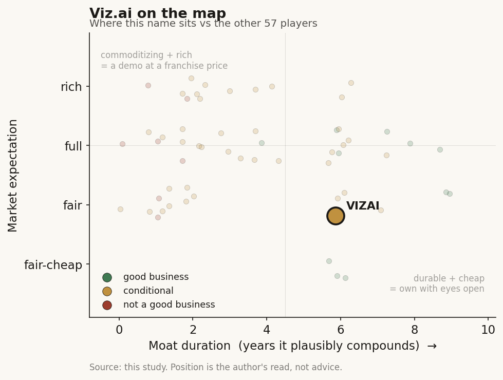

# Viz.ai (private)

> **The read.** A durable value-capturer, narrowly - grade B / conditional-yes: Viz owns a real, embedded multi-disease coordination workflow plus a differentiated life-sciences data-attach, but it is not the reimbursement fortress its NTAP-first branding implies and its algorithm layer is openly commoditizing.

**Snapshot**

| | |
|---|---|
| Listing | Private |
| Region | US |
| Value-chain layer | Imaging L5a (interpretive triage) / L6 (clinical workflow) / L8-adjacent (payment-rail-adjacent) |
| Archetype | SaaS subscription (02) with bolted-on data-to-life-sciences (03) leg |
| Size | ~$1.2bn last private valuation (Apr 2022, 4 years stale) |
| Revenue (latest) | ~$65m (2024 est.); ~$40m (2023 est., ~+100% YoY) |
| Moat verdict | Conditional - workflow ownership durable, algorithm and NTAP not |
| Expectation | Fair |
| Evidence quality | Med |

## What it is
AI-powered disease-detection and care-coordination platform for hospitals - it records the scan, flags the finding (stroke LVO first), and pushes an alert plus group-chat to mobilize the specialist team, collapsing the phone-tag between ER, radiology and the interventionalist. Founder-CEO Chris Mansi is a neurosurgeon. The mechanism of action is the workflow, not the algorithm alone.

## Business model - how it makes money
Enterprise SaaS sold to health systems as an annual subscription priced by (number of algorithms) × (population/size of system); a ~$25K/yr/algorithm figure appears in the CMS filing, likely tiered primary-vs-comprehensive-stroke-center. The model is capital-light - no wet lab, no reagents, no inventory; the caveat is per-inference COGS and heavy enterprise-sales, EHR-integration and clinical-change-management spend to land a system (the same drag as the ambient-scribe cohort). A second engine - a life-sciences data leg - sells real-time patient-identification and HCP-engagement to pharma: it doubled in 18 months to 13 partnerships (6 added 2025; Sanofi/Regeneron COPD, Novartis oncology). This leg is the higher-margin, more-defensible monetization of the installed network and is the growth story management is now leaning on. Incremental economics improve as the network scales, but the land cost per system remains high.

## Financial summary
Private-company data is thin by construction, so this profiles funding, adoption and reimbursement, not an income statement.

**Funding**

| | |
|---|---|
| Series D | $100m at a $1.2bn valuation, Apr 2022, led by Tiger Global + Insight Partners |
| Series C | $71m (2021, Scale Venture Partners + Insight) |
| Total raised | ~$289m across ~10 rounds (Crunchbase/Tracxn variants cite $251-298m - the spread is small tranches, e.g. a $40m other-equity in Mar 2023) |
| Notable backers | Tiger Global, Insight, GV (Google Ventures), Kleiner Perkins, Scale, CRV, Threshold, Sozo, Susa - plus HCA Healthcare as a strategic customer-investor |
| Re-raise | No fresh priced round disclosed since 2022; the $1.2bn mark is 4 years stale. Company says its healthcare business reached profitability in 2025 |

**Estimated revenue / ARR**

| Metric | 2020 | 2023 | 2024 |
|---|---|---|---|
| Revenue (est.) | - | ~$40m (~+100% YoY) | ~$65m |
| ARR (est.) | ~$12m | - | ~$100m (projected) |

Revenue/ARR figures are estimates (Sacra); the profitability claim is a chosen segment cut, not audited whole-company FCF.

## Value-chain position and competition
Viz sits across three layers: **L5a** interpretive triage (the LVO/PE/aneurysm detection algorithms - the commoditizing layer); **L6** clinical-workflow orchestration (the alert plus care-team mobilization - where the actual value sits, "workflow > tech"); and **L8-adjacent**, where Viz owns a reimbursement relationship (first CMS NTAP for AI) rather than the payment rail itself. Imaging plus workflow signals plus longitudinal context across ~2,000 hospitals / 230M+ lives flow IN; a real-time clinical alert and, increasingly, a patient-identification/HCP-education product sold to pharma flow OUT. It sits on top of the L0 EHR/PACS rails (integrates with Epic/Salesforce/Microsoft) - it rents that distribution surface, it does not own it.

Direct competition: RapidAI, Aidoc, Brainomix e-Stroke and Siemens Healthineers in stroke triage; the top imaging-AI names collectively held ~65% share in 2025. RapidAI publicly claims +33% more medium-vessel-occlusion detection vs Viz; Aidoc claims a PPV edge - i.e. the algorithm layer is a contested, commoditizing race. Viz's edge is not accuracy - it is distribution depth plus workflow embedding plus first-mover reimbursement: ~2,000 hospitals (from ~1,000 in 2024), a majority of the top-50 systems, a 90% alert click-through rate, 120+ peer-reviewed publications, and a multi-disease platform (neuro/cardio/onc/pulm) that lands-and-expands within an account.

Two competitive facts sharpen the picture. First, the NTAP moat is not exclusive: RapidAI and Aidoc both hold CMS NTAP add-ons for LVO triage software as well [reported], and RapidAI's Rapid OH (one of five new FDA clearances announced Nov 2025) also qualifies for NTAP [reported] - so "first CMS reimbursement for AI" is a first-mover story, not a sole-holder one. Second, the rivals are far better capitalized: Aidoc raised a $150m Series E led by Growth Equity at sell-side Sachs Alternatives (with General Catalyst, SoftBank and NVentures), taking total funding above $500m [reported, 2026] - roughly 2x Viz's ~$252-289m lifetime raise. Viz is out-funded by at least one direct rival, which cuts against any assumption that distribution depth is a permanent lead; the algorithm-clearance race is running fast on both sides (RapidAI added five modules in a single Nov-2025 batch).

## Moat
This is Moat 1 (reimbursement/clearance) and Moat 2 (workflow embedding) stacked, and it is one of the genuinely stronger private cases in the universe - but honestly capped.

- **Reimbursement:** Viz owns the first-ever CMS NTAP for AI (Viz LVO, up to $1,040/patient, 2020, renewed 2021) - the exact thing the framework says the tape mistakes for a moat. The refutation bites here: NTAP is a 3-year transitional inpatient add-on, not a permanent Category-I CPT code. Viz is closer to the LumineticsCore/HeartFlow aspiration than to HeartFlow's actual permanent code (only 3 of 1,451 cleared devices hold one). The bare de-novo FDA clearance is table stakes (Moat-1 verdict: refuted, ~0 yr on grant).
- **Workflow ownership is the part that survives.** The one durable mechanism - own a scarce input the platform cannot cheaply replicate - partly applies: the multi-year, multi-disease, 90%-click-through embedded network across 2,000 systems is a real switching cost (Moat-2 conditional, ~5-7 yr for owned workflow vs ~1-3 for a rented slot). Viz is nearer the owned-workflow end than the pure-scribe end because it owns the care-coordination layer and a reimbursement relationship, not just an EHR slot.

Is the moat real for a private at this stage? Partially, and it is the workflow - not the algorithm or the NTAP - that is real. The durable input is the embedded coordination network plus the life-sciences data-attach; the algorithm commoditizes (~1 yr) and the NTAP is repricing-fragile and transitional. Duration of compounding: ~5-7 yr on the workflow leg, capped by (a) the OEMs (Siemens/GE/Philips) bundling AI into scanners they already sell these hospitals, and (b) any CMS reimbursement step-down.

## Core variables
1. **Reimbursement durability post-NTAP** - does stroke-AI payment survive the transition off the 3-year NTAP into a durable pathway, and does Viz avoid the -14% autonomous-DR-style repricing? The whole hospital-adoption ROI rests on the hospital getting paid.
2. **Life-sciences growth and retention** - is the pharma-data leg (13 partners, 2x in 18mo) the durable, capital-light compounder, or lumpy multi-year deals dressed as recurring? This is the leg that would justify a re-rate above a services multiple.
3. **Net revenue retention / land-and-expand at price** - does the 90%-click-through network convert into additional-module attach at a holding price as RapidAI/Aidoc/OEMs compress the algorithm?

Second-order (excluded as noise): raw algorithm accuracy vs RapidAI/Aidoc; new-disease launch cadence; international/CE-mark expansion; the stale $1.2bn mark.

## Bear case / key risks
Viz is a workflow feature sandwiched between two owners - the commoditizing detection algorithm below (RapidAI claims +33% MeVO; Aidoc claims a PPV edge; the layer trends to cost-of-inference) and the scanner OEMs beside/above (Siemens/GE/Philips can bundle good-enough triage into hardware these same hospitals already buy). Its loudest moat - "first CMS reimbursement for AI" - is a 3-year transitional NTAP, not a permanent code, and NTAP pays only 65% of the hospital's loss capped at ~$1,040, so the reimbursement is thin, inpatient-only and repricing-fragile (sector precedent: autonomous-DR CPT eroded -14% in two years). The $1.2bn valuation is a 4-year-old mark struck at the 2021 ZIRP peak; the absence of a re-raise plus the pivot-to-narrative on life-sciences suggests the subscription core alone did not support a clean up-round. "Profitability in the healthcare business" (2025) is a chosen segment cut, not audited whole-company FCF.

## The expectation read
The $1.2bn mark is 4 years stale and was struck at the 2021 ZIRP peak, so it prices a much cheaper capital regime than today's; against ~$65m (2024) estimated revenue it implied a high-teens revenue multiple that has almost certainly compressed. The market's inability to see a re-raise and the pivot-to-narrative on life-sciences suggest investors no longer credit the subscription core with the 2022 growth multiple. Where the belief looks soft: the implied durability of the NTAP-anchored reimbursement moat, which is transitional not permanent, and the assumption that the life-sciences leg is recurring rather than lumpy. On revenue and installed-base traction the expectation looks fair-to-supportable; on moat permanence it looks optimistic.

## Recent developments (2025-2026)
The 2025-2026 news flow confirms the profile's central thesis: the workflow-plus-life-sciences leg is where Viz is compounding, and every new step is a disease-workflow expansion or a pharma attach, not an algorithm-accuracy claim.

- **Year-end 2025 scorecard (release dated Jan 12, 2026)** [reported/disclosed]. Viz says it reached "profitability in its healthcare business" in 2025 - a chosen segment cut, not audited whole-company FCF. Installed base: nearly 2,000 hospitals, a majority of the 50 largest US health systems, 230M+ lives, 120+ peer-reviewed publications, 90% alert click-through. No revenue, ARR, or new priced-round figure was disclosed; the $1.2bn mark (Apr 2022) remains the last public valuation, now 4 years stale.
- **Life-sciences leg doubled to 13 partnerships, 6 added in 2025** [reported]. This is the growth engine management is leaning on and the higher-margin monetization of the installed network. No individual dollar figures were disclosed, so "recurring vs lumpy multi-year deals" (Core variable 2) stays unresolved on the public record.
- **Viz Oncology launched (2025)** [reported] - extends the multi-disease platform into onc (prostate and breast per the Novartis workflow). **Viz Assist** expanded via partnerships with Salesforce and Microsoft [reported], deepening the rented L0 distribution surface rather than replacing it.
- **IMVARIA / ScreenDx partnership for interstitial lung disease (Nov 18, 2025)** [reported]. Viz attaches IMVARIA's FDA-cleared ScreenDx screening algorithm to expand the pulmonary portfolio into ILD (including IPF/PPF). A partner-cleared-algorithm attach, consistent with "own the workflow, source the algorithm" - reinforcing that the detection layer is a commodity Viz buys or licenses, not its moat.
- **Alnylam Pharmaceuticals partnership for cardiac amyloidosis (March 2026)** [reported]. An AI Care Pathway that uses the FDA-cleared Us2.ai echocardiography algorithm plus EHR connectivity and generative AI to flag suspected cardiac-amyloidosis patients on standard echos and trigger confirmatory testing, referral and follow-up. It launches as a multi-site pilot to generate real-world time-to-treatment evidence before rolling out to the 2,000+ hospital base. This is both a new cardiology workflow and a pharma-funded patient-identification deal - the two-engine model in one announcement - and again sources the algorithm (Us2.ai) rather than building it.

What did NOT appear: no fresh priced round or updated valuation, no permanent Category-I CPT code to replace the transitional NTAP, and no disclosed dollar figures behind the life-sciences "doubling." The single most load-bearing variable - post-NTAP reimbursement durability - remains unresolved, and the competitive-capital gap widened (Aidoc's $150m Series E, RapidAI's five-module Nov-2025 clearance batch). Net: the thesis is intact and the direction of travel is exactly what the profile predicted (workflow and pharma-attach up, algorithm sourced not owned), with valuation and reimbursement-permanence still the open questions.

## Verdict
Durable value-capturer, narrowly - grade B / conditional-yes, at a fair expectation. Viz is more than a demo: it owns a real, embedded, multi-disease coordination workflow across ~2,000 systems (90% click-through) plus a genuinely differentiated life-sciences data-attach - the two surviving forms of workflow ownership. But it is not the reimbursement fortress its NTAP-first branding implies (transitional add-on, not a permanent code), and its algorithm layer is openly commoditizing against RapidAI/Aidoc/OEMs. The durable moat is the workflow plus the pharma-data network (~5-7 yr); the algorithm and the NTAP are not. Confidence: medium - private-company financials are estimates, the $1.2bn mark is stale, and the single most load-bearing variable (post-NTAP reimbursement durability) is unresolved.
