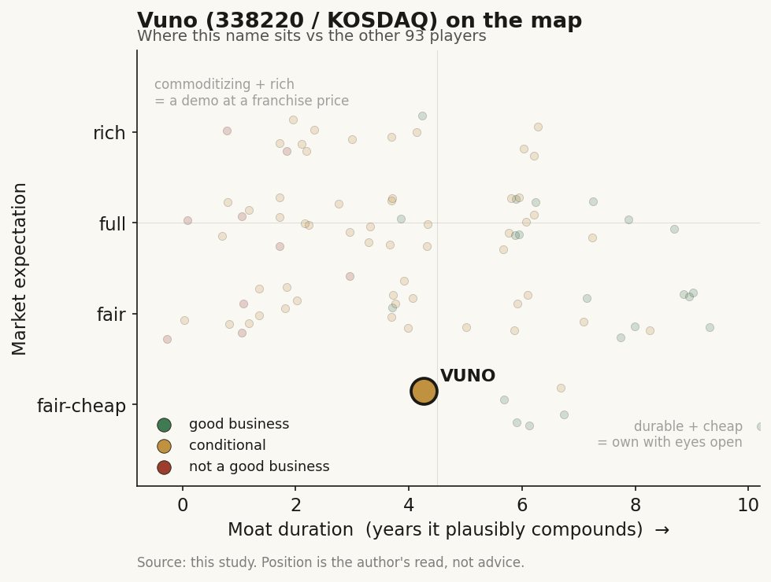

# Vuno (338220 / KOSDAQ (Korea))

> **The read.** A rare cash-generating medical-AI name - one product (a cardiac-arrest early-warning tool) that reached breakeven inside Korea's home market - but the whole story rests on a single reimbursement path that has not yet cleared its permanent hurdle, and the FDA door to the US has slipped again. Good small business, single-point-of-failure risk, priced after a ~60% de-rate.

**Snapshot**

| | |
|---|---|
| Listing | 338220 / KOSDAQ (Korea) |
| Region | Korea (ex-US / ex-Taiwan) |
| Value-chain layer | L6-L7 - clinical AI application / decision support at the bedside |
| Archetype | regulated-device software (per-bed / per-use software, no per-test lab) |
| Size | ~KRW 109bn market cap (~$79m), price 7,880 KRW, ~14.0m shares (6-Jul-26) [disclosed] |
| Revenue (latest) | FY25 KRW 34.85bn (~$25m), +35% YoY; Q3'25 KRW 10.8bn, first profitable quarter [disclosed] |
| Moat verdict | conditional - clinical embed + first-mover reimbursement slot, one regulatory gate from re-rating either way |
| Expectation | fair-to-cheap after a ~60% de-rate, but on a binary catalyst |
| Evidence quality | med (Korea-listed; audited FY figures + IR disclosure, thinner English-language coverage) |

## What it is
A Korean medical-AI software company (founded 2014, KOSDAQ-listed) that turns medical images and bio-signals into diagnostic and early-warning read-outs at the point of care. It is the AI-native, single-country version of the same idea as the imaging names in this study - software that reads a scan or a waveform - but its cash comes from one breakout product: **DeepCARS**, an AI monitor that scores an inpatient's risk of cardiac arrest in the next 24 hours from routine vital signs (blood pressure, heart rate, respiration, temperature). It sits at L6-L7: the clinical-application and decision-support layer, at the bedside rather than in the lab.

## Business model - how it makes money
Regulated-device software sold into hospitals - no lab, no per-test reagent toll, so gross margins are software-like once a bed is live. Two things to understand:

- **One product carries the P&L.** DeepCARS was ~KRW 25.7bn of FY25's KRW 34.85bn revenue - roughly **74%** [disclosed] - and grew ~18% YoY. It is billed **per inpatient-day**, and as of late-2025 it was live across **50,000+ hospital beds** in Korea, including 20+ tertiary hospitals [disclosed]. The rest of revenue is a broad imaging/bio-signal catalogue (below) plus R&D-service and one-off items.
- **How DeepCARS gets paid is the whole story.** It is NOT on standard national-health-insurance (NHIS) reimbursement. Korea let it enter early under an **assessment-deferral / pre-entry track** for new medical technology, under which hospitals charge the patient **out-of-pocket (non-covered, 비급여)** per day while real-world evidence accumulates [disclosed]. That deferral window (extended to a 2+2-year term) runs out around **mid-2026** [reported]. What replaces it - full NHIS coverage, a lower covered rate, or nothing - is the central variable below.

**Growth quality.** FY25 revenue +35% to an all-time high; **11 consecutive quarters of revenue growth** [disclosed]. Q3'25 was the **first profitable quarter since founding** (revenue KRW 10.8bn, operating profit KRW 1.0bn, net profit KRW 1.0bn) - but that quarter was helped by a **non-core asset sale and R&D-service revenue**, so it is a milestone, not yet a clean recurring-software profit run-rate [reported]. Full-year FY25 was still an operating loss of ~KRW 4.9bn and a net loss of ~KRW 5.78bn - though the loss was cut ~55-60% YoY on roughly flat operating cost [disclosed].

## Financial summary

| | FY24 | FY25 | Latest |
|---|---|---|---|
| Revenue | KRW 25.87bn | KRW 34.85bn (+35%) | Q3'25 KRW 10.8bn [disclosed] |
| - DeepCARS | ~KRW 21.8bn | ~KRW 25.7bn (~74% of rev, +18%) | Q3'25 ~KRW 7.0bn [disclosed] |
| Operating loss | ~KRW 12.4bn | ~KRW 4.9bn (loss cut ~60%) | Q3'25 op profit KRW 1.0bn [disclosed] |
| Net loss | ~KRW 13bn | ~KRW 5.78bn (loss cut ~55%) | Q3'25 net profit KRW 1.0bn [disclosed] |
| Operating cost | KRW ~38.3bn | KRW ~39.8bn (+4%) | - |
| Market cap | - | - | ~KRW 109bn (~$79m), 6-Jul-26 [disclosed] |

Figures are consolidated; FY25 per the company's audited-basis full-year disclosure. USD conversion at ~KRW 1,380/$ [estimate]. Prices as of 6-Jul-2026.

## Value-chain position and competition
L6-L7 clinical-application layer: it consumes upstream hardware (patient monitors, X-ray/CT/MRI/fundus scanners - it owns none of it) and sells the read-out and the alert. Flow: routine vitals or a scan come in -> a trained model scores risk or flags a finding -> the alert reaches the ward. Value is captured at the bedside decision, one layer above the imaging device and well downstream of the chips/models that the US and Taiwan names in this study occupy.

The wider catalogue (mostly Korea-MFDS approved, five CE-marked, one FDA-cleared) shows the breadth but also the concentration problem - only one line is a real business yet:
- **DeepCARS** - cardiac-arrest early warning (the cash engine).
- **DeepECG** suite - ECG AI for heart failure / LVSD, acute MI, arrhythmia, even hyperkalemia; a Korean MFDS Breakthrough Device.
- **Imaging**: Chest X-ray, LungCT, Fundus AI (first Korean Class III AI device), BoneAge (Korea's first-ever approved AI medical device), and **DeepBrain** (MRI brain volumetry, **FDA-cleared** [disclosed]).

Competition: domestically the closest cardiac-arrest rival is VitalCare, and Korea has a crowded medical-AI cohort (Lunit in imaging/oncology, Deepnoid, JLK). Globally the imaging catalogue competes with far larger names in each niche; DeepCARS's differentiator is the clinical-embed and the first-mover reimbursement slot, not a per-scan accuracy win. It was cited in the **AHA 2025 CPR & ECC guidelines** as the sole product-based reference for AI deterioration prediction [reported] - a credibility marker, not revenue.

## Moat
- **Clinical embed + first-mover reimbursement slot - CONDITIONAL (~3-6 yr if it converts).** Being the first AI device through Korea's pre-entry track, plus 50,000+ live beds and multi-year real-world outcome data, is a genuine switching-cost and evidence moat: a ward that has wired DeepCARS into its workflow and built alarm protocols around it does not rip it out cheaply. That is real. But it is **capped by the reimbursement gate** - the moat only compounds if the permanent coverage decision lands favorably; a bad decision converts the moat into a stranded install base.
- **Regulatory clearances - table stakes, NOT a moat.** MFDS/CE/FDA clearances gate the shelf, not the revenue (same lesson as the US names) - and the FDA has now asked for additional **multi-ethnic validation data** for DeepCARS, pushing US entry out again and adding cost [reported].
- **Data flywheel - WEAK/UNPROVEN.** More live beds means more outcome data, but the vitals-based model is not obviously hard to replicate, and a domestic rival already exists.

Net: a real but narrow clinical-embed moat, estimated ~3-6 years of durable advantage **only if** DeepCARS converts to stable coverage; otherwise closer to zero.

## Core variables
1. **[CORE] The DeepCARS reimbursement decision (mid-2026 gate).** The assessment-deferral window ends ~mid-2026. Three outcomes [reported]: (a) passes new-technology assessment AND enters NHIS coverage at a stable ~KRW 5,000-6,000/day rate - lower than today's out-of-pocket price but unlocks a step-change in hospital adoption; (b) passes but at a disappointing covered rate - Vuno must make it up on volume and global expansion; (c) fails / lapses - the current billing basis is threatened. This one decision swings the base business.
2. **[CORE] Clean, recurring profitability.** Q3'25 turned the first profit, but on help from an asset sale and R&D-service revenue. The question is whether per-bed software economics alone can hold the company above breakeven across a full year - i.e., is the profit structural or a one-quarter print?
3. **[CORE] Global door (US/EU/Middle East).** FDA clearance for DeepCARS is the option value; the multi-ethnic-data request delays it and raises spend. CE-MDR pilots in Germany and planned Middle-East approvals are the nearer-term expansion. Home-market saturation (there are only so many Korean tertiary beds) makes this the growth axis beyond ~FY27.

Below the line as noise: the long imaging catalogue (broad, low individual revenue), single-quarter margin optics, the AHA-guideline citation as a marketing point rather than a P&L driver.

## Bear case / key risks
A one-product company whose one product is paid for by a temporary regulatory exception that expires in 2026. DeepCARS is ~74% of revenue and is billed out-of-pocket under an assessment-deferral track, not permanent insurance coverage; if the mid-2026 decision goes to a low covered rate or lapses, the core revenue base is directly hit. Profitability is one quarter old and was flattered by a non-core asset sale plus R&D-service revenue, so "profitable medical-AI company" may be premature. The home market (Korean tertiary beds) is finite, and the main escape valve - the US - just slipped again on an FDA request for multi-ethnic validation data, which costs money the company is only now starting to generate. The rest of the catalogue is broad but commercially thin, and a domestic cardiac-arrest rival already exists. The stock is down ~60% over a year, which tells you the market is already pricing the reimbursement uncertainty, not ignoring it.

Falsification watch: (1) the mid-2026 assessment decision lands at a low covered rate or is denied - the base case for the shares breaks; (2) FY26 slides back to full-year operating losses once one-off items drop out - the profitability thesis was optical; (3) FDA/EU timelines slip again with no offsetting domestic coverage win - the growth axis stalls with the home market near saturation.

## The expectation read
At ~KRW 109bn market cap (~$79m) on ~KRW 35bn revenue, the shares trade around ~3x sales - modest for a +35%-growth medical-AI name, and down ~60% from a year ago [disclosed]. That de-rate says the market is NOT paying for a software re-rate here; it is pricing a binary regulatory event. What the current price seems to assume is roughly the middle case: DeepCARS keeps its install base and gets *some* form of continued reimbursement, profitability is real-ish, and global entry eventually happens - but with a heavy discount for the chance the mid-2026 decision disappoints and for repeated FDA slippage. The upside is genuinely binary: a clean NHIS coverage win plus a US clearance would re-rate a now-profitable, cash-generating single-country leader. The downside is equally direct: a bad coverage rate strands ~74% of revenue. This is an event-driven small-cap, not a compounder you can buy and forget. (No buy/sell advice - just what the tape is discounting.)

## Verdict
Conditional. Vuno is one of the very few medical-AI names that actually reached breakeven on a real, embedded clinical product inside its home market - a genuine achievement most peers in this study have not matched - but it is a single-product, single-country business whose core revenue rides a reimbursement exception that faces its permanent test around mid-2026, with the US escape hatch delayed. After a ~60% de-rate the price is fair-to-cheap on the middle case and asymmetric on the catalyst. Confidence: MEDIUM-HIGH on the facts (audited FY25 revenue/loss, DeepCARS mix, bed count, market cap all disclosed); MEDIUM on the verdict, which hinges on one unresolved binary (the mid-2026 coverage decision) that can break either way; evidence quality is capped as MED by thinner English-language disclosure for a Korea-listed micro-cap.
