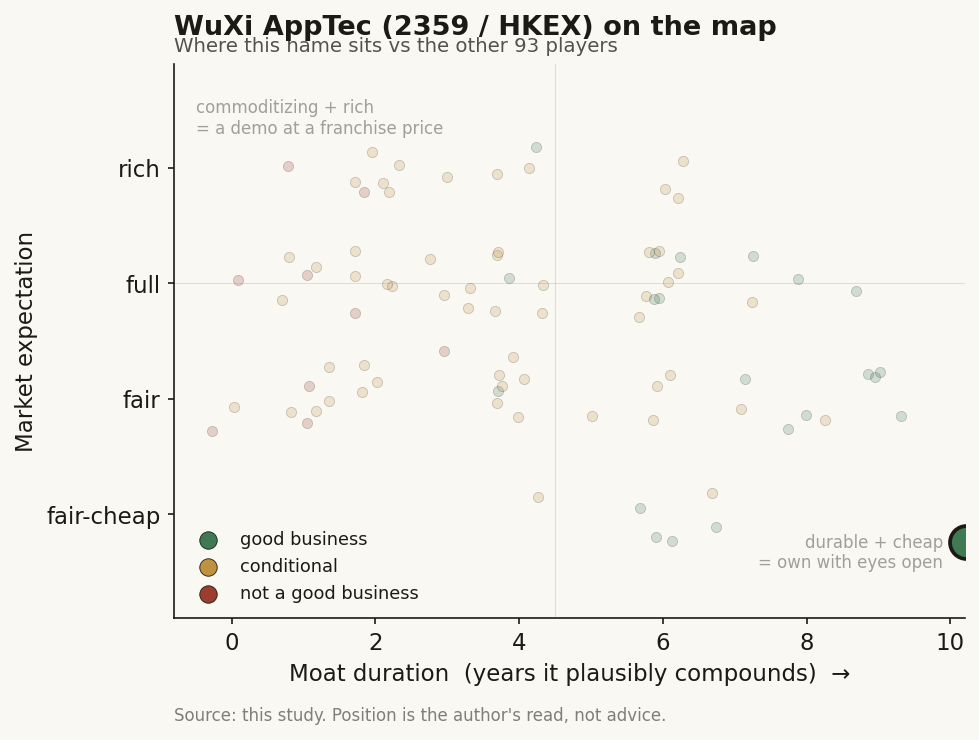

# WuXi AppTec (2359 / HKEX (China))

> **The read.** The picks-and-shovels backbone of global drug discovery and manufacturing - a genuinely good, cash-generative, share-gaining business (FY2025 continuing-ops revenue +21.4%, adjusted operating cash flow RMB 16.67bn, TIDES revenue +96%) whose AI is a real-but-ancillary workflow tool inside the service, not the product. The equity is not an AI thesis; it is a single geopolitical bet. In June 2026 the US Department of War added WuXi AppTec to its 1260H "Chinese military companies" list and the BIOSECURE Act became law - and more than 60% of continuing-ops revenue comes from the US. Good business, un-underwritable expectation until the political tail resolves.

**Snapshot**

| | |
|---|---|
| Listing | 2359 / HKEX (Hong Kong H-share); also A-share 603259 / Shanghai; H-share ~HK$152.70 (29-Jun-26) [reported] |
| Region | China (ex-US, ex-Taiwan) |
| Value-chain layer | L9x picks-and-shovels - the outsourced discovery + development + manufacturing (CRDMO) rail that sits under everyone else's drug programs; AI/in-silico is a tool inside L9b-L9c, not a sold product |
| Archetype | contract research/development/manufacturing (CRDMO) - fee-for-service + milestone-linked manufacturing, migrating up-value into TIDES (peptides/oligos) |
| Size | ~US$59bn market cap (Jul-26) [reported] |
| Revenue (latest) | FY2025 total RMB 45.46bn (+15.8%); continuing operations RMB 43.42bn (+21.4% YoY) [disclosed] |
| Moat verdict | strong on the business (scale + integration + switching cost, ~10yr), but capped by a binary political overhang |
| Expectation | un-underwritable - fundamentally cheap-to-fair, priced against a fat geopolitical tail |
| Evidence quality | high on financials (dual-listed IFRS/CAS filer, clean disclosure); the swing variable is legal/political, not accounting |

## What it is
The largest of China's contract research/development/manufacturing organizations - the outsourced backbone a drug program rents instead of building. A biotech or pharma hands WuXi AppTec a target, a molecule, or a process and buys back chemistry, biology, testing, and manufacturing on a fee-for-service basis. Management brands this the "CRDMO" model (contract research, development, and manufacturing) - one integrated rail from a compound idea through commercial-scale production. It is picks-and-shovels in the literal sense: WuXi does not own the drugs, it sells the shovels (labs, chemists, capacity) to everyone digging. Founded 2000; dual-listed on the HKEX (2359) and Shanghai (603259) [disclosed]. In the healthcare-AI map it sits at L9x, the discovery/development/manufacturing service layer under the whole chain - and its AI (in-silico / computer-aided drug design, DNA-encoded-library screening fused with machine learning, a Schrodinger collaboration) is a workflow accelerator inside that service, not a product the reader is buying.

## Business model - how it makes money
Fee-for-service and milestone-linked manufacturing across an integrated funnel. Money enters at every stage a molecule passes through:

- **WuXi Chemistry (the core, ~84% of FY2025 revenue).** Small-molecule discovery ("R"), process development, and commercial manufacturing ("D and M"). FY2025 revenue RMB 36.47bn, +25.5% YoY [disclosed]. The engine here is the "follow-the-molecule" model: WuXi wins a compound early (cheap discovery work), then earns far larger development and manufacturing revenue if that compound advances - a funnel that compounds as its early-stage pipeline matures. Inside Chemistry sits **TIDES** (peptides and oligonucleotides - the chemistry behind GLP-1 and other new modalities): FY2025 revenue RMB 11.37bn, +96.0% YoY [disclosed], the fastest-growing and highest-demand line, riding the GLP-1/obesity manufacturing boom.
- **WuXi Testing (~9%).** Lab testing and clinical services. FY2025 revenue RMB 4.04bn, +4.7% YoY [disclosed] - the slow-growth leg.
- **WuXi Biology and other continuing lines** make up the balance.

**Growth quality - the debate that is NOT the debate.** The operating business is genuinely strong: continuing-ops revenue +21.4%, TIDES nearly doubling, backlog for continuing operations RMB 58.00bn (+28.8% YoY) [disclosed] - roughly 1.3x a full year of revenue booked forward. Adjusted non-IFRS gross margin rose 6.6 points to 48.2% and adjusted operating cash flow was RMB 16.67bn, +39.1% [disclosed] - this is a scaled, cash-generative, share-gaining business, not a promotional one. (The headline IFRS net profit +102.6% is flattered by one-off divestiture gains from selling non-core units; the cleaner read is adjusted non-IFRS net profit RMB 14.96bn, +41.3%.) The problem is not the business. The problem is who the customers are and who is trying to cut them off.

## Financial summary

| | FY2024 | FY2025 | FY2026 guide |
|---|---|---|---|
| Total revenue | RMB 39.24bn | RMB 45.46bn (+15.8%) | RMB 51.3-53.0bn |
| Continuing-operations revenue | - | RMB 43.42bn (+21.4%) | +18-22% YoY |
| - WuXi Chemistry | - | RMB 36.47bn (+25.5%) | - |
| - of which TIDES | RMB 5.80bn | RMB 11.37bn (+96.0%) | - |
| - WuXi Testing | - | RMB 4.04bn (+4.7%) | - |
| IFRS net profit (attrib.) | RMB 9.45bn | RMB 19.15bn (+102.6%, incl. divestiture gains) | - |
| Adjusted non-IFRS net profit | RMB 10.58bn | RMB 14.96bn (+41.3%) | - |
| Adjusted non-IFRS gross margin | ~41.6% | 48.2% (+6.6pts) | - |
| Adjusted operating cash flow | - | RMB 16.67bn (+39.1%) | adj FCF RMB 10.5-11.5bn |
| Backlog (continuing ops) | RMB 49.31bn | RMB 58.00bn (+28.8%) | - |
| US-market revenue | - | RMB 31.25bn (+34.3%), >60% of continuing ops | - |

Reports IFRS (HKEX) and CAS (Shanghai) in RMB; H-share price/market cap as of late-Jun/Jul-26 [reported]. FY2024 gross-margin figure approximate [estimate].

## Value-chain position and competition
WuXi sits at L9x - the picks-and-shovels service rail beneath the entire drug-discovery chain. It is the node every other name in this study can outsource to: a frontier AI lab (Isomorphic, Xaira) that designs a molecule still needs someone to make it and test it; a big-pharma incumbent still runs chemistry and manufacturing it chooses not to own. Flow: a customer's target/molecule/process enters -> WuXi runs discovery, development, testing, and manufacturing against it -> finished compounds, data packages, and (at scale) commercial drug substance flow back out. Its AI/in-silico layer (CADD, DEL + machine learning, ~80bn-compound encoded libraries, the Schrodinger tie-up) is one input that makes the discovery service faster and cheaper - it lowers WuXi's cost to serve, it is not licensed to the customer as a standalone AI product. So on this study's frame WuXi is where AI shows up as a margin/efficiency tool inside a services business, the mirror image of the pure-play AI labs.

Competition:
- **Western CRO/CDMO scale players:** Lonza, Catalent, Thermo Fisher (PPD/patheon), IQVIA, Charles River - the natural beneficiaries if US customers are forced to reshore work away from China. They are more expensive and capacity-constrained, which is exactly why WuXi won the share it did.
- **Chinese peers:** WuXi Biologics (the separately listed biologics affiliate), Asymchem, Pharmaron, Tigermed - same secular demand, same geopolitical exposure.
- **The AI-native discovery layer** (Schrodinger, Recursion, the frontier labs) is a customer/partner as much as a rival - they design, WuXi makes.

Edge: unmatched scale and vertical integration (one contract spans discovery to commercial manufacturing), a cost and speed advantage Western peers cannot match, and the follow-the-molecule funnel that turns cheap early work into large downstream revenue. Its disadvantage is singular and existential: it is a Chinese company whose biggest customer base is the country actively legislating against it.

## Moat
Two things are true at once, and they point in opposite directions.
- **Operating moat - STRONG (~10yr) on fundamentals.** Scale, integration, a deep skilled-chemist base, embedded multi-year programs, and high switching cost (moving a validated molecule to a new manufacturer mid-program is slow, expensive, and regulator-gated) give WuXi a durable, hard-to-replicate position. The RMB 58bn backlog and the follow-the-molecule funnel are the evidence: customers are locked in for years once a program advances. In a normal world this is a wide-moat compounder.
- **Political durability - REFUTED as a moat, and now the whole equity.** None of the operating moat protects against a US legislative cut-off. The BIOSECURE Act was enacted 18 December 2025, and on 8 June 2026 the US Department of War added WuXi AppTec to its Section 1260H "Chinese military companies" list, citing indirect state ownership and defense affiliations - which WuXi called "mistaken and baseless," requesting reconsideration and filing a federal lawsuit on 11 June 2026 [disclosed]. The switching cost that is a moat against commercial rivals becomes a liability against a legal mandate: if US customers are *forced* to move, the stickiness that took years to build unwinds into a multi-year re-shoring scramble.

Net: a genuinely wide operating moat wrapped around a binary political fuse. Estimated durable-compounding duration is ~10 years on the business and ~0-3 years of visibility on the political question - and the second number dominates the equity.

## Core variables
1. **[CORE] BIOSECURE / 1260H enforcement timeline and outcome.** This is the master variable and nearly the entire equity. As of mid-2026 the prohibitions are NOT yet in effect: the statutory sequence runs OMB list (by ~Dec-2026) -> OMB guidance (~180 days) -> FAR Council rulemaking (~1 year) -> prohibitions live 60 days later (potentially ~2028), with an existing-contract grandfather that could run to ~2033 [disclosed timeline, dates are statutory estimates]. WuXi's federal lawsuit and reconsideration request are live. The spread of outcomes is enormous - from "designation overturned / narrowly scoped, business continues" to "forced US decoupling over 2028-2033." Everything else is second-order.
2. **[CORE] US-revenue defensibility and re-shoring speed.** US-market revenue was RMB 31.25bn in FY2025, +34.3%, and >60% of continuing operations [disclosed]. The question is how much of that is genuinely movable, and how fast: commercial-manufacturing contracts on advanced molecules are the hardest to move (regulator-gated), early discovery the easiest. The more the mix skews to sticky late-stage work (TIDES commercial supply), the slower any forced decoupling and the more time WuXi has to re-base demand toward ex-US customers.
3. **[CORE] TIDES / GLP-1 manufacturing demand.** TIDES revenue nearly doubled (+96%) and is the highest-demand line, riding the GLP-1/obesity buildout. This is the growth engine that could offset US attrition if it comes - but it is also the work Western peers most want to reshore. Does WuXi hold GLP-1 peptide/oligo capacity share, or does the political premium hand it to Lonza et al.?

Below the line as noise: quarterly backlog beats, the divestiture-inflated IFRS net-profit line, the exact in-silico/AI capability set (real but immaterial to the multiple), individual customer logos, short-run H-share moves on headline risk.

## Bear case / key risks
A wide-moat business whose largest market is legislating it out. More than 60% of continuing-ops revenue is US, and the US has now (a) enacted the BIOSECURE Act and (b) placed WuXi on the DOD 1260H list - the exact machinery designed to force American biopharma to unwind its dependence on Chinese CRDMOs. The operating strengths cut the wrong way under that mandate: the deep switching cost that locks customers in also means a forced exit is a slow, value-destroying re-shoring over years, and Western peers (Lonza, Catalent, Thermo) are positioned to absorb the share. Secondary risks stack on top: it is a Chinese ADR-adjacent name exposed to broader US-China decoupling, HK/A-share liquidity and sentiment swings, customer-concentration in a biotech-funding cycle that can turn, and the reality that the AI angle is not a differentiator (in-silico tooling is table stakes across the CRO field). The IFRS profit doubling is partly one-off divestiture gains, not operating leverage.

Falsification watch: (1) the 1260H designation is upheld and FAR rulemaking proceeds on schedule - the forced-decoupling clock starts and the US revenue base becomes a wasting asset; (2) a marquee US customer publicly re-shores a late-stage program to a Western CDMO - proof the sticky revenue is movable after all; (3) conversely, the lawsuit succeeds or the designation is narrowed / reversed, and US revenue keeps compounding - the political discount was mispriced and the business re-rates on fundamentals; (4) TIDES growth stalls as GLP-1 capacity gets re-shored on political grounds rather than economics.

## The expectation read
At ~US$59bn on a business earning ~RMB 15bn adjusted net profit and generating ~RMB 16.7bn adjusted operating cash flow, WuXi is not priced like a story stock - it trades at a visible discount to what a ~20%-growing, ~48%-gross-margin, cash-generative CRDMO leader would fetch absent the politics. That discount IS the thesis. The market is not debating whether the business is good (it plainly is) or whether the AI is transformative (it is not, and the price does not assume it is). The price is a single probability-weighted bet on the BIOSECURE/1260H tail: how likely is a forced US decoupling, how fast, and how much of the US 60% survives it. A benign resolution (designation overturned or narrowly scoped) implies meaningful upside as the political discount unwinds; a hostile one (forced re-shoring 2028-2033) implies the US revenue base is a wasting asset and the current price is not cheap enough.

Where the belief is genuinely un-underwritable: the outcome is legal and political, not analytical - it turns on OMB findings, FAR rulemaking, and a federal court, on a multi-year timeline with a grandfather clause, none of which a fundamentals model can price with confidence. This is the one name in the study where the four-lens business read is clear and the answer still isn't, because the swing variable sits outside the business.

## Verdict
Good business - a genuinely wide-moat, cash-generative, share-gaining picks-and-shovels CRDMO leader (FY2025 continuing-ops +21.4%, TIDES +96%, adjusted OCF RMB 16.67bn, RMB 58bn backlog) whose AI is a real but ancillary workflow tool, not the story. But the expectation is un-underwritable, not merely full or cheap: >60% of continuing-ops revenue is US, the BIOSECURE Act is now law, and WuXi is on the DOD 1260H list with a live federal lawsuit - so the equity is a single binary political bet layered on a strong operating base, with an outcome range from "discount unwinds, re-rate" to "US revenue is a wasting asset." Confidence: HIGH on the business facts (dual-listed filer, revenue/margin/cash/backlog all disclosed and current); LOW on the verdict, which hinges almost entirely on a legal/political process (1260H reconsideration, the June-2026 lawsuit, FAR rulemaking) that resolves outside any fundamentals model and not for years.
