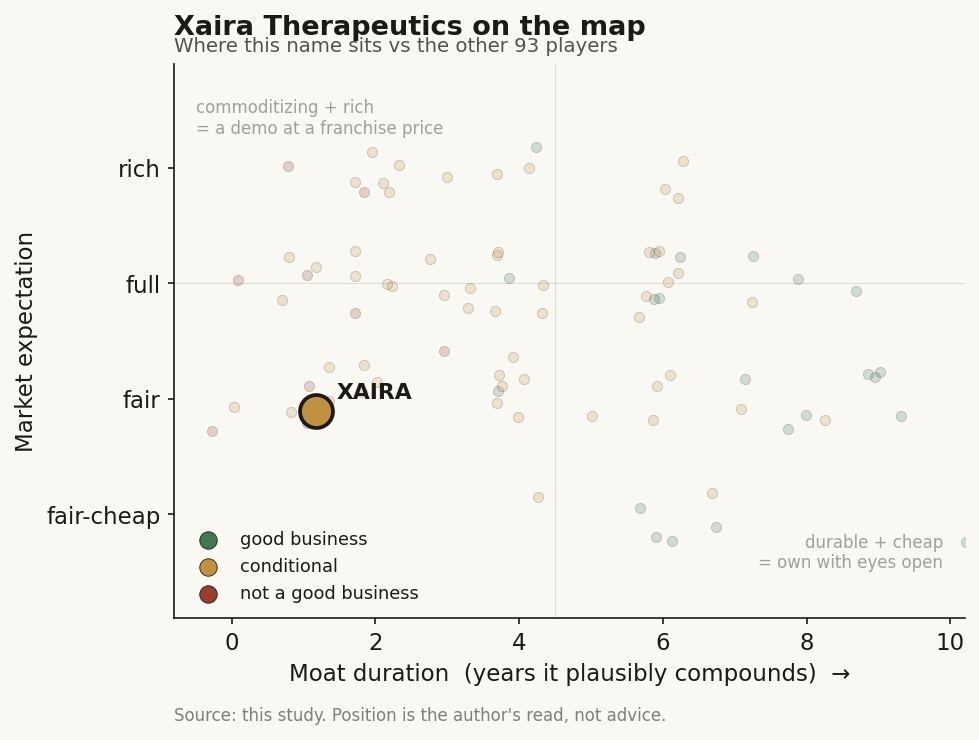

# Xaira Therapeutics (private)

> **The read.** A well-capitalized, frontier-credentialed shot on goal - but a demo/optionality story, not yet a durable value-capturer: its only moat-eligible layer (owned assets vs risk-bearing pharma) is unproven and gated by the ~40% Phase-II wall, while its data flywheel is the refuted discovery form.

**Snapshot**

| | |
|---|---|
| Listing | private |
| Region | US |
| Value-chain layer | L9a-L9d (target-ID -> generation -> selection -> preclinical) |
| Archetype | drug-owner / frontier-lab (Archetype 04, milestone-and-owned-pipeline) |
| Size | ~$3.5-4bn last private valuation [reported] |
| Revenue (latest) | pre-revenue / private |
| Moat verdict | commoditizing (data flywheel refuted; own-pipeline conditional) |
| Expectation | fair (~2.7x valuation/capital) |
| Evidence quality | med |

## What it is
An AI-first drug-discovery company that fuses David Baker's de novo protein-design lineage (RFdiffusion / ProteinMPNN) with its own large-scale perturbation-biology data and a "virtual cell" foundation model, aiming to own a differentiated therapeutic pipeline rather than sell software. Launched April 2024 out of ARCH Venture Partners + Foresite Labs; Bay Area; CEO Marc Tessier-Lavigne (ex-Genentech CSO, ex-Stanford president).

## Business model - how it makes money
Archetype 04 (milestone + owned pipeline), tilted hard toward OWNING assets. The declared strategy is one tightly-coupled loop - protein design + large-scale perturbation biology + foundation models + wet-lab validation + internal drug development - rather than a tool-vendor licensing play. Money, if it comes, is (a) equity value in an owned pipeline that reaches the clinic (first INDs guided ~2026-27 [reported]), and (b) pharma partnerships/biobucks on the platform (a star BD hire, Rachel Lane, was added early 2026 to commercialize the engine) [reported]. **Capital-HUNGRY, deliberately so**: it is building proprietary wet-lab data at scale (X-Atlas/Pisces: 25.6m perturbed single-cell transcriptomes, the largest genome-wide CRISPRi Perturb-seq set reported) and intends to carry its own programs into trials - the expensive path, not the asset-light licensing path.

## Financial summary
Private and pre-revenue; profiled on funding/valuation/backers because no financials exist. Provenance tags on every load-bearing number: [disclosed] company/primary · [reported] press/secondary · [estimate] derived · [unverified].

| Round / metric | Detail | Tag |
|---|---|---|
| Launch (Apr 2024) | >$1.0bn committed at inception - largest initial raise in ARCH's history, one of biotech's largest-ever seed/Series-A launches | [disclosed] / [reported] |
| Total raised to date | ~$1.3bn | [reported] |
| Further round (~Aug 2025) | ~$800m, taking secondary-market-implied valuation to ~$3.5bn (an earlier ~$4bn post-money figure also circulated at launch) | [reported] |
| Valuation | Xaira does not disclose one; treat the $3.5-4bn range as [reported], not [disclosed] | [reported] |
| Capital efficiency | ~2.7x valuation/capital - low by venture standards; the mark is barely above cash in | [reported] |
| Revenue | Pre-revenue; no product sales, no disclosed pharma-deal cash | [disclosed] |

Backers (co-leads ARCH + Foresite Labs): NEA, Sequoia, Lux, Lightspeed, Menlo, Two Sigma Ventures, F-Prime, SV Angel [reported]. Seeded at inception with an Illumina functional-genomics R&D group and Interline Therapeutics' proteomics team [reported].

## Value-chain position and competition
Sits across L9a target-ID (X-Cell virtual-cell perturbation model, 4.9bn params [disclosed]), L9b generation (RFdiffusion/ProteinMPNN de novo binders + antibodies), L9c selection, into L9d preclinical (owned pipeline, antibody-first). What FLOWS out is not data-for-sale (yet) but *designed molecules and an owned pipeline* - value is meant to accrue one layer down in the clinical asset, per the "model is the door, not the moat" structure. It is NOT a picks-and-shovels vendor and NOT (today) an RWE data licensor.

Direct cohort: Isomorphic (Alphabet, the flagship model+pipeline peer), Recursion/Exscientia (the largest-flywheel, worst-clinical-output cautionary tale), Generate Biomedicines and Absci (AI biologics/antibody design), Insilico. On the virtual-cell axis specifically, X-Cell competes with the open academic effort (Chan Zuckerberg Initiative's rBio / virtual-cell push, Arc Institute's State model, the Genentech/CZ single-cell foundation-model lineage) - which is the axis where a self-funded flywheel is most exposed to open clones. Xaira's claimed edge is threefold: the Baker de novo lineage (genuinely frontier protein design, extended in 2025 to full-length de novo antibodies binding user-specified epitopes [reported]), a self-generated causal-perturbation dataset at a scale peers have not published (X-Atlas/Pisces: 25.6m perturbed single-cell transcriptomes vs the ~7-8m of its own prior Orion set [disclosed]), and an unusually deep drug-development bench (Genentech/Roche alumni). Its edge is data-generation + design integration, NOT a defensible model - the model layer is the commoditizing part (open clones caught AF3 in ~1yr at >1000x lower cost, per Ch5), and Xaira itself released a subset of X-Cell and Pisces to the community, which accelerates that same commoditization on the virtual-cell layer.

## Moat
Two Ch5 audits apply and both land against a durable moat AT THIS STAGE:
- **Moat 4 (data flywheel), drug-discovery form - REFUTED, ~0-1yr.** Xaira is named explicitly in the refuted cohort. Its own X-Atlas/Pisces flywheel is the exact mechanism Ch5 shows is empirically broken for *discovery*: marginal data value decays at the frontier, and the biggest flywheel (Recursion) has the worst clinical output. The data would only compound if the data itself were the sold product (data-licensing, Archetype 03) with the buyer bearing efficacy risk - Xaira is not selling the data, it is feeding it into owned programs, so it inherits the refuted version.
- **Moat 3 (own-pipeline vs risk-bearing pharma) - CONDITIONAL, ~2-3yr binary watch.** The only place value can accrue is an owned asset a partner can't cheaply replicate - but that is gated by the ~40% Phase-II efficacy wall unchanged in 30 years, and Xaira has ZERO human data, first IND still ahead.
- **Is the moat real for a private at this stage? No - not yet, and not from the model or the data.** What is real is optionality (frontier design + a deep team + a large war chest buying many shots on goal). More shots, unchanged odds per shot - the opposite of compounding. The moat is unproven until an owned molecule clears Phase-II above the ~40% base, unobservable before ~2028-29.

## Core variables
1. **First owned-program clinical readout / Phase-II PoS.** The master binary. Everything re-rates on whether an owned asset clears the ~40% efficacy wall; zero human data today, first IND ~2026-27.
2. **Cash runway vs value-inflection.** ~$1.3bn raised buys years, but owning a multi-modality pipeline is a "billions and a decade" endeavour by the CEO's own framing - burn rate vs next readout is the pre-revenue survival variable (the biotech rule: watch cash and burn, not margins).
3. **Partnership conversion (the near-term tell).** Does the platform convert into real pharma biobucks/validation deals (post the 2026 BD hire), or stay a cost centre? Upfronts in this cohort run just 1.2-3.0% of headline biobucks (Ch5) - watch committed cash, not the biobuck number.

Second-order (held below the line): X-Cell benchmark leadership vs virtual-cell peers; antibody-first modality pick; further dilution/mark; team retention.

## Bear case / key risks
It is Exscientia/BenevolentAI with a bigger balance sheet and a Nobel name - priced on a DEMO/HEADLINE (X-Cell scale, RFdiffusion pedigree, the $1bn launch), not on any clinical evidence. The data flywheel it is building is the specific mechanism Ch5 refutes for discovery: public/open models caught the frontier in ~1yr, the largest flywheel owner (Recursion) has the worst clinical output, and the flywheel compounds the cheap, already-solved generation step while the ~40% Phase-II wall - where ~90% of failure and ~93% of spend sit - is untouched by AI (zero AI-discovered drugs approved as of 2026). Capital intensity is brutal and binary: a single failed readout can strand a program and close the financing window at once. The $3.5bn+ mark is a venture mark struck years before any human efficacy data, at a thin ~2.7x on capital - the market itself is barely underwriting a premium.

## The expectation read
The ~$3.5-4bn mark implies the market is paying for optionality - a frontier team, a large war chest, and many shots on goal - but at only ~2.7x valuation/capital it is barely underwriting a premium over cash in. That thin multiple is the tell: the belief priced in is not durable value capture but survivorship plus a lottery ticket on the first owned readout, struck years before any human efficacy data exists. Where the belief looks soft is the implicit assumption that the data flywheel compounds - it does not for discovery, so the mark rests on a mechanism Ch5 refutes rather than on evidence.

## Recent developments (2025-2026)
Coverage on the pipeline itself remains thin - the company has stayed quiet on molecular-design programs and disclosed no INDs, lead candidates, or pharma partnerships as of mid-2026. What moved was the platform layer and the bench, not the clinical thesis.

- 2025 [reported]: extended the Baker de novo lineage to antibodies - a Nature study (co-founders Nathaniel Bennett, Joseph Watson) generated full-length antibodies from scratch that bound user-specified epitopes with atomic-level precision. This is a genuine frontier-design result, but it sits at the generation step (L9b) that Ch5 flags as the already-cheap, commoditizing layer - it does not touch the ~40% Phase-II wall.
- 2026-03-17 [disclosed/reported]: launched X-Cell, its first virtual-cell model - 4.9bn parameters (described as the largest causal-perturbation model built to date), trained on X-Atlas/Pisces (25.6m perturbed single-cell transcriptomes across 16 biological contexts, ~3x the scale of its prior Orion set). Architecture is a diffusion language model, a departure from the autoregressive single-cell models that dominated the field; the company reports power-law scaling like LLMs and zero-shot generalization to unseen therapeutic contexts (primary human T cells, iPSC-derived melanocyte progenitors). A subset of the model and dataset was released to the scientific community; the preprint was posted to bioRxiv and was not yet peer-reviewed at release.
- 2026-06-22 [reported]: Chief Medical Officer Paulo Fontoura (15+ yrs at Roche) was named Global Head of R&D at Sanofi, effective 2026-09-01. This is a senior loss from the "deep drug-development bench" that is one of Xaira's three edge claims - a talent-retention data point to watch, not yet a thesis-breaker.
- Funding/valuation [reported]: no confirmed new priced round beyond the ~Aug-2025 ~$800m raise; secondary-market marks still cluster in the ~$3.5-4bn range. The ~2.7x valuation/capital read is unchanged.

Net: the 2025-2026 flow confirms the profile's read rather than revising it - real platform progress (X-Cell scale, de novo antibodies) on the commoditizing model/generation layers, still zero human efficacy data, still no disclosed owned program or partnership, and a notable senior-bench departure. The binary that matters (first owned Phase-II readout vs the ~40% wall) remains unobservable before ~2028-29.

## Verdict
DEMO/OPTIONALITY, not yet a durable value-capturer - a well-capitalized, frontier-credentialed shot on goal whose only moat-eligible layer (owned assets vs risk-bearing pharma) is unproven and gated by the ~40% Phase-II wall, while its data-flywheel is the Ch5-refuted discovery form. At a fair (~2.7x-on-capital) expectation, not a full or rich one. Confidence: HIGH that no durable moat exists at this stage; LOW on the terminal outcome (binary, unobservable before ~2028-29).
