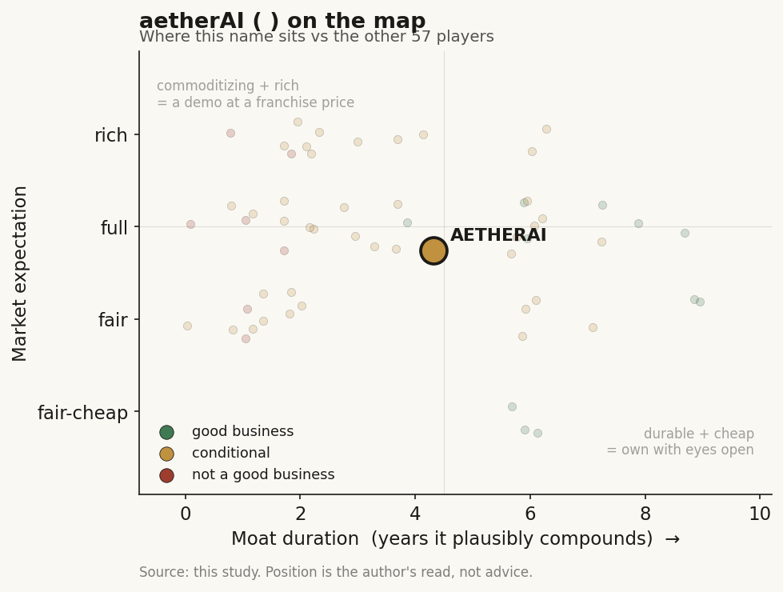

# aetherAI (雲象科技, 7803 TT)

> **The read.** A genuinely differentiated Taiwan digital-pathology pure-play with a thin-but-real workflow moat that routes around the NHI chokepoint — but a loss-making micro-cap whose entire equity case rests on an unproven US/EU export push against global incumbents; conditional-watch, not conviction.

**Snapshot**

| | |
|---|---|
| Listing | 7803 TT / TWSE Taiwan Innovation Board (創新板), listed 2026-05-20 |
| Region | Taiwan |
| Value-chain layer | L2-L4 (imaging platform → module design → digitized-slide processing) |
| Archetype | workflow-software / regulated-SaMD (taxonomy 01/02 hybrid) |
| Size | ~NT$2.0bn market cap [estimate] (sub-US$70m micro-cap) |
| Revenue (latest) | FY25 NT$193m, +91% YoY |
| Moat verdict | conditional — thin-but-real workflow ownership over two false moats and one un-investable data moat |
| Expectation | full |
| Evidence quality | high on business facts, low on live market data |

## What it is
Taiwan's digital-pathology pure-play — 雲象科技 (aetherAI Co., Ltd.), founded 2015 by 葉肇元 (Chao-Yuan Yeh, USC pathology PhD), headquartered Taipei Nangang. It digitizes the pathology slide (scanner + image-management platform) and hangs AI modules on top (bone-marrow smear, colon-polyp, glomerulus) — the "find the cell / find the polyp" selection product on a workflow rail. [disclosed]

## Business model — how it makes money
Software + hardware-integration sale to hospitals: scanner (aetherBot / Techman-Hamamatsu automated slide scanner), aetherSlide image-management platform (the recurring core), and per-module AI (Hema bone-marrow, Endo colon-polyp). Revenue is hospital capex/opex — the hospital pays, not the payer. Critically, there is no standing NHI reimbursement code for pathology AI [unverified — none surfaced in NHI/press search, consistent with Ch6 rule 3: only a per-use 特材 point-value template exists, and no software-service code]. So unlike a US per-test SaMD, aetherAI is NOT reimbursement-funded today; it sells the digital-transformation project directly to the pathology department. That is a strength (it routes around the NHI single-payer chokepoint) and a weakness (no reimbursement tailwind to scale it). Product mix concentration is rising: aetherSlide moved from ~69% to ~93% of revenue FY24→FY25 — concentration is increasing, not diversifying. Gross margin ~52.6% is healthy for the loss stage but good-not-great for a "software" narrative given the hardware-integration mix. [reported]

## Financial summary

| | FY23 | FY24 | FY25 |
|---|---|---|---|
| Revenue | ~NT$102m [disclosed] | — | NT$193m, +91% YoY [reported] |
| Gross margin | — | ~52.6% [reported] | — |
| Net / pre-tax loss | net loss ~NT$74.1m [disclosed] | pre-tax loss ~NT$121m [reported] | — |
| EPS | -1.26 [disclosed] | -1.6 [reported] | — |
| aetherSlide % of revenue | — | ~69% [reported] | ~93% [reported] |

Capital and listing: paid-in capital ~NT$888.6m (some sources cite ~NT$944m post pre-IPO raise); ~NT$128m raised at IPO; underwriting price NT$23.12; prior 興櫃 (Emerging) since Nov 2024. Share price ~NT$21.8-23.5 range through Jun 2026 (traded as high as ~NT$34 in Apr 2026 pre-listing). Market cap ~NT$2.0bn [estimate] (~89-94m shares × ~NT$22) — indicative, not a clean float-adjusted figure. Overseas ~30-40% of revenue from outside Taiwan (Japan, Germany, then US push). FY24 loss partly reflects employee-option expense. Management guides breakeven "2025-2026" — a guide that has already slipped once (originally 2024/25). [disclosed/reported]

Hospital centres (role, not financials): NTUH 台大, 北榮 VGHTPE, 國泰, 長庚, 中山附醫, 三總 domestically; Cedars-Sinai, UPMC, Tübingen, NCC East Japan internationally — these are co-development / reference customers, not consolidated subsidiaries. The NTUH bone-marrow collaboration (~600k cells, 3yr) is the flagship. [reported]

## Value-chain position and competition
In the Ch2/Ch3 TW map aetherAI occupies L2 (instrument/imaging platform — the scanner + slide-digitization rail) → L3 (assay/module design — its own AI algorithms) → L4 (the digitized-slide processing layer feeding read-out). What flows: physical slide → digital whole-slide image (WSI) → AI-flagged region → pathologist read-out inside aetherSlide. It sits beneath the pathologist's decision (L6 in the US genomics numbering) and above the tissue — the "data-liquidity + first-pass triage" layer. It is the imaging-analog occupant, flagged as such per Ch2 (the imaging chain does not map cleanly onto the L1-L9 genomics ladder).

Competition — TW names: distinct from the other TW SaMD pure-plays — Ever Fortune (6841, screening/imaging), Acer Medical (6857, retinopathy triage), Amcad (4188, ultrasound CAD) all sit in radiology/screening; aetherAI owns pathology, a different slide-based workflow with far fewer domestic competitors. EBM (8409) is the PACS/imaging-infra incumbent that could hang third-party pathology modules — a potential channel rival, not a head-to-head. Domestic pathology-AI share claimed >50%. [reported]

Competition — US/global players selling into TW: the real competition is global digital-pathology — Roche (Ventana/NAVIFY), Philips (IntelliSite, the first FDA-cleared WSI system), Paige.AI, Leica/Aperio. These have deeper scanners, larger validation sets, and (Paige) FDA-cleared cancer-detection AI. aetherAI's edge into TW/Asia is localization, price, hospital relationships, and Asian-population training data (nasopharyngeal, bone-marrow). Its FDA 510(k) (K233126) and 2026 EU-IVDR on aetherSlide put it in the small club with US+EU dual marks — genuinely rare for a sub-NT$1bn player, and the clearest live example of a TW name eating the EU-IVDR compliance cost (Ch6 EU section names it explicitly).

## Moat
Applying the Ch5 audit honestly: the bare clearances (FDA 510(k) + IVDR) are REFUTED as a moat — table stakes, ~0yr on grant (Ch5 Moat 1); they gate the shelf, not the revenue, and the global incumbents hold more. The one plausibly-durable form is workflow OWNERSHIP (Ch5 Moat 2): once a pathology department digitizes its whole read-out onto aetherSlide, switching means re-scanning, re-training, re-validating — a real ~3-5yr installed-base friction, and pathology digitization is genuinely sticky and early. The hospital-data access is real but NOT investable (Ch5 Moat 3/4 verdict for TW): the training data (NTUH bone-marrow, Cathay colon) is co-owned with the hospitals and ultimately governed by the state NHI-data regime (opt-out + NT$10m fines since 2025-12-02) — aetherAI cannot build a proprietary NHI-scale data annuity; the exclusivity is the hospital's and the state's, not the equity's. Verdict: a thin-but-real workflow moat (installed-base + Asian-pathology reference sites), sitting on top of two false moats (clearances) and one un-investable one (state/hospital data). Do not underwrite the data story. Duration on the durable piece: ~3-5yr installed-base friction.

## Core variables
1. **CORE — hospital contract wins / installed-base conversion.** The whole model is department-by-department pathology digitization; the read is order visibility → aetherSlide seats → recurring platform revenue. Orders convert to revenue on a 6-9mo lag, so the tell is bookings, not the trailing print.
2. **CORE — export ability beyond Taiwan.** TW pathology TAM is tiny (<NT$600m combined for the listed pure-plays); the equity case requires the US/EU/Japan push to work. The FDA 510(k) + IVDR + planned US subsidiary are the gating milestones. Overseas already ~30-40% — the variable is whether that share and its absolute size keep compounding.
3. **Secondary — path to breakeven.** Guidance is 2025-26 breakeven and it has already slipped once. A micro-cap creation-board name that keeps missing breakeven re-rates hard; watch gross-margin × revenue scaling vs the opex base.

NOT a core variable here: an NHI reimbursement decision — because aetherAI is not reimbursement-funded (hospital-paid). This is the key inversion vs the US per-test cohort and vs a TW screening-SaMD name: the NHI chokepoint that gates most of the TW map largely does not gate aetherAI's current revenue. That is a genuine differentiator worth stating plainly.

## Bear case / key risks
- Loss-making micro-cap on a creation board with thin float, thin coverage, and a breakeven guide that has already slipped — classic pre-scale valuation risk.
- Revenue concentration rising into one product (aetherSlide ~93%) — the opposite of de-risking; a single platform-cycle or a large-hospital churn event swings the print.
- The US/EU expansion — the entire equity thesis — pits a sub-US$70m company against Roche, Philips, and Paige on their home turf, where clearance is table stakes and distribution/scanner-installed-base is the incumbents'. FDA clearance ≠ US revenue (Ch6 US rule: entry is solved, payment/adoption is the wall).
- Data moat is state/hospital-captured, not company-captured — no Tempus-style RWE annuity is available to this equity.
- Hardware-integration mix dilutes the software-multiple story; gross margin ~53% is good-not-great for a "software" narrative.

## The expectation read
The tape — a ~NT$2.0bn cap on FY25 revenue of NT$193m — puts the name at roughly 10x trailing sales for a still loss-making micro-cap, which prices in continued high growth plus the export story working. That belief looks soft where it matters most: the multiple leans on the US/EU push against Roche, Philips and Paige, where FDA clearance is table stakes and adoption/distribution is the wall, and on a breakeven guide (2025-26) that has already slipped once. The market is paying for compounding overseas revenue and platform stickiness it cannot yet verify from one listed quarter with no disclosed segment/US revenue split. Expectation is full, not cheap.

## Verdict
Conditional-watch, not investable-conviction — a genuinely differentiated TW pathology-workflow pure-play whose thin-but-real installed-base moat routes around the NHI chokepoint, but whose entire equity case rests on an unproven US/EU export push against global incumbents, while it remains a loss-making micro-cap with a slipped breakeven guide. A good business only conditionally, at a full expectation. Data-confidence: MODERATE on business facts (company/press disclosed, multiple corroborating sources), LOW on live market data and forward economics (one listed quarter, micro-cap illiquidity, no analyst coverage, no disclosed segment/US revenue split, market cap [estimate] only) — flagged honestly; do not size a position on the numbers here without a primary MOPS filing pull.
