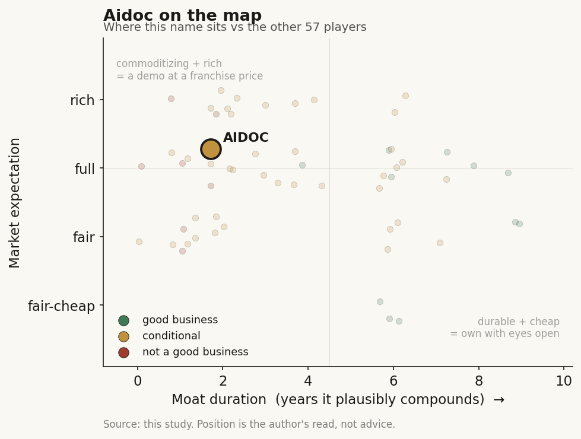

# Aidoc (private)

> **The read.** A well-distributed radiology-AI app with real breadth, but the entire thesis rests on whether aiOS becomes owned workflow orchestration rather than a commoditizing model on rented rails — conditional value-capturer, grade C+/B-, confidence medium.

**Snapshot**

| | |
|---|---|
| Listing | private (US / Israel, founded 2016) |
| Region | US |
| Value-chain layer | Imaging L5a/L6 (interpretive triage + clinical-workflow orchestration) |
| Archetype | SaMD / workflow — SaaS/subscription at the app level, migrating toward infrastructure toll (the aiOS operating layer) |
| Size | total funding >$500m (~$520m cited); valuation not disclosed |
| Revenue (latest) | ~$60m (2025) |
| Moat verdict | conditional |
| Expectation | full |
| Evidence quality | med |

## What it is
A radiology-AI company: software that flags time-critical findings on CT/X-ray (PE, stroke, ICH, c-spine, etc.) and routes them to the front of the worklist to cut time-to-treatment. It has since repositioned as aiOS, an "operating system" that runs its own and third-party clinical-AI models across a hospital, powered by its CARE foundation model.

## Business model — how it makes money
Enterprise SaaS sold to health systems (per-site / per-enterprise subscription; no direct reimbursement dollar — the software is workflow-efficiency, not a billable code). The buyer (the health system) is the beneficiary, and app-level economics are capital-light with no CPT gate. The strategic move is up-stack to aiOS as an infra toll — hosting Aidoc's CARE model and third-party vendors' models on one governance/monitoring layer, with cloud compute underneath. Capital profile is mixed: app economics are light, but the CARE foundation-model plus regulatory plus enterprise-integration build is hungry (the >$150m NVIDIA/AWS spend and the revolving credit line say so). Scale metrics (company): ~2,000 hospitals, ~200 US health systems, >110m cases analyzed, ~60-70m patients/yr, 18 FDA clearances.

## Financial summary
No public financials; the capital and position stand in for an income statement. Real numbers only, tagged.

| Round | Amount | Date | Notes |
|---|---|---|---|
| Series E | $150m | 29 Apr 2026 | Led by Growth Equity at a sell-side Alternatives arm; participation from General Catalyst, SoftBank Vision Fund 2, NVentures (NVIDIA) |
| Prior round | $150m | Jul 2025 | Led by General Catalyst + Square Peg, with NVentures and four health-system strategics (Hartford HealthCare, Mercy, Sutter Health, WellSpan); included a $40m revolving credit line; brought cumulative funding to $370m |
| Series D | $110m | 2022 | |
| Growth | $30m | 2023 | |
| Series C | $66m | 2021 | |
| Series B | $27m | 2019 | |
| Additional | $47m | 2020 | |

- Total funding >$500m ("~$520m" cited).
- Valuation not disclosed on either the 2025 or 2026 round; the company declined to state a mark or whether insiders sold — treat as an unverified equity-moat input.
- 2025 revenue ~$60m. IPO under consideration post-Series E (the sell-side lead is the tell).
- A separate AWS multi-year agreement funds the CARE model build-out (AWS "significant investment"; Aidoc says >$150m to be invested across the NVIDIA + AWS initiatives to bring CARE to market).

## Value-chain position and competition
Sits at L5a interpretive triage (the model that reads the scan and raises the flag) and L6 clinical workflow (routing, notification, worklist prioritization inside the PACS/EHR loop). What flows in: DICOM images off the modality (L1/L2) plus the PACS feed; what flows out: a prioritized worklist, a mobile/desktop alert to the on-call clinician, and increasingly a draft report (the announced automated draft-reporting capability pushes it deeper into the radiologist's output). Named-patient liability stays with the reading physician (assistive tier) — Aidoc carries little of the med-mal weight that would justify a defensive moat on its own. The aiOS move is an attempt to become the L6 orchestration rail other vendors rent, i.e. to stop being a single L5a app and become the layer above them.

Crowded L5a triage: Viz.ai (the direct rival, stroke/PE care-coordination, similar system-selling motion), RapidAI, Cleerly (adjacent cardiac CT), plus the OEM stacks that own the modality and the PACS — GE HealthCare (~120 AI clearances), Siemens (~89), Philips (~50), Canon (~45) — any of which can bundle triage into the scanner/PACS it already sells. Aidoc's edge is breadth + installed base + the platform pivot: most FDA clearances rolled into one multi-condition triage workflow (the Jan-2026 "first comprehensive foundation-model triage" clearance, 11 new + 3 prior indications), the widest deployment footprint, and aiOS as a multi-vendor governance layer that raises switching cost beyond any single algorithm. The hyperscaler tie-ins (NVIDIA compute + capital, AWS compute + capital) are real distribution/scale access most single-point rivals lack.

## Moat
Two Ch5 audits bite here, both against Aidoc's loudest claims:

- **Moat 1 (Regulatory clearance): refuted, ~0 yr on grant.** 18 FDA clearances is an accumulation story, not a barrier — 1,451 AI devices are cleared, ~295/yr added, ~97% predicate 510(k), and radiology is ~76% of all clearances. Aidoc is named explicitly in the refuted dx/imaging-SaMD cohort. The clearance gates the shelf, not the revenue — and Aidoc holds no permanent Category-I CPT code (only 3 of 1,451 devices do). Clearance count is table stakes.
- **Moat 2 (Workflow embedding / distribution): conditional.** As a rented L6 slot it commoditizes (~1-3 yr); it survives only where the vendor owns a scarce input the platform above cannot cheaply replicate. Aidoc's honest claim to that survivor bucket is aiOS as owned orchestration — if it genuinely becomes the multi-vendor governance/monitoring rail (the "own the workflow, not rent a slot" test), that is a real switching-cost moat (~5-7 yr). If aiOS stays a thin layer over a commoditizing foundation model (Ch5 Moat-4: model IP is a ~12-month edge; open clones caught frontier models in ~1 yr) sitting on rented AWS compute and rented PACS/EHR access, it is a refuted rented slot dressed as a platform.

Is the moat real for a private at this stage? Not yet demonstrated. The load-bearing proof — audited net-revenue-retention at price through a renewal cycle as OEMs/PACS bundle triage — is unobservable while private. The venture round (sell-side lead, IPO talk) prices the platform outcome; the evidence to date supports footprint and breadth, not durable pricing power. Verdict applied: conditional, and the condition is whether aiOS is owned orchestration (survives) or a model-plus-rented-rails app (refuted).

## Core variables
- **CORE-1 — aiOS: owned rail or rented slot?** Does third-party-vendor adoption of aiOS actually compound (vendors + models hosted, governance stickiness) into switching cost, or is it a thin layer over rented AWS compute and OEM-controlled PACS access? This is the entire moat.
- **CORE-2 — reimbursement / monetization path.** Triage earns no CPT dollar today. Can Aidoc convert footprint into pricing power (per-site ASP, up-stack to draft-reporting that touches radiologist productivity), or does OEM/PACS bundling cap price? NRR-at-price is the number the S-1 would reveal.
- **CORE-3 — CARE model durability vs commoditization.** Is the foundation model a durable edge or a ~12-month lead that open/hyperscaler models erase, leaving the value in orchestration + data, not the model?
- *(Second-order, held below the line: FDA clearance count (table stakes, not a variable); hospital-count growth; NVIDIA/AWS capital dependence; IPO timing/valuation mark.)*

## Bear case / key risks
A feature sandwiched by two owners — the commoditizing model below (CARE's edge decays as hyperscaler/open clinical models catch up) and the modality+PACS OEMs beside/above (GE/Siemens/Philips/Canon, which own the scanner and the worklist and can bundle triage into hardware the hospital already bought). Triage has no reimbursement anchor — nothing gates a switch except integration friction, and the OEMs control that surface the way Epic controls the scribe surface. aiOS is the escape hatch, but as of now it is unproven as an owned rail: ~$60m revenue on >$500m raised implies heavy burn, capital dependence on NVIDIA/AWS (whose compute and models it also rents), and a valuation the company won't disclose. If aiOS stays thin, Aidoc is a well-distributed L5a app selling a commoditizing model on rented infrastructure — footprint without durable pricing power — and the IPO would be marking breadth, not a moat.

## The expectation read
The undisclosed mark plus a sell-side lead and IPO talk say the round is pricing the platform outcome — aiOS as owned orchestration — not the L5a app economics visible today. At ~$60m revenue on >$500m raised, the implied multiple is a bet on the up-stack, and the belief looks soft precisely where the proof is unobservable while private: net-revenue-retention at price through a renewal cycle as OEMs and PACS bundle triage. The market is capitalizing footprint and breadth as if they were durable pricing power; that is the belief to watch break in any S-1.

## Verdict
Conditional value-capturer, leaning demo-until-proven — grade C+/B-, confidence medium. Real distribution and genuine breadth, but the moat lives entirely in whether aiOS becomes owned workflow orchestration rather than a commoditizing model on rented rails with no reimbursement anchor; clearance count is table stakes and the undisclosed mark is a caution flag — durable only if the platform pivot is proven at price (watch NRR-at-price in any S-1). Good business at a full expectation, conditional on the aiOS pivot.
