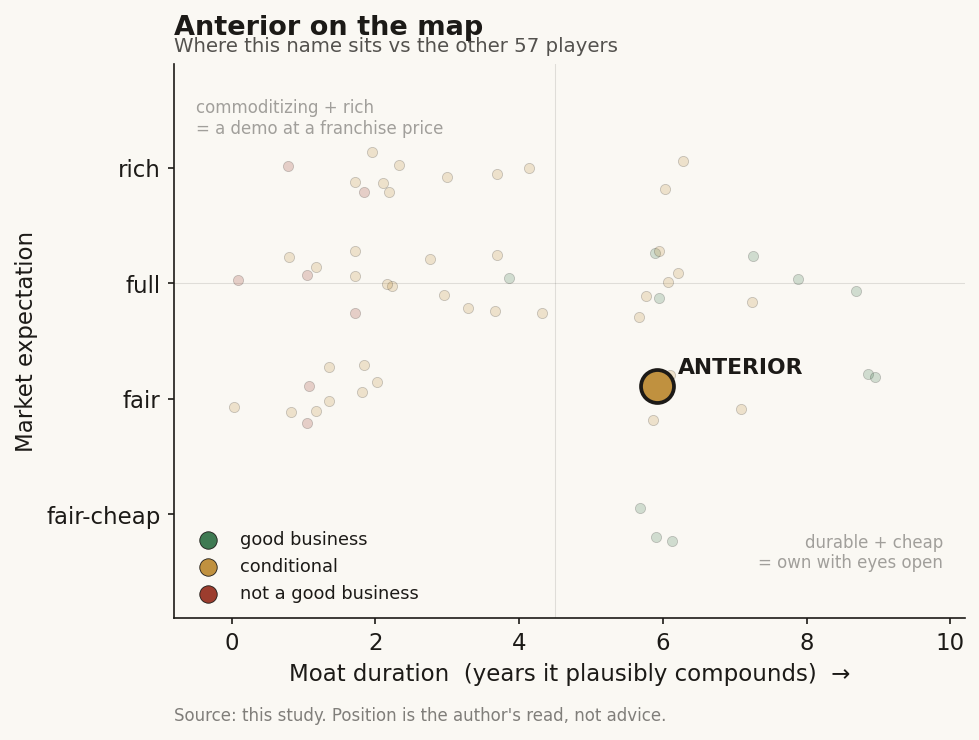

# Anterior (private)

> **The read.** A durable value-capturer, EMERGING — right side of the workflow-ownership moat and buyer-is-beneficiary economics, but retention-at-price is unproven for a private at this stage: more than a demo, not yet a proven compounder.

**Snapshot**

| | |
|---|---|
| Listing | private |
| Region | US |
| Value-chain layer | L8 — utilization-management / prior-auth node |
| Archetype | workflow (savings-share / risk-share, shading into task-based fee) |
| Size | Series B $40M closed Feb 2026, total funding to $64M; B post-money not disclosed |
| Revenue (latest) | private — value-share plus per-transaction fees, figure not disclosed |
| Moat verdict | conditional — durable side of workflow-ownership (Ch5 Moat-2), EMERGING |
| Expectation | fair (B post-money undisclosed; A at reported ~$95M post-money) |
| Evidence quality | med |

## What it is
Clinician-founded AI platform that automates the payer side of prior authorization and adjacent utilization-management work — structuring the medical record, turning coverage criteria into executable logic, and applying clinical reasoning to draft a determination that a human nurse verifies. Sits inside the health plan, not the provider. Founded 2022 as Co:Helm, rebranded Anterior [reported]; CEO/co-founder Dr. Abdel Mahmoud (physician; prior product background), COO Tahseen Omar, ~half the team clinicians (doctors/nurses) [reported]; HIPAA / HITRUST certified [reported].

## Business model — how it makes money
Archetype 05 — savings-share / risk-share, shading into task-based fee [Ch4]. Charges the health plan against value created, priced by use case, plus per-transaction fees (e.g. per auto-approved prior auth) [reported]. The buyer (the payer) IS the beneficiary — no reimbursement code sits between the work and the dollar. That is the durable side of the archetype table (buyer = beneficiary, no CPT gate) — GM band ~60-75%, capital MEDIUM (a services/clinical-review tail, not a wet lab) [Ch4 estimate].

Capital-light vs hungry: light-to-medium. No reagents, no CLIA lab, no inventory. The real incremental cost is (i) per-case LLM inference and (ii) the embedded-engineer + nurse-review layer needed to hit auditability — so realized margin is squeezed below a pure zero-marginal-cost SaaS ideal, same structural caveat as the ambient-scribe cohort but with a stronger buyer.

## Financial summary
Private US company. No public financials — profiled on funding / valuation / backers / product mechanics, not an income statement. Provenance tags on every load-bearing number: **[disclosed]** company/primary · **[reported]** press/secondary · **[estimate]** derived · **[unverified]**.

| Round | Amount | Date | Valuation | Lead / investors |
|---|---|---|---|---|
| Series B | $40M (total funding to $64M) [disclosed / reported] | Feb 2026 | post-money not disclosed [unverified] | NEA and Sequoia Capital (both continued) + new FPV Ventures and Kinnevik [disclosed] |
| Series A | $20M [reported] | June 2024 | reported ~$95M post-money [reported] | led by NEA (Sequoia, Neo existing; angels incl. Mustafa Suleyman) [reported] |

**Traction stated by the company** [disclosed — company/press, treat marketing metrics as unaudited]: organizations covering ~50M lives; named customers Geisinger Health Plan, MedWatch, WNS-HealthHelp; "99.24% clinical accuracy" independently validated by KLAS; one customer cut clinical-review cycles ~75%; ~5-day average deployment.

## Value-chain position and competition
L8 — the utilization-management / prior-auth node, sitting against the PAYER (a party the EHR platform does not own). What flows in: the provider's clinical documentation + the plan's own coverage criteria. What flows out: a structured, auditable coverage determination (approve / route to nurse) and the downstream administrative-cost saving. Anterior re-plumbs the coverage-decision step of the claims-to-cash rail — this is workflow OWNERSHIP, not a rented interface slot.

Peers: Cohere Health (the closest direct UM/prior-auth analogue, both named on the durable side of Ch5's Moat-2), point solutions for specific plan workflows, and the RCM/payment-integrity adjacency (Waystar listed). CEO frames the frontier labs (sell-side model suppliers) as "co-petitive" suppliers, not rivals [reported] — correct: the model is an input it rents, not its moat. Edge: the "last mile" — accuracy, safety, EHR/plan integration, and audit trail — plus a clinician-heavy team and an installed relationship with named plans covering ~50M lives. The human-nurse-in-the-loop design is both a safety story and the thing that lets a regulated payer actually deploy an LLM decision.

## Moat
Applies: Ch5 Moat-2 (workflow embedding / distribution), CONDITIONAL — and Anterior is placed on the DURABLE side. The surviving mechanism across all four Ch5 audits is *workflow ownership of a scarce input the platform cannot cheaply replicate.* Anterior passes Ch5 "Test 1 — the reimbursement dollar": it re-plumbs the claims-to-cash / coverage rail and sits against the payer, whom Epic does not own. Switching cost = the cost of re-wiring the plan's money-flow and re-clearing payer adjudication logic. Durable band for owned-workflow: **~5-7+ years** [Ch5].

Real vs commoditizing: the LLM underneath commoditizes (~1yr); the defensible layer is the payer relationship + the criteria-to-executable-logic + audit plumbing built INTO a regulated plan. Is the moat real for a private at this stage? Partly — call it EMERGING, not proven. The archetype and the position are on the durable side, which is more than most healthcare-AI names can say. But the Ch5 falsification hinge is retention-at-price through a renewal cycle, and for a private that number is unobservable. What is proven today is a good position; what is unproven is whether the switching cost holds when a plan re-bids or a payment-integrity incumbent bundles a "good-enough" UM module. Position: real. Duration: not yet demonstrated.

## Core variables
1. **Auto-approval rate x accuracy at audit — the unit economics of the whole thing.** The claim is ~90% of the administrative work automated at "99.24%" accuracy [reported]. If real auto-approval holds high with a defensible audit trail, the per-case economics and the value-share pricing both work; if accuracy forces more cases back to nurse review, the margin and the ROI pitch both erode.
2. **Net revenue retention / renewal-at-price with the named plans.** The Ch5 durable-workflow test. A handful of marquee plans (~50M lives) is a strong land; the moat is proven only if those contracts renew and expand at price, not just log new pilots.
3. **Regulatory / policy tailwind on prior-auth turnaround.** UM sits directly in the path of payer-side prior-auth reform (mandated faster decisions, electronic PA); this is the exogenous demand driver that can accelerate or reprice the category.

*(Second-order, held below the line: expansion into payment integrity / risk adjustment / claims adjudication; inference-COGS trajectory; concentration in a few large plan logos; the private-mark risk on the next round.)*

## Bear case / key risks
It is a well-positioned FEATURE inside the payer stack, not yet a proven durable company. Three legs: (1) **Commoditization from below** — the reasoning is a rented frontier-LLM capability; the only durable layer is the payer plumbing + audit, and a payment-integrity incumbent (or a plan's existing UM vendor) can bundle a "good-enough" auto-adjudication module and compress Anterior to a point-tool. (2) **Concentration + private-mark risk** — the traction is a small set of large plan logos; lose or fail to expand one and the growth story and the (undisclosed) mark both wobble; value-share pricing means revenue is hostage to each plan's realized savings. (3) **The falsification is unobservable** — as a private, there is no audited NRR-at-price, so the "durable workflow" claim rests on position and marketing metrics, not proven retention; the KLAS-validated 99.24% and the ~50M lives are real signals but not a moat until they renew at price.

## The expectation read
The Series A carried a reported ~$95M post-money [reported]; the Series B ($40M, total funding to $64M, Feb 2026) closed with the post-money undisclosed [unverified]. What the round implies the market believes: that the durable Archetype-05 buyer-is-beneficiary economics and the workflow-ownership position (~50M lives, KLAS-validated accuracy) are real and worth continued backing from returning leads NEA and Sequoia plus new entrants FPV Ventures and Kinnevik. Where that belief looks soft: the whole thesis rests on retention-at-price through a renewal cycle, which is unobservable for a private — so the mark prices a good position, not proven durability.

## Verdict
Durable value-capturer, EMERGING — right side of the workflow-ownership moat (Ch5 Moat-2, ~5-7yr band) and the durable Archetype-05 buyer-is-beneficiary economics, but retention-at-price is unproven for a private at this stage; more than a demo, not yet a proven compounder. Confidence: medium (position CONFIRMED, duration UNVERIFIED — valuation on the B round undisclosed).
