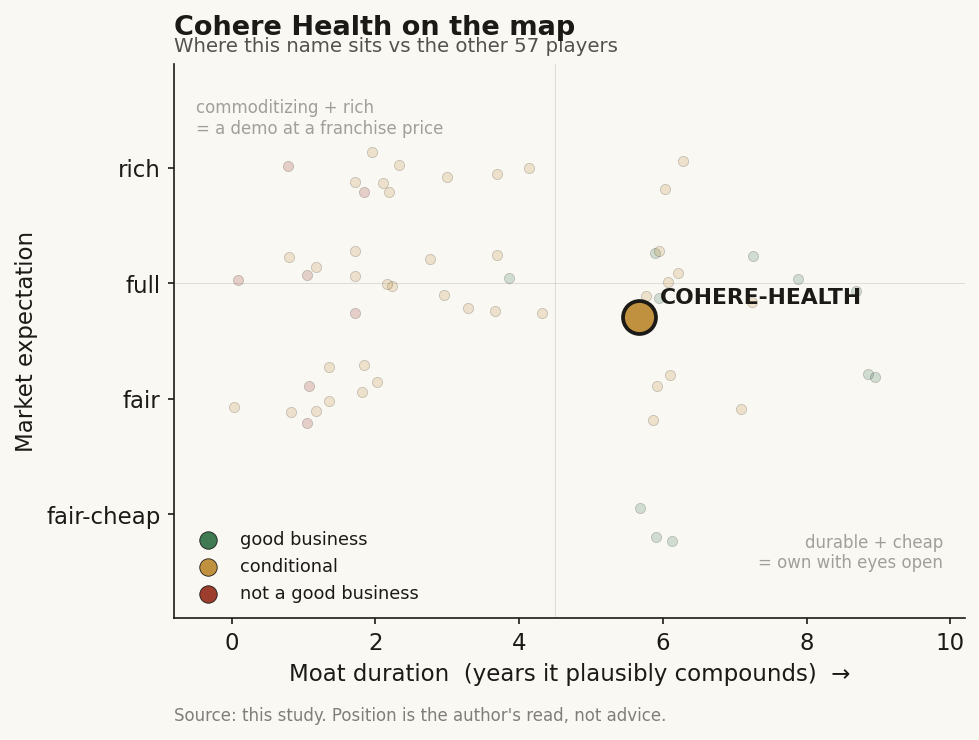

# Cohere Health (private)

> **The read.** A real L8 utilization-management rail on the right side of the moat map, but at private stage its pricing power is asserted through ARR growth, not proven through NRR-at-price — grade B / B-, conditional durable value-capturer.

**Snapshot**

| | |
|---|---|
| Listing | private |
| Region | US |
| Value-chain layer | L8 — utilization-management / claims-to-cash rail |
| Archetype | AI-services on a savings-share + SaaS base |
| Size | undisclosed (a circulating "$5.5bn" mark is unverified / likely contaminated) |
| Revenue (latest) | private; >60% YoY committed-ARR growth, stated path to ~$500m run-rate by end-2026 |
| Moat verdict | conditional (durable side) |
| Expectation | full |
| Evidence quality | med |

## What it is
Prior-authorization and utilization-management AI sold to health plans (payers), not providers — it sits on the insurer's side of the approval transaction, auto-adjudicating care requests against evidence-based clinical pathways and, increasingly, auditing claims for payment integrity. Founded 2019 (Boston; now Portsmouth, NH). Not to be confused with Cohere Inc., the enterprise-LLM lab.

## Business model — how it makes money
Archetype 05 (savings-share / risk-share) fused with Archetype 02 (SaaS / PMPM) — the L8 pattern. Revenue comes from three streams: (i) per-member / per-transaction platform fees for running a plan's UM function (Cohere Unify / Next / Connect); (ii) savings-share on medical-expense reduction — Cohere is paid from cost avoided, and results count toward medical-loss ratios, aligning it with the payer as beneficiary; and (iii) payment-integrity / claims-audit via the ZignaAI acquisition (Sept 2025).

Growth (company-sourced): >60% YoY committed-ARR growth; a stated path to a ~$500m revenue run-rate by end-2026; ambition to manage 50m+ lives. Capital character is mostly capital-light — no wet lab, no reimbursement gate — but with a real services tail: human clinical reviewers and payer-specific integration / change-management are a cost that scales with each new plan, so it is lighter than a lab and heavier than pure SaaS.

## Financial summary
Private company — funding table, real disclosed numbers only.

| Round | Date | Amount | Lead | Notes |
|---|---|---|---|---|
| Series A | 2020 | $10m+ | — | [reported] |
| Series B | Apr 2021 | $36m | Polaris | [reported] |
| Equity | Feb 2024 | $50m | Deerfield | [disclosed] |
| Series C | May 2025 | $90m | Temasek | [disclosed]; return backers Deerfield Management, Define Ventures, Flare Capital, Longitude Capital, Polaris Partners |
| Total raised | — | ~$200m | across three rounds | [reported] |

Valuation is undisclosed. A reported "$5.5bn" circulates via data aggregators (PitchBook / DeepNewz-style tertiary feeds) and should be treated as a red flag, not a fact. A $5.5bn mark on only ~$200m raised implies a ~28x cumulative-cash-to-value ratio, far outside the venture norm; it does not appear in the primary Series C release, which discloses no post-money, and it collides with the near-identically-named Cohere Inc. (the LLM lab, $6.8bn Aug 2025) — a likely cross-contamination. The honest read: a $90m round from crossover names like Temasek typically prices a healthcare-services company at low-single-digit $bn at most, and the "$5.5bn" should not be used as a load-bearing input.

## Value-chain position and competition
L8 is the utilization-management / claims-to-cash rail — it re-plumbs the money-flow decision between provider and payer. Clinical documentation flows in; an approve / deny / pend decision plus a paid / audited claim flows out. Reported throughput ~12m PA requests/yr, ~13m+ covered members, ~560,000–660,000 providers, and ~47m payer-provider interactions/yr. Named plans: Humana (musculoskeletal, multi-state), Geisinger, regional Blues.

It is a crowded L8. Rivals: Availity (largest clearinghouse, Anthem channel), Rhyme / PriorAuthNow (~4m PAs/yr, provider-network side), Myndshft (600+ payer rules, med + pharmacy), CoverMyMeds, Anterior, plus in-house payer builds and the legacy UM outsourcers (Cohere's real displacement target). Cohere's edge: it runs on the payer's side of the transaction with an evidence-pathway / clinical-intelligence layer, several large payers run it as their UM engine, and it has the FHIR-API maturity (Cohere Connect) to sell CMS-0057-F 2027-mandate compliance — a regulatory forcing function every US plan must meet by 1 Jan 2027. Critically, it sits against the payer — a counterparty the EHR platform (Epic) does not own — which is the whole moat argument. That is a distribution + timing edge, not a technology monopoly.

## Moat
Applies: Moat 2 (workflow embedding / distribution), conditional — and Cohere is placed on the durable side. Ch5's single surviving moat type is workflow ownership of a scarce input the platform cannot cheaply replicate; Cohere's scarce input is the payer relationship and the claims-to-cash / UM rail, which Epic does not own and cannot cheaply clone — the switching cost is re-wiring money flow and re-clearing payer adjudication. That is genuinely more durable than the rented-EHR-slot scribe layer (~1–3yr), and Ch5 names Cohere explicitly among the owned-workflow survivors (~5–7yr).

Durability here is conditional on two things the private status hides: (a) whether the savings-share take-rate holds as the automation commoditizes — Ch5 / Ch4 warn that savings-share quietly reverts to per-transaction SaaS as take-rates on commodity automation compress; (b) whether payers, once the 2027 API plumbing is built, in-source the function. The mechanism is the right one (owns the payer rail), but at this stage it is asserted on private ARR growth, not proven by audited NRR-at-price through a renewal cycle. The rail is real; its pricing power is unverified.

## Core variables
1. **Savings-share take-rate durability / NRR-at-price** — does Cohere keep its share of avoided cost as auto-approval (reported "up to 90%") commoditizes, or does it revert to thin per-transaction SaaS? The single number that decides whether it is a value-capturer or a utility.
2. **Payer in-sourcing risk post-2027** — CMS-0057-F forces every plan to build FHIR PA APIs. The mandate is Cohere's near-term tailwind and its medium-term threat: once the plumbing is standard, the largest payers (with in-house AI) can replicate the UM engine and drop the vendor.
3. **The real valuation** — the load-bearing unknown. The "$5.5bn" is unverified / likely-contaminated; the actual price paid by Temasek gates any return math.

Held below the line (second-order noise): ZignaAI payment-integrity cross-sell execution; regulatory / PR risk on AI-driven denials (the sector's reputational tail); client concentration on Humana.

## Bear case / key risks
It is a UM-outsourcing services business wearing an AI-platform multiple. The three-way payer / provider / patient split (the Babylon lesson) is a hazard: the buyer (payer) wants denials that reduce cost; regulatory and political pressure on AI-driven prior-auth denials is rising, and a denial-algorithm controversy is a live headline risk that can reprice trust overnight. The savings-share model compresses as automation commoditizes (archetype-05 bear: take-rates on commodity automation revert to per-transaction SaaS). The 2027 CMS API mandate that Cohere sells today simultaneously hands large payers the standard plumbing to in-source the function. And the headline valuation is unverified and implausible on the cash raised — anyone underwriting a return off "$5.5bn" is underwriting a number that does not appear in a primary source.

## The expectation read
The circulating "$5.5bn" mark, if anyone took it as real, would price Cohere as a proven AI platform — a ~28x cumulative-cash-to-value ratio the ~$200m raised cannot support and no primary source confirms. The defensible read is that a $90m Temasek-led round prices a fast-growing healthcare-services company at low-single-digit $bn at most, which is a full expectation for a business whose pricing power is still asserted (ARR growth) rather than proven (NRR-at-price through a renewal cycle). What looks soft: the market belief embedded in the headline number assumes savings-share take-rates hold through automation commoditization and that payers do not in-source post-2027 — neither is yet demonstrated.

## Verdict
Conditional durable value-capturer, grade B / B-, moderate confidence — a real L8 rail on the right side of the moat map, but at private stage the pricing power is asserted (ARR growth) not proven (NRR-at-price), and it is exposed to savings-share compression plus post-2027 payer in-sourcing; the circulating "$5.5bn" valuation is a red flag, not a fact. Good business at a full expectation.
