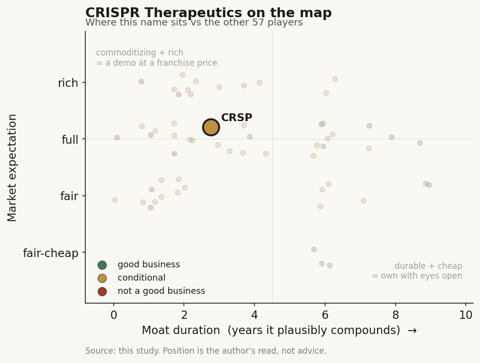

# CRISPR Therapeutics (CRSP)

> **The read.** Structurally the strongest survivor of a hard owned-pipeline gene-editing cohort — an approved product, ~$2.0bn cash and a correctly liver/blood-concentrated pipeline — but priced (~$2.7bn EV) as if in-vivo Phase-II success and a >$1bn Casgevy peak are more than half-underwritten, which the readouts have not yet earned: a good balance sheet wearing an option-book multiple at a demanding, not fair, expectation.

**Snapshot**

| | |
|---|---|
| Listing | CRSP / Nasdaq (US-listed, Zug-domiciled) |
| Region | US |
| Value-chain layer | L9a / L9c–L9e — target selection through owned clinical development on the editing modality |
| Archetype | drug-owner (milestone + royalty / owned-pipeline biotech) |
| Size | Market cap ~$4.66bn; EV ≈ $2.7bn (net of ~$2.0bn cash) |
| Revenue (latest) | FY25 GAAP revenue $3.5M (−91% YoY, an accounting artifact); Casgevy end-market revenue $116M FY25 (+~211%) sits on Vertex's books |
| Moat verdict | conditional |
| Expectation | full |
| Evidence quality | high |

## What it is
A clinical-stage gene-editing developer that owns the CRISPR/Cas9 (and proprietary SyNTase) editing toolbox and carries its own therapeutic pipeline. It has one commercial product — Casgevy (exa-cel), the world's first approved CRISPR medicine, partnered with and led by Vertex — plus an in-vivo liver-editing, allogeneic CAR-T, siRNA and regenerative-medicine pipeline that is the actual valuation.

## Business model — how it makes money
Almost nothing today from products directly. Casgevy is a 60/40 Vertex-led profit-share (Vertex 60, CRSP 40); Vertex manufactures, commercializes and books it. CRSP's own P&L runs on R&D opex plus a burn line — an owned-pipeline biotech, not a revenue-compounding business. Incremental ROIC is undefined pre-product; the biotech rule applies — read cash and runway, not margins.

Growth quality is not organic compounding but **discrete re-ratings on clinical readouts**, funded by dilution (basic shares ~84.4M → ~95.3M weighted, i.e. ~13% share creep in a year) and partner economics. The corporate line is capital-hungry and cash-negative even as Casgevy accelerates. Casgevy's own ramp — 64 patients infused in 2025 (30 in 4Q, a visible acceleration); 147 first cell collections initiated in-year (~3x the 2024 initiation pace); ~90% of US patients now with reimbursed access — is the cure-economics readout in real time: real acceleration off a tiny base, throttled by conditioning/collection/access friction.

## Financial summary

| Metric (FY25, disclosed) | Figure | Note |
|---|---|---|
| Total GAAP revenue | $3.5M | grant $3.5M + $0M collaboration; FY24 was $37.3M incl. a one-off $35M collaboration item, so the −91% YoY is an accounting artifact |
| Casgevy end-market revenue | $116M | +~211% vs ~$37M FY24-equivalent ramp; $54M in 4Q25 alone; sits on Vertex's books, reaches CRSP only via the net collaboration line |
| R&D | $284.8M | |
| G&A | $73.5M | |
| Collaboration expense, net | $213.5M | up from $120.7M — a 2024 cost-deferral under the Vertex agreement did not repeat |
| Acquired IPR&D charge | $96.3M | |
| Total opex | $668.1M | |
| Loss from operations | −$664.6M | |
| Net loss | −$581.6M | −$6.47/sh basic; 4Q25 net loss −$130.6M (−$1.37/sh, wider than ~$1.16 consensus) |
| Cash + marketable securities | $1,975.8M | at 12/31/25 vs $1,903.8M a year earlier — cash rose YoY, funded by equity issuance/option exercise + interest income |
| Implied runway | ~3 years | ~$2.0bn balance against a ~$0.66bn operating-loss run-rate; one of the strongest in the editing cohort |

## Value-chain position and competition
A vertically integrated therapeutic developer sitting **on** the editing modality (Cas9 + SyNTase), not a tool/reagent vendor. It spans target selection (L9a), candidate/edit selection (L9c) and owned clinical development (L9e). The edit itself is the analogue of an AI model — increasingly a commodity input as the science diffuses; value forms one layer down, in the owned clinical asset the edit enables. CRSP defines the corrective genomic edit and its proprietary LNP-to-liver (or ex-vivo blood) delivery moves the cargo into cells; the choke point is not the edit and not (in liver/blood) efficacy — it is **delivery**. The whole in-vivo pipeline has crowded the two places delivery works: liver (CTX310/CTX321/CTX340/CTX460) and ex-vivo blood (Casgevy, zugo-cel CAR-T). Vertex (Casgevy) and Sirius (siRNA) supply the pharma-distribution layer of reach and cost-share.

Competition is head-to-head on the **same liver targets**, which makes "platform superiority" directly testable — the race is decided by human data, not modality elegance. Peers: NTLA (leads the cohort — in-vivo editing's first positive Phase 3, HAE), BEAM (base editing; human AATD proof-of-concept in hand), PRME (prime editing; preclinical, distressed tail). CRSP's edge: (i) the only cohort member with an approved, revenue-generating product (Casgevy) and the strongest balance sheet (~$2.0bn); (ii) leading in-vivo lipid/CV data — CTX310 (ANGPTL3) Ph1 showed LDL ~−39/−49% and TG ~−55/−62% with no toxicity flagged; (iii) SyNTase as a differentiated next-gen editor (CTX460/AATD preclinical ~90%-class mRNA editing). The lack: on AATD it is ~18 months behind BEAM into the clinic (CTX460 first-in-human only mid-2026); its own lead in-vivo assets are still Ph1/1b with no pivotal win, and "safer/cleaner edit" claims have not yet translated into a clinical lead the way execution/delivery/timing did for NTLA and BEAM. External overhang: the contested Cas9 patent estate (Broad vs Berkeley).

## Moat
Pharma-distribution / own-pipeline moat, verdict **conditional**. Not a compounding moat in the durable sense: it is binary optionality gated on the same ~40% Phase-II biology wall unchanged for ~30 years, sized for asymmetry, not owned-for-duration. "The model is the door, not the moat" applies directly — the editing enzyme commoditizes (~1yr for any model/tool lead; David Liu's academic labs seeded base/prime editing and the science diffuses); the data-flywheel is refuted for drug-discovery-style editing (more data does not buy Phase-II PoS). What survives is a real but soft owned-asset-against-a-risk-bearing-pharma edge: CRSP owns the pipeline while Vertex/Sirius bear part of the development/commercial risk. Durable vs commoditizing: the editor is commoditizing; the owned assets plus the Casgevy revenue annuity are the only defensible layers. Estimated duration: ~2–3 year structural watch (own-pipeline optionality), not a widening moat; Casgevy itself is a one-time-cure annuity with no refill revenue — durability cuts both ways.

## Core variables
1. **In-vivo lead-program readout (the master variable).** Do the 2H26 in-vivo updates de-risk? CTX310 (ANGPTL3) Ph1b in sHTG/refractory-hypercholesterolemia update 2H26; CTX321 (Lp(a), ~2x-potency next-gen guide) update in 2026; CTX460 (AATD) first-in-human mid-2026; CTX340 (AGT/hypertension) Ph1 start 1H26. This is the analogue of the AI Phase-II wall — one binary event re-rates the name.
2. **Delivery / tissue reach — the true biology wall.** Liver (LNP) and blood (ex-vivo) are solved enough to have cleared efficacy; the value of every program is gated by whether its target tissue is on the paved road. CRSP's assets are correctly concentrated there — which is why they carry near-term value.
3. **Cash runway vs catalyst cadence.** ~$2.0bn against a ~$0.66bn operating-loss run-rate ≈ ~3-year cushion — enough to take the shots without a forced raise, the opposite of the distressed tail (PRME). Casgevy's ramp partly self-funds this.

*(Second-order, held below the line: Casgevy commercial ramp as the cure-economics readout; zugo-cel allo-CAR-T in autoimmune + oncology (2H26); CTX611/siRNA FXI Ph2 (2H26, non-editing optionality via Sirius); editor safety/precision differentiation; Cas9 IP litigation; share dilution.)*

## Bear case / key risks
Selectability of the edit does not make the biology work — the wall moved from "design the molecule" to "deliver it safely to the right tissue for a durable, safe benefit," and CRSP's own in-vivo assets have no pivotal win yet (NTLA and BEAM are ahead on the shared targets). Editing-specific safety tails (off-target edits, indels/translocations, durability of a permanent change) sit over every program. Capital intensity is brutal and the corporate line loses ~$0.58bn/yr with ~13% annual share creep. The cure-economics paradox is live: Casgevy — years of hype, the first approved CRISPR drug — still generated only $116M FY25 because conditioning/collection/access friction throttles the ramp, and a one-time cure has no refill revenue. Consensus is partly bifurcated: the balance-sheet-and-Casgevy story is known, so upside now rests on unproven in-vivo readouts landing in 2H26. What breaks the bear: durable, safe, approvable in-vivo human efficacy from CTX310/CTX321 (proof delivery generalizes and the owned assets clear the wall) — until that lands, this is "selection solved, delivery-gated biology unsolved," more shots on goal at unchanged odds per shot.

## The expectation read
At ~$48.93 (12-Feb-2026) on ~95.3M shares, market cap ~$4.66bn; net of ~$2.0bn cash, EV ≈ $2.7bn — i.e. the market pays ~$2.7bn for the pipeline plus CRSP's 40% of Casgevy, and essentially zero of the cap is FY25 corporate revenue ($3.5M GAAP; even $116M end-market Casgevy at 40%-share is a rounding item against a ~$0.58bn loss). So the multiple is not an earnings multiple — it is a probability-weighted option book. The ~$2.7bn EV implies the market assigns meaningful value to Casgevy reaching >$1bn peak sales and at least one in-vivo/CAR-T asset clearing to market — broadly the sell-side base case (probability-adjusted DCFs, ~10% discount rate, targets clustering ~$75–82 with mixed conviction: one BUY vs Equal-Weight/Hold elsewhere). Where the belief looks soft: (i) the Casgevy line — $116M FY25 is real acceleration but a fraction of the >$1bn peak the valuation leans on, and the ramp is friction-gated; (ii) the in-vivo assets carry no pivotal de-risking yet, so the EV embeds Phase-II success the ~40% base rate does not underwrite; (iii) the balance-sheet strength that differentiates CRSP within the cohort is largely in the price. The soft belief is that "cohort leader + strong cash + approved product" substitutes for an in-vivo pivotal win it has not yet delivered.

## Verdict
Structurally the strongest survivor of a hard owned-pipeline cohort — an approved product, ~$2.0bn cash and a correctly liver/blood-concentrated pipeline — but priced (~$2.7bn EV) as if in-vivo Phase-II success and a >$1bn Casgevy peak are more than half-underwritten, which the readouts have not yet earned: a good *balance sheet* wearing an option-book multiple at a demanding, not fair, expectation. Confidence: MODERATE-HIGH on the FY25 financials, Casgevy ramp and cash (all disclosed); MODERATE on the expectation read (valuation resolves on binary 2H26 in-vivo readouts that are unknowable today).
