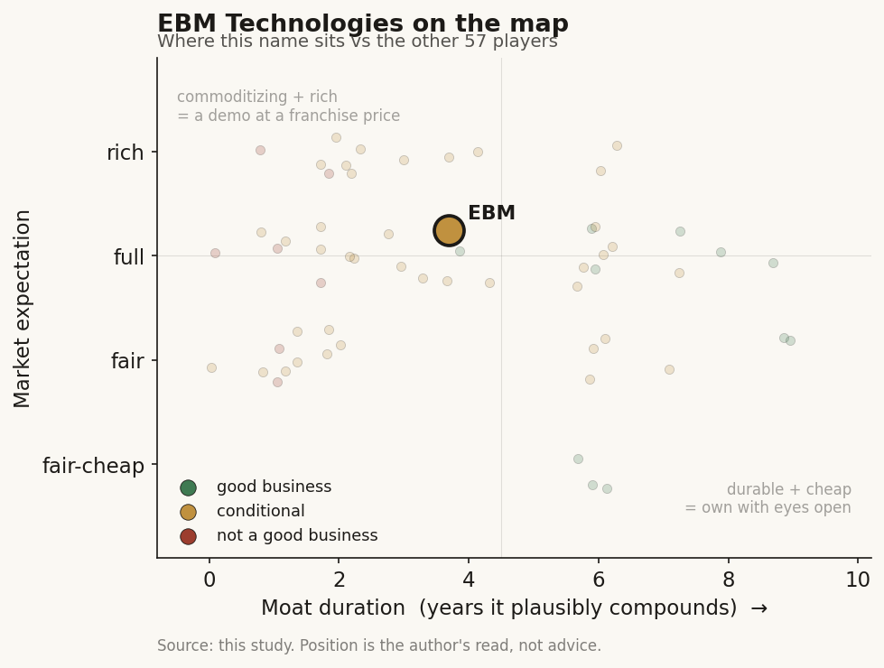

# EBM Technologies (8409 TT)

> **The read.** A genuinely sticky but mature, ex-growth domestic PACS incumbent whose one real re-rate lever — becoming the imaging-AI aggregation rail every Taiwan SaMD vendor plugs into — is plausible and correctly shaped as picks-and-shovels, but is unproven, undisclosed in the numbers, and contested; watch-only, not investable-conviction.

**Snapshot**

| | |
|---|---|
| Listing | 8409.TWO / TPEx (上櫃), listed 2013-11-25 |
| Region | Taiwan |
| Value-chain layer | L1-L2 (imaging data-source rail: PACS store/transmit + AI-integration platform) |
| Archetype | Workflow-software / infra (picks-and-shovels imaging rail, not a diagnostic-AI owner) |
| Size | Market cap ~NT$614m (~32m shares, ~NT$19.2, 2026-07-03) — a sub-US$20m nano-cap |
| Revenue (latest) | FY2025 ~NT$253m (declining from NT$384m FY2023); 2026 YTD (Jan-May) up ~62% YoY off a soft base |
| Moat verdict | Conditional — one real-but-mature switching-cost moat, one un-investable data position, one unproven aggregation-toll option |
| Expectation | Full (P/E ~19.7 for an ex-growth micro-cap) |
| Evidence quality | Med |

## What it is
Taiwan's PACS / medical-imaging-IT incumbent — 商之器科技 (EBM Technologies), founded January 1988, Taipei; ~150 staff, PACS installed at 3,500+ hospitals across Asia / North America. It now sells an AI-integration platform that hangs third-party AI modules onto the existing imaging workflow — the "last-mile" data-liquidity rail beneath the SaMD vendors, not a diagnostic-AI owner itself. Domestic PACS share is cited at ~40%, #1 in Taiwan (also cited #1 in China and Thailand, unverified). It sits structurally beneath every SaMD vendor (Ever Fortune, Acer Medical VeriSee, Amcad, aetherAI).

## Business model — how it makes money
Sell-and-maintain imaging IT to hospitals: PACS (image storage/transmission), RIS, FHIR interoperability, the iDO Viewer mobile-imaging app (TFDA Class-II cleared), and the new leg — an AI-integration platform (annotation → model training → result visualization → deployment) that lets a hospital run any third-party imaging-AI model inside the existing PACS/workstation without changing radiologist workflow. **The hospital pays** (capex/opex + maintenance + integration project fees). Crucially, EBM's revenue is NOT NHI-reimbursement-dependent — it is not a per-scan SaMD claiming a 特材 point value; it is infrastructure the hospital buys to run its imaging department. That inverts the usual Taiwan chokepoint: the NHI single-payer vote gates EBM's *customers'* AI-adoption economics but does not directly gate EBM's own sale. Gross margin ~80% is genuinely software/service-like; operating margin is still negative (~−9%), so the gap is opex, not COGS. Sales mix ~87% Taiwan, 5% China, 6% SE Asia, 2% Japan (2024) — overwhelmingly domestic. No meaningful dividend since 2011.

## Financial summary

| Metric | FY2022 | FY2023 | FY2024 | FY2025 |
|---|---|---|---|---|
| Revenue (NT$m) | ~195 | ~384 | ~281 | ~253 |
| EPS (NT$) | +0.13 | −0.44 | ~+0.07 | +0.24 |
| Gross margin | | | | ~80% |
| Operating margin | | | | ~−9% |

Additional facts: FY2021 EPS was −0.73. Revenue is project-driven and lumpy — the 2023 spike then fade is tender lumpiness, not a growth trend, and the top line is declining, not compounding. 2026 YTD (Jan-May) reads up ~62% YoY off a soft 1H25 base, driven by large early-2026 project bookings (Jan +300% YoY, then decelerating). Profitability oscillates around breakeven: trailing-4Q EPS ~0.97 is flattered by a strong Q4'25 (+0.82) and one lumpy quarter, and Q1'26 is back to a small loss (−0.05). FY24 sign is uncertain — vendor sources disagree; read FY24 as "roughly breakeven, sign uncertain." Paid-in capital ~NT$320m; chairman 盤龍; P/E ~19.7, P/B ~2.0. The 3,500+ installed hospitals are customers/installed base, not consolidated entities; EBM is a vendor into the MOHW "深耕計畫" (Healthcare Taiwan Deep Root) program, providing planning + system integration + AI-model deployment + multi-centre PoC.

## Value-chain position and competition
In the Taiwan map EBM occupies **L1 (patient/imaging data-source rail — it owns the PACS the images live in) → L2 (imaging platform — the storage/transmission/viewer layer)**, plus a new bridge into an L5-analog by hosting other vendors' AI. What flows: DICOM image → PACS store/transmit → (AI-integration platform routes it to a third-party model) → result overlaid back into the radiologist's existing viewer. EBM is the pipe and the last-mile connector, not the interpreter.

It is not head-to-head with the SaMD pure-plays — EBM is the rail, they are the modules. Its AI-integration platform is a potential channel/aggregator for their algorithms, and equally a potential competitor to aetherAI's platform ambitions if EBM builds/hosts its own modules. The real competition is the global imaging-IT stack — GE HealthCare (Centricity/enterprise imaging), Philips, Sectra, Fujifilm (Synapse), Agfa, Change/Merge — all far larger, bundling PACS with modality installed base and out-resourcing EBM globally. EBM's edge is domestic: local install base, hospital relationships, NHI/FHIR localization, and price. Its structural failure to break out of Taiwan (the "無法擴大海外市場" problem) is the whole bear case in one line.

## Moat
Conditional. **The PACS installed base is a real workflow/switching-cost moat** — ripping out a hospital's PACS is a multi-year, high-risk migration, so a ~40% domestic #1 share with 30+ years of relationships is genuinely sticky and the most defensible thing EBM owns. But it is a mature, low-growth, commoditizing moat: PACS is a decades-old category with global incumbents underneath it; the switching cost protects the installed base, not pricing power or growth. **The hospital-imaging-data access is real but NOT investable** — EBM sits on the pipe through which billions of images flow, but the data is the hospitals' and ultimately governed by the state NHI-data regime (opt-out + NT$10m fines since 2025-12-02); EBM cannot build a proprietary RWE annuity off it. **The AI-integration platform is the one genuinely-new moat candidate** — if EBM becomes the default aggregation rail that every Taiwan imaging-AI vendor plugs into, it earns a toll on the whole SaMD cohort regardless of which module wins. That is the right picks-and-shovels shape, but it is unproven, undisclosed in the numbers, and contestable (aetherAI, GE, the hospitals' own MOHW-funded platforms all want that layer). Verdict: one real-but-mature switching-cost moat (legacy PACS) + one un-investable data position + one plausible-but-unproven aggregation-toll option.

## Core variables
1. **CORE — AI-integration-platform adoption / attach rate.** The entire re-rate case is whether the AI platform converts the legacy PACS base into a higher-margin recurring aggregation toll. The read is platform seats / hospitals live / third-party modules hosted — none of which EBM discloses cleanly, so this is currently un-underwriteable from the outside. This separates "declining legacy PACS vendor" from "imaging-AI rail."
2. **CORE — export ability beyond Taiwan.** ~87% domestic, a flat-to-declining top line, and a documented multi-year failure to crack overseas medical-device regulatory walls. The equity has no growth without export; the FHIR/AI-platform + Middle East expansion talk is the milestone to watch. Absent export, this is an ex-growth micro-cap.
3. **Secondary — margin durability vs opex.** Gross margin ~80% is the asset; operating margin is negative because opex (R&D/sales for the AI push) outruns a shrinking top line. The tell is whether AI-platform revenue scales into that opex base or the company keeps oscillating around breakeven.

The key inversion, stated plainly: the NOT-core variable here is an NHI reimbursement decision. Unlike the Taiwan per-scan SaMD cohort, EBM is infrastructure-sold, not reimbursement-funded — the NHI chokepoint gates its customers, not EBM's own revenue. EBM benefits indirectly if NHI reimbursement expands imaging-AI adoption (more modules needing a rail), but its own sale does not wait on a 共同擬訂會議 vote.

## Bear case / key risks
- Ex-growth legacy PACS incumbent: top line has gone NT$384m (2023) → NT$281m (2024) → NT$253m (2025), i.e. shrinking, with lumpy project revenue masking no durable trend. A nano-cap (~NT$614m) with ~32m shares, no analyst coverage, and no dividend.
- The decades-long, still-unsolved problem is overseas expansion — the "can't get out of Taiwan / can't clear foreign medical-device barriers" story is structural, not a fixable quarter.
- The AI-integration platform — the whole bull case — is undisclosed in the financials, contested by better-resourced players (GE/Philips imaging stacks, aetherAI, MOHW hospital platforms), and may end up a low-margin systems-integration line rather than a real recurring toll.
- Data moat is state/hospital-captured, not company-captured — no proprietary imaging-RWE annuity is available to this equity.
- Profitability is marginal and unstable (near-breakeven, sign flips year to year; Q1'26 back in loss); the flattering trailing-4Q EPS rests on one strong quarter. Valuation (P/E ~19.7) is not cheap for an ex-growth micro-cap.

## The expectation read
At P/E ~19.7 and P/B ~2.0 on a shrinking, near-breakeven top line, the multiple implies the market is pricing in the AI-integration-platform re-rate — that the legacy PACS base converts into a higher-margin recurring aggregation toll and/or that export finally breaks. That belief looks soft: the platform economics are entirely undisclosed, FY24's profit sign disagrees across vendors, there is no analyst coverage and no segment split, and the export problem is a multi-year structural failure, not a fixable quarter. A ~20x multiple is not cheap for an ex-growth micro-cap whose growth optionality is unproven.

## Verdict
Watch-only, not investable-conviction. A genuinely sticky but mature, ex-growth domestic PACS incumbent whose one real re-rate lever (becoming the imaging-AI aggregation rail every Taiwan SaMD vendor plugs into) is plausible and correctly shaped as picks-and-shovels, but is unproven, undisclosed in the numbers, and contested — while the equity stays a shrinking-top-line, near-breakeven nano-cap that has never cracked export. A conditionally good business (one real switching-cost moat) at a full expectation. Confidence: MODERATE on business facts (30+ yr operating history, TPEx-disclosed financials, multiple corroborating data-vendor sources), LOW on the load-bearing forward variables. Do not size a position on the numbers here without a primary MOPS/TPEx annual-report pull.
