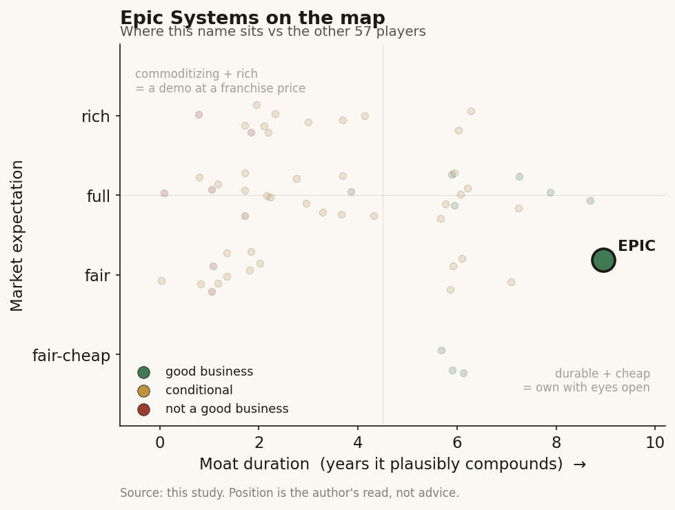

# Epic Systems (private)

> **The read.** The durable platform moat of US healthcare-AI — the system-of-record every L6 scribe rents from — and structurally un-investable: no equity, no external capital, private by design.

**Snapshot**

| | |
|---|---|
| Listing | private (employee/founder-owned, no external capital) |
| Region | US |
| Value-chain layer | L0/L6 — EHR/data rail plus clinical-workflow surface |
| Archetype | infra (infrastructure toll, 06) |
| Size | no marked valuation; Faulkner ~$7.8bn net worth on a ~43-47% stake implies a company value very roughly in the mid-teens $bn (unverified) |
| Revenue (latest) | ~$5.7bn (2024), +16% YoY; ~$6.7bn 2025 estimate |
| Moat verdict | durable — decade-plus for the platform owner, ~0 for the rented slot |
| Expectation | private — no market price |
| Evidence quality | med |

## What it is
The dominant US electronic-health-record (EHR) platform — the system of record that owns the clinician's screen, the patient chart, and the third-party integration surface every healthcare-AI app rents. It is the "distribution moat owner": the landlord that, in Feb 2026, walked down one floor and became the ambient-scribe layer's competitor. Profiled for structural centrality, not as an investable line.

## Business model — how it makes money
Archetype 06, infrastructure toll: perpetual/subscription enterprise software licensed to hospitals and health systems, priced roughly on beds/volume, with heavy multi-year implementation and support. Reimbursement-independent — the health system pays directly; Epic never waits on a payer or an efficacy readout. Capital-LIGHT on the balance sheet (no wet lab, no inventory, no reagents) but R&D-HEAVY on the P&L: ~50% of operating expense goes to R&D (vs ~34% Allscripts, ~19% Cerner, ~10% athenahealth; higher than Google/Apple), ~82% of cost is employee comp. Growth is fully ORGANIC — Epic has never acquired a company, building every module from scratch, on a claimed ~25% CAGR over four decades. It monetizes AI as a native feature bundled into the platform (AI Charting / "Art"), not as a separately-priced product — an envelopment tool, not a new revenue archetype. ~14,000 employees, ~8 salespeople: the distribution runs on installed base and switching cost, not a sales motion.

## Financial summary
No third-party enterprise valuation exists (no round, no listing). The defining fact is the absence of a funding history: founded 1979 by Judy Faulkner on a ~$70,000 friends-and-family investment; never took venture or private-equity capital and carries no debt. Ownership is engineered to stay closed — a post-Faulkner trust (family, long-time senior employees, customer "trust protectors") mandates no IPO, no sale, no acquisition, and a developer-CEO successor; she is selling non-voting shares back to Epic (~$100m/yr) into employees' hands and her Roots & Wings foundation. Backers: none — this is the point.

| Metric | 2023 | 2024 | 2025 |
|---|---|---|---|
| Revenue | ~$4.9bn | ~$5.7bn | ~$6.7bn (estimate) |
| YoY growth | — | +16% | — |
| EBITDA margin | >30% (estimated, self-funded from cash flow) | | |
| Debt | none | none | none |
| External capital raised | none (self-funded since ~$70,000 seed, 1979) | | |

Faulkner's ~43-47% stake underpins a ~$7.8bn personal net worth, which implies a company value very roughly in the mid-teens $bn on that back-out but is unverified as a marked valuation.

## Value-chain position and competition
L0 (the EHR/data rail) AND L6 (the clinical-workflow surface) in one entity — the rare vendor that owns both the floor apps stand on and a floor it can occupy itself. Down the L0 rail flows the patient chart, order/results data, the identity/login, and the API/integration surface (Toolbox, Haiku, App Market) that every L6 app — scribes, CDS, agents — must plug into to reach the clinician. Epic controls that surface's terms. What Epic can push UP into L6 is native documentation, orders, and diagnosis-aware note structuring (Art). The scarce input is not a model or a dataset; it is the integration surface + the clinician's screen + the longitudinal chart — the distribution itself.

Structurally a near-monopoly at the top of the US acute market: ~43.7% acute-care hospital share and ~56.9% of beds in 2025 (up from 42.3% / 54.9% in 2024), +77 hospitals and +18,679 beds in the year; followed by Oracle Health ~21.9% (losing share, -173 hospitals since 2021 vs Epic's +568), Meditech ~14.7%, TruBridge ~7.6%, Altera ~2.9% (KLAS/Becker's). Both large (>10-hospital) enterprise EHR decisions in 2025 chose Epic. Its edge is a compounding installed-base + switching-cost + interoperability-network flywheel: rip-and-replace of an EHR is a multi-year, multi-$100m, clinical-risk event, so share is exceptionally sticky, and each net add deepens the data-exchange network. Against the L6 app cohort (Abridge ~30%, Ambience ~13%, Suki ~10%, Microsoft/Dragon Copilot, Nabla) its edge is simply that it IS the distribution they rent — a native tool needs no separate login, contract, integration, or third-party audio egress, rumored ~$80/provider/mo vs incumbents' several-hundred (Feb 2026).

## Moat
This is the "become the platform" survivor of Moat 2 (workflow embedding / distribution), CONDITIONAL overall — but confirmed decade-plus for the platform owner, ~0 for the rented slot. Epic is the enveloping platform, not the enveloped complement: it OWNS the scarce input (integration surface + screen + chart) that the L6 scribes only rent. The Ch5 through-line — does the vendor own a scarce input the platform beside/above it cannot cheaply replicate? — resolves YES for Epic and NO for its complements. Durable, not commoditizing: unlike the model (~1yr), the raw-data flywheel (~1yr), or the bare clearance (0yr), a system-of-record with ~57% of US beds and multi-year switching cost compounds for a decade-plus. The privateness is orthogonal to the moat — the moat is the installed base and the switching cost, both fully in evidence in the tape of share gains and enterprise wins; no funding round or public disclosure is needed to prove it. If anything the closed ownership strengthens durability: no PE roll-up pressure, no quarterly-earnings distortion of the ~50% R&D reinvestment. Ch5 explicitly names Epic as the durable platform moat and, in the same breath, notes there is no clean listed pure-play — the moat is real and un-investable in the same sentence.

## Core variables
1. **Installed-base share retention + net adds** — the moat is the base; as long as net hospital/bed share keeps climbing (2025: +77 hospitals, share to ~57% of beds), the compounding is intact. This is the master variable; everything else is second-order to it.
2. **Envelopment execution on the app layer (Art attach vs third-party throttle)** — whether Epic actually converts its L0 control into L6 capture: native-scribe adoption inside its own base, and how hard it privileges vs throttles third-party scribes through Toolbox terms. This is where the distribution moat is turned from potential into realized share of the AI-workflow dollar.
3. **Regulatory / interoperability posture** — the one exogenous variable that can force the moat open: info-blocking rules, TEFCA, and antitrust scrutiny of a ~57%-of-beds system-of-record are the only forces that meaningfully lower the switching cost the moat is built on.

(Noise discarded from the full set: Art/AI attach and pricing, developer-ecosystem terms, Oracle Health competitive recovery, succession-trust execution, R&D reinvestment rate.)

## Bear case / key risks
A moat this wide invites the two things that erode incumbency from outside the market rather than inside it.
1. **Regulation is the real bear, not competition** — a system-of-record at ~57% of US beds is a natural antitrust and interoperability target; mandated data portability / API-openness (info-blocking enforcement, TEFCA) directly attacks the switching cost and integration-surface control that ARE the moat. Epic has repeatedly drawn regulatory and interoperability criticism.
2. **The envelopment could underdeliver or backfire** — health systems that resent Epic bundling free substitutes over paid third-party tools, or that want best-of-breed AI, can push back; a heavy-handed Toolbox-throttle invites the exact antitrust attention in (1).
3. **Organic-only, developer-CEO, no-M&A, private-forever is a governance bet** — the same trust rules that protect the moat also forbid the capital-markets flexibility to respond if a genuinely disruptive AI-native care model appears; the succession trust is untested.
4. **Not investable regardless** — even if every bull point holds, there is no equity to own; the durable value accrues entirely to a private balance sheet and its employees, with only diffuse read-throughs (ORCL as the challenger, MSFT via Dragon Copilot) available to a listed reader. The bear case for an investor is therefore structural: the best asset in the chain is the one you cannot buy.

## The expectation read
There is no market price to read: no round, no listing, no marked valuation. The only quantitative anchor is a back-out — Faulkner's ~$7.8bn net worth on a ~43-47% stake implies a mid-teens $bn company value, but that is unverified, not a set expectation. What the closed structure implies is a business run for compounding rather than for a valuation event: ~50% R&D reinvestment, no PE roll-up pressure, no quarterly-earnings distortion. Where the belief looks soft is not price but permanence — the ~57%-of-beds position that underwrites the moat is the same position that makes regulation and interoperability mandates the one force that can lower the switching cost the whole thesis rests on.

## Verdict
DURABLE VALUE-CAPTURER — decade-plus platform moat (Ch5 Moat-2 "become the platform" survivor), but structurally UN-INVESTABLE: no equity, no external capital, private by design. Confidence: HIGH on the moat, HIGH on the un-investability. It is the distribution moat owner the whole L6 scribe cohort rents from — profile it to understand who captures the AI-workflow dollar, not to size a position.
