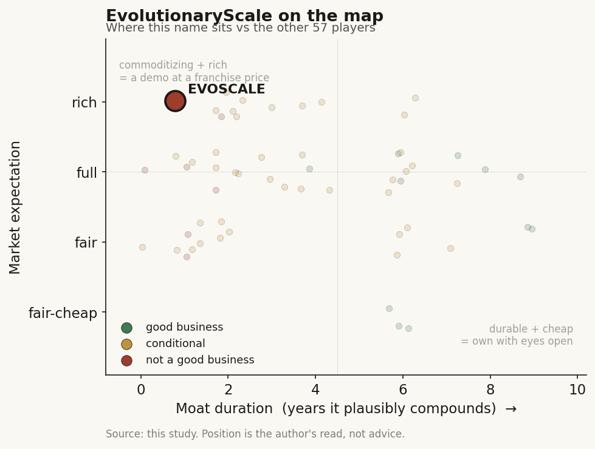

# EvolutionaryScale (private)

> **The read.** World-class protein-AI science on a commoditizing model layer with no owned asset, payment rail, or data-attach moat — a demo/feature, not a durable value-capturer; the standalone company effectively ended ~18 months post-seed in a CZI acqui-hire.

**Snapshot**

| | |
|---|---|
| Listing | private |
| Region | US |
| Value-chain layer | L9b — protein/structure generation (model layer of the drug-discovery chain) |
| Archetype | infra (06 infrastructure toll — API/model-access variant) |
| Size | ~$1.1bn implied secondary mark [unverified]; no primary post-money disclosed |
| Revenue (latest) | private — never disclosed |
| Moat verdict | commoditizing |
| Expectation | rich |
| Evidence quality | med |

## What it is
A frontier AI-biology lab building ESM3, a 98-billion-parameter generative protein language model that reasons jointly over sequence, structure and function [reported]. Founded 2023 as a public benefit corporation by three ex-Meta FAIR protein-AI scientists (Alexander Rives, Tom Sercu, Sal Candido) after Meta disbanded the group [reported].

## Business model — how it makes money
Archetype 06 infrastructure toll — API/model-access variant (Ch4 taxonomy), NOT archetype-04 own-pipeline. Intended monetization: the full ESM3 model behind the Forge cloud API (usage fees), plus fine-tune access via cloud marketplaces and NIM distribution, pharma partnerships, and revenue-share on commercialized discoveries [reported]. The frontier model was released for non-commercial use with paid commercial tiers. Capital-hungry, not capital-light: a 98B-param model trained on 2.78bn proteins on ~1 trillion teraflops of compute is a large fixed training bill [reported]; the archetype is "toll" in intent but the model IP underneath is the commoditizing kind (Ch5). Revenue was never disclosed and the standalone commercial path closed inside ~18 months.

## Financial summary
Private — no income statement. Funding, valuation, backers and the terminal event substitute.

| Item | Detail |
|---|---|
| Seed round | $142m, announced June 2024 — one of the largest seeds ever for an AI-biology lab [reported] |
| Post-money valuation | Never publicly disclosed [disclosed: no figure released]; a later secondary-marketplace quote implied roughly ~$1.1bn [unverified] — a private-market mark, not a primary round price |
| Backers | Co-led by Nat Friedman, Daniel Gross and Lux Capital; Amazon and NVentures (Nvidia's venture arm) strategic; plus Khosla, Lead Edge, Scale VP, Tola, and angels incl. Sam Altman [reported]. The Amazon/Nvidia cap-table = compute + distribution, not just cash |
| Terminal event | Nov 2025 — absorbed by Chan Zuckerberg Biohub / CZI in an undisclosed-terms transaction; ~50 staff and co-founder Rives (now CZI Head of Science) moved across; the Forge commercial platform migrated to biohub.ai [reported]. Framed by trade press as the "apparent end of the AI startup" — a talent/capability acqui-hire into a non-profit, not a growth-round or IPO path |

## Value-chain position and competition
Sits at L9b — protein/structure generation (the "picks-and-shovels" model layer of the drug-discovery chain), with an L9x/L0 compute-spine dependency (the reason Amazon + Nvidia are on the cap table). What flows: sequence/structure/function predictions and de novo protein designs (e.g. the generated esmGFP) DOWN to L9c candidate-selection and L9e clinical developers. Critically it is a supplier to drug developers, not a drug owner — it sells the door, not the asset behind it. Per Ch4/Ch5 this is exactly the layer where value does not durably accrue.

Edge: the leading language-based (vs structure-based) foundation model — generative design of novel sequences/chemistries in one unified model, plus the FAIR-lineage ESM/ESMFold brand and the Amazon+Nvidia distribution rails [reported].

The landscape that broke it: the model layer commoditized. Boltz-1 (MIT, Nov 2024) hit AlphaFold3-level accuracy fully open-source and commercially usable; Boltz-2 added affinity; Chai-1 (Apache-2.0), Protenix, OpenFold-3 piled on — frontier caught in ~1 year at radically lower cost [disclosed/reported]. AlphaFold3 (DeepMind) anchors the top. Against free, commercially-open peers, a paid proprietary API has thin willingness-to-pay.

## Moat
Ch5 Moat-1 "the model is the door, not the moat" applies directly — REFUTED, ~0-1 year duration. ESM3 is precisely the "model IP" Ch5 grades as a ~12-month moat: open MIT/Apache clones matched the frontier within ~1 year at >1000x lower cost. EvolutionaryScale owned none of the three surviving moat forms — no reimbursement/coverage rail, no owned clinical asset against a risk-bearing pharma counterparty, no data-attach/licensed-corpus plumbing. It owned a great model and the compute to train it, and both commoditize. Is the moat real for a private at this stage? No. The Nov-2025 CZI absorption is the market's verdict made concrete: a standalone toll on a commoditizing model could not clear its own cost of capital, so the durable home for the capability was a non-profit freed from "commercial pressures," not a venture-scale business.

## Core variables
1. Model-layer commoditization rate — how fast open/commercial clones erase the frontier lead. Answer already in: ~1 year. This is the master variable and it went against the company.
2. Willingness-to-pay for a proprietary protein-model API vs free open weights — the toll's pricing power. Thin, and thinning; no disclosed revenue traction.
3. Cash burn vs a fundable next round at a defensible price — a 98B-param compute bill against a commoditizing product; the runway-vs-repricing race that ended in an acqui-hire.

Second-order (noise for the verdict): benchmark accuracy vs AF3, esmGFP-style demos, param count, FAIR-brand prestige — all real, none load-bearing once the model commoditized.

## Bear case / key risks
The bear case already played out. A capital-hungry lab monetizing a commoditizing model layer, one step removed from any owned asset or payment rail, with open peers matching the frontier for free within a year — the classic Ch5 "model is the door" trap plus the Ch4 lesson that value migrates to the owned asset or the compute toll (accruing to Amazon/Nvidia), not to the model vendor in the middle. Standing bear residual for the acquirer: even inside CZI the science is upstream of the ~40% Phase-II efficacy wall that no protein model has moved, and zero AI-designed drugs are approved as of 2026.

## The expectation read
The ~$1.1bn implied secondary mark [unverified] priced the frontier model IP and the FAIR-lineage team as a durable, monetizable toll. What the model layer actually delivered — open MIT/Apache clones at the frontier within ~1 year at >1000x lower cost, no disclosed revenue, and a standalone path that closed inside ~18 months — says that belief was soft on the one variable that mattered: the moat did not exist to be priced. The Nov-2025 CZI acqui-hire at undisclosed (i.e. not up-round) terms is the repricing made concrete: the commercial-toll expectation was rich against a commoditizing product.

## Verdict
Demo/feature, not a durable value-capturer — CONFIRMED by the Nov-2025 CZI acqui-hire; high confidence. World-class science and team on a commoditizing model layer with no owned asset, payment rail, or data-attach moat; the standalone commercial company effectively ended ~18 months post-seed. Good business? No — the durable value in this chain accrues below it (compute: Amazon/Nvidia) and beside it (the owned clinical asset), not to the picks-and-shovels model vendor, and the market cleared it at a rich expectation that did not hold.
