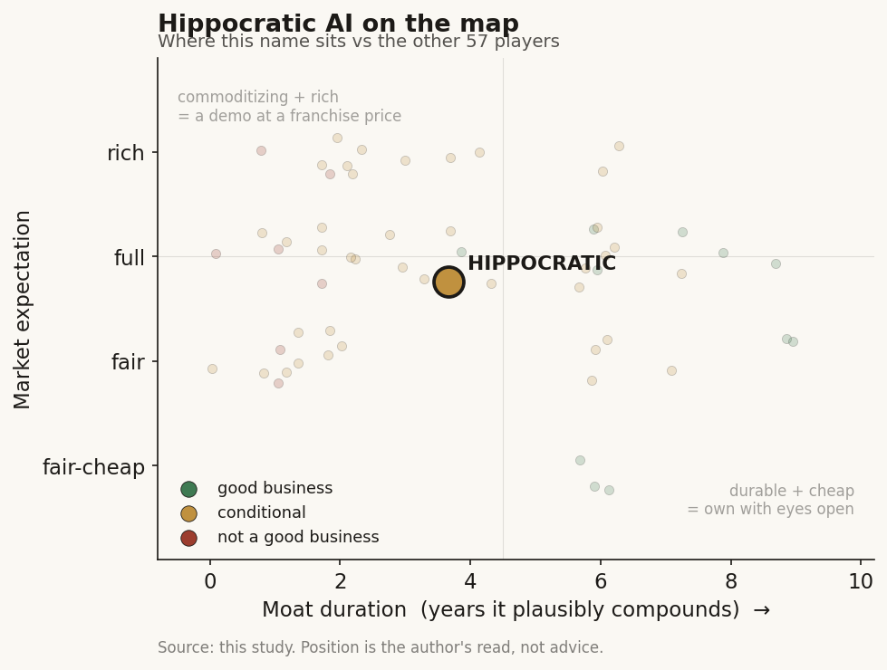

# Hippocratic AI (private)

> **The read.** A category-leading patient-facing voice-AI with real traction whose only durable moat candidate — the accumulated safety record — is not yet shown to convert into retention-at-price; promising but unproven at a $3.5bn mark on no disclosed revenue.

**Snapshot**

| | |
|---|---|
| Listing | private |
| Region | US |
| Value-chain layer | L6 — clinical-workflow application |
| Archetype | AI-services (agentic patient outreach; usage-metered labor-substitution SaaS) |
| Size | $3.5bn post-money (Series C, 3 Nov 2025) |
| Revenue (latest) | private — no revenue/ARR disclosed |
| Moat verdict | conditional (mostly prospective) |
| Expectation | full |
| Evidence quality | med |

## What it is
Patient-facing agentic voice AI that runs non-diagnostic nursing-type phone calls at scale — post-discharge follow-up, chronic-disease check-ins, pre-visit intake, medication and appointment reminders. The pitch is "safety-focused": it does not diagnose or prescribe, and safety is sold as the product. Founder-CEO Munjal Shah (Like.com to Google, then Health IQ, which filed bankruptcy 2023); founded 2023.

## Business model — how it makes money
B2B usage-metered AI-services / labor-substitution SaaS: **~$9/hour per agent** versus a US RN median ~$39-45/hr — the entire commercial logic is arbitrage against the nursing wage during a structural labor shortage. The buyer (health system) is the beneficiary and there is no reimbursement gate, which places it in the high-durability quadrant (buyer = beneficiary + no billing code needed). Two caveats blunt the SaaS-clean read: (a) it is variable-cost, not zero-marginal-cost — per-hour voice-LLM inference is a real COGS that scales with call volume, so gross margin is capped below classic software; (b) revenue is usage-lumpy (flu-season call spikes inflate the customer's bill), land-and-expand off a per-workflow configuration. The capital position is economically light (no wet lab, no inventory) but operationally hungry at the front — clinician-validated safety testing (1,000+ nurses, 130+ physicians, 307k test calls for Polaris 3.0) and enterprise/EHR integration are heavy sunk cost. A Clinician Creator program pays RNs 5% of the base rate to build and validate agents.

## Financial summary
No revenue/ARR disclosed. Funding history:

| Round | Date | Raised | Valuation | Lead |
|---|---|---|---|---|
| Series B | Jan 2025 | $141m | $1.64bn | — |
| Series C | 3 Nov 2025 | $126m | $3.5bn post-money | Avenir Growth |

The valuation ~2.1x'd from $1.64bn to $3.5bn in ~10 months; total raised **$404m**. Backers: CapitalG (Alphabet), General Catalyst, a16z, Kleiner Perkins, Premji Invest, NVIDIA NVentures, SV Angel — plus strategic health-system / provider capital: Universal Health Services, Cincinnati Children's, WellSpan Health, and individuals John Doerr and Rick Klausner. The strategic-provider cap-table is the tell that matters (distribution, not just money).

## Value-chain position and competition
Sits at L6, the clinical-workflow application layer, on top of the L0 model + telephony/EHR rails. What flows in: a rented frontier LLM + the health system's patient roster and care-protocol config. What flows out: completed patient phone interactions and structured call outcomes back into the system of record. Unlike the ambient scribe (also L6), it is patient-facing and outbound-agentic, not a passive note-drafter — it substitutes labor rather than documenting it, which is a genuinely different revenue physics (priced against a wage, not a per-seat license). It captures no reimbursement dollar directly; value is pure workflow-cost avoidance for the buyer.

Category leader in clinical-grade patient-facing voice — a lane most voice-AI vendors avoid because it carries patient-safety liability. Adjacent/competing: Infinitus (payer-side benefit calls, different buyer), Nabla and Abridge (documentation/scribe, not autonomous patient contact), plus a long generic voice-AI tail. Claimed edge: the Polaris "safety constellation" — 22+ specialized cooperating LLMs (>4.1T aggregate params), a proprietary RWE-LLM validation harness, and a stated safety record of 115m+ patient interactions with zero reported safety issues across 50+ systems / 1,000+ built use cases in 6 countries. The edge is real today but is an execution + trust-accumulation lead, not a structural lock — the underlying model is rented and commoditizing.

## Moat
Maps to Ch5 Moat 2 (workflow embedding / distribution), verdict **CONDITIONAL** — with the same hinge as the ambient scribe: does the vendor own a scarce input the platform above/beside it cannot cheaply replicate? The three survival tests:

- **Owns the model? No.** Polaris is orchestration over rented frontier LLMs; the company's own risk framing concedes Med-Gemini / GPT-5-Health class models could "narrow the technical gap," forcing competition onto integration and brand. Model layer = ~1yr moat (Ch5 through-line).
- **Owns distribution? Rented, but with a twist.** It rents patient access through the health system and the EHR/telephony rails it does not own — the same landlord exposure incumbents weaponized against scribes. Partial offset: strategic health-system investors (UHS, WellSpan, Cincinnati Children's) convert some rented distribution into aligned, sticky channel — a duration cushion, not ownership.
- **Owns a scarce input? The one candidate is the SAFETY ASSET.** 115m+ interactions with a clean safety ledger + the clinician-validation corpus + RWE-LLM harness is a genuinely accumulated, hard-to-clone input — and in a patient-facing, liability-bearing setting (unlike the scribe's assistive tier), that record is the switching cost. This is the only plausibly durable leg, and the reason this is a stronger conditional than the pure scribe. Duration if it holds: ~3-5yr.

The moat is conditional and mostly prospective at this stage. The safety record is the real candidate scarce input; everything else (model, distribution) commoditizes or is rented. The falsification hinge is whether that safety lead converts into audited NRR-at-price through a renewal cycle once a hyperscaler ships a comparably-safe generalist agent. For a private with no disclosed revenue, the moat is asserted from a safety count, not yet proven from retention economics.

## Core variables
1. **Safety record durability under scale + the first adverse event.** The entire premium rests on "115m calls, zero issues." One publicized patient-harm event resets the anchor and inverts the moat from asset to liability. This is the master variable.
2. **NRR-at-price post-frontier-model.** Does a deployed system renew and expand at price once a Med-Gemini/GPT-5-Health generalist offers "good-enough safe" outreach? Unobservable while private — the S-1 (or a lost marquee contract) is the read.
3. **Realized gross margin vs voice-inference COGS.** Per-hour voice-LLM cost is a real variable COGS; if it stays high while the $9 price is pressured, "capital-light" does not equal high realized ROIC.

Second-order (held below the line): pace of health-system procurement; regulatory/governance burden (CMS audit logs, bias, human-oversight requirements); clinician trust-calibration (studies show doctors second-guess correct AI); international expansion economics.

## Bear case / key risks
It is a feature priced as a company, one frontier-model release from commoditization. (1) From below: Polaris orchestrates rented LLMs; a hyperscaler shipping a safety-tuned patient-agent collapses the technical gap the company itself flags. (2) From the side/above: it rents patient access through the EHR/telephony rail and the health system — the same platform-envelopment vector that hit scribes; a bundled "good-enough" native agent from the EHR incumbent competes on price and single-vendor simplicity. (3) Economics: variable inference COGS + usage-lumpy billing + a $9 price under downward pressure squeezes the capital-light story from both ends. (4) Valuation: $3.5bn on no disclosed revenue, marked ~2x higher in 10 months by growth capital — a venture mark on an interaction count, not on retention or cash flow, struck before any frontier generalist has entered patient-facing voice. (5) Founder tail: the prior venture (Health IQ) went bankrupt — execution-risk column, not disqualifying.

What breaks the bear: an S-1 (or credible disclosure) showing NRR durably >110-120% at price AND the safety ledger holding through a renewal cycle despite a frontier entrant — proof the safety asset is a switching cost, not a head-start.

## The expectation read
The $3.5bn mark — 2.1x'd from $1.64bn in ~10 months on no disclosed revenue — prices Hippocratic as a confirmed value-capturer in patient-facing voice: the market is paying for the safety ledger (115m+ interactions, zero reported issues) as if it were already a proven, retention-generating switching cost. The soft spot is that this belief rests on an interaction count, not on cash flow or audited NRR, and it was struck before any frontier generalist has entered the lane. The full expectation therefore embeds two unproven conversions — safety-count into retention-at-price, and today's execution lead into structural durability — either of which a Med-Gemini/GPT-5-Health-class entrant or a single adverse event could reprice.

## Verdict
Promising but unproven — a category-leading demo-with-traction whose only durable moat candidate (the patient-facing safety record) is real but not yet shown to convert into retention-at-price; treat as a conditional value-capturer at a full expectation, not a confirmed one. Confidence: MEDIUM-LOW (no revenue disclosed; moat asserted from a safety count, refutable by the first frontier patient-agent or the first adverse event).
