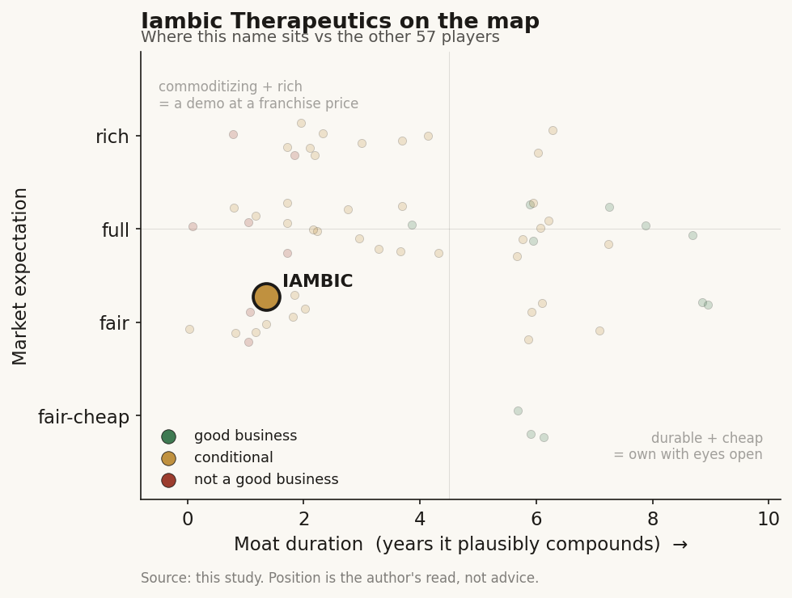

# Iambic Therapeutics (private)

> **The read.** A genuinely fast AI-native discovery platform wrapped around one early-stage owned HER2 asset (IAM1363) whose entire value is gated by an unproven Phase-II efficacy readout — demo/optionality, not yet a durable value-capturer.

**Snapshot**

| | |
|---|---|
| Listing | private |
| Region | US (San Diego) |
| Value-chain layer | L9b-L9e (structure generation -> candidate optimization -> owned clinical development) |
| Archetype | drug-owner (archetype 04 — owned pipeline + optional milestone/royalty) |
| Size | over $100m latest round (Nov 2025); no post-money valuation disclosed |
| Revenue (latest) | pre-revenue (near-zero; no product margin line) |
| Moat verdict | conditional (own-pipeline binary optionality); platform leg refuted |
| Expectation | private — no reported mark |
| Evidence quality | med |

## What it is
AI-native oncology drug developer: a physics-plus-ML discovery platform (NeuralPLexer structure prediction + Enchant multimodal endpoint prediction) fused to an **owned** small-molecule pipeline. Lead asset IAM1363 (selective HER2 inhibitor) is in a Phase 1/1b trial — the company carries its own molecules into the clinic rather than selling the platform.

## Business model — how it makes money
Archetype 04 — **own-pipeline biotech** (not a platform licensor). Value is a probability-weighted string of clinical readouts; near-zero revenue today, no product margin line. Optional pharma biobucks on top: a **research collaboration with Jazz Pharmaceuticals** pairs IAM1363 with Jazz's zanidatamab in a HER2+ breast cohort — non-dilutive reach, not a platform sale. **Capital: HUNGRY** — R&D/clinical opex dominates; the balance-sheet variables that matter are cash and runway, not margin/ROIC (undefined pre-product). The platform is a cost-and-speed edge inside the company, not a separately-sold product.

## Financial summary
No product revenue, no margin line, no reported valuation mark. This is a funding-profile, not a valuation-anchored, read. Rounds and backers below.

| Round | Amount | Date | Notes |
|---|---|---|---|
| Series A | ~$53m | 2021 | reported |
| Series B | $100m | Oct 2023 | co-led Ascenta + Abingworth; brought in NVIDIA + Illumina Ventures |
| Series B extension | $50m | — | Mubadala Capital + Exor Ventures, QIA (reported) |
| Latest round (secondary trackers: Series C) | over $100m | Nov 2025 | oversubscribed; no series letter in primary source; no post-money valuation disclosed |
| **Cumulative** | **~$300m+** | to date | estimate, summing disclosed rounds |

Backers (Nov 2025 named): Abingworth, Ascenta, Catalio, Illumina Ventures, Mubadala, Qatar Investment Authority, Regeneron Ventures, Sequoia, ARK, Alexandria Venture Investments, Tao Capital, Pegasus Tech, Everbright Biofund. Sovereign-wealth + crossover-heavy; NVIDIA is a prior investor + compute partner. Valuation is the key data gap: no reported mark.

## Value-chain position and competition
Vertically spans the drug-discovery chain: **L9b** (NeuralPLexer generation/structure) -> **L9c** (candidate selection/optimization — Enchant predicting clinical/preclinical endpoints) -> **L9e** (owned clinical development, IAM1363 in-human). What flows out is not a model or a dataset but an **owned molecule** and its clinical data — the Isomorphic/gene-editing structure, where the model is the door, not the moat; value forms one layer down in the owned asset, not in the L9b generator.

Two competitive fronts. (a) **As a platform:** the L9b structure-prediction layer is commoditizing — open clones (Boltz-1/2, Chai-1, Protenix, OpenFold-3) matched the AlphaFold3 frontier in ~1 year at >1000x lower cost. So NeuralPLexer/Enchant confer speed, not a durable technical moat: the tell Iambic itself cites is program-start-to-clinic in ~2 years. (b) **As a drug:** IAM1363 competes on the HER2 target against T-DXd (Enhertu), tucatinib, zanidatamab. Its edge claims: brain-penetrant, type-II, >5,000-fold HER2-vs-EGFR selectivity, activity in wild-type + mutant HER2. Early Phase 1/1b data (ESMO 2025): partial responses in 28% (n=18) systemic and 33% (n=3) intracranial at >=960 mg/day, including patients pretreated with T-DXd and tucatinib — real but tiny-n, early. Pipeline behind it: KIF18A + CDK2/4 programs, clinic-bound near-term.

## Moat
**Applies: Ch5 Moat 3 (pharma-distribution / own-pipeline) — CONDITIONAL, and Moat 4 (data/model flywheel for discovery) — REFUTED for the platform leg.** The platform is a ~1-year model moat at best; the real question is the owned asset. Per Ch5, own-pipeline is binary optionality, not compounding — it buys more shots on goal, not better odds per shot, and hits the unchanged ~40% Phase-II efficacy wall (~90% of failure, ~93% of clinical spend sit past the selection gate). **Is the moat real for a private at this stage? No — not yet.** IAM1363 is Phase 1/1b: the speed-to-clinic edge is genuine but sits entirely in the already-solved chemistry/Phase-I half; zero Phase-II efficacy proof, zero approvals. The durable value, if any, is a single owned HER2 asset clearing efficacy against Enhertu — unobservable today. The Jazz collaboration is the only distribution edge and it is optionality the pharma landlord can envelop, not an owned rail.

## Core variables
- **CORE 1 — IAM1363 Phase 1b/2 efficacy readout (the master variable).** Does the 28%/33% early PR signal hold and deepen into a differentiated, durable response vs T-DXd/tucatinib in a real cohort? This one binary re-rates the whole company.
- **CORE 2 — cash runway vs next value-inflection.** Own-pipeline + capital-hungry; the ~$300m cumulative + Nov 2025 raise must reach the IAM1363 efficacy readout AND get KIF18A/CDK2-4 into clinic before dilution. Runway-vs-catalyst, not science, decides whether the shots are taken.
- **CORE 3 — does the platform speed convert to a portfolio PoS edge, or just faster failure?** The 2-years-to-clinic claim is only value-bearing if the fast-built molecules also clear Phase II above the ~40% base — otherwise speed just reaches the wall sooner.
- *(Second-order, discarded as noise: NeuralPLexer/Enchant benchmark scores; investor-roster prestige; the missing valuation mark; program count.)*

## Bear case / key risks
Same shape as Exscientia/BenevolentAI (Ch4 failure cases): the edge lands in cheap Phase-I chemistry while ~93% of spend and ~90% of failure sit downstream at the unmoved ~40% Phase-II wall. The platform (L9b) is commoditizing toward open clones in ~1 year, so the demo of speed is not a moat. IAM1363 is a single HER2 asset in a crowded, well-served target (Enhertu is entrenched) — a 28% PR in n=18 is a hopeful early signal, not a franchise, and can fade in a larger cohort. As a private with no disclosed valuation, the venture mark is unobservable and the round was a growth-financing, not a priced efficacy de-risking. Financing is binary: one weak IAM1363 readout can strand the asset AND close the window simultaneously. Refuting evidence that breaks the bear: a durable, differentiated IAM1363 efficacy readout (esp. intracranial, where brain-penetrance is a genuine gap vs incumbents) clearing Phase II visibly above base — not yet in hand.

## The expectation read
No reported valuation mark, so the market's implied belief is not directly priced. The over-$100m Nov 2025 round (oversubscribed, sovereign-wealth + crossover-heavy) implies backers are paying for platform speed and portfolio optionality — the pre-efficacy story — because there is zero Phase-II efficacy proof to price. That belief is softest exactly where the value sits: the ~40% Phase-II wall is unmoved by discovery speed, and a single owned HER2 asset in n=18 is not yet a de-risked franchise. The round is growth-financing, not priced efficacy de-risking.

## Verdict
**DEMO/OPTIONALITY, not yet a durable value-capturer** — a genuinely fast platform wrapped around one early-stage owned HER2 asset whose value is gated by an unproven Phase-II efficacy readout; the platform moat is ~1-year commoditizing and the owned-asset moat is unconfirmed at this stage. Good business? Conditional — the science is real and the shots are funded, but durable value capture is unproven. Confidence: HIGH on the framing (own-pipeline binary, platform commoditizes), MEDIUM on IAM1363 specifically (early PR signal is real but tiny-n).
