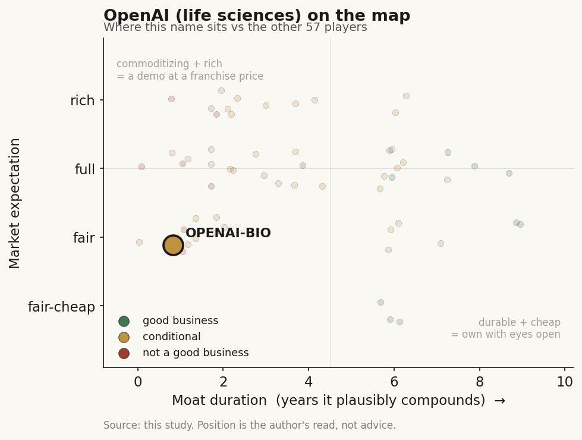

# OpenAI — life sciences (private)

> **The read.** A durable general-infrastructure toll (L9x, ~5-10yr) wearing a biology skin — real value, but it accrues to the general-AI API and to partners' owned assets, not to a defensible drug-discovery moat.

**Snapshot**

| | |
|---|---|
| Listing | private (parent OpenAI; bio program not separately capitalized) |
| Region | US |
| Value-chain layer | L9x compute/model spine, reaching into L9b candidate generation |
| Archetype | infra toll (06), reaching into candidate-generation (04) |
| Size | parent ~$852bn post-money (31 Mar 2026 round) |
| Revenue (latest) | private; bio unit funded off parent balance sheet, no separate P&L |
| Moat verdict | commoditizing (bio-specific) / durable (general toll) |
| Expectation | fair (as general toll) — full/rich if priced as healthcare-AI |
| Evidence quality | high |

## What it is
The frontier general-purpose AI lab, running a life-sciences push (GPT-4b micro for protein engineering; GPT-Rosalind, a science-tuned reasoning model) plus equity stakes in the biology stack. It builds the model/compute layer, then lets partner biotechs own the drug asset — it is not itself a drug company. The framing question: does the general frontier-model race spill into drug discovery, and if so, where does value land?

## Business model — how it makes money
Archetype 06 — infrastructure toll, reaching selectively into 04 — candidate generation. It monetizes life sciences the way it monetizes everything: usage-priced API + enterprise seats on a science-tuned model (GPT-Rosalind; early partners Moderna, Genentech, Thermo Fisher, Retro) — reimbursement-independent, capital-light at the inference margin. The Retro/Chai relationships are equity optionality, not product revenue: OpenAI supplies the model, the biotech owns the asset and bears efficacy risk. Capital posture is bimodal — the model API is capital-light per call, but the parent is the most capital-hungry entity in tech (Stargate: up to $500bn of data-center capex). For the bio unit specifically, the incremental unit is cheap; the moat spend is the shared frontier-training bill.

## Financial summary   (funding / valuation / backers — private)
- **Parent OpenAI:** ~$122bn round closed 31 Mar 2026 led by Amazon, Nvidia, SoftBank, a16z at ~$852bn post-money; prior ~$110bn round Feb 2026 at $840bn post. SoftBank cumulative ~$64.6bn / ~13%. IPO work underway (bank-led tender at latest mark).
- **Life-sciences is not separately capitalized** — it is a program funded off the parent balance sheet ("OpenAI for Science," launched Oct 2025, since decentralized into research teams Apr 2026).
- **The biology bets sit in the ecosystem, not the P&L:**

| Bet | OpenAI role | Round / valuation | Total raised | Note |
|---|---|---|---|---|
| Retro Biosciences | Sam Altman personally wrote entire ~$180m seed (2021, disclosed 2023) | ~$1.8bn (May 2026) | — | first clinical trial (Alzheimer's protein-aggregate pill) dosing |
| Chai Discovery | investor since seed | $130m Series B Dec 2025 at ~$1.3bn | >$225m ($30m seed / $70m Series A / $130m B) | founder Joshua Meier is ex-OpenAI |

## Value-chain position and competition
Sits on the **L9x compute/model spine** (the picks-and-shovels toll every layer above rents) and reaches down into **L9b — candidate generation** (protein/molecule design). What flows in: protein sequences, biological text, tokenized 3D structure (GPT-4b micro's training diet), plus partner wet-lab feedback. What flows out: designed variants (RetroSOX, RetroKLF), hypotheses, experimental plans, evidence synthesis — inputs to a discovery pipeline, not a drug and not a clinical readout. It deliberately does not occupy L9c (selection/fail-fast) or L9e (owned clinical asset) — the layers where NPV and liability actually form.

Competition is against structure/generation specialists — DeepMind/Isomorphic (AlphaFold3), the open-weight frontier (Boltz-1/2 MIT, Chai-1/2 Apache-2.0, ByteDance Protenix, OpenFold-3), and Chai itself (which it funds). Edge: the general frontier model's reasoning + tool-use breadth (evidence synthesis, experimental planning) that a narrow folding model lacks, plus unmatched compute and a validated wet-lab result — RetroSOX/RetroKLF drove **>50x** pluripotency-marker expression, **>30%** of RetroSOX variants beat wild-type SOX2, iPSC generation cut ~3 weeks → ~7 days. The tell: that result required Retro's wet lab to validate — the model is the door, the biology partner is the moat holder.

## Moat
This is Moat 2 (data flywheel, drug-discovery version) + the "model is the door, not the moat" ranking — both REFUTED for the layer OpenAI occupies. Open clones matched the AF3 frontier on geometry and affinity within ~1 year at >1000x lower cost; OpenAI's own funded portfolio company (Chai) publishes near the open frontier. A frontier-model lead in biology is a **~12-month moat at best**. The durable moat in this chain is the owned asset against a risk-bearing pharma counterparty (Isomorphic, gene-editing) — the layer OpenAI chose not to enter, taking equity in Retro/Chai instead. For the bio unit, there is no bio-specific durable moat: model IP commoditizes and OpenAI captures value here only as (a) a general-purpose API toll (a real ~5-10yr business, but priced as general AI, not healthcare-AI) and (b) equity in partners who must still clear the unchanged ~40% Phase-II wall. It is a general-AI toll with a biology skin.

## Core variables
- **CORE 1 — API/enterprise-seat pull for GPT-Rosalind (the only capital-light monetization).** Does the science model convert Moderna/Genentech/Thermo pilots into recurring usage revenue, or stay a demo? This is the one place OpenAI captures bio value directly.
- **CORE 2 — does OpenAI stay a toll or migrate into owned assets?** Its value in drug discovery is capped unless it takes the Isomorphic route (own the asset). Watching whether Retro/Chai stakes convert into structured asset economics is the whole optionality.
- **CORE 3 — frontier-model commoditization rate in biology.** The open cohort (Boltz/Chai/Protenix) sets how fast any bio-model lead decays; if ~12 months holds, the bio unit is never a standalone moat.
- Second-order: parent capex/burn and IPO timing; Retro's Alzheimer's Phase readout; talent flow between OpenAI and its funded biotechs.

## Bear case / key risks
The frontier race spills into drug discovery, but the spillover commoditizes the exact layer OpenAI holds. The general model race does reach biology — but it lands on L9b generation, the cheap, already-solved half that carries no NPV, and it arrives as a commodity (open clones caught the frontier in ~1yr at >1000x lower cost). OpenAI's headline win (RetroSOX 50x) is a lab-reprogramming result, not a clinical asset, and required a wet-lab partner to produce — OpenAI owns the door, not the drug. The bio unit is not separately capitalized, its lead decays on the open-clone clock, and its two equity bets still face the ~40% Phase-II wall that AI has not moved (zero AI-discovered drugs approved as of 2026). The value is real but accrues to the general toll and to partners' owned assets, not to a defensible bio-specific position.

## The expectation read
The risk for a reader: paying a healthcare-AI multiple for what is a general-AI API toll with a biology demo attached — mispricing the compute spine as a drug-discovery franchise. Priced as a general infrastructure toll, the ~$852bn parent mark is a fair expectation for a ~5-10yr business; the belief that looks soft is any incremental premium attributed to a defensible drug-discovery position, which the ~12-month commoditization clock and the unmoved ~40% Phase-II wall do not support.

## Verdict
DURABLE VALUE-CAPTURER as a general infrastructure toll (L9x, ~5-10yr) — but a DEMO/FEATURE as a drug-discovery moat; the spillover is real and commoditizing, and OpenAI captures bio value chiefly as an API toll + partner equity, not an owned asset. Good business at a fair expectation as a general toll; full-to-rich if the market prices the biology skin as a franchise. Confidence: high (model-commoditization evidence is disclosed and consistent; the private, unsegmented bio P&L is thin, which caps precision not direction).
