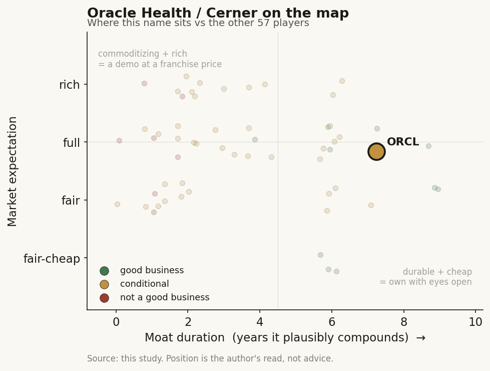

# Oracle Health / Cerner (ORCL)

> **The read.** A durable #2 EHR rail with a real L0 switching-cost moat — but it is a ~9%-revenue, share-losing, margin-dilutive annuity inside a stock the market prices entirely on AI-cloud; good business, fair-to-full expectation, but not the reason to own or avoid ORCL.

**Snapshot**

| | |
|---|---|
| Listing | ORCL / NYSE |
| Region | US |
| Value-chain layer | L0 — EHR + cloud rail (system of record) |
| Archetype | infra (infrastructure toll) |
| Size | ~$400-620bn market cap (source-dispersed) |
| Revenue (latest) | ~$5.9bn health unit (+~4-6%); parent FY26 $67.4bn (+17%) |
| Moat verdict | durable (on the owned-workflow/platform side; ~5-10yr on the retained base) |
| Expectation | fair-to-full |
| Evidence quality | med |

## What it is
Oracle Health is the ex-Cerner EHR business Oracle bought for ~$28.3bn (closed Jun 2022) [disclosed] — the #2 acute-hospital electronic-health-record system in the US, now being re-platformed onto Oracle Cloud Infrastructure (OCI). Inside the four-lens map it is the **L0 EHR/cloud rail** (the system of record the L6 app layer rents), wearing archetype **infrastructure toll** — every workflow app above it pays to reach the clinician through its integration surface.

Oracle Health is a non-broken-out unit inside a ~$67bn parent, so most segment figures are [reported]/[estimate], not clean [disclosed] segment accounting — flagged throughout. Provenance tags: [disclosed] company/primary · [reported] press/secondary · [estimate] derived · [unverified].

## Business model — how it makes money
Perpetual/subscription EHR licenses + hosting + implementation services + a large legacy on-prem maintenance tail, increasingly re-priced as OCI cloud subscriptions. Archetype **infrastructure toll** — usage/seat-based, reimbursement-INDEPENDENT (the hospital pays, not a payer code), but with a heavy services drag that keeps GM well below clean SaaS.

**Scale + growth quality (the whole problem):** Oracle Health contributes ~$5.9bn of revenue [reported], roughly 9% of the parent's record FY26 $67.4bn (+17%) [disclosed: ORCL FY26 8-K]. But the health unit is the parent's *worst-growing* segment — guided to only ~4-6% [reported], vs total cloud +39% and OCI/IaaS +77% to $18.1bn [disclosed]. Management has repeatedly flagged Cerner "near-term headwinds" to growth [reported]. So the growth-quality decomposition is stark: **the toll is real and sticky, but it is barely growing and is being carried by a parent whose entire re-rating is the AI-cloud engine, not health.**

**Capital / margins / cash conversion:** parent gross margin is high (~70%+) [estimate] and Oracle is a deep free-cash-flow machine, but the *health* unit is margin-DILUTIVE — multi-year integration + a ground-up re-platform (new AI-native EHR debuted Aug 2025, acute-care parity targeted mid-2026 [reported]) is a heavy capex/opex sink with dual-posting migration cost. Incremental ROIC on the Cerner deal itself is poor-to-negative so far: ~$28bn in, a shrinking share base, and a unit growing 4-6%. Note the parent-level cash story is now ALSO strained — Oracle is funding a massive OCI capex build with new debt against a $638bn RPO backlog [disclosed] — so "capital-light software" does not describe today's Oracle at all.

## Financial summary

| Metric | Figure | Tag |
|---|---|---|
| Cerner acquisition price | ~$28.3bn (closed Jun 2022) | [disclosed] |
| Oracle Health revenue (latest) | ~$5.9bn | [reported] |
| Health unit growth guide | ~4-6% | [reported] |
| Health unit share of parent revenue | ~9% | [reported] |
| Parent revenue FY26 | $67.4bn (+17%) | [disclosed: ORCL FY26 8-K] |
| Total cloud growth | +39% | [disclosed] |
| OCI/IaaS | $18.1bn (+77%) | [disclosed] |
| Parent gross margin | ~70%+ | [estimate] |
| RPO backlog | $638bn | [disclosed] |
| Forward P/E | ~21-23x (Jun 2026) | [reported: multiple aggregators] |
| Market cap | ~$400-620bn band (source-dispersed, volatile) | [reported] |

## Value-chain position and competition
**L0 the EHR + cloud rail** is the core: Oracle Health owns the system of record, the clinician's screen, and the patient-data store for ~23% of US acute hospitals. What flows THROUGH it: clinical documentation, orders, results, and — critically — the **integration surface (L6)** that ambient scribes, CDS, and workflow apps must rent to reach the physician. Oracle sits on the *same side of the table as Epic*: it is the landlord the L6 app cohort pays, and (like Epic's Feb-2026 native AI Charting) it can bundle its own clinical-AI agent/voice-nav to envelop those apps. The re-platform is explicitly an attempt to convert a legacy L0 license base into an OCI-metered toll + native L6 AI attach.

Two-horse acute-hospital race, and Oracle is **losing share**: Epic ~42.3% vs Oracle ~22.9%, with Oracle down from ~25% in 2021 and a **net loss of ~74 hospitals in 2024** while Epic added a record net ~176 [reported: KLAS]. Meditech ~14.8% is third [reported]. The edge Oracle bought (installed base + national reach, incl. the VA/DoD federal footprint) is real but **eroding on customer-satisfaction grounds** — "poor partnership, lack of follow-through" is the cited churn driver [reported]. Its structural edge vs Epic is the OCI cloud + frontier-AI tie-in and price/scale; its structural deficit is product satisfaction and a decade of Epic momentum. **Verdict: a durable #2 rail, but a share-DONOR into the category leader, not a share-taker.**

## Moat
Applies **Ch5 Moat 2 — workflow embedding / distribution → "become the platform" leg.** Oracle Health is explicitly named in Ch5 as one of the durable **enveloping platforms** (Epic / MSFT / ORCL), NOT the fragile rented-slot app cohort. It OWNS the scarce input (the EHR system of record + data store) the L6 apps cannot cheaply replicate — the moat survives.

- **Which verdict:** distribution/embedding moat, **CONFIRMED on the owned-workflow (platform) side**, ~5-10yr durability — EHR switching costs are among the highest in enterprise software (multi-year, multi-million-dollar rip-and-replace, clinical retraining).
- **Durable vs commoditizing:** the *rail* is durable (switching cost); the *AI layer* bolted on top is commoditizing (frontier models every vendor rents — Ch5's ~1yr model moat).
- **The catch:** high switching cost cuts BOTH ways — it is a moat around the *installed base* but also the exact friction letting Epic hold its 42% and Oracle bleed at the margin. A moat that keeps your customers is not the same as one that wins new ones. **Duration ~5-10yr on the retained base; ~0 pricing/AI moat beyond that.**

## Core variables
Noise excluded (parent AI-cloud RPO, OCI capex debt, macro — these drive the STOCK but not the health thesis). The **2-3 CORE** health-unit variables:
1. **EHR net hospital share trend (retention vs churn).** The single decisive number — is the ~74-hospital-net-loss/yr bleed arrested, or does Epic keep compounding its lead? Share direction IS the franchise.
2. **Re-platform execution + acute-care parity by mid-2026.** Does the ground-up OCI AI-EHR ship at functional parity and stem churn — or does a slipped/buggy migration (setbacks already reported) accelerate defection during the risky dual-posting window?
3. **Health-unit growth re-acceleration off ~4-6%.** Whether OCI attach + AI monetization moves the unit toward parent-cloud rates, or it stays the sub-cloud laggard that dilutes the group.

*(Second-order, below the line: VA/DoD federal contract renewals; national-public-health-tech ambitions; clinical-AI-agent attach vs Epic's native tool.)*

## Bear case / key risks
A slow-melting #2 rail inside a stock priced on something else entirely.

(1) **Share is going the wrong way:** 25%→22.9% and a net-74-hospital loss in a single year against a leader adding 176 — the toll base is *shrinking* at the acute margin, and switching costs that should protect it are instead cementing Epic's 42%. (2) **The growth is structurally sub-cloud:** ~4-6% guided vs +39% group cloud; health is the segment the parent's own CEO frames as a "near-term headwind," and there is periodic press chatter that Oracle should "stop kicking the Cerner can" and get decisive [reported]. (3) **The re-platform is a live execution risk, not a catalyst yet:** a ground-up EHR rebuild with dual-posting migration is exactly the moment incumbents lose accounts; setbacks already reported. (4) **ROIC on the $28.3bn is poor:** three-plus years in, a low-growth, margin-dilutive, share-losing unit — the deal has not compounded. (5) **The tell:** Oracle Health is ~9% of revenue and **~0% of the equity story** — the entire ORCL re-rate is AI-cloud/OCI RPO. A healthcare-AI investor buying ORCL for the EHR is buying a slow-melting rail wrapped in a hyperscaler capex bet they did not underwrite.

## The expectation read
ORCL trades at a forward P/E of roughly **~21-23x** [reported: multiple aggregators, Jun 2026] on a market cap in the **~$400-620bn** band (source-dispersed, volatile) [reported]. That multiple prices in **the $638bn OCI AI-cloud RPO and +77% IaaS growth — essentially nothing for Oracle Health.** The market's implied belief: Cerner is a stable ~$6bn cash annuity that neither helps nor breaks the thesis. **Where that belief looks soft:** (a) it under-weights the *optionality* if the AI-EHR re-platform actually works — a re-accelerating, OCI-metered health toll with native clinical-AI attach across 23% of US hospitals is a real second engine the multiple gives ~zero credit for; and (b) symmetrically, it under-prices the *tail risk* that a botched migration during dual-posting accelerates share loss below the "stable annuity" the tape assumes. The soft spot is that health is modeled as inert — and a re-platform of the system of record is rarely inert in either direction. The dominant risk to the *stock*, separately, is that the AI-cloud RPO backlog is debt-funded and capacity-constrained — but that is the OCI thesis, not the health thesis.

## Verdict
**Good business (durable #2 EHR rail, real L0 switching-cost moat) at a fair-to-full expectation — but it is NOT the reason to own or avoid ORCL; the equity is an AI-cloud bet in which Cerner is a ~9%-revenue, share-losing, margin-dilutive annuity the multiple treats as inert.** Confidence: MEDIUM on the health-unit read (segment figures are [reported]/[estimate], not cleanly broken out; share and growth direction are well-evidenced); the parent-level valuation read is LOWER confidence given wide source dispersion on market cap and the OCI-RPO backlog dominating the tape.
