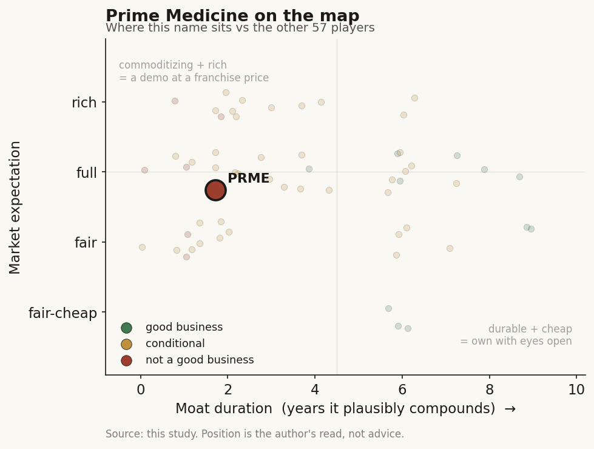

# Prime Medicine (PRME)

> **The read.** Not yet a good business — pre-revenue and capital-hungry with cash into 2027 racing 2027 readouts — priced at a distressed-option expectation, not a franchise, as better-funded peers already hold the human data PRME is chasing.

**Snapshot**

| | |
|---|---|
| Listing | PRME / Nasdaq |
| Region | US |
| Value-chain layer | L9a (target/edit definition) + L9c (candidate selection) |
| Archetype | drug-owner (own-pipeline pre-revenue biotech, milestone + royalty) |
| Size | market cap ~$720m |
| Revenue (latest) | pre-revenue — collaboration only: Q1'26 $0.86m, FY25 $4.6m |
| Moat verdict | conditional |
| Expectation | full (distressed-option) |
| Evidence quality | med-high on financials/runway, med on competitive-timing gap |

## What it is
Clinical-stage gene-editing developer commercializing **prime editing** — a "search-and-replace" edit (David Liu / Broad lineage) that writes a corrective sequence without a double-strand break — into an own-pipeline of one-time genetic-disease therapies. It is the distressed tail of the listed editing cohort: a 2025 restructuring narrowed it to a two-program in-vivo **liver franchise**.

## Business model — how it makes money
It does not yet. Effectively zero product revenue; the only P&L revenue is collaboration recognition — Q1'26 collaboration revenue **$0.86m**, FY25 **$4.6m**, almost entirely the Bristol Myers Squibb (BMS) ex-vivo CAR-T deal. Value is a probability-weighted string of clinical readouts plus, for any winner, a one-time-cure durable annuity if approved.

Growth is **not** organic compounding — it is discrete re-ratings on data events, funded by dilution and partner biobucks (revenue archetype: milestone + royalty / owned-asset binary). ROIC is undefined pre-product; the correct biotech read is **cash vs burn vs next inflection**, not margins. The company is capital-**hungry** with negative cash conversion: CFO is deeply negative, the balance sheet is financed by the BMS upfront/equity and prior equity raises, and any extension needs dilution or a new partner deal. The 2025 RIF + CGD deprioritization was a deliberate burn-cut to stretch runway to the 2027 readouts.

## Financial summary

| | FY24 | FY25 | Q1'26 |
|---|---|---|---|
| Collaboration revenue | — | $4.6m | $0.86m |
| Net loss | $195.9m | $201.1m | $49.1m (vs $51.9m yr-ago) |
| R&D | — | $160.6m | $34.1m (down on the RIF) |
| G&A | — | $52.3m | $17.4m (up on arbitration legal cost) |
| Cash + investments + restricted | — | $191.4m (YE25) | $149.2m (31-Mar-26) |

Annualized gross burn still ~$180-200m. Cash of **$149.2m** at 31-Mar-26 (down ~$42m in one quarter) implies roughly **3-4 quarters** of cushion; runway guided **"into 2027."** BMS economics that actually landed: **$55m upfront + $55m equity** (the up-to-$3.5B biobuck ceiling is optionality, not cash).

## Value-chain position and competition
PRME is a vertically-integrated therapeutic developer sitting **ON** the prime-editing enzyme toolbox (L9a: define the corrective edit; L9c: select the candidate to carry into the clinic) — **not** a tool/reagent vendor. The editor is the analogue of the AI model: increasingly a **commodity input** as the science diffuses from Liu's academic labs; economic value forms one layer down in the **owned clinical asset** the edit enables (PM577 Wilson, PM647 AATD). The real choke point is **not the edit and not efficacy — it is DELIVERY**: the LNP-to-liver route is the only in-vivo path essentially solved, which is exactly why the surviving franchise is liver-only. BMS is the sell-side pharma-distribution layer for the ex-vivo CAR-T optionality (non-dilutive capital + reach).

The cohort shares the modality but not survival odds: CRSP (Casgevy on market + ~$1.5B cash), BEAM (funded into ~2029, human AATD POC in hand), NTLA (positive HAE Phase 3, into 2028) — and **PRME as the laggard**: cash only into 2027, POC not until 2027, price ~$3.99. On AATD specifically, BEAM-302 already has HUMAN proof-of-concept while PRME's PM647 is still preclinical/early with initial clinical data guided to **2027** — roughly ~18 months behind on the most contested shared target. PRME's differentiation is genuinely **mechanistic** (writes wild-type protein, no bystander edits, no double-strand break — a cleaner-safer edit), but "safer/cleaner edit" claims have **not** translated into a clinical lead; the leaders won on delivery/execution/timing, not editor elegance. Its Wilson Disease program is the clearest whitespace (fewer direct editing rivals) but is unproven. Chronic incumbents (siRNA/mAbs) whose refill franchises a one-time cure would displace also compete — and their existence means a cure has **no refill revenue**.

## Moat
Ch5 **Moat 3, CONDITIONAL** — the own-pipeline-against-a-risk-bearing-pharma case, **not** code-ownership / data-flywheel / clearance. This is not a compounding moat in the durable sense. The editor itself commoditizes toward ~0-1 year (open science). What can hold is the **owned clinical asset** — but it is capped by the **~40% Phase-II efficacy wall that has been unchanged for ~30 years**; the platform lets you own more shots on goal, not better odds per shot. Estimated investable duration: a **~2-3yr binary watch sized for asymmetry**, not multi-year compounding. For PRME the moat is the weakest in the cohort — the asset is still preclinical/early, so there is no de-risked owned asset yet protecting anything.

## Core variables
1. **Cash runway vs next value-inflection readout (the master survival variable).** ~$149m into 2027 against POC readouts that also land in 2027 — a runway-vs-catalyst race where **dilution or a partner deal, not the science, decides whether the shot is even taken.**
2. **Lead-program clinical readout (PM577 Wilson / PM647 AATD).** Does 2027 in-vivo POC land, and is it competitive vs BEAM/CRSP on AATD? One binary event re-rates the equity.
3. **Delivery / in-vivo liver validation.** Liver (LNP) is the only paved road; the whole thesis is gated on the liver route working durably and safely in humans — extra-hepatic ambition carries ~zero near-term value.

(Second-order noise held below the line: BMS milestone headlines — up-to-$3.5B is optionality, not cash; PM359/CGD — NEJM data but deprioritized, small few-dozen-patient market; editor-precision differentiation; arbitration legal cost. Do not confuse the $3.5B biobuck ceiling with realized value.)

## Bear case / key risks
The live cautionary tale of the cohort. (1) **The edit being selectable does not make the biology work** — the wall moved from "design the molecule" to "deliver it safely and get a durable benefit," and even in-liver programs carry editing-specific safety tails (off-target/bystander edits, durability/immunogenicity of a permanent change). (2) **Capital intensity is brutal and funding is binary** — a single failed or delayed readout can strand the program AND close the financing window at once. PRME already declared CGD proof-of-concept, then **defunded it**, ran a RIF, changed CEO, and must reach 2027 POC on cash that runs to 2027 — the thinnest runway-vs-catalyst setup in the cohort. (3) **Cure-economics paradox** — even a win is a one-time annuity with no refill: Casgevy, the first approved CRISPR product, generated only ~$116m FY25 despite years of hype, because manufacturing/access friction throttles the ramp. (4) The cleaner, de-risked, better-funded expressions of the same modality thesis are the **peers (BEAM/NTLA/CRSP), not PRME.**

## The expectation read
At ~$3.99 / ~$180.6m shares, market cap is ~**$720m**. Net of ~$149m cash, enterprise value is roughly **~$570m** — i.e. the market ascribes ~half a billion to a preclinical/early two-program liver franchise plus the BMS CAR-T optionality. That implies the market believes PRME **survives to its 2027 POC and that at least one liver program is competitive** — a real but un-de-risked bet, since the cohort leaders already have human data PRME lacks. Where the belief looks soft: (a) the runway ends the same year the catalysts arrive, so a raise into weakness (or a disappointing readout) is a live path — the EV embeds a survival assumption the balance sheet does not yet guarantee; (b) it pays for a franchise still ~18 months behind BEAM on the shared AATD target; (c) the up-to-$3.5B BMS number in headlines vastly overstates cash economics. The 52-week range ($2.67-$6.94) is itself the option-value volatility band around a single 2027 binary.

## Verdict
**Not yet a good business** (pre-revenue, capital-hungry, cash into 2027 against 2027 readouts) at a **distressed-option expectation, not a franchise price** — the EV embeds a survival-plus-one-competitive-readout bet the balance sheet does not underwrite, while better-funded peers already hold the human data PRME is racing toward. Confidence: medium-high on the financials and runway, medium on the competitive-timing gap (moves on each 2027 readout).
