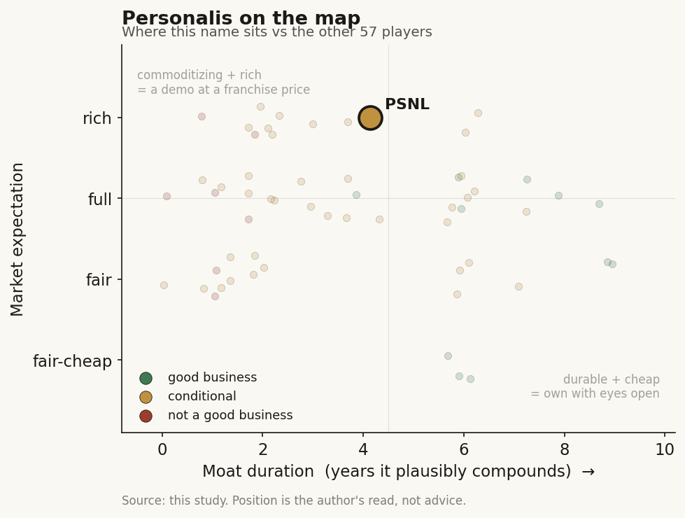

# Personalis (PSNL)

> **The read.** A differentiated MRD technology inside a structurally hard per-test archetype (capital-hungry, reimbursement-gated, late-entrant), priced at a rich ~15x EV/sales that treats a coverage-and-margin crossover as already won while the margin line still says it has not begun.

**Snapshot**

| | |
|---|---|
| Listing | PSNL / Nasdaq |
| Region | US |
| Value-chain layer | L3-L5 (assay/wet-lab -> CLIA lab ops -> AI-bioinformatics interpretation) |
| Archetype | Per-test SaMD / molecular-dx pivoting toward a data-platform |
| Size | ~$1.45B market cap (2-Jul-2026); EV ~$1.21B |
| Revenue (latest) | FY25 $69.6M, -17.7% YoY; Q1'26 $15.5M, -25% YoY |
| Moat verdict | Conditional — coverage-code moat only, commoditizing on the assay/model layer |
| Expectation | Rich |
| Evidence quality | High (FY25 actuals, Q1'26, guidance, coverage rates, multiple all disclosed/dated) |

## What it is
A genomic-sequencing and analytics company (Menlo Park, founded 2011) whose whole equity story now rests on **NeXT Personal** — an ultra-sensitive, tumor-informed liquid-biopsy MRD test for detecting and monitoring cancer recurrence. It is mid-pivot from a legacy biopharma/population-sequencing services shop into a reimbursement-gated clinical MRD franchise.

## Business model — how it makes money
Four revenue streams, one of which is supposed to become the company:
- **Biopharma / oncology services** — sequencing for pharma trials; the historical core. FY25 ~$55.9M (~80% of revenue), and it is **shrinking** (-27% FY25), as the Moderna vaccine trial wound down and a Natera sequencing contract stepped down.
- **VA MVP (population sequencing)** — a lumpy government task-order stream, ~$11.8M FY25 at ~$1,003/sample. Non-recurring in character.
- **Clinical diagnostics (NeXT Dx + NeXT Personal)** — the growth engine, but tiny today: **$2.0M FY25** (~3% of revenue), guided to **$10-11M in FY26**.
- Legacy enterprise/other — de minimis.

**Growth quality — capital-HUNGRY and cash-burning, the archetype's worst quadrant.** This is a per-test fee model: a payer sits between the work and the dollar, and the incremental unit is a wet-lab/reagent/CLIA cost. **Incremental ROIC is negative today** — the company is spending ~$100M/yr to build volume that is only ~50-60% reimbursed, so each incremental test at present coverage *dilutes* GM rather than dropping to contribution. Cash conversion is deeply negative (burn > revenue). The bet is that reimbursement coverage flips the sign: guided GM 15-20% FY26 -> ~31% FY27E as reimbursed mix rises. **The number that decides the thesis is not revenue growth — it is revenue-per-test.** Blended NeXT test ASP was only ~$139 in Q4'25 against a Medicare breast rate of **$3,878 initial / $1,158 follow-on** — the entire equity case is the gap between those two figures closing as coverage expands.

## Financial summary
| Metric | FY24 | FY25 | Q1'26 | FY26 guide |
|---|---|---|---|---|
| Revenue | — | $69.6M (-17.7% YoY) | $15.5M (-25% YoY) | $78-80M (+~13%) |
| Clinical revenue | — | $2.0M | — | $10-11M |
| Gross margin | — | ~22.7% (fell to 10.9% in Q4'25) | — | 15-20% |
| Net loss | — | ~$81.3M | $30.0M | ~$105M |
| Cash burn | ~$47M | ~$74M | — | ~$100M |
| Cash + ST investments | — | $233.2M | — | — |
| Debt | — | $0.9M | — | — |

FY25 gross margin *fell* through the year — the opposite of operating leverage — because unreimbursed NeXT Personal tests cut ~1,800-1,900bps off GM as volume ramped ahead of coverage. Q1'26 was reported 7-May-2026, off a VA-MVP-flattered Q1'25.

## Value-chain position and competition
Vertically integrated across **L3 (assay/wet-lab) -> L4 (CLIA lab operations) -> L5 (AI-bioinformatics interpretation)**. What flows in: patient plasma + a tumor-tissue reference. What flows out: a whole-genome-informed MRD call (tumor-informed, ~claimed part-per-million sensitivity) back to the oncologist. Unlike the data-platform anchors, there is **no material L7 data-licensing annuity** bolted on — Personalis does not monetize a de-identified RWE product at scale, so it lacks the high-margin (~73% GM) leg that justifies a software multiple. It is the interpretive lab, and the interpretive lab is where named-patient liability concentrates and where the reimbursement wall bites.

A **late entrant into a crowded MRD/liquid-biopsy market** it estimates at >$20B, <10% penetrated. Direct competitors: **Natera (Signatera)** — the entrenched tumor-informed MRD leader with broad coverage and ~181k units/quarter scale; **Guardant (Reveal/Shield)**; **Tempus (xM)**; Foundation, Exact/Haystack, and others. Personalis's claimed edge is **analytical sensitivity** — a study in *Annals of Oncology* reported NeXT Personal detected 100% of breast-cancer recurrences a median ~15 months ahead of standard imaging. That is a real, differentiated technical claim. **But sensitivity is not the binding constraint — coverage and commercial reach are**, and there Personalis is years behind Natera. The edge is "better test, later, smaller, under-reimbursed"; it must convert sensitivity into guideline inclusion and payer contracts faster than incumbents defend share.

## Moat
**Regulatory-clearance moat = REFUTED; the survivor is code/coverage ownership, capped by CMS repricing.** Personalis holds no durable moat from being a cleared/validated assay — 1,451 AI/dx devices exist and clearance gates the shelf, not the revenue. Its *only* candidate durable moat is the **reimbursement-code + coverage build**: Medicare coverage for breast (Nov'25) and lung NSCLC (Q1'26), IO-monitoring pending. This is real and scarce, but it is the CONDITIONAL survivor, not a confirmed wide moat — the rate can be repriced DOWN under CMS budget-neutrality (the LumineticsCore -14%/2yr precedent), and each indication is won one MolDx decision at a time. **The data-flywheel moat does NOT apply** — Personalis has no data-licensing product where "the data is the sold product," so it gets none of the ~73%-GM annuity that makes a licensing flywheel. **Durability verdict: coverage moat, indication-by-indication, ~3-6yr of protected compounding per covered indication, conditional on ADLT status and no CMS step-down. Commoditizing on the assay/model layer; durable only on the payment rail.**

## Core variables
Noise discarded: VA-MVP task-order timing, biopharma quarter-to-quarter lumpiness, the sensitivity headline (already known/priced), total-revenue growth (misleading — it is legacy-decline masking clinical-ramp).

**CORE 1 — Medicare/MolDx coverage EXPANSION x ASP realization (the master variable).** Breast + lung are in; the value is in adding **immunotherapy-monitoring, colorectal, and ADLT status**, and in *actually collecting* $3,878/$1,158-class rates instead of ~$139 blended. This single lever turns GM from ~11% toward 30%+ and is the entire re-rating.

**CORE 2 — Clinical test-volume ramp vs cash runway.** Guided **43,000-45,000 tests FY26 (+~170%)** off 16,233 in FY25, 7,815 in Q1'26 (+258% YoY). Volume must compound while ~$233M cash funds a ~$100M/yr burn — **roughly two years of runway**, so a raise or a coverage-driven burn-down is forced inside the thesis window.

**CORE 3 — Reimbursed-mix / gross-margin crossover.** The point where reimbursed tests outweigh unreimbursed ones and each incremental test stops diluting GM. Until that crosses, scaling volume makes the P&L *worse*, not better.

## Bear case / key risks
(1) **It is scaling the wrong side of the reimbursement wall.** Volume +258% YoY while GM collapsed to 10.9% — unreimbursed tests are a ~1,800bps GM drag, so today growth destroys margin. (2) **Late entrant against an entrenched leader** — Natera/Signatera owns the MRD category with coverage and scale Personalis must replicate from behind; sensitivity superiority has not yet translated into share or guideline lock-in. (3) **The high-margin leg that saves the anchor names is absent** — no data-licensing annuity, so there is no ~73%-GM mix to re-rate into; this is a per-test lab, not a data platform, whatever the archetype label suggests. (4) **Runway is finite** — ~$233M against ~$100M/yr burn is ~2 years; a coverage delay (IO/CRC decisions slip, or a CMS step-down) strands the capital-hungry leg below self-funding and forces dilution at a weak price. (5) **The legacy core is shrinking** — biopharma -27% — so clinical MRD is not additive growth, it is a *replacement* race the total-revenue line (+13% FY26E) barely papers over. **Falsification watch:** IO-monitoring/CRC Medicare coverage denied or delayed; GM fails to cross ~20% in FY26; Q/Q clinical volume decelerates below guide; a raise inside 18 months.

## The expectation read
Market cap **~$1.45B (2-Jul-2026)** on ~104.7M shares, net cash ~$233M -> EV **~$1.21B**. Against FY26E revenue ~$79M that is **~15x EV/sales**, and ~12x FY27E (~$99M) — versus small/mid dx peers at a **~2.9x FY26E median**. The stock roughly **doubled off its ~$800M Feb'26 level (~8.8x)** on the coverage wins. At ~15x EV/S on a business with **10-20% gross margin and a ~$105M FY26 net loss**, the market is pricing PSNL as if the MRD coverage flywheel is largely *de-risked* — i.e. that IO/CRC/ADLT coverage lands, ASP steps from ~$139 toward the $1,000-3,900 reimbursed band, GM crosses into the 30s, and volume compounds at ~170% into a Signatera-scale franchise. **Where the belief looks soft:** every one of those is still forward and sequential (one MolDx decision at a time), GM is *falling* not rising, the business is cash-burning with ~2yr runway, and it is competing from behind. The multiple implies the coverage-and-ASP crossover is a when, not an if — but the P&L today (11% Q4 GM, -$30M quarterly loss) shows the crossover has not started to prove out in margin. Sell-side base case itself is ~12x FY27E sales ($12 PT), *below* where the shares now trade — the tape has run ahead of even the bullish model. This is an option on reimbursement priced closer to a certainty.

## Verdict
**A differentiated technology inside a structurally hard (capital-hungry, reimbursement-gated, late-entrant) per-test archetype — a plausible business, but at a RICH expectation: ~15x EV/sales on a ~15%-GM, cash-burning lab prices the coverage-and-margin crossover as already won when the margin line still says it has not begun.** *Confidence: medium-high on the facts; medium on the verdict — the whole call hinges on the pace of MolDx coverage expansion and ASP realization over the next 4-6 quarters, which is genuinely uncertain and binary by indication.*
