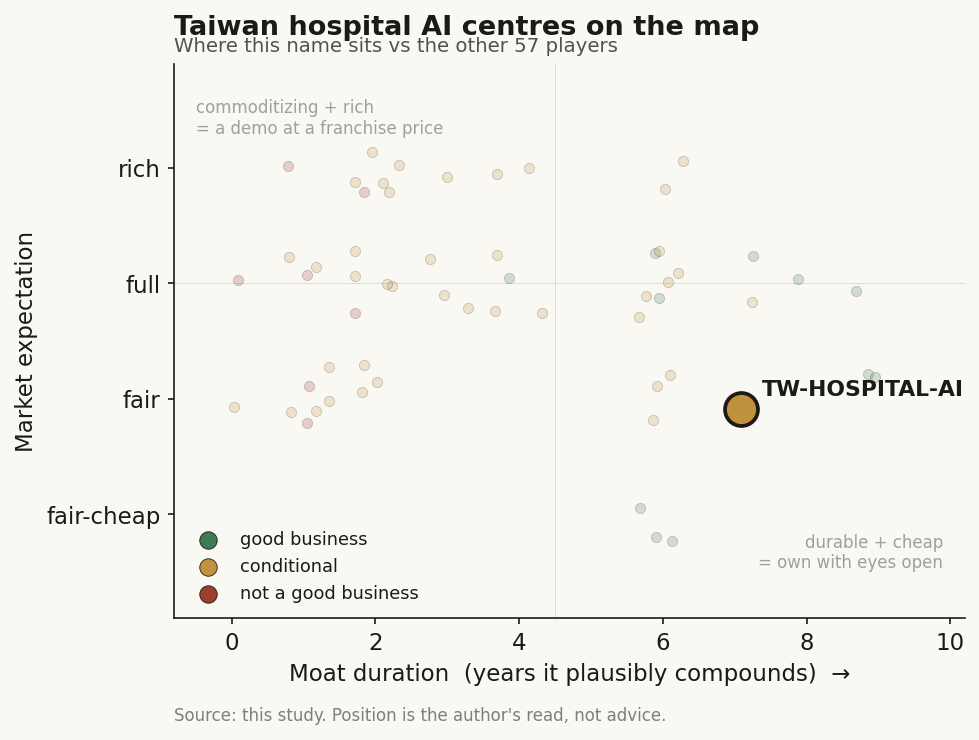

# Taiwan hospital AI centres (private)

> **The read.** A real, deep, two-sided moat that is state-captured and stranded on non-listed public/non-profit balance sheets — a structural node, not a security; use it as the lens for pricing vendors that sell INTO it, never as an exposure.

**Snapshot**

| | |
|---|---|
| Listing | private (not listed, not separable) |
| Region | Taiwan |
| Value-chain layer | L0-L2 (data source + model-build + validation floor) |
| Archetype | AI-services (buyer / data-owner) |
| Size | private — grant-funded cost centres, no standalone valuation |
| Revenue (latest) | private — no disclosed standalone P&L |
| Moat verdict | durable-but-state-captured (un-underwritable) |
| Expectation | fair (no market price) |
| Evidence quality | med (institutional facts) / low-and-honest (economics) |

## What it is

The in-house AI/data centres of Taiwan's flagship medical centres — 臺大醫院智慧醫療中心 (NTUH Smart Healthcare Center), 臺北榮總醫療人工智慧發展中心/大數據中心 (VGHTPE MAIC + Big Data Center), 林口長庚醫療人工智能核心實驗室 (Linkou CGMH "CAIM"). They are the R&D-and-buyer engine of the sector: they own the patient data, build/validate models, run the RCTs, and consume vendor SaMD. They are the demand-side node, not a product company.

## Business model — how it makes money

There is no external revenue model — the "customer" is the hospital's own clinicians and, upstream, the state. Three funding sources: (a) MOHW's 次世代數位醫療平台 3-centre grant program (launched 2024-10-07; 30 hospitals / 48 proposals → 16 hospitals / 19 proposals funded, incl. 臺大/中榮/北榮/成大/中醫大/三總/林口長庚) [disclosed: MOHW cp-16-80155]; (b) hospital operating budget; (c) tech-transfer / licensing when a home-grown model becomes a saleable device (CGMH's route). Any downstream dollar the centre's work unlocks flows through the single-payer: the AI影響性研究中心 exists specifically to generate the RCT + health-economics evidence that feeds an NHI 共同擬訂會議 reimbursement decision. NHI-reimbursement dependence is therefore total but indirect — the centre does not get paid per-use; it manufactures the evidence that decides whether a vendor's device ever does. As economics: a capital-hungry cost centre with no cash conversion and no incremental ROIC to underwrite.

## Financial summary

Not listed and not separable. Each centre is a grant-funded cost centre inside a public hospital (NTUH, VGHTPE) or a non-profit medical foundation (長庚醫療財團法人); none discloses a standalone P&L, revenue, or margin — there is nothing to underwrite as equity. The only disclosed hard numbers are inputs, not outputs.

| Item | Figure | Tag |
|---|---|---|
| NTUH compute spend | ~NT$26m on 2× NVIDIA DGX H200 (activated 2024-12-04, on top of 2× A100 from 2020) | [reported: ETtoday/NOW健康] |
| VGHTPE 大數據中心 | live Jan 2019, structured to mirror the NHI database schema | [disclosed: VGHTPE] |
| CGMH CAIM | running since May 2018 on ~380k-record modelling sets | [reported: CGMH/天下] |
| Standalone economics | absent by construction | [unverified] |

## Value-chain position and competition

L0-L2 = the data source + model-build + validation floor of the TW genomics/imaging chain. What flows OUT: (i) de-identified patient data and images (the raw substrate — though state-governed); (ii) built-and-validated models (NTUH's own LLM → ICD-10 auto-coding ~86.67% F-score, health-report and ED-record generation; CGMH's 3 TFDA-cleared devices; VGHTPE's patient-safety AI); (iii) the RCT/health-economics evidence that gates reimbursement. What flows IN: vendor SaMD from the listed pure-plays (Ever Fortune, aetherAI, Acer Medical VeriSee, Amcad) — the centres are these vendors' primary validation partner and reference buyer. The MOHW 3-centre split maps 1:1 to the three sequential gates the whole market must clear: 負責任AI執行中心 (落地/explainability) → 臨床AI取證驗證中心 (取證/TFDA-representative datasets) → AI影響性研究中心 (健保支付/NHI evidence).

Among themselves these three are complementary, not competing — MOHW deliberately spread the 19 funded proposals across ~16 institutions. The competition is between the hospitals as data-and-validation gatekeepers and the players who want to build directly on hospital data without them: the ICT large-caps (Quanta QOCA cloud, Foxconn CoDocator foundation model, ASUS AICS coding) that try to own the L0-L2 rails, and the US L0 hyperscalers selling in — most concretely Alphabet's "AI照護網" chronic-care partnership (5-6m patients from Mar 2026) and NVIDIA (whose DGX boxes sit inside NTUH). The centres' leverage over all of them is the same: nobody reaches Taiwanese clinical data at scale except through a hospital that holds it, and (for reimbursement) through the AI影響性研究中心 that runs the savings RCT.

## Moat

Real, but not investable. The moat is genuine and two-sided: (a) privileged custody of large, longitudinal, single-payer-linked clinical data (CGMH ~380k-record sets, NTUH/VGHTPE structured to the NHI schema); (b) the state-conferred gatekeeper role — under the MOHW 3-centre architecture these hospitals ARE the certification-and-reimbursement evidence chokepoint. But the test is whether the moat accrues to *equity*, and here it does not. The data itself is a STATE-captured moat, not a company-captured one: the 全民健康保險資料管理條例 (三讀 2025-12-02: opt-out right, 30-day freeze, fines to NT$10m) plus two-stage on-site release keep the ~70bn-claim / >3bn-image set under state control — no listed name can build a proprietary NHI-data annuity. The hospital-level moat is real but sits inside non-listed public/non-profit balance sheets. This is the canonical TW-data pattern: the moat exists, it is deep, and it is un-buyable — do not import the Tempus L7 data-annuity read to any TW name touching this layer.

## Core variables

The three that actually move the thesis for anyone underwriting a vendor *into* these centres:
1. **NHI reimbursement decisions the centre's RCTs produce** — the CT intracranial-haemorrhage cost-effectiveness read (targeted year-end) is the first test of whether pure diagnostic-triage AI clears the "must-save-the-payer-money" gate; a yes re-rates every vendor selling through these hospitals.
2. **Hospital validation/contract wins** — which vendor SaMD each centre picks as its reference deployment (the reference sale that de-risks the rest of the TW market).
3. **Export ability beyond TW** — whether a model built on this data can be re-certified and sold outside Taiwan (CGMH/NTUH tools carrying US-FDA as well as TFDA), the only path by which the data advantage converts into a scalable, non-single-payer-capped revenue line.

Watchlist (noise excluded from CORE): MOHW grant continuity/scale; DGX/compute build-out; TFDA-device output; cross-hospital FHIR interoperability progress; opt-out (退出權) take-up rate (a high opt-out rate thins the data substrate).

## Bear case / key risks

Not a security, so the bear case is for anyone treating "access to 台大/北榮/長庚 data" as a thesis: the data is state-locked and now opt-out-encumbered (NT$10m fines), so the advantage can't be privatised; the centres are grant-dependent cost centres whose funding can be cut; their own output competes with the vendors that sell to them (build-vs-buy — CGMH already self-certifies devices); the single-payer caps the downstream dollar these centres unlock (global budget ~7% of GDP, zero-sum); and the FHIR/SMART state rail erodes any single hospital's integration-depth moat by design. The value is real and stranded on a non-investable balance sheet.

## The expectation read

There is no market price to imply anything from — the object is a grant-funded cost centre with no standalone P&L, by construction. What the *sector* prices off this node is the belief that hospital-data access converts into a durable vendor annuity; that belief looks soft precisely where the data is state-captured. Anyone paying up for a listed name on "台大/北榮/長庚 data access" is underwriting a moat that lives on someone else's non-listed balance sheet. The fair reading is a non-investable node priced at its true role: a lens, not an exposure.

## Verdict

Structural node, NOT a security — the demand-side buyer/gatekeeper whose moat is real-but-state-captured and therefore un-underwritable; use it only as the lens for pricing vendors that sell INTO it, never as an exposure. Data-confidence: MEDIUM on the institutional facts (each centre, the MOHW program structure, the compute spend, the device counts are primary/press-anchored), but LOW-and-honest on economics — there is no disclosed standalone P&L to grade, by construction, not by gap in our search. Coverage is thin because the object is thin, and that thinness is the finding.
