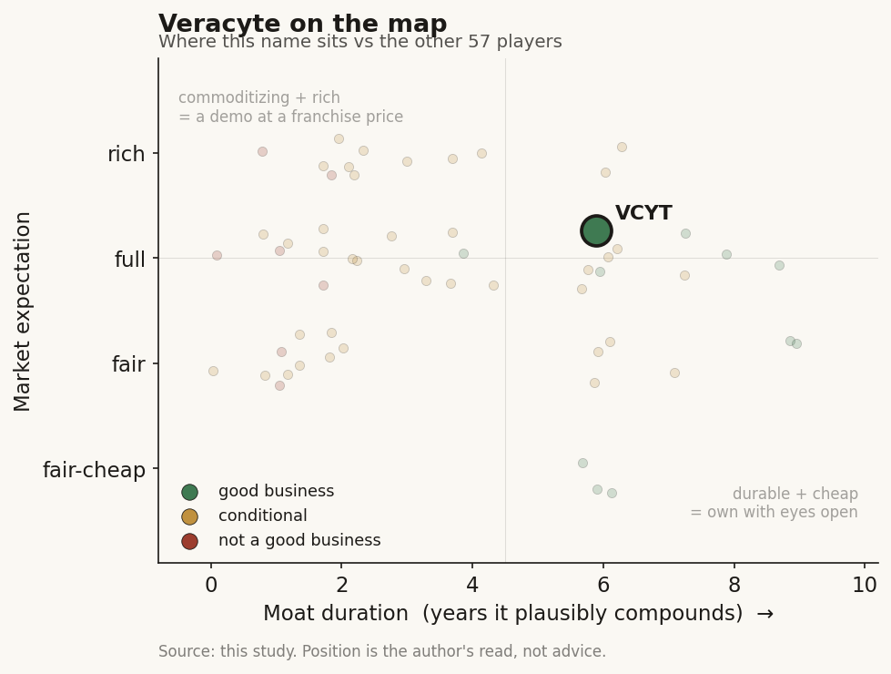

# Veracyte (VCYT)

> **The read.** A genuinely good business — GAAP-profitable, self-funding, ~76% gross margin, coverage-moated core — priced at a full-to-rich expectation that already banks an MRD re-acceleration the guide does not show.

**Snapshot**

| | |
|---|---|
| Listing | VCYT / Nasdaq |
| Region | US |
| Value-chain layer | L3-L5 (assay/wet-lab -> CLIA lab operations -> interpretive AI classifier) |
| Archetype | SaMD / AI-services diagnostics (per-test fee) |
| Size | Market cap ~$4.78bn; EV ~$4.38bn |
| Revenue (latest) | FY25 $517.1m, +16%; Q1'26 $139.1m, +21% |
| Moat verdict | Conditional — durable on core, contested on MRD |
| Expectation | Full-to-rich |
| Evidence quality | High |

## What it is
A US molecular-diagnostics company that runs genomic classifiers on tissue/cytology samples in its own CLIA labs — genomic signatures interpreted by ML models, billed per test to payers. The two cash engines are Decipher (prostate) and Afirma (thyroid); the growth frontier is whole-genome MRD.

## Business model — how it makes money
Per-test clinical-lab economics, not software. Veracyte is paid per resulted test, mostly by Medicare + commercial payers — the classic 3-way split (payer pays, urologist/endocrinologist decides, patient benefits), reimbursement-gated. Testing is ~97% of revenue, so this is a pure clinical-lab, not a data-licensing annuity.

Capital intensity is medium: CLIA labs + reagents are real, but the model is built (opex is R&D $27.1m + SG&A $50.8m/qtr, largely fixed), so incremental test volume drops at ~76% GM to a mostly-fixed cost base — high incremental margin, positive incremental ROIC. Cash conversion is clean: FY25 OCF $136.3m vs $66.4m net income (~2x), D&A + working-capital-light. This is GAAP-profitable and self-funding — the rare per-test name that has already crossed the crossover peers are still chasing.

## Financial summary

| Metric | Q1'25 | FY25 | Q1'26 |
|---|---|---|---|
| Total revenue | — | $517.1m (+16%) | $139.1m (+21%) |
| Testing revenue | — | $493.2m (+18%) | $135.1m (+26%) |
| GAAP gross margin | 69% | — | 73% |
| Non-GAAP gross margin | — | — | ~76% (+350bp YoY) |
| Adj EBITDA | — | $142.5m (27.6% margin, +55%) | $42.8m (30.8% margin) |
| GAAP net income | — | $66.4m (+175%) | $28.7m |
| Operating cash flow | — | $136.3m | $35.2m |
| Cash + ST investments | — | — | $439.1m (no debt of note) |

Segment detail (FY25): Decipher $310.7m, +27% (~102k tests, +27%); Afirma $172.9m, +9% (~67.7k tests, +11%). Q1'26 product $3.7m; biopharma/other $0.3m. Growth is Decipher-led, and mostly volume + coverage, not price. Gross margin sits at the high end of the per-test band (~40-62% cited for a sequencing-heavy peer) because tissue classifiers carry lower per-test wet-lab cost than sequencing-heavy CGP.

## Value-chain position and competition
Veracyte sits across L3 (assay/wet-lab) -> L4 (CLIA lab operations) -> L5 (interpretive AI classifier), vertically integrated. What flows in: tissue/cytology + the genomic signal; what flows out: a binary risk call (aggressive vs indolent prostate cancer; benign vs suspicious thyroid nodule) that changes a treatment decision. The named-patient interpretive liability concentrates at L5 — but so does the value, because the classifier plus the coverage behind it is the product. It does not reach L7 (no pharma-RWE data-licensing annuity of scale) — the ceiling on its re-rating.

Competition is category-specific, not one megacap rival:
- **Prostate (Decipher):** the category leader, guideline-included (NCCN), the anchor franchise. Competes with a large-cap diagnostics rival's Oncotype/Prostate positioning and MDxHealth, but Decipher has the coverage + guideline lead.
- **Thyroid (Afirma):** duopoly vs Interpace/ThyroSeq; mature, single-digit-volume growth — the slow-grower in the mix.
- **MRD (TrueMRD, launched Jun 2026):** enters a crowded, faster-moving field vs Natera Signatera (dominant, ~181k units/qtr scale at peers), Guardant, Exact, and Personalis (which already holds Medicare coverage in NSCLC + breast). Veracyte is a late entrant here off a small base.

Edge: guideline inclusion + Medicare coverage on the core urology/thyroid franchises, and GAAP profitability that lets it self-fund the MRD build without dilution. Lack: no MRD scale lead, no data-licensing leg, no reimbursement monopoly.

## Moat
Two moats are in play. The bare FDA/clearance moat is refuted (~0 yr) — clearance is a crowd; it gates the shelf, not the revenue. What actually protects Veracyte is reimbursement-code + coverage ownership + guideline inclusion (~5-8 yr, CMS-repricing-capped): Decipher's Medicare coverage + NCCN guideline status is the real barrier — years of sunk prospective evidence and payer contracting a new entrant must replicate. This is durable but conditional: a permanent code can be repriced down under CMS budget-neutrality (sector precedent: autonomous-DR CPT -14% over two years).

A data-flywheel does not apply as a moat — Veracyte sells the test, not the data; no RWE annuity. Duration estimate: ~5-8 yr on the core franchises (durable on prostate/thyroid), commoditizing/contested on MRD (unproven).

## Core variables
1. **Decipher volume + coverage durability (the master variable).** ~$310m, +27%, ~97% of the growth engine; its NCCN + Medicare position is the moat. Any coverage/ASP step-down here breaks the thesis.
2. **MRD (TrueMRD) traction vs the incumbents.** Whether a late, whole-genome MRD entrant takes real share from Signatera/Personalis, or stalls — this is the entire growth-duration debate once prostate/thyroid mature.
3. **Margin/EBITDA sustainability through the MRD spend ramp.** Can it hold >26% adj EBITDA margin (30.8% in Q1'26) while funding the MRD build — does the profitable core subsidize the growth bet without eroding the P&L that justifies the multiple.

*(Second-order, held below the line: Afirma's slow ~9% growth; Prosigna/Decipher-Bladder optionality; Percepta nasal-swab (still CLIA-study only, no revenue); biopharma/product line at <3% of revenue.)*

## Bear case / key risks
Veracyte is a mature two-franchise lab whose growth is decelerating into a crowded frontier. (1) The core is maturing: Afirma is single-digit; company guidance implies FY26 total growth decelerates to 13-14% (testing 16-18%) from FY25's +16-18% — the +21-26% Q1 headline is not the run-rate. (2) The re-rating leg is MRD, where Veracyte is a late entrant against a scaled incumbent (Signatera) and a coverage-ahead rival (Personalis) — a per-test share fight, not a data-network annuity. (3) The whole business is reimbursement-gated and CMS can price the codes down (the -14% autonomous-DR precedent). (4) There is no L7 data-licensing leg to justify a software multiple — it is a per-test lab, correctly, and should clear at a lab multiple, not a platform one.

Falsification / scenario-B to watch: a Decipher coverage or ASP step-down; MRD traction stalling below a credible share; adj EBITDA margin compressing through the MRD spend.

## The expectation read
Market cap ~$4.78bn, EV ~$4.38bn; EV/sales ~8x, EV/EBITDA ~39x, fwd P/E ~35x (Jul'26). At ~8x sales / ~39x EBITDA on a business guiding to 13-14% total revenue growth, the market is pricing Veracyte closer to a durable-compounder / platform than to a maturing per-test lab. The implied belief: (a) MRD becomes a real second growth leg that re-accelerates the top line, and (b) coverage + margins hold through the ramp.

Where the belief looks soft: the growth guide is deceleration, not acceleration; the re-rating leg (MRD) is a late entrant in a share fight, not an annuity; and there is no data-licensing leg to earn a software multiple. An ~8x-sales tag on mid-teens per-test-lab growth leaves little cushion if MRD disappoints or a core code is repriced.

## Verdict
A genuinely good business (GAAP-profitable, self-funding, ~76% GM, coverage-moated core) priced at a full-to-rich expectation — the multiple already banks an MRD re-acceleration the guide does not show. Confidence: medium-high on the quality/financials (company-disclosed, GAAP-profitable, clean cash conversion); medium on the expectation read (MRD traction and CMS repricing are the two open variables that decide whether ~8x sales is earned or paid forward).
