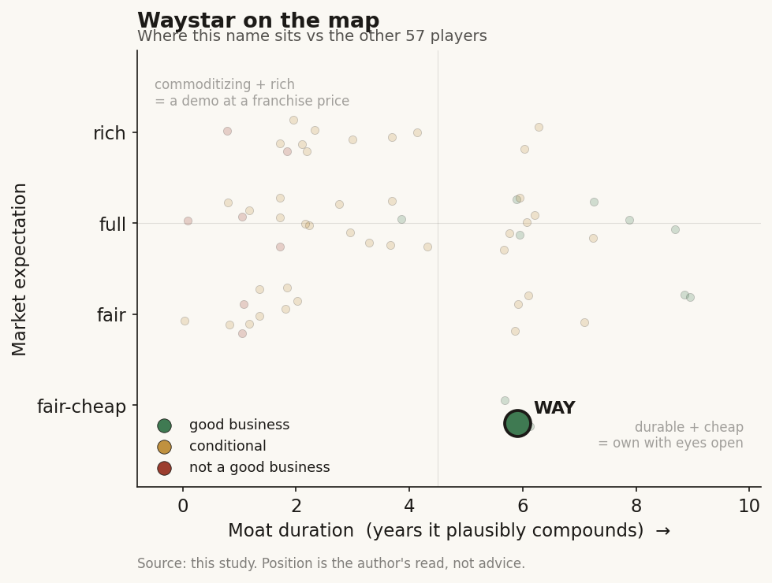

# Waystar (WAY)

> **The read.** A genuinely profitable, capital-light owner of the payer claims-to-cash rail — a good business at a fair-to-slightly-cheap expectation, provided ~112% NRR holds against Epic envelopment.

**Snapshot**

| | |
|---|---|
| Listing | WAY / Nasdaq |
| Region | US |
| Value-chain layer | L8 — payer/claims-to-cash rail |
| Archetype | workflow (savings-share/volume overlay on a recurring-SaaS core) |
| Size | ~$4.5bn market cap; EV ~$5.8bn |
| Revenue (latest) | FY25 $1,099.3m, +17% YoY |
| Moat verdict | durable but conditional (owned payer rail; Epic/take-rate capped) |
| Expectation | fair-to-slightly-cheap |
| Evidence quality | high (company-disclosed, internally consistent) |

## What it is
Cloud revenue-cycle-management (RCM) software that sits between ~1 million U.S. providers and the payers, automating the claims-to-cash workflow: eligibility, claim submission/scrubbing, denials/appeals, prior-auth, and patient payments. It owns a money-flow rail, not a clinical-decision or reimbursement-code product.

## Business model — how it makes money
Two revenue lines. **Subscription** $558.4m (+22% YoY, ~51% of revenue) is the per-provider/per-seat SaaS recurring core; **Volume-based** $534.8m (+11% YoY) is per-transaction fees on claims/payments run across the network. FY25 total revenue $1,099.3m, +17% YoY; Q1'26 $313.9m, +22%, with Subscription accelerating to +37.7% ($172.2m).

The economics are the durable side of the taxonomy: the buyer (the provider) IS the beneficiary — gets paid faster, fewer denials — no reimbursement code gates the dollar, and the volume leg grows with claim throughput. Buyer = beneficiary, no reimbursement wall, capital-light.

Growth quality is genuinely high. GAAP net income $112.1m (10% margin) and non-GAAP net income $262.9m in FY25 — a profitable healthcare-AI name, rare in the cohort. Adjusted EBITDA $462.1m, 42% margin (Q1'26 stepped to 43%, $135.4m). NRR 112% FY25 / 111% Q1'26 — land-and-expand within the base is real, not new-logo dependent. Gross margin ~68-69%, software-grade not lab-grade.

Capital intensity is light: no wet lab, no reagents, no reimbursement adjudication risk on its own P&L. Unlevered FCF $365m FY25 at a 79% adj-EBITDA-to-uFCF conversion, above the ~70% long-term target; operating cash flow $310m. Incremental ROIC is high on the organic base; the qualifier is that scale was partly bought (Olive AI assets 2023, prior roll-ups under sponsor ownership), so reported growth blends organic and acquired — read Subscription NRR (112%) as the cleaner organic-durability signal.

## Financial summary

| Metric | FY25 | Q1'26 |
|---|---|---|
| Total revenue | $1,099.3m (+17% YoY) | $313.9m (+22% YoY) |
| Subscription revenue | $558.4m (+22% YoY, ~51%) | $172.2m (+37.7% YoY) |
| Volume-based revenue | $534.8m (+11% YoY) | — |
| GAAP net income | $112.1m (10% margin) | — |
| Non-GAAP net income | $262.9m | — |
| Adjusted EBITDA | $462.1m (42% margin) | $135.4m (43% margin) |
| Net revenue retention | 112% | 111% |
| Gross margin | ~68-69% | — |
| Unlevered FCF | $365m (79% conversion) | — |
| Operating cash flow | $310m | — |

## Value-chain position and competition
Waystar owns the **claims-to-cash rail** (L8): what flows through it is the money and the adjudication metadata between provider and payer — >7.5 billion transactions/yr, >$2.4 trillion in gross claims/yr, spanning ~60% of U.S. patients. It sits against the payer, the one counterparty the EHR platform (Epic) does not own. Providers plug in above; payers connect on the far side; Waystar owns the pipe and the reconciliation logic in the middle.

It competes with Change Healthcare / Optum (the scaled incumbent, hobbled by the Feb-2024 ransomware outage that pushed volume to Waystar), Availity (payer-owned clearinghouse), R1 RCM (services-heavy, taken private 2024), Experian Health, FinThrive, athenahealth's embedded RCM, and — increasingly — Epic, which is extending native RCM/claims features and has publicly sparred with Waystar (patent-infringement friction).

Its edge is breadth of payer connectivity plus install-base switching cost (re-wiring money flow and re-clearing payer adjudication is painful and risky) plus a clean, single-platform alternative to the compromised Change/Optum rail. It is not a per-code monopoly and not a clinical-decision moat — the edge is plumbing incumbency, and it partly benefited from a rival's outage rather than pure product superiority.

## Moat
Ch5 Moat-2 (workflow embedding/distribution), durable side — "owns the workflow, not rents a slot." Waystar is the named survivor: it owns the claims-to-cash rail against a payer Epic does not own, so the switching cost is the cost of re-plumbing money flow, not a rented EHR integration surface. This is workflow ownership, not the commoditizing model (~1yr), the drug-discovery data flywheel (~1yr), or the bare clearance (0yr).

Durable but conditional, not permanent. The savings-share/volume archetype bear applies: volume economics quietly revert toward per-transaction SaaS as take-rates on commoditized automation compress, and the layer above (Epic) can extend into RCM. The moat is the payer-connectivity graph plus switching cost, not the AI features (which are table-stakes, not defensible).

Estimated duration: ~5-7 years of protected compounding (owned-workflow band), capped by (a) Epic/payer-native envelopment risk and (b) automation-take-rate compression on the volume leg.

## Core variables
- **Subscription NRR at price (the decisive number).** 112% / 111% today. Land-and-expand within the ~30,000-client base (1,391 clients >$100k, +16% YoY) is the entire durable-value case. If NRR holds >110% through Epic's RCM push, the moat is confirmed; if it drifts toward 100%, the thesis is just a clearinghouse.
- **Volume-leg take-rate durability.** The +11% volume line is where automation-price-compression bites first. Watch revenue-per-transaction, not transaction count — count can rise while price erodes.
- **Epic / payer-native envelopment of RCM.** The one structural threat to an L8 rail: does the platform above or the payer beside extend far enough into claims to reset the anchor.

(Noise held below the line: quarterly EBITDA-margin ticks, the Change/Optum outage tailwind (one-off), AI-feature launches, sponsor-overhang selldown mechanics.)

## Bear case / key risks
It is a profitable clearinghouse being asked to defend a growth-software identity while three things compress at once. (1) Growth is decelerating and partly borrowed — FY25 +17% (Q1'26 +22% flattered by Subscription mix and easy comps); the volume leg is a mid-single/low-double-digit utility, and a chunk of the multi-year re-rate leaned on the Change Healthcare outage redirecting volume, a one-off not a durable share gain. (2) Take-rate compression — as claim-automation commoditizes, per-transaction economics revert toward thin SaaS; NRR at 111-112% is good but not hyperscaler, and it is slipping (112->111). (3) Envelopment from above — Epic is extending into RCM and has active IP friction with Waystar; the payer-owned clearinghouse (Availity) sits on the other flank. (4) Sponsor overhang plus leverage — net debt ~$1.33-1.39bn against ~$160m cash, adj-net-leverage ~2.7x; sponsor stock is still being distributed into a falling tape (shares -40% over 52 weeks, ~$41->~$23).

The falsification event: NRR breaks below ~105%, or Epic ships a good-enough native RCM claims product that CIOs consolidate onto — at which point the L8 "owns the rail" premium collapses to a utility multiple.

## The expectation read
At ~$23/share, ~$4.5bn market cap, EV ~$5.8bn, the multiple has already compressed hard: ~14x forward P/E and ~14x EV/EBITDA on the ~$530-540m FY26 adj-EBITDA guide (vs ~35x trailing GAAP P/E). What the tape now implies: the market has moved from pricing Waystar as a durable-compounder RCM platform to pricing it much closer to a profitable-but-maturing utility — a ~14x EV/EBITDA name growing high-teens with 42% margins.

Where the belief looks soft, both ways: the bull soft spot is that 14x forward on 42%-margin, 79%-cash-conversion recurring revenue with 112% NRR is a low bar if the owned-payer-rail moat is real and Epic does not envelop it — the compression may over-extrapolate the outage tailwind rolling off. The bear soft spot is that the same 14x is not obviously cheap if the volume leg is a compressing utility and NRR is drifting toward 100% under platform pressure — in which case the multiple is fair-to-full for a decelerating clearinghouse. The disagreement is entirely NRR-at-price x Epic envelopment; the multiple is the residual of which one the reader believes.

## Verdict
Good business — genuinely profitable, capital-light, owned-payer-rail moat, the durable survivor — now at a fair-to-slightly-cheap expectation IF the ~112% NRR holds against Epic; the entire debate is whether the L8 rail is enveloped or the volume take-rate compresses. Confidence: medium-high on the financials and moat type (company-disclosed, internally consistent); medium on durability, because NRR is already easing (112->111) and the Epic-RCM/take-rate threats are real but not yet in the numbers.
