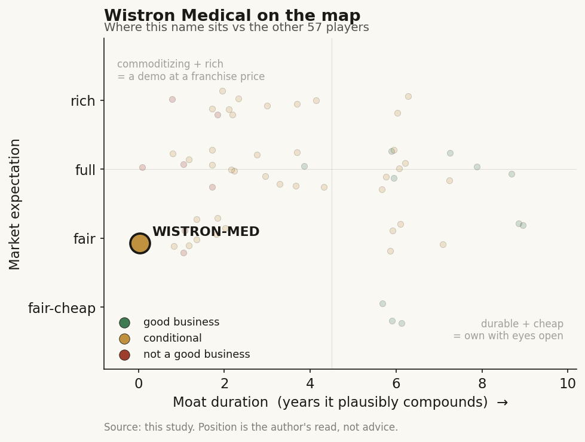

# Wistron Medical (緯創醫學, 3231 TT — parent only)

> **The read.** A credible, real dialysis-AI operating business that is structurally uncapturable by an equity holder — unlisted, undisclosed, and gated by the same NHI single-payer wall; the only vehicle (3231) is an AI-server bet, not a healthcare-AI one. Not investable for the healthcare thesis.

**Snapshot**

| | |
|---|---|
| Listing | private subsidiary; only vehicle is parent 3231 / TWSE |
| Region | Taiwan |
| Value-chain layer | L1 (data source + hardware ODM), L5–L6 (AI interpretation + clinical workflow) |
| Archetype | picks-and-shovels / AI-services (hardware + workflow enabler) |
| Size | parent FY2025 consolidated revenue ~NT$2.19tn; medical subsidiary paid-in capital NT$500m |
| Revenue (latest) | medical standalone unverified/undisclosed; parent FY2025 ~NT$2.19tn (+108% YoY) |
| Moat verdict | commoditizing / real-but-not-investable (state-captured) |
| Expectation | fair (no separate medical price to over- or under-price) |
| Evidence quality | low |

## What it is

緯創醫學科技 (Wistron Medical Technology) is Wistron's medtech arm — a medical-device OEM/ODM contract manufacturer plus an AI smart-care software leg built on the parent's ICT (IoT + big-data + hardware) capability. Its flagship own-IP product is an AI intradialytic-hypotension (透析中低血壓) prediction / CKD care system (BestShape); it also does IVD, imaging, physiological-signal devices, medical-data interface software (IntelliBridge), and exoskeleton robotics.

Ticker caveat that changes everything: **3231 TT is the PARENT, Wistron Corp (緯創資通), not Wistron Medical.** The medical business is Wistron Medical Technology (緯創醫學科技), a wholly-owned, unlisted subsidiary founded 2016, paid-in capital NT$500m [disclosed: company registry / 台灣公司網]. There is no separately traded medical equity — the only way to own it is to own 3231, where the medical economics are immaterial and undisclosed. This is the single most important fact in the profile and the reason evidence quality is low.

## Business model — how it makes money

Two engines, both not-yet-NHI-monetized at scale:

1. **Medical-device OEM/ODM** — the parent's contract-manufacturing model applied to medtech (build others' devices); buyer = the device brand/OEM customer, paid on a manufacturing/BOM basis. This is picks-and-shovels; it does not touch NHI reimbursement.
2. **AI smart-care software (BestShape / dialysis)** — sold into hospitals/clinics as a care-management + AI-alert system. Who pays here is the unsolved question. A pure diagnostic/alert AI in Taiwan has no software-service NHI code — the only proven payment template is a per-use 特材 (special-material) point value bundled to a procedure (the Edwards Acumen HPI precedent, 8,593 points from 2023-07-01). Wistron's hypotension-prediction AI is the same clinical category as Edwards HPI, so the template exists — but there is no evidence [unverified] that Wistron's product has cleared the 共同擬訂會議 gate or earns an NHI point value. Today it most plausibly sells as hospital enterprise software / project revenue, i.e. the buyer (hospital budget), not the payer (NHI), pays.

Growth quality: the only genuinely durable, capital-heavy asset is the parent's ODM cost/scale, which accrues to 3231's AI-server business (a thin ~5.2% gross-margin, contract-manufacturing structure), not to any medical re-rate. The medical arm's economics are not disclosed and cannot be underwritten for ROIC, cash conversion, or capital intensity.

## Financial summary

Medical subsidiary is unlisted; standalone revenue / margin / profitability are [unverified] — Wistron does not break out a medical segment. Treat any medical P&L as non-existent in the public record. The only investable vehicle is the parent, whose numbers are shown for context.

| Item | Figure | Tag |
|---|---|---|
| Medical subsidiary founded | 2016 | disclosed: registry |
| Medical subsidiary paid-in capital | NT$500m | disclosed: registry |
| Medical standalone revenue / margin / profit | not disclosed | unverified |
| Parent (3231) listing | TWSE 2003-08-19 | disclosed |
| Parent FY2025 consolidated revenue | ~NT$2.19tn, +108% YoY | reported: 理財周刊 / CMoney |
| Parent FY2025 EPS | NT$9.04 (record) | reported: 理財周刊 / CMoney |
| Parent 2026 revenue (sell-side est.) | ~NT$3.1–3.7tn | estimate: sell-side, unverified |
| Parent 2026 EPS (sell-side est.) | ~NT$14.3–14.6 | estimate: sell-side, unverified |
| Parent Q1'26 gross margin | ~5.2% (thin, contract-mfg) | reported |

Hospital / clinic deployments (role, not financials): Taipei Veterans General (北榮) built a real-time dialysis-AI risk-prediction system (targets ~95% accuracy, ~200 dynamic physiological/machine inputs) [reported: VGHTPE / CIO Taiwan]; a clinic-market push via BestShape cloud (partnered with 台大智活 / NTU iNSIGHT, design-thinking co-creation) [disclosed: NTU]; a 產學 MOU with Taipei Medical University (北醫) to deploy self-developed devices [reported: UDN 2024]. These are pilots/deployments, not disclosed revenue.

## Value-chain position and competition

Position (Ch2 layers):
- **L1** — the device-OEM and IoT/sensor leg (mmWave BestShape VS vitals monitor) sits at the data-origination + hardware layer.
- **L5–L6** — the dialysis low-BP prediction model (L5) wrapped in a case-management/inventory/alert workflow (L6, BestShape) + IntelliBridge data-interface middleware feeding hospital systems.

What flows: patient physiological data (in) → ODM-built devices and an AI risk-alert + care-coordination layer (out) → hospital systems. It is a hardware + workflow enabler, not an assay owner (no L3/L4) and not a drug/data-licensing play (no L7/L9).

Competition:
- **vs TW listed pure-plays:** unlike Ever Fortune (6841), aetherAI (7803), Acer Medical (6857), Amcad (4188) — directly tradable SaMD licence-accumulators — Wistron Medical gives no clean exposure (buried in 3231). On the dialysis-AI product itself, competition is thin domestically (北榮's in-house build is a partner-not-rival; the category is niche).
- **vs parent-buried peers:** closest analog to ASUS AICS (2357), Quanta QOCA (2382), Foxconn CoDocator (2317) — all four are ICT giants folding a medtech/AI-services arm into an undisclosed segment. Wistron's differentiator is device OEM/ODM manufacturing depth + a specific dialysis clinical product, vs Quanta's cloud/compute or ASUS's coding/RCM tilt.
- **vs US players selling into TW:** the hardware/ODM leg competes on cost against global contract manufacturers, not against US healthcare-AI names. On the dialysis clinical side, Edwards (Acumen HPI) is the incumbent that already holds the standing NHI 特材 payment for hypotension-prediction — so a US player has, if anything, the reimbursement beachhead Wistron lacks. That is a competitive disadvantage worth naming.

## Moat

Thin, and honest about why. The four Ch5 tests:
- **Hospital-data access?** Real but not company-captured. The dialysis model was trained on medical-centre data (北榮 etc.), but the NHI/hospital data set is a state-captured moat — no listed TW name can build a proprietary data annuity off it. Access ≠ ownership.
- **NHI relationship?** No evidence of a standing NHI payment [unverified]. The Edwards template shows the category can be paid, but Wistron has not demonstrably cleared the single-payer binary gate. Until it does, there is no reimbursement moat.
- **Switching cost / integration depth (L6)?** Some — IntelliBridge middleware + hospital-system integration create stickiness — but the state-mandated FHIR/SMART interoperability rail is actively eroding single-vendor integration moats in Taiwan.
- **Manufacturing scale (parent)?** The one genuinely durable asset is the parent's ODM cost/scale — but that is an ICT-manufacturing moat, not a healthcare-AI moat, and it accrues to 3231's server business, not to a medical re-rate.

Verdict: the TW-data-access story is real-but-not-investable — the classic Taiwan pattern. The moat that exists (state data access, hospital relationships) cannot be capitalized by an equity holder; the moat an equity holder could underwrite (proprietary data annuity, standing NHI code) is absent. Duration on the investable side is effectively zero.

## Core variables

1. **NHI reimbursement decision on the dialysis / hypotension-prediction AI.** Does it clear the 共同擬訂會議 gate and earn a 特材 point value (Edwards-HPI-style), or stay hospital-budget software forever? This is the binary that would convert it from a project to a product. Status: no evidence of clearance [unverified].
2. **Hospital/clinic contract wins beyond pilots.** BestShape moving from 北榮/北醫/台大智活 co-creation into paid multi-site clinic rollout at disclosed scale. Pilots ≠ revenue.
3. **Export ability beyond Taiwan.** The device-OEM/ODM leg is inherently global; the question is whether the AI care product can travel (it faces a fresh regulatory + reimbursement gate in every market — US CMS wall, EU AI-Act/MDR tax). Absent export, TAM is capped by a single-payer, global-budget (~7% GDP) system.

Excluded as noise: parent AI-server cyclicality (dominates the tradable P&L and completely swamps any medical signal); TFDA SaMD re-registration friction on model updates.

## Bear case / key risks

- **You cannot buy it.** The only vehicle is 3231, where medical is immaterial — you'd be buying an AI-server contract manufacturer on a ~5% gross margin and hoping the medical arm one day matters. It won't move the stock.
- **No disclosed medical economics** — revenue, margin, profitability all [unverified]. Nothing to underwrite.
- **No standing NHI payment** — the AI-care product sits on the wrong side of the chokepoint (no software-service code; savings-RCT gate; ~2yr9mo lag; zero-sum global budget). Edwards already holds the one relevant 特材 slot.
- **The moat is real-but-not-investable** — state-captured data, state FHIR rail eroding integration lock-in.
- **Dialysis-AI is a niche** inside a capped envelope; even full domestic success is a small absolute number against Taiwan's <NT$600m listed-pure-play TAM.

## The expectation read

There is no separate medical multiple to read — the medical arm carries zero disclosed value inside 3231, and the market is not pricing a healthcare-AI option in the stock. What the current 3231 valuation implies is an AI-server / rack-integration belief (FY2025 ~NT$2.19tn, +108% YoY, EPS NT$9.04; 2026 sell-side ~NT$3.1–3.7tn revenue, EPS ~NT$14.3–14.6 [estimate, unverified]) on a ~5.2% gross-margin structure. Any upside from the medical arm is an unpriced, un-modelable free option — and the soft spot is that the two events that would give it value (a standing NHI 特材 code; paid multi-site rollout) both lack evidence today.

## Verdict

Not investable as a healthcare-AI exposure. The medical arm is a credible, real operating business (genuine dialysis-AI product, real hospital deployments, ODM manufacturing depth) but is structurally uncapturable by an equity holder — unlisted, undisclosed, and gated by the same NHI single-payer wall that has no software-service code. The one moat that exists (hospital-data access) is state-captured and not for sale; the one that would matter (a standing NHI 特材 payment) is absent [unverified]. Data-confidence LOW: all medical financials [unverified]; NHI/TFDA status of the dialysis AI unconfirmed against a primary; the only hard numbers (founding 2016, capital NT$500m, parent scale) are parent- or registry-level, not medical-segment. That absence is itself the finding — good business, structurally uncapturable; the parent 3231 is a separate AI-server call. Confidence: high that it is uninvestable for the healthcare thesis.
