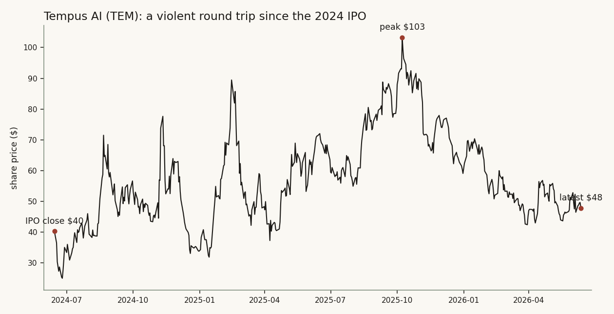

# 00 — Tempus AI: it's my favorite company. Does the thesis survive a hard look?

**The question.** Tempus AI (NASDAQ: TEM) is the company I find most interesting in the market right now. This note is me trying to do the honest thing: lay out exactly what the business is, how it actually makes money, and then attack my own enthusiasm hard enough to find out whether it deserves the affection. *Why it matters:* "favorite company" is the most dangerous phrase an investor can say. The whole point of writing it down is to see whether the love is built on the numbers or just on a good story.

This is a business deep-dive, not a backtest. It sits at the front of these notes on purpose — it's the one name I'd want a sharp outsider to push back on.

## What I found (the short version)

- **It's a genuinely good business that is finally turning the corner — and it's still loss-making, expensive, and carries real governance flags.** Both things are true at once. That tension is the whole study.
- **Two engines, not one.** A diagnostics lab (~75% of revenue, ~60% gross margin) feeds a data-licensing business (~25%, ~72% margin). The lab generates the data; the data is sold to pharma and trains the AI. That loop is the actual asset.
- **The numbers inflected in 2025.** Revenue grew 83% to $1.27bn, and adjusted EBITDA crossed from −$105m (2024) to roughly breakeven (2025), turning clearly positive in Q4. Management guides to ~$65m positive for 2026.
- **The moat is real but narrower than the marketing.** The strongest evidence is a 126% net revenue retention and a >$1.1bn contracted data backlog — that's stickiness you can measure. But it's data *scale*, not a true network effect, and it's exposed to commoditization.
- **The bear case is not noise.** A credible short-seller flagged related-party density around the highest-margin revenue; the "AI" is <2% of sales today; founder control is extreme (30 votes per share, ~62% of the vote); and the stock has already round-tripped a 54% drawdown from its October-2025 peak.
- **Verdict: Conditional. A high-quality, inflecting business worth owning with eyes open — not a clean buy.** What has to be true is spelled out at the end.

I went in a fan. I came out still a fan, but a more nervous one. That's the honest result.

## Why this one is my favorite (and why that's a reason to be careful)

Most companies do one thing. Tempus does a strange, ambitious thing: it runs a cancer-genomics lab *and* it turns every test it runs into data it sells a second time. I find that elegant — the same activity that earns a fee also builds the asset. When a business is structured so that doing the work compounds the moat, that's the kind of thing worth studying closely.

But "elegant story" is exactly what gets people hurt. So the rest of this note is built to disappoint me if it should. I lead with my own note record (a couple of years of tracking this name) and the filings, then I bring in the competition and the short-seller and try to break the thesis.

## What the company actually is

Tempus is a precision-medicine company founded in 2015 by **Eric Lefkofsky** — the same person who co-founded Groupon — after his wife's breast-cancer diagnosis showed him how disconnected cancer data was. The pitch in the company's own words is "Intelligent Diagnostics": use AI to make a lab test smarter by reading it in the context of that specific patient's clinical, imaging, and outcome data.

The plain-English version: a doctor sends a tumor sample, Tempus sequences it and returns a report, and — this is the part that matters — Tempus keeps the *linked* record (the genomics plus the clinical history plus the imaging). Do that a few million times and you've built something rare: a matched, de-identified, multimodal dataset. The company reports **more than 450 petabytes** of it, drawn from roughly **8.6 million patient records**, across **5,000+ connected institutions**, reaching **over half of US oncologists**.

## How it makes money — two segments

The income statement has exactly two lines (the company renamed them in 2025; they're the same businesses).

**Revenue, by segment ($ millions):**

| Segment | FY2023 | FY2024 | FY2025 | Q1-2026 |
|---|---:|---:|---:|---:|
| Diagnostics (the lab) | 363.0 | 451.7 | **955.4** | 261.1 |
| Data & Applications (data licensing) | 168.8 | 241.6 | **316.4** | 87.0 |
| **Total** | **531.8** | **693.4** | **1,271.8** | **348.1** |
| Total growth | — | +30.4% | **+83.4%** | +36.1% |

**1. Diagnostics (~75% of revenue) — the lab.** This is per-test billing: oncology sequencing (the xT / xF / xR assays) plus hereditary testing (from the Ambry Genetics acquisition that closed in early 2025). A doctor orders, Tempus sequences, Tempus bills a payer. The economics are volume × price: roughly **340,000 oncology tests in 2025** at an average selling price near **$1,640** (management's stated target is ~$2,200, helped by the FDA-approved xT CDx test that lists around $4,500).

**2. Data & Applications (~25%) — the data business.** This is the high-margin half. Tempus licenses de-identified, linked clinical-molecular-imaging data and analytics to pharma and biotech for drug development. The core product (Insights) is the data-licensing line; the others are trial-matching and algorithmic tests. Pharma pays for access — recurring licenses, project work, trial fees.

**The margin gap is the whole point:**

| Gross margin | FY2024 | FY2025 | Q1-2026 |
|---|---:|---:|---:|
| Diagnostics | 46.1% | **59.6%** | 61.3% |
| Data & Applications | 71.5% | **72.3%** | 71.1% |
| Blended | 55.0% | **62.7%** | 63.8% |

The lab runs at ~60% gross margin; the data business runs at ~72%. So the lower-margin activity (sequencing) manufactures the input for the higher-margin activity (data). The diagnostics margin jumping from 46% to 60% in a single year — lab automation, scale, and a better test mix — was the single biggest operating story of 2025.

## The flywheel (the "why" behind the structure)

Here is the loop, said plainly:

1. Run a diagnostic test → earn a fee, **and** capture a linked molecular-plus-clinical record.
2. The growing dataset gets licensed to pharma (high margin) and trains AI models.
3. Better AI makes the diagnostics more accurate and more useful to doctors.
4. More doctors on the network → more tests → back to step 1.

The reason a believer cares: no competitor cleanly owns *both* the lab and the matched clinical-outcome data at this scale. The data vendors (Flatiron, Komodo) own clinical or claims data but not the in-house genomics; the lab competitors own genomics but not the longitudinal clinical follow-up. Tempus sits on the intersection. Whether that intersection is a durable moat is the contested question — I get to it below.

## Who pays, and the deals that prove the model

- **Doctors and health systems** pay for diagnostic tests (the volume engine).
- **Pharma and biotech** pay for data and trials — the company reports working with **19 of the 20 largest pharma companies** and a **>$1.1bn contracted backlog** ("remaining total contract value") with **126% net revenue retention** (existing customers spending 26% more year over year).
- **Marquee deals on the record:** a three-year, **$200m** AstraZeneca + Pathos collaboration to build "the world's largest oncology foundation model" (2025); the **~$600m Ambry** acquisition (hereditary testing); the **$81m Paige** acquisition (digital pathology); Deep 6 AI (trial matching).

## The financials — the inflection is real

This is where the story stopped being just a story in 2025.

| | FY2024 | FY2025 | FY2026 (guide) |
|---|---:|---:|---:|
| Revenue | $693m | **$1,272m** | ~$1,590m |
| Adjusted EBITDA | −$105m | **−$7m** (Q4 +$13m) | **~+$65m** |
| Net loss (GAAP) | −$706m | −$245m | — |

Two honest caveats sit right next to that good news. First, **FY2024's enormous loss is largely an IPO artifact** — it carried $534m of stock-based compensation from IPO-vesting shares; the underlying business was never as broken as −$706m implies. Second, **FY2025's 83% growth is only ~33% organic** — the rest is the Ambry acquisition, so the headline flatters the underlying pace.

**Balance sheet:** ~$644m of cash and securities (Q1-2026) against ~$1.24bn of debt (mostly convertible notes), and the company raised a fresh **$500m convertible** in May 2026. So liquidity is fine for years; the real constraint is the debt load and ongoing dilution, not running out of money.

**Valuation:** ~$9bn market cap, roughly **6x forward sales** for a company that is still GAAP-unprofitable. That is not cheap. The multiple already pays for the data moat and the AI optionality.

## The tape — a violent round trip

It IPO'd in June 2024 at $37 (first close $40.25), sank to the mid-$20s within two weeks, melted up to an all-time high of **$103** in October 2025, and has since given back more than half, sitting around **$48**. The maximum close-to-close drawdown was **−59%**. ARK sold its position in late April 2026; the consensus analyst target is ~$66, but Barron's own grader rates it a Sell. So the market is as divided as I am.

## Is the moat real? (steelman, then attack)

The bull claim is a network-effect flywheel. I want to be precise about how much of that survives scrutiny.

**What's genuinely real:**
- **126% net revenue retention and a >$1.1bn backlog** are the best *measurable* moat evidence — pharma customers expand, they don't churn. Retention above 120% is a real switching-cost signature.
- **The matched dataset is hard to assemble.** The combination (genomics + clinical + imaging, linked, at scale) is rare and slow to replicate.
- **FDA companion-diagnostic approvals** compound — Tempus is the first lab with FDA CDx approval for both tumor-only and tumor-normal profiling, which creates pharma lock-in.

**Where I have to be skeptical:**
- **This is scale economics, not a true network effect.** A data buyer doesn't value Tempus more because another buyer also bought; they multi-source from Tempus *and* Flatiron *and* Komodo. The flywheel is real but weaker than a two-sided marketplace.
- **Commoditization is structural.** Sequencing costs keep falling and electronic-record interoperability keeps improving. The "largest dataset" today can become "first commoditized" tomorrow as competitors (Caris, Guardant, Foundation) accumulate overlapping data.
- **The diagnostics half has no durable moat at all** — it's a reimbursement-and-reputation business with several funded competitors.

My read: it's a *data-scale + regulatory + relationship* moat — durable for a few years, **not unassailable**, and directly exposed to commoditization. Not the textbook network effect the name implies.

## The bull case (why I own the story)

1. **The flywheel + measurable stickiness** — 450PB, 126% NRR, >$1.1bn backlog.
2. **AI optionality, nearly free.** AI-specific revenue is tiny today, so you pay ~6x sales for the diagnostics-plus-data business and get the AI lottery ticket thrown in. If oncology foundation models become real clinical products, Tempus owns the substrate.
3. **The profitability inflection** — adjusted EBITDA positive in Q4-2025, guided to ~+$65m in 2026.
4. **Two secular tailwinds at once** — precision oncology and AI-in-healthcare.
5. **Huge addressable market** — sequencing, MRD monitoring, and pharma data are each large and growing.

## The bear case (the honest one — this is what I worry about at night)

1. **Still unprofitable on a GAAP basis, and Q1-2026 net loss actually *widened*** (to −$126m from −$68m). The "adjusted EBITDA positive" headline excludes exactly the stock-comp and amortization that dilute me.
2. **The sharpest point: related-party density around the best revenue.** A short-seller (Spruce Point, 2025) alleged that the **Pathos** deal ($200m) is with a company founded and funded by Tempus-affiliated people, and that the **SoftBank** joint venture looks like capital round-tripped into recognized revenue. I can't adjudicate the allegation — but the related-party pattern is observable in Tempus's *own* disclosures, and it sits on the highest-margin line. That's a real quality-of-earnings flag, independent of the short-seller's price target.
3. **"AI" is mostly aspirational** — under 2% of revenue. The premium prices a franchise the financials don't yet show.
4. **Founder control is extreme** — Class B shares carry **30 votes each**, giving Lefkofsky roughly **62% of the vote** on a far smaller economic stake. The company also reincorporated to Nevada and waived jury trials for internal disputes by written consent. Public holders have little say, which makes related-party deals harder to police.
5. **Reimbursement risk** — the lab depends on Medicare/commercial coverage and pricing; MRD Medicare coverage is still pending.
6. **Data-revenue concentration** — a few mega-deals dominate the backlog; a slow biopharma-spend year bites (Tempus *cut* guidance once before citing "elongated biopharma sales cycles").
7. **Well-funded competition** — Roche owns both Foundation Medicine and Flatiron; Natera leads the MRD category at 2x the revenue; Caris just IPO'd and is already EBITDA-positive with faster organic growth.
8. **Valuation** — ~6x forward sales, loss-making. The downside if the narrative cracks is large.

## What my own data already knew

This is the part I find reassuring about the process, not the stock. I keep a running note record on this name (it's [study 03](../03-due-diligence-news-hub/) in these notes). When I pulled everything tagged Tempus, it came to **117 notes spanning IPO to today** — heavily bullish by volume, but the *informed* tone (the sell-side recaps, the earnings reactions) had already drifted to "great business, contested valuation, governance and earnings-quality question." My own record had logged the segment numbers, the partnerships, the convertible raises, and the dual-class governance.

One honest gap: **there was no short-seller report in my record.** The bear case wasn't in my own data — I had to go get it. That's a useful lesson about the difference between a coverage corpus and a complete view: a database that's 99% news and sell-side will lean bullish, because that's what news and sell-side do. The discipline is to go find the missing adversary on purpose.

## The answer, graded

**Is Tempus a good business?** Yes — a genuinely differentiated, fast-growing, finally-inflecting one.

**Is it a clean buy because it's my favorite?** No. Conditional. The same numbers that make it interesting (data moat, AI optionality, growth) sit next to real flags (GAAP losses, related-party density, extreme founder control, full valuation).

| Question | Answer | The number behind it |
|---|---|---|
| Growing? | Yes | +83% FY25 revenue (~33% organic) |
| Profitable? | Not yet | GAAP net loss −$245m FY25; Adj. EBITDA just crossing zero |
| Durable moat? | Conditional | 126% NRR + $1.1bn backlog real; network-effect claim overstated |
| Is the "AI" real revenue? | No, today | <2% of sales |
| Cheap? | No | ~6x forward sales, loss-making |
| Clean governance? | No | 30 votes/share; ~62% founder vote; related-party deals |
| Worth owning? | **Conditional** | great business, eyes-open risks |

**What has to be true for the bull to win:** the data and pharma relationships have to prove both *durable* and *clean* — the backlog and 126% retention keep compounding on arm's-length demand (the related-party concerns turn out immaterial, not structural), **and** the profitability inflection converts to real cash faster than dilution and commoditization erode it. Lose either leg — earnings quality or the path to real profit — and a loss-making company at 6x sales with 30-vote founder control re-rates down hard. I own the story. I also keep the bear case taped to the monitor.

## Caveats

- This is a qualitative business deep-dive, not a backtest; there is no edge being claimed or measured here.
- Peer revenue figures are from press releases and may differ slightly from final audited filings.
- The short-seller's allegations are contested opinion, not adjudicated fact; I include the related-party pattern because it is observable in Tempus's own disclosures, and I flag the rest as a claim.
- "Favorite company" is a bias. The entire structure of this note — leading with the bear case at full strength — is my attempt to control for it. The reader should assume I am still too kind.

## Sources

- Tempus AI SEC filings: FY2025 10-K (filed 2026-02-24), FY2024 10-K, Q1-2026 10-Q, the 2024 IPO prospectus.
- Tempus FY2025 and Q1-2026 results releases and earnings calls (investor relations).
- Spruce Point Capital, "The Tempest Surrounding Tempus AI" (2025) — short report (contested).
- Peer filings: Natera, Exact Sciences, Guardant Health FY2025 results; Caris Life Sciences IPO (June 2025); Roche updates (Foundation Medicine, Flatiron).
- Price history from a daily-bars warehouse (TEM, 500 sessions, 2024-06-14 to 2026-06-12).
- My own running note record on the name (117 dated notes), summarized in [study 03](../03-due-diligence-news-hub/).

*Builds on [study 03 — the Tempus due-diligence tracker](../03-due-diligence-news-hub/). This is the full business deep-dive that the tracker pointed toward.*

---

*Independent research by Hsin Cheng Yeh / Yeh Capital. Method and findings only; the data pipeline is operated privately. Research and educational use, not investment advice — no live capital, no audited track record.*
