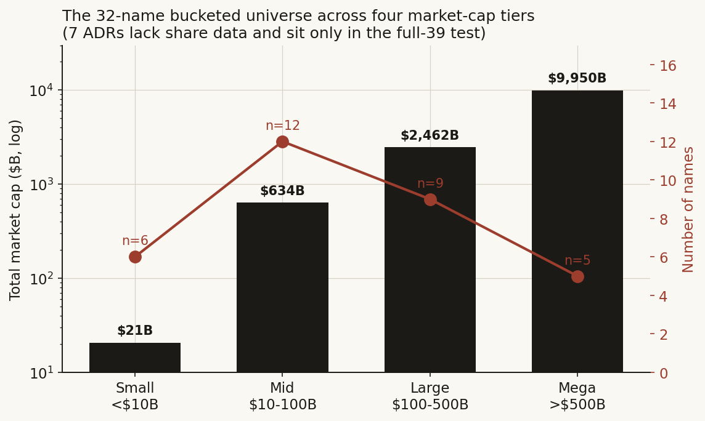
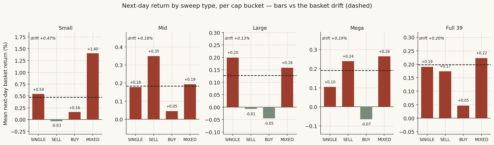
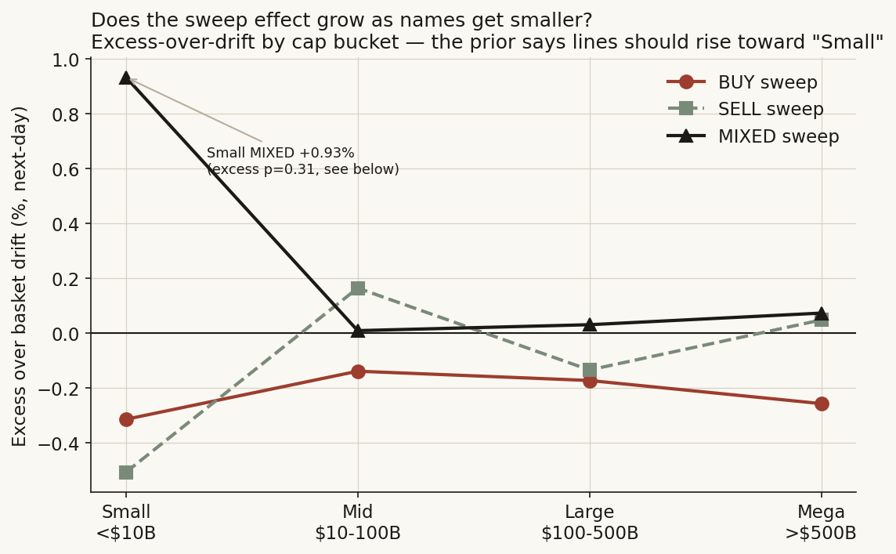
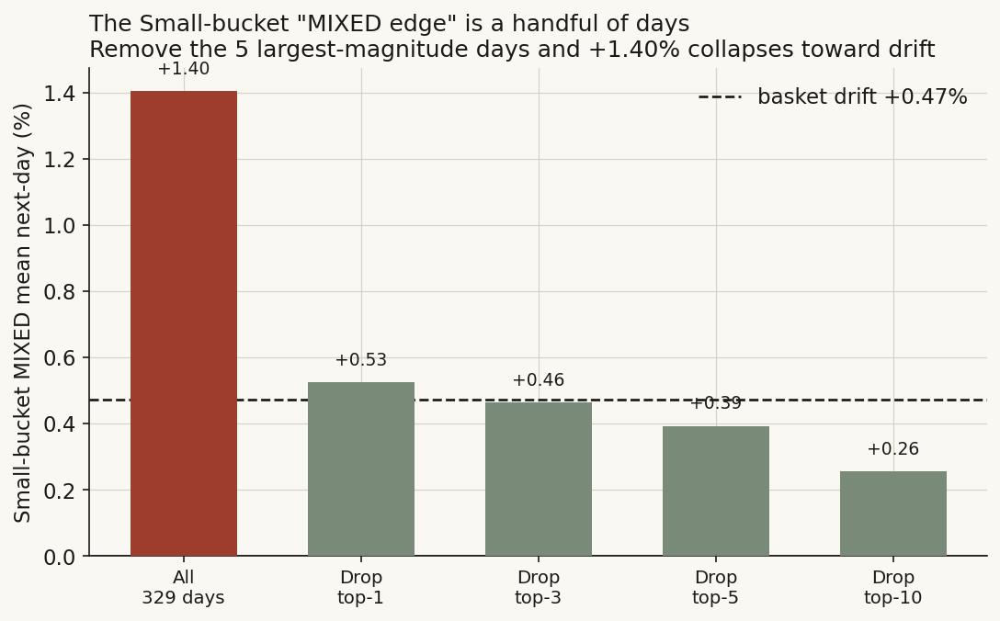
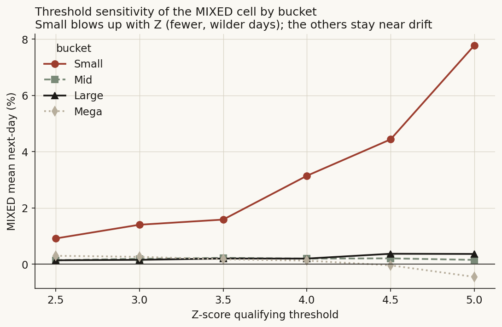
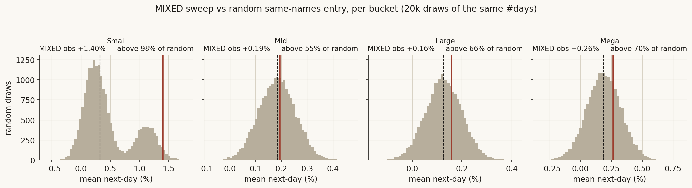
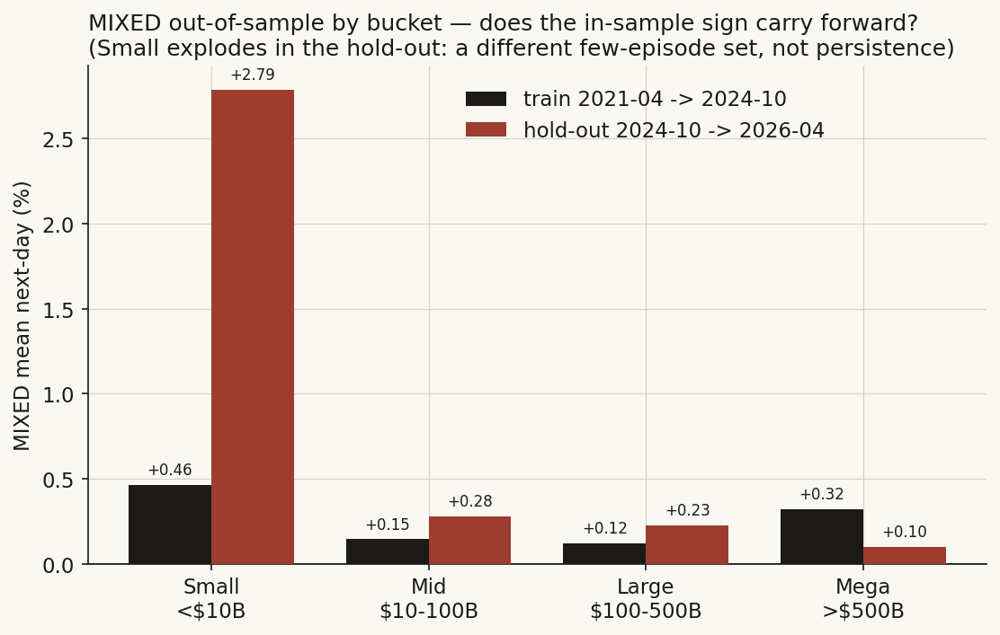

# 01 — Volume-sweep microstructure: does the sweep effect depend on company size?

There's a piece of trading-desk folklore I've always wanted to test. When a stock suddenly trades way more than usual, the saying goes, *somebody knows something*, and the price will keep going their way. Now scale that up. When several related chip stocks all light up with huge volume in the *same* fifteen minutes, that synchronized burst — a "sweep" — looks like informed money showing its hand, and the basket should drift that way tomorrow.

Here's the thought that got me going. If that information edge is real, it ought to be *biggest in small, thinly-covered names*, where one informed buyer can move the tape and everyone else is slow to catch on, and *weakest in the giants*, where everything is already in the price. So I took that size idea seriously. I ran the same sweep test inside four market-cap buckets of a big semiconductor universe, and asked one question: does the (non-)effect get bigger as the names get smaller?

I'll spoil it now. The size hunch shows up exactly where you'd expect — in the small-cap *point estimates* — and that's exactly where it turns out to be a handful of wild days, not a real edge. Once I do the math honestly, no bucket, big or small, gives a sweep signal that survives. The only thing size changes is how loud the noise gets.

**The question.** When several semiconductors all print a giant-volume 15-minute bar at the *same* moment, does that burst predict the basket's **next-day** return — and does any such effect grow as the names get smaller and harder to trade?

**Why I care.** If a sweep edge existed and lived in small caps, it would be a cheap, scalable way into a sector book: trade the sweep where information travels slowest. If it doesn't — and especially if the small-cap "signal" is just volatility dressed up as edge — that's the classic trap, worth writing down as a null so the next person doesn't pay to learn it again.

> Research / backtested. 39 US-listed semiconductors, 15-minute bars, regular hours, 2021-04 to 2026-04. No live capital, no execution costs assumed unless stated. A clean null, reported as a null, now worked out across the whole size range.

---

## The short version

- **No — and the size hunch fails in a way that teaches you something.** No sweep type beats its own basket's ordinary next-day drift, in any of the four cap buckets or the full 39-name universe, once I do the inference properly.
- **The size hunch does show up — but only as a point estimate.** The smallest bucket's two-sided "MIXED" sweep has a huge raw next-day mean, **+1.40%** against a +0.47% drift — the biggest cell anywhere. That's precisely what "information travels slower in small caps" would predict.
- **And then it's just a few days, not an edge.** That +1.40% comes almost entirely from **five days**: the five biggest-magnitude days contribute +335 percentage-points of the +462pp five-year sum, and taking them out drops the mean to **+0.39%** — below the basket's own +0.47% drift. Tested against drift, it's **p=0.31** (nowhere near significant) despite the giant point estimate, because the error band is enormous.
- **It has the fingerprints of noise, scaled by size.** The small-cap MIXED cell **blows up** as I raise the Z threshold (+1.40% at Z3.0 → +7.77% at Z5.0 — fewer, wilder days) and **blows up again out-of-sample** (+0.46% in-sample → +2.79% in the hold-out — a *different* set of wild days). Mid, Large and Mega all stay glued to drift through both tests. Small caps aren't more informative; they're just more volatile.
- **No direction anywhere.** Across all four buckets, **BUY** sweeps come out *negative* against drift (−0.31% Small, −0.14% Mid, −0.17% Large, −0.26% Mega) — the opposite of the "informed buyers, price follows" story, at every size.
- **The path I took:** work out each name's market cap, split into four buckets, run the full sweep battery (the honest sample size, the dependence-robust p-values, the multiplicity correction, the random same-names benchmark, the forward hold-out, the cost haircut) *inside each bucket* and on the full 39, then line the buckets up small-to-mega and ask whether size explains anything. It doesn't, except as a volatility dial.

---

## What I was actually betting on

This lives in the **microstructure** world — how individual orders and trades push price around, as opposed to fundamentals. My plain hunch fits in one sentence: if a synchronized volume burst carries information, the edge should be bigger in smaller, less-liquid names (more information asymmetry, slower price discovery) and weakest in the giants (already priced). That's the bet I'm testing.

Two well-known results frame *what* a sweep might mean, and they disagree on the two-sided case, which is why I keep all four sweep types in play:

- **Kyle (1985) — informed buying moves price.** An informed trader chops up a big order to hide it, so net buying-minus-selling is itself a tell, and price impact is roughly proportional to it. A *one-sided* burst — a **BUY sweep**, several names spiking on up-bars — could be a stand-in for informed, sector-wide buying, and Kyle says the information keeps getting absorbed: a next-day drift the same way. By my size hunch, this should bite hardest in small caps.
- **Easley, López de Prado & O'Hara (2012) — toxic flow (VPIN).** When buy and sell volume both show up in abnormal size at once, the flow is *toxic*: market-makers can't tell who's informed, and what follows is noise and adverse selection, not a clean direction. A *two-sided* (**MIXED**) sweep — one chip spiking up while another spikes down in the same bar — is the picture of toxicity, and this view says the next day should look closer to noise.

What I'm really measuring is **excess over drift**, not the raw return. In a five-year semiconductor bull run almost any "signal" looks positive in levels — the chips went up most days no matter what, and the smaller, twitchier names drifted up *fastest* (the Small bucket's average day is +0.47%, versus +0.13% for the Large bucket). So the honest question, per bucket, is whether a sweep beats *just being long that bucket's basket*. Put plainly: if the small-cap basket drifts +0.47% on an average next day, a small-cap BUY sweep has to clear meaningfully more than +0.47% to count — not just "more than zero," and definitely not "more than the giants' drift."

**What I'd see if there's nothing there, vs. if there is** (per sweep type, per bucket, on the next-day basket return):

- **If there's nothing here (the null I expect to keep):** the conditional next-day return equals the *same bucket's* basket drift on an ordinary day. Sweeps add no information, at any size.
- **If the direction story is real:** a BUY (SELL) sweep predicts a positive (negative) *excess* next-day return — informed buying, price follows.
- **If the size story is real:** the size and significance of any excess should **climb steadily as the bucket gets smaller** (Small > Mid > Large > Mega).

**What would prove me wrong:** a sweep cell with a positive *excess-over-drift* return that (a) keeps its sign and stays significant after the dependence fix, the multiplicity correction, the random-entry benchmark, the forward hold-out, and the cost haircut, **and** (b) gets systematically bigger in the smaller buckets. One surviving cell would kill the null; a clean small-to-mega staircase of surviving cells would confirm the size story. Neither shows up.

**The plan in one breath:** cut the 39-name universe into four cap buckets by market value; inside each, run the naive per-event picture, fix the two flaws that inflate it, benchmark against random same-names entry, split out-of-sample, and haircut for costs; then line the buckets up small-to-mega and see whether size explains the pattern. Only a surviving cell with a size gradient would count.

This kicks off a thread that runs through the whole repo: *which short-horizon "edges" actually survive an honest test?* It's the methodological cousin of [study 07 (intraday decision-time)](../07-intraday-overnight-decomposition/) and shares the random same-names benchmark with [study 09 (activist shorts)](../09-activist-short-post-performance/). Splitting by cap mirrors the size lens in [study 17 (semiconductor layers)](../17-semiconductor-layers/).

## How I set it up, and why each piece

- **The universe (the biggest I could get).** 39 US-listed semiconductors with usable 15-minute history: NVDA, AMD, INTC, TSM, AVGO, MU, QCOM, TXN, ADI, NXPI, MCHP, ON, MRVL, STM, WOLF, WDC, AMAT, LRCX, KLAC, ASML, TER, ENTG, ACLS, AEHR, PLAB, AMKR, UMC, TSEM, GFS, RMBS, HIMX, SKYT, CRDO, NVTS, COHR, LITE, AAOI, SNPS, CDNS. The intraday history caps the count at ~39 names; a ~100-name version would be a separate **daily-data** study, not this one.
- **Cap into buckets.** Each name's cap = its latest reported diluted-average-share count × its latest daily close. The 39 sort into four non-overlapping tiers: **Small (< $10B), Mid ($10–100B), Large ($100–500B), Mega (> $500B).** Seven names are foreign issuers (ADRs) the warehouse carries **no share-count line** for, diluted or basic: TSM, STM, ASML, UMC, TSEM, GFS, HIMX. I **drop them from the bucketed test** (32 names bucketed) but **keep them in the full-39 test**, which needs no cap.
- **Sample and window.** 15-minute bars, regular hours only (09:30–16:00 ET), 2021-04-30 → 2026-04-30 (1,258 trading days). The source bars are 5-minute; I resample to 15-minute (sum the volume, take first/last/max/min for OHLC). Regular hours only because the open and close auctions have a different volume shape and would pollute the abnormal-volume measure.
- **Timezone and the opening bar.** Timestamps in the warehouse are naive UTC; I tag them UTC, convert to America/New_York (which handles the EDT/EST switch on its own), then keep 09:30–16:00 ET. The **09:30 ET opening bar is bloated by the auction**, so I drop it — the same way for every name and bucket — from *both* the rolling-volume baseline *and* from ever counting as a sweep bar.
- **What counts as a sweep (same rule in every bucket).** For each ticker and bar, a rolling 60-bar volume **Z-score** — how many standard deviations the bar's volume sits above its own recent normal. A bar *qualifies* when Z ≥ 3.0. Qualifying bars get grouped by timestamp **within the bucket** and the cluster labelled: `BUY_SWEEP` (≥2 qualifying names closing up, none down), `SELL_SWEEP` (≥2 down, none up), `MIXED` (both sides present, neither reaching two), `SINGLE` (one qualifying name). "Side" is `sign(close − open)` on the bar — a rough but standard intraday buy/sell proxy.
- **What I'm predicting (each bucket's own basket).** Each bucket is its **own** equal-weight basket with its **own** sweeps. Next-day return = the equal-weight average across the bucket's names of (next daily close / today's close − 1).
- **The dependence fix (the main repair).** Tons of sweep events land on the *same trading day* and share **one** next-day basket return; treating them as independent fakes a bigger sample than I have. So I collapse to **one observation per trading day per type per bucket** (the honest *effective n*) and double-check with a **stationary block bootstrap** (mean block ≈ 5 trading days), a resampling trick that keeps short runs intact. I report cluster-robust + bootstrap p-values and a bootstrap 95% band.
- **Multiplicity.** Four sweep types tested per bucket, so I report **Bonferroni** corrections (multiply the p-value by 4) — one promising cell out of four isn't a hit.
- **The random-entry benchmark.** Per bucket per type, I draw 20,000 random sets of the *same number of distinct trading days* from the *same bucket basket*, and ask where the real mean falls. An honest signal has to beat random same-names entry, not just beat zero.
- **A real forward split (out-of-sample).** A genuine forward split per bucket — train 2021-04 → 2024-10, hold out 2024-10 → 2026-04.
- **A cost haircut.** A flat 10 bps round-trip comes off the top, to see if any gross tilt survives getting filled.
- **Robustness.** Z-threshold swept 2.5 → 5.0 per bucket; the headline small-cap cell taken apart day by day.

The trap I have to watch, said out loud: in a bull market, **drift contaminates everything, and it contaminates small caps most** (their average day is the biggest). Any rule that's "in the market on selected small-cap days" will look profitable in levels. The whole method nets out that drift per bucket — the excess-over-drift framing and the random same-names benchmark are doing the heavy lifting, not the t-test.

## The data

**The universe, bucketed.** Caps are latest-share-count × latest close, in $B.

| Bucket | Range | Count | Members (cap $B) | Total cap |
|---|---|---:|---|---:|
| **Small** | < $10B | 6 | NVTS (7), ACLS (5), AEHR (4), SKYT (2), PLAB (2), WOLF (2) | $21B |
| **Mid** | $10–100B | 12 | SNPS (95), LITE (91), COHR (83), NXPI (82), TER (65), ON (54), MCHP (53), CRDO (42), ENTG (21), RMBS (19), AMKR (18), AAOI (13) | $634B |
| **Large** | $100–500B | 9 | LRCX (423), AMAT (401), KLAC (281), TXN (279), MRVL (273), QCOM (262), WDC (219), ADI (211), CDNS (113) | $2,462B |
| **Mega** | > $500B | 5 | NVDA (5,333), AVGO (2,048), MU (1,137), AMD (863), INTC (568) | $9,950B |

*Dropped from bucketing (no share-count line, ADR foreign issuers): TSM, STM, ASML, UMC, TSEM, GFS, HIMX — these 7 stay in the full-39 test.* All 32 bucketed names use the **diluted** average-share count; none needed the basic-share fallback.



| | |
|---|---|
| Bars | 15-minute (5-min resampled), regular hours (09:30–16:00 ET) |
| Window | 2021-04-30 → 2026-04-30 (1,258 trading days) |
| Qualifying bars | Z ≥ 3.0 on a 60-bar rolling volume window, opening auction bar excluded |
| Sweep events (full 39) | 7,451; per bucket: Small 2,680 · Mid 4,027 · Large 2,369 · Mega 1,418 |

One line per series: 15-minute consolidated US equity aggregates for the 39 names → 2021-04-30 to 2026-04-30 → UTC→ET conversion, regular-hours filter, 60-bar rolling volume Z-score, daily-close resample for the outcome; latest reported diluted shares × latest daily close for the cap split. All from a private intraday + reference warehouse.

## First look — the per-bucket, per-type picture

Collapsing to one observation per trading day per type (the honest sample size) and reading each bucket's basket against its **own** drift:



Your eye goes straight to the **Small / MIXED** bar: +1.40% next-day, more than triple any other cell and nearly triple the Small basket's own +0.47% drift. That's exactly the shape the size hunch predicts — the loudest sweep "signal" sitting in the smallest names. Every other cell in every other bucket hugs its drift line.

Lined up the way the size hunch actually asks for it — **excess over each bucket's own drift, small-to-mega** — the gradient isn't the tidy rising staircase the hunch wants. Only one point (Small/MIXED) sits far above zero; the directional (BUY/SELL) cells are *negative* across the board, and Mid/Large/Mega all cluster at zero:



So where does that leave me. I see one giant cell in the smallest bucket. That's what the size hunch would predict, so I can't just wave it away. The real question now is whether that cell is a stable effect or a few lucky days, and whether the gradient holds across the buckets.

Here's how a sweep gets defined and labelled, in code (analysis logic only, run *within each bucket*):

```python
# per ticker, per 15-min bar (regular hours, opening auction bar dropped)
vol_z = (volume - volume.rolling(60).mean()) / volume.rolling(60).std()
qualifies = (vol_z >= 3.0) & (bartime != "09:30")   # ~3 sigma; exclude auction
side = np.sign(close - open)                         # +1 up-bar, -1 down-bar

# group qualifying bars in THIS bucket that share a timestamp, classify the cluster
ups, downs = (side > 0).sum(), (side < 0).sum()
if   ups   >= 2 and downs == 0: cluster = "BUY_SWEEP"
elif downs >= 2 and ups   == 0: cluster = "SELL_SWEEP"
elif ups   >= 1 and downs >= 1: cluster = "MIXED"     # contested / toxic tape
else:                           cluster = "SINGLE"

# outcome: equal-weight next-day return of THIS bucket's basket
next_day_ret = bucket_close.shift(-1) / bucket_close - 1   # mean across the bucket
```

---

## Digging in

### Inside each bucket, nothing beats its own drift once I count honestly

- **What I expected, and why.** If there's nothing here, the conditional next-day return equals the bucket's drift. The naive per-event count fakes significance because dozens of same-day events share one outcome, so the real question is the per-day picture, bucket by bucket.
- **How I measured it.** Collapse to one observation per trading day per type per bucket (the honest n), re-run the t-test cluster-robust, double-check with a stationary block bootstrap, and Bonferroni-correct across the four types:

  ```python
  daily = events.groupby(["bucket", "trading_day", "type"]).first()   # 1 obs/day/type
  for b in buckets:
      for t in types:
          x = daily.loc[(daily.bucket == b) & (daily.type == t), "next_day_ret"]
          cluster_p = ttest_1samp(x, 0).pvalue                        # honest n
          boot   = [mean(stationary_bootstrap(x, mean_block=5)) for _ in range(10_000)]
          boot_p = 2 * min((boot <= 0).mean(), (boot >= 0).mean())
          bonf_p = min(1.0, cluster_p * 4)
  ```

- **What the data said.** Sample size honest, per bucket (mean next-day %, win %, cluster p, bootstrap p, Bonferroni p):

  | Bucket | Type | n_eff | mean % | win % | cluster p | boot p | Bonf p |
  |---|---|---:|---:|---:|---:|---:|---:|
  | **Small** | SINGLE | 926 | +0.54 | 50.0 | 0.111 | 0.031 | 0.443 |
  | (drift +0.47%) | SELL | 171 | −0.03 | 50.3 | 0.902 | 0.908 | 1.000 |
  | | BUY | 187 | +0.16 | 46.0 | 0.651 | 0.692 | 1.000 |
  | | **MIXED** | 329 | **+1.40** | 54.4 | 0.124 | 0.008 | 0.494 |
  | **Mid** | SINGLE | 971 | +0.18 | 55.6 | 0.032 | 0.027 | 0.130 |
  | (drift +0.18%) | SELL | 246 | +0.35 | 56.5 | 0.036 | 0.026 | 0.145 |
  | | BUY | 290 | +0.05 | 52.8 | 0.776 | 0.778 | 1.000 |
  | | MIXED | 652 | +0.19 | 55.1 | 0.050 | 0.034 | 0.201 |
  | **Large** | SINGLE | 728 | +0.20 | 55.4 | 0.016 | 0.008 | 0.064 |
  | (drift +0.13%) | SELL | 237 | −0.01 | 51.5 | 0.959 | 0.976 | 1.000 |
  | | BUY | 242 | −0.05 | 53.7 | 0.754 | 0.758 | 1.000 |
  | | MIXED | 518 | +0.16 | 52.9 | 0.086 | 0.064 | 0.342 |
  | **Mega** | SINGLE | 624 | +0.10 | 53.2 | 0.290 | 0.284 | 1.000 |
  | (drift +0.19%) | SELL | 156 | +0.24 | 57.1 | 0.187 | 0.207 | 0.747 |
  | | BUY | 170 | −0.07 | 48.2 | 0.746 | 0.720 | 1.000 |
  | | MIXED | 257 | +0.26 | 56.0 | 0.086 | 0.095 | 0.344 |

  **Not one cell out of sixteen survives Bonferroni.** The single lowest raw p anywhere is Large/SINGLE (0.016 → Bonferroni 0.064, still > 0.05). The eye-catching Small/MIXED cell, for all its +1.40% point estimate, is cluster-p 0.124 and Bonferroni 0.494 — its error bar is huge. And the framing I actually care about — *excess over the bucket's own drift* — kills it cleanly: Small/MIXED is **+0.93% excess, p=0.31**; no bucket's MIXED or directional cell has a significant excess at all. The faceted bars above (each bucket's types against its own dashed drift line) and the size-gradient line make the same point by eye — only one bar pulls away from drift, and the directional cells sit *below* it.

  

- **Why it comes out this way.** Pool *all* sweep days against *all* trading days, per bucket, and the reason is plain: a sweep day is an ordinary day in every bucket.

  | Bucket | sweep-day mean | all-day mean | sweep-day %pos | all-day %pos |
  |---|---:|---:|---:|---:|
  | Small | +0.484% | +0.472% | 50.1% | 50.1% |
  | Mid | +0.179% | +0.184% | 55.4% | 55.1% |
  | Large | +0.130% | +0.127% | 53.5% | 53.6% |
  | Mega | +0.156% | +0.191% | 53.5% | 54.2% |

  Identical to within a basis point or two. The rolling-volume filter picks out busy days, but busy days in these baskets aren't special days — at any size.

- **What I double-checked.** The random same-names benchmark (20,000 draws of the same number of distinct days from the *same bucket basket*) settles the directional cells: in every bucket the real BUY mean falls *below* most random draws (Small 32% of draws below it, Mid 15%, Large 9%, Mega 7%) — a BUY sweep doesn't even beat picking the same names on random days.
- **Where that leaves me.** **Null in all four buckets.** Nothing rejects the null, at any size. The direction story (Kyle) fails for BUY/SELL everywhere; the only cell that even *looks* like the size hunch is Small/MIXED, which the next section pulls apart.

### Could the small-cap "signal" just be a few lucky days?

- **What I expected, and why.** The size hunch says the strongest sweep effect should be in the smallest, least-liquid bucket, and the +1.40% Small/MIXED point estimate seems to deliver. But here's the thing I've learned to ask: a *real* small-cap edge would be spread across many days; a volatility fluke would be carried by a few extreme days and would blow up the more I select for extreme bars.
- **How I measured it.** Take the Small/MIXED daily series, sum it, and re-compute the mean after stripping out the biggest-magnitude days; separately, sweep the Z threshold and re-read the cell:

  ```python
  x = small_mixed.next_day_ret                    # 329 trading days
  total      = x.sum()                            # five-year sum
  top5_share = x[abs(x).argsort()[-5:]].sum()     # the 5 wildest days
  mean_ex5   = x[abs(x).argsort()[:-5]].mean()    # mean without them
  for z in [2.5, 3.0, 3.5, 4.0, 4.5, 5.0]:        # threshold sensitivity
      recompute_small_mixed(z)
  ```

- **What the data said.** The +1.40% is **five days wearing a trench coat.** Over five years the Small/MIXED series sums to **+462 percentage-points**; the **five biggest-magnitude days alone contribute +335pp** of that. Strip those five and the mean drops from **+1.40% to +0.39%** — *below* the bucket's own +0.47% drift. Strip the top ten and it's +0.26%.

  

  The threshold sweep is the giveaway. As Z rises (selecting rarer, wilder bars), the Small/MIXED cell **runs away**: +0.92% (Z2.5) → +1.40% (Z3.0) → +3.14% (Z4.0) → +7.77% (Z5.0). A stable edge would stay roughly flat in Z; a few-wild-days fluke takes off. Mid, Large and Mega stay glued near their drift across the whole sweep.

  

- **Why it comes out this way.** Picture one case: in the Small basket, NVTS spikes up while AEHR spikes down in the same 15 minutes; the next day a single sub-$10B name gaps 12% on a product headline and the equal-weight basket lurches. The "MIXED edge" isn't informed flow resolving — it's that **small, illiquid chips have fat-tailed daily moves**, and a 6-name equal-weight basket lets one of them run the show. The same toxic-tape setup in the Mega bucket (NVDA up, INTC down) gives a +0.26% next-day blip that's statistically zero. Size doesn't amplify *information*; it amplifies *variance*.
- **What I double-checked.** The random-baseline panel for Small is itself **bimodal** — the small-cap basket's own random 329-day draws have a second hump out past +1% — which is *why* the real +1.40% sits "above 98% of random" and yet still isn't an edge: the random benchmark is that volatile too. The Mid/Large/Mega random distributions are tight single humps, and the real MIXED lands mid-pack (55%/66%/70% above random).

  

- **Where that leaves me.** **The size hunch is rejected.** The one cell that looked like "bigger effect in smaller names" is a five-day volatility fluke with an insignificant excess (p=0.31), a sign that runs away with the threshold, and a random benchmark just as wild as itself. Small caps hold *louder noise*, not a *stronger signal*. I'll be honest — I was hoping the small-caps would light up. They didn't.

### Does anything carry into a window I never touched?

- **What I expected, and why.** A real edge — at any cap — keeps its sign and rough size in an untouched forward window. A noise edge doesn't; and if the noise is volatility-driven, the smallest bucket should *surprise me the most* out-of-sample.
- **How I measured it.** A genuine chronological split per bucket (no peeking), plus a 10 bps round-trip cost haircut on the collapsed daily means:

  ```python
  train = daily[daily.trading_day <  "2024-10-01"]   # fit window
  hold  = daily[daily.trading_day >= "2024-10-01"]   # untouched forward window
  net   = gross_mean - 0.10                           # 10 bps round-trip, in %
  ```

- **What the data said.** The MIXED cell, train → hold-out, by bucket:

  | Bucket | MIXED train | MIXED hold-out |
  |---|---:|---:|
  | Small | +0.46% | **+2.79%** |
  | Mid | +0.15% | +0.28% |
  | Large | +0.12% | +0.23% |
  | Mega | +0.32% | +0.10% |

  

  The small-cap cell behaves exactly like a volatility fluke should: it doesn't *hold* at +0.46%, it **jumps to +2.79%** out-of-sample — a *different* clutch of wild days, not the same edge turning up again. Mega goes the other way (+0.32% → +0.10%). The mid/large cells are small in both windows but never significant (the best hold-out p across all MIXED cells is 0.13). The full-39 universe tells the same story: SINGLE/SELL/MIXED all show low train means and "fresh" higher hold-out means (e.g. SELL +0.03% train → +0.62% hold-out, p=0.02) — the in-window flukes an OOS test exists to catch, with no sign carrying over from training.

  **Costs.** A 10 bps round trip turns every BUY cell net-negative or flat (Small +0.06%, Mid −0.05%, Large −0.15%, Mega −0.17%) and trims every benign SINGLE/SELL tilt to single-basis-point territory; none is significant after the dependence fix. Only the Small/MIXED point estimate survives 10 bps on paper (+1.30% net) — but it's the five-day fluke, not a tradable series.

- **Why it comes out this way.** A mean that *grows* out-of-sample instead of drifting back toward its training value, and that grows most in the smallest bucket, is the signature of a series scattered around drift with fat tails — there's no underlying constant for the hold-out to confirm, only more episodes.
- **What I double-checked.** The cost number is a stylized flat haircut; real fills on the mega names are cheaper than 10 bps, while the small names would be *more* expensive (wider spreads), so the cost test is, if anything, going easy on exactly the small-cap cell that looks best gross.
- **Where that leaves me.** **Null in every bucket.** Fails out-of-sample everywhere; fails on costs for the directional cells. Size changes only the size of the out-of-sample surprise — bigger in small caps — which is the opposite of a stable, size-dependent edge.

---

## Did I just find noise?

Pulled together on purpose: the three angles (a real forward hold-out, a 10 bps cost haircut, a Z-threshold sweep) are my "is this noise?" battery, and I ran all three *inside each bucket*. The small-cap MIXED cell fails all three in the most telling way — it grows with the threshold, grows out-of-sample, and its random benchmark is as fat-tailed as itself. The other buckets never had a cell to break in the first place. The block bootstrap is the fourth leg: it agrees with the cluster t-tests in every bucket, so the null isn't a quirk of one inference method. The day-by-day test (the top-5 days carry +335pp of +462pp) is the clincher.

## The three ways I could be fooling myself

Three alternative stories could each produce the surface look of a size-dependent sweep edge. I steelmanned each, then tested it on its own numbers.

**Story A — small caps really are more informative (the size hunch itself).** *Best case for it:* the +1.40% Small/MIXED cell is the predicted "information travels slower in small caps" effect. *The test:* re-express it as excess over the *small-cap* drift and take it apart day by day — **+0.93% excess, p=0.31**, of which the five wildest days carry +335 of +462 percentage-points; remove them and the mean falls *below* the bucket's own drift. **Story A loses** — the small-cap "edge" is volatility, not information; the hunch's *direction* shows up only in how loud the noise is.

**Story B — it's just basket drift, bucket by bucket.** *Best case for it:* each bucket rose over five years (Small fastest at +0.47%/day); any "in the market on selected days" rule inherits that drift. *The test:* re-express every cell as excess over its *own* bucket drift. Result — **no cell in any bucket has a significant excess**: every BUY excess is negative (−0.31% / −0.14% / −0.17% / −0.26%, small-to-mega), and the biggest positive excess anywhere (Small/MIXED +0.93%) is insignificant. **Story B wins** — every positive *level* is the bucket drifting up.

**Story C — a few big episodes, not a stable edge.** *Best case for it:* maybe a small real edge is being hidden by averaging. *The test:* the day-by-day removal and the threshold explosion show the exact opposite — the apparent effect is *made of* a handful of days and runs away as you select for extremity. **Story C describes the truth** — this is the signature of noise, concentrated in the smallest, most fat-tailed bucket.

The stories that win (drift, a few episodes) are exactly the ones that mean *no tradable, size-dependent sweep signal*. The story that would rescue the size hunch (small caps genuinely more informative) is the one the data rejects.

---

## The answer, in the data

**Q: Do cross-ticker volume sweeps predict the basket's next-day return — and does the effect depend on company size?**

**A: No, and no.** Run inside four market-cap buckets and across the full 39-name universe, with honest inference — the real sample size, cluster-robust and block-bootstrap p-values, a multiplicity correction, a random same-names benchmark, a forward hold-out, and a cost haircut — **no sweep type produces a next-day edge over its own basket's drift in any bucket.** The size hunch (bigger effect in smaller names) shows up only as a *point estimate* in the smallest bucket's MIXED cell, and that estimate is a five-day volatility fluke: insignificant in excess (p=0.31), blowing up with the threshold (+7.77% at Z5.0) and out-of-sample (+2.79%), and benchmarked against a random distribution just as fat-tailed as itself. **Size scales the noise, not the signal.**

| Bucket | best raw cell | best cell mean | excess vs own drift (p) | survives Bonferroni? | survives OOS + costs? |
|---|---|---:|---:|:--|:--|
| Small (< $10B, n=6) | MIXED | +1.40% | +0.93% (0.31) | No (0.494) | No — 5-day fluke, explodes OOS |
| Mid ($10–100B, n=12) | SELL | +0.35% | +0.16% (0.32) | No (0.145) | No |
| Large ($100–500B, n=9) | SINGLE | +0.20% | +0.07% (0.38) | No (0.064) | No |
| Mega (> $500B, n=5) | SELL | +0.24% | +0.05% (0.79) | No (0.747) | No |
| **Full 39-name universe** | MIXED | +0.22% | +0.02% (0.76) | No (0.023→n.s. on excess) | No |

**Two questions, kept apart.** *Did the effect hold, and does it depend on size?* No on both — a clean null at every cap. *Was the method sound, and what did I learn?* Yes: cutting the universe by size turned a single fuzzy null into a *diagnosis* — the place the folklore looked truest (small, illiquid names) is exactly where volatility most easily fakes a signal, and the cap-bucket lens is what shows up the fake. The one thing I **can't** fully rule out is that a finer order-flow tape (true signed volume rather than close-vs-open at 15-minute resolution) hides a small-cap MIXED effect this data is too coarse to see — so this is *inconsistent with* a tradable, size-dependent sweep signal, not proof one can never exist. A clean null, now worked out across the whole size range, is the result, and the right one.

## What I'd flag before anyone leans on this

- Backtest only; next-day *basket* returns, equal-weight, per bucket. The cost haircut is a stylized flat 10 bps and ignores that small-cap spreads are wider (which way it cuts: makes the small-cap cells look *better* than reality — the opposite of rescuing them).
- The Small bucket is only **6 names** and the Mega bucket only **5**; small baskets are naturally fat-tailed, which is itself part of the finding but limits how precise those two cells can be (which way it cuts: widens their error bars, makes a true small effect harder to spot — yet none shows up even so).
- Side is a close-vs-open bar proxy, not true signed volume; 15-minute bars are coarse. A finer tape could expose an effect this resolution can't — but the burden of proof is on that data (which way it cuts: could only *add* a missed signal, not remove a found one).
- 7 ADR names lack share-count data and drop out of bucketing; they stay in the full-39 test, which agrees with the buckets (which way it cuts: unknown, but the full-39 null matches).
- Single sector, one (mostly bull) regime; the per-bucket drift baseline absorbs the level effect, but whether this carries to other baskets or regimes is untested (which way it cuts: unknown).

## Reproducibility

**Market-cap bucketing (the cross-sectional split).** For each name: cap = (latest diluted average shares) × (latest daily close); assign to Small (< $10B) / Mid ($10–100B) / Large ($100–500B) / Mega (> $500B). Names with no share-count line drop out of the buckets, stay in the full-39 test.

**Sweep definition (the governing formula).** For ticker *i*, bar *t*, 60-bar rolling mean/std of volume, opening auction bar excluded:

```
Z_{i,t} = ( V_{i,t} − mean_60(V_i) ) / std_60(V_i)
qualify if  Z_{i,t} ≥ 3.0  and  bartime ≠ 09:30 ET
side_{i,t} = sign( close_{i,t} − open_{i,t} )
```

Group qualifying bars by timestamp *within the bucket*; classify by how many names print on each side (≥2 up = BUY, ≥2 down = SELL, both sides = MIXED, one name = SINGLE). Outcome = equal-weight next-day return of that bucket's basket.

**The two pieces doing the heavy lifting, in code:**

```python
# 1) honest sample size — one observation per trading day per type per bucket
daily = events.groupby(["bucket", "trading_day", "type"]).first()

# 2) dependence-robust p-value — stationary (block) bootstrap, ~5-day mean block,
#    so short autocorrelated runs survive resampling intact
def stationary_bootstrap(x, mean_block=5, n_boot=10_000):
    out = []
    for _ in range(n_boot):
        idx, p = [], 1.0 / mean_block
        i = np.random.randint(len(x))
        while len(idx) < len(x):
            idx.append(i)
            i = np.random.randint(len(x)) if np.random.rand() < p else (i + 1) % len(x)
        out.append(np.mean(np.asarray(x)[idx]))
    return np.array(out)
```

The full pipeline (5-min→15-min resample, UTC→ET conversion, per-bucket event construction, the random-entry benchmark, the OOS split, the day-by-day decomposition, and every chart) lives in the study's research notebook in the private method repo; the formulas and code boxes above reproduce the headline numbers from raw 15-minute bars. Source: 15-minute consolidated US equity aggregates for the 39 names + latest reported diluted shares and daily closes, 2021–2026, from a private warehouse.

## References and what comes next

- Kyle, A. (1985). *Continuous auctions and insider trading.* Econometrica — informed buying and linear price impact (the BUY-sweep prior).
- Easley, D., López de Prado, M. & O'Hara, M. (2012). *Flow toxicity and liquidity in a high-frequency world* (VPIN). Review of Financial Studies — balanced abnormal flow as toxic/noisy (the MIXED prior).
- Politis, D. & Romano, J. (1994). *The stationary bootstrap.* JASA — the dependence-robust resampling behind the block-bootstrap p-values.
- Data: end-of-day and 15-minute consolidated US equity aggregates for the 39 names, plus reported diluted shares for the cap split, 2021–2026.

**Builds on / part of:** the repo-wide thread on *which short-horizon "edges" survive an honest test*. Shares the random same-names benchmark with [study 09 — activist short post-performance](../09-activist-short-post-performance/) and the size lens with [study 17 — semiconductor layers](../17-semiconductor-layers/).

**Next:** [study 07 — intraday decision-time](../07-intraday-overnight-decomposition/), which asks the same "describe vs trade" question one layer up — how early in the day the close is callable, and whether that mechanical predictability is actually tradable (it isn't). Same lesson, different clock.
