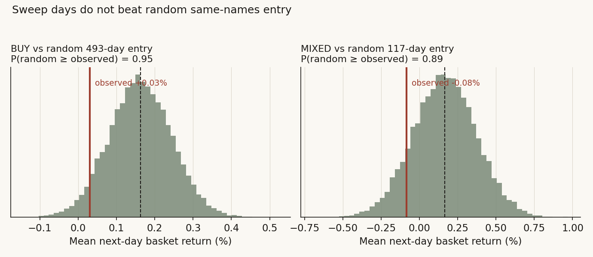
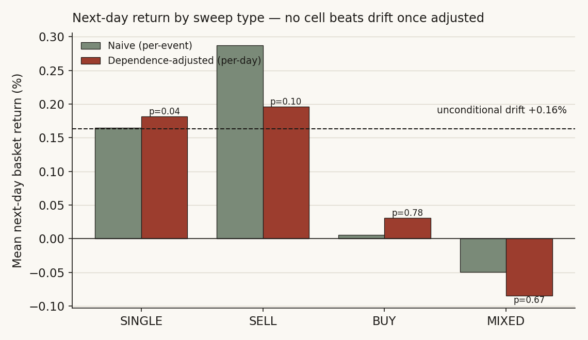
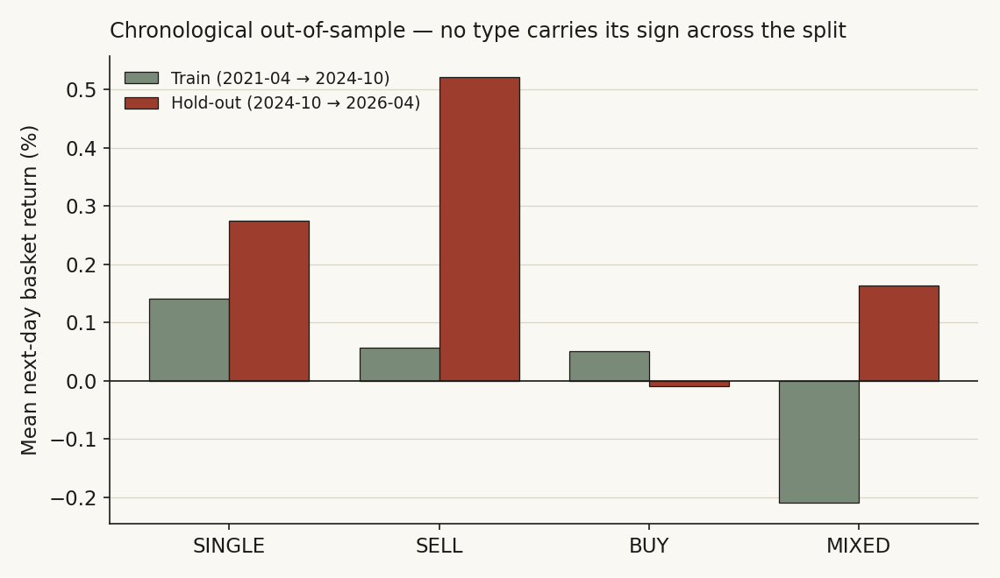
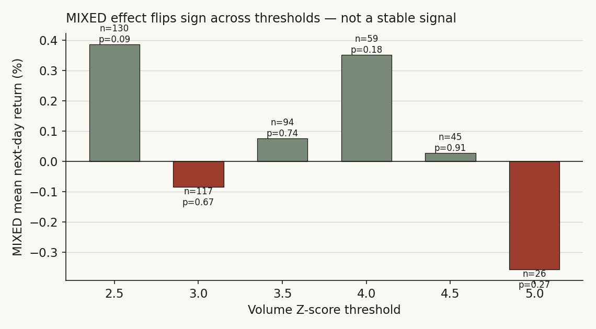
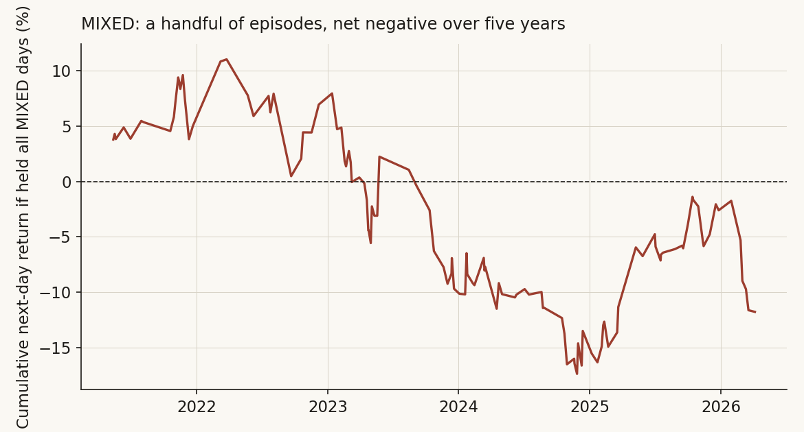

# 01 — Do cross-ticker volume sweeps predict next-day semiconductor returns?

**Question.** When several liquid semiconductors all print an abnormal-volume 15-minute bar at the *same* timestamp — a synchronized "sweep" — does that burst of activity carry information about the basket's **next-day** return, over and above just being another day in the tape?

**Finding (it does not survive).** No. A 14-day pilot once showed a strong "BUY sweep" edge (+1.06%, p≈0.002) and an apparently surviving two-sided "MIXED" edge (+0.65%, p≈0.008). On the full ~5-year sample, with the statistics done properly — dependence-adjusted, multiplicity-corrected, benchmarked against random entry, and split out-of-sample — **every sweep type collapses to the basket's ordinary next-day drift.** MIXED is the clearest casualty: it is *negative* on the full sample (−0.05%, dependence-adjusted p≈0.67), flips sign across thresholds, and underperforms a random same-names entry. The honest result is a null: a sweep tells you nothing the calendar does not already.

> Research / backtested. 7 US semiconductors, 15-minute bars, regular hours, 2021-04 to 2026-04. No live capital, no execution costs assumed unless stated. A clean null, reported as a null.

---

## Theory and prior

Two microstructure results motivate the test, and they pull in opposite directions — which is exactly why it is worth running.

- **Kyle (1985) — informed order flow moves price.** An informed trader splits a large order to disguise it; aggregate order flow is therefore informative, and price impact is roughly linear in net signed flow. A *synchronized* abnormal-volume burst across correlated names is a candidate proxy for informed, sector-wide flow. If the burst is one-sided (a BUY sweep), Kyle predicts the information should *continue* to be impounded — a next-day drift in the direction of the flow.
- **Easley, López de Prado & O'Hara (2012) — VPIN / flow toxicity.** When buy and sell volume arrive in roughly balanced abnormal size, order flow is *toxic*: liquidity providers are uncertain who is informed, spreads widen, and the immediate aftermath is dominated by noise and adverse selection rather than a clean directional signal. A *two-sided* (MIXED) sweep is the picture of high VPIN. The toxic-flow reading predicts the next-day response should be **closer to noise**, not a reliable continuation.

So the priors disagree on MIXED specifically. The pilot's "contested-tape continuation" story (two-sided pressure resolving in the basket's favour) is a *Kyle-flavoured* read; the VPIN read says contested tape is where signal goes to die. The test arbitrates.

**Hypotheses (per sweep type, on next-day basket return):**

- **H0:** conditional next-day return equals the unconditional next-day drift of the same basket — sweeps carry no incremental information.
- **H1 (directional sweeps):** a BUY (SELL) sweep predicts a positive (negative) *excess* next-day return — informed-flow continuation.
- **H1 (MIXED):** under the pilot's continuation story, MIXED predicts a positive excess return; under the toxic-flow story, MIXED predicts no excess (indistinguishable from drift). These are competing, falsifiable predictions.

The unit being tested is **excess over drift**, not raw level. In a five-year semiconductor bull run almost any "signal" looks positive in levels; the question is whether it beats simply being long the basket.

## Method, and why each piece

- **Sample / window.** Seven large-cap semiconductors (NVDA, TSM, AVGO, AMD, ASML, AMAT, KLAC), 15-minute bars, regular trading hours only (9:30–16:00 ET), 2021-04 to 2026-04 — ~224k intraday bars. Regular-hours-only because the pre/open and post/close auctions have a different volume distribution and would contaminate the abnormal-volume measure.
- **Sweep definition.** For each ticker/bar, a rolling 60-bar (~one trading day) volume **Z-score**; a bar *qualifies* when Z ≥ 3.0. Bars are grouped by timestamp; the cluster is classified `BUY_SWEEP` (≥2 qualifying bars closing up), `SELL_SWEEP` (≥2 closing down), `MIXED` (≥2 qualifying, both sides present, neither side reaching two), or `SINGLE` (one qualifying name). Side is `sign(close − open)` on the bar — a coarse but standard intraday buy/sell proxy.
- **Outcome.** Next-day basket return = equal-weight mean across the 7 names of (next daily close / today's close − 1).
- **Naive test (where the old study stopped).** One-sample t-test of each type's next-day returns against zero. This is the starting point, not the finish — it has two known defects that *inflate* significance, which the next three steps repair.
- **Dependence adjustment (the core fix).** Many sweep events land on the *same trading day* and therefore share one next-day basket return; treating them as independent observations overstates n and shrinks standard errors. I collapse to **one observation per trading day per type** (the honest *effective n*) and, for the headline types, run a **stationary block bootstrap** (mean block ≈ 5 trading days) to absorb any residual serial dependence in the daily series. Reported as cluster-robust + bootstrap p-values and a bootstrap 95% CI.
- **Multiplicity.** Four sweep types are tested at once, so I report **Bonferroni and Šidák** corrections on the naive p — a single suggestive cell among four is not the same as a pre-registered hit.
- **Random-entry baseline.** For each type I draw 20,000 random sets of the *same number of distinct trading days* from the same basket and same window, and ask where the observed mean falls in that distribution. This separates a genuine edge from the basket's drift: an honest signal must beat random same-names entry, not just beat zero.
- **Chronological out-of-sample.** A true forward split — train on 2021-04 → 2024-10, hold out 2024-10 → 2026-04 — for all four types. The previous study *claimed* an out-of-sample decay it never actually ran; this resolves that.
- **Cost haircut.** A round-trip cost (5/10/15 bps on the equal-weight basket) is deducted to see whether any gross tilt survives execution.
- **Robustness.** Z-threshold swept 2.5 → 5.0, and the MIXED cell decomposed by sweep size, intra-sweep tilt, and volatility regime.

## Data

| | |
|---|---|
| Basket | NVDA, TSM, AVGO, AMD, ASML, AMAT, KLAC (equal-weight) |
| Bars | 15-minute, regular hours (9:30–16:00 ET) |
| Window | 2021-04-30 → 2026-04-30 (~5 years, 1,255 trading days) |
| Intraday bars | ~224k after the regular-hours filter |
| Qualifying bars | Z ≥ 3.0 on a 60-bar rolling volume window |
| Sweep events | 2,135 across 1,135 distinct trading days |

**Reproducibility note / data gap.** This rebuild runs on the warehouse's 15-minute intraday history. The original 14-day pilot and the first ~5-year extension were computed on a *different* intraday source that is no longer available, and its exact event counts (e.g. MIXED n=92) do not reproduce here (this build yields MIXED n=121 at the same Z=3.0). The pilot's raw numbers are therefore reported as historical context, not re-derived; every number in the Analysis below is freshly computed on the data described in this table. The qualitative conclusion is unchanged and, if anything, stronger: the pilot did not survive.

## Descriptive — the per-sweep-type picture

Counting events naively (each event as one observation) gives the picture the old study stopped at:

| Sweep type | events | naive mean next-day | win rate | naive p |
|---|---:|---:|---:|---:|
| SINGLE | 1,040 | +0.16% | 56.0% | 0.026 |
| SELL_SWEEP | 433 | +0.29% | 52.7% | 0.010 |
| BUY_SWEEP | 541 | +0.01% | 51.8% | 0.960 |
| MIXED | 121 | −0.05% | 44.6% | 0.798 |

The eye-catching pilot cells are already gone before any hardening: BUY_SWEEP is flat (+0.01%), and MIXED — the cell that "survived" in the pilot — is *negative*. Two cells (SINGLE, SELL_SWEEP) look significant naively. The Analysis layer asks whether any of that is real.

---

## Analysis

### a. Test — dependence-adjusted, multiplicity-corrected, vs a random baseline

**Claim.** None of the four sweep types beats the basket's ordinary next-day drift once the inference is done correctly.

**Evidence.** Collapsing to one observation per trading day (the honest effective n) and re-testing:

| Sweep type | effective n | mean next-day | win rate | cluster p | bootstrap p | Bonferroni p |
|---|---:|---:|---:|---:|---:|---:|
| SINGLE | 711 | +0.18% | 55.3% | 0.040 | — | 0.106 |
| SELL_SWEEP | 378 | +0.20% | 52.1% | 0.097 | — | 1.000 |
| BUY_SWEEP | 493 | +0.03% | 52.1% | 0.779 | 0.783 | 1.000 |
| MIXED | 117 | −0.08% | 44.4% | 0.668 | 0.607 | 1.000 |

The two naively-significant cells lose it: SELL_SWEEP slips to p≈0.10, and SINGLE (p≈0.04 cluster) does not survive Bonferroni (0.106). BUY_SWEEP and MIXED were never significant. The block-bootstrap 95% CI for MIXED is **[−0.43%, +0.26%]** — squarely straddling zero.

The random-entry baseline is decisive: the observed BUY mean sits below ~95% of random same-names 493-day draws, and the MIXED mean below ~89% of random 117-day draws. The accent line (observed) falls to the *left* of the random distribution in both panels.

Most directly: pool **all** sweep days and compare to **all** trading days in the same window —

| | n | mean | median | % positive |
|---|---:|---:|---:|---:|
| All sweep days | 1,135 | +0.166% | +0.147% | 53.5% |
| All trading days (baseline) | 1,255 | +0.163% | +0.147% | 53.4% |

Identical to three decimals. A sweep day is an ordinary day.

**Caveat.** The cluster collapse is conservative on days with several same-type events; a small amount of within-day information is discarded. The bootstrap p-values agree with the cluster p-values, so the conclusion is not an artifact of the collapse.

**Verdict.** H0 is not rejected for any type. The directional-flow (Kyle) prediction fails for BUY/SELL; the contention-continuation prediction fails for MIXED.

### b. Mechanism — why MIXED does *not* work

**Claim.** The pilot's "contested-tape continuation" story does not hold; what little structure exists is consistent with the toxic-flow (noise) reading, but is too thin to call either way.

**Evidence.** At Z=3.0 every MIXED event is, by construction, a *two-name, one-up-one-down* bar (with three or more qualifying names, one side almost always reaches two and the cluster is classified BUY or SELL instead). That single cell is **−0.08%, 44% win, p≈0.67** — the opposite sign to the continuation story. Conditioning on volatility regime does not rescue it: low-vol MIXED is −0.18% (39% win), high-vol MIXED is −0.06% (48% win); neither is significant. There is no subgroup in which contested tape reliably continues.

**Caveat.** With only ~117 effective MIXED days, the mechanism battery has little power; "no mechanism found" here means "no detectable mechanism," not a proven absence. A finer signed-volume tape (true buy/sell classification, not close-vs-open) could in principle revive it.

**Verdict.** The continuation mechanism is rejected at this resolution; the toxic-flow null is consistent with the data. MIXED has no demonstrated economic driver.

### c. Robustness — out-of-sample, costs, thresholds

**Claim.** The effect is unstable across the three robustness axes the pilot promised but never ran.

**Evidence — out-of-sample.** A true chronological split shows no type carrying its sign and significance from train to hold-out:

| Sweep type | train mean (p) | hold-out mean (win, p) |
|---|---:|---:|
| SINGLE | +0.14% (0.16) | +0.28% (60%, 0.12) |
| SELL_SWEEP | +0.06% (0.69) | +0.52% (62%, 0.010) |
| BUY_SWEEP | +0.05% (0.71) | −0.01% (55%, 0.96) |
| MIXED | −0.21% (0.39) | +0.16% (49%, 0.64) |

MIXED flips from −0.21% in-sample to +0.16% out-of-sample — noise, not persistence. SELL_SWEEP's hold-out (+0.52%, p=0.010) looks tempting but is a *fresh* appearance in the hold-out window (train p=0.69, sign did not carry), i.e. an in-window fluke rather than a confirmed effect — exactly the trap an OOS test is meant to expose.

**Evidence — costs.** A 10 bps round trip turns BUY_SWEEP net-negative (−0.07%) and pushes MIXED to −0.18%. Even the benign SINGLE/SELL tilts (gross ~+0.18–0.20%) shrink to +0.05–0.10% net — thin, and not significant once dependence-adjusted.

**Evidence — thresholds.** Sweeping Z, MIXED reads +0.39% (Z2.5), −0.08% (Z3.0), +0.08% (Z3.5), +0.35% (Z4.0), +0.03% (Z4.5), −0.36% (Z5.0): the sign is unstable and no level is significant after adjustment.

**Caveat.** Costs are a stylized flat haircut; real fills on these megacaps are usually cheaper than 10 bps, but borrow/short friction on a SELL sweep is not modelled.

**Verdict.** Fails out-of-sample, fails on costs, fails threshold stability. Nothing robust remains.

### d. Alternatives — basket drift, momentum, or a few episodes?

**Claim.** What looks like a signal in levels is basket drift plus a handful of episodes — not a sweep effect.

**Evidence.** Tested as *excess over the basket's unconditional next-day drift* (+0.163%), **no type has a significant excess**: SINGLE +0.018% (p=0.84), SELL +0.033% (p=0.78), BUY −0.133% (p=0.22), MIXED −0.248% (p=0.21). Every positive level is just the basket drifting up in a bull market. On episode concentration: summed over five years, the MIXED daily returns total **−9.9%**, and the five largest-magnitude days swing it by +14.3% — the whole series is a few episodes around zero, the signature of noise, not a stable edge.

**Caveat.** "Drift" here is the same-basket same-window mean; against a broader market benchmark the residual could differ slightly, but the within-basket comparison is the correct one for a basket-trading rule.

**Verdict.** The level effects are drift; MIXED is episodic noise. The alternative explanations win.

---

## The answer, in the data

**Q: Do cross-ticker volume sweeps predict the basket's next-day return?**

**A: No.** Once the inference is done honestly — effective n, cluster-robust and block-bootstrap p-values, multiplicity correction, a random same-names baseline, a true chronological hold-out, and a cost haircut — **no sweep type produces a next-day edge over the basket's own drift.** The pilot's BUY signal was small-sample noise; the MIXED cell, far from "surviving," is negative on the full sample, sign-unstable across thresholds, beaten by random entry, and net-negative after costs. The contested-tape continuation story is rejected; the toxic-flow null is consistent with the data.

| Sweep type | effective n | median next-day | mean next-day | % positive | dependence-adj. p | survives OOS + costs? |
|---|---:|---:|---:|---:|---:|:--|
| SINGLE | 711 | +0.30% | +0.18% | 55.3% | 0.040 (n.s. after Bonferroni) | No |
| SELL_SWEEP | 378 | +0.09% | +0.20% | 52.1% | 0.097 | No |
| BUY_SWEEP | 493 | +0.04% | +0.03% | 52.1% | 0.779 | No |
| MIXED | 121 | −0.25% | −0.05% | 44.6% | 0.668 | No |
| **All sweep days** | **1,135** | **+0.15%** | **+0.17%** | **53.5%** | — (= drift) | — |
| Baseline (all days) | 1,255 | +0.15% | +0.16% | 53.4% | — | — |

A clean null is the result, and the right one.

## Caveats

- Backtest only; next-day *basket* returns, equal-weight. The cost haircut is stylized and ignores borrow on short sweeps.
- Side is a close-vs-open bar proxy, not true signed volume; 15-minute bars are coarse. A finer order-flow tape could in principle expose a MIXED effect this resolution cannot see — but the burden of proof is on that finer data, not on a +0.65% pilot.
- Single sector, 7 names, one (mostly bull) regime; the drift baseline absorbs that, but generalization to other baskets/regimes is untested.
- The exact pilot data source could not be reproduced (see Data note); pilot figures are historical context, all Analysis numbers are recomputed on the stated sample.

## References

- Kyle, A. (1985). *Continuous auctions and insider trading.* Econometrica — informed order flow and linear price impact.
- Easley, D., López de Prado, M. & O'Hara, M. (2012). *Flow toxicity and liquidity in a high-frequency world* (VPIN). Review of Financial Studies — balanced abnormal flow as toxic/noisy.
- Politis, D. & Romano, J. (1994). *The stationary bootstrap.* JASA — dependence-robust resampling used for the block-bootstrap p-values.
- Data: end-of-day and 15-minute consolidated US equity aggregates for the seven names, 2021–2026.
