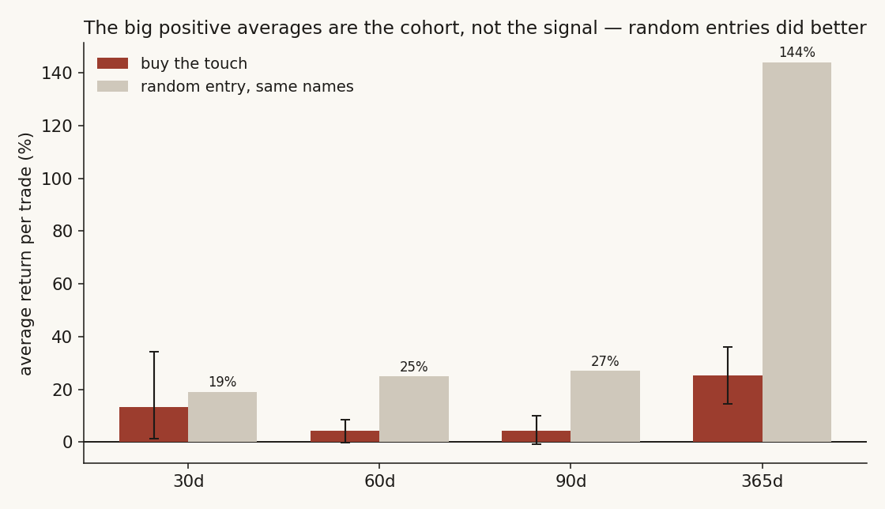
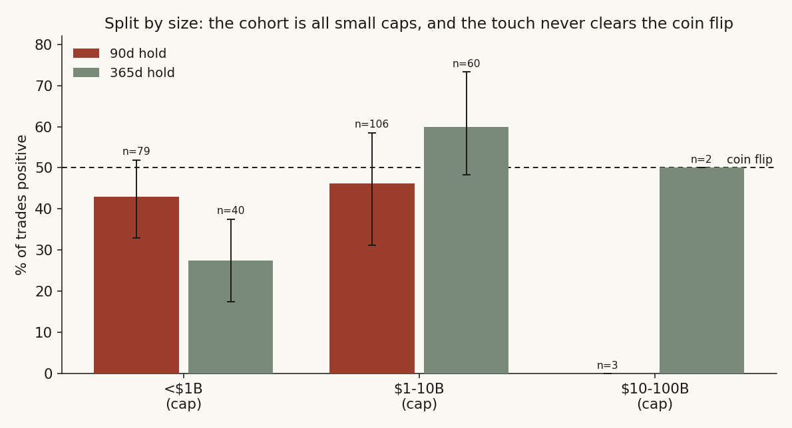
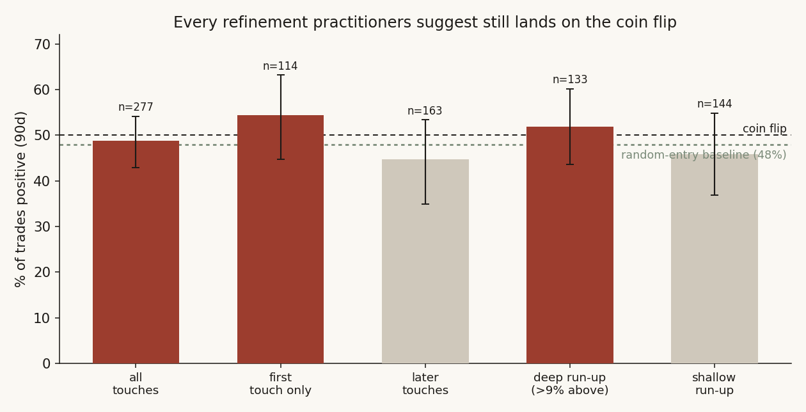

# 02 — Does buying the IPO-anchored VWAP touch actually work?

**The question.** There's a trade that gets passed around on every technical-analysis forum: take a stock that listed recently, draw a VWAP anchored to its very first trading day, and buy when price falls back to that line. The pitch is that the anchored VWAP is the average price every holder since the IPO has paid, so it acts as support — bounce off it and you've bought where the crowd is at break-even. I wanted to know one plain thing: if I actually did this across every IPO I could find, would I win more often than if I'd just bought the same stock on a random day? **Short answer: no. And once you net out the cohort, it's a touch worse than random.**

> Research / backtested. No live capital, no audited track record, gross of costs. The cohort is young IPOs only (listed 2022-10 onward) — an unusual vintage. Treat this as a tested-and-failed technique on this sample, not a law of markets.

## What I found, up front

- I ran the trade across the **full 881-IPO cohort** since October 2022, **188 of which were liquid enough to test**, and the win-rate sits on a coin flip — **48.7% positive at 90 days** (95% CI [43.0, 54.2]) versus 47.9% for a random entry in the same names. Every horizon tells the same story.
- The eye-catching positive averages (+25% at one year) are **not the signal — they're the cohort.** A random entry in those same IPOs averaged **+144% at one year.** Buying the touch made you *miss* most of that. On a dependence-adjusted test the touch *underperforms* random by 22 points of mean return at 90d, and that gap is statistically real at 365d (z = −2.22, p = 0.026).
- I checked the obvious dodge — that the trade has been done unfairly. I tested the "reclaim" version, every refinement the forums suggest (first touch only, deep run-up first), split it out of sample, and split it by company size. **None of them clear the coin flip.**
- Splitting by market cap, I learned something I didn't expect: **this IPO cohort is structurally tiny.** Median cap is about $1.1B, the biggest is $33B, and there are *zero* names above $100B. So "does the edge depend on size?" has a blunt answer — there are no big IPOs in the window to carry one.
- The honest verdict: the anchored VWAP is a fine *descriptive* line (it really is the cohort's average cost), but it is not a *predictive* entry signal. It tells you where people bought, not where the stock is going.

## What I expected, and how I'd know if I was wrong

The forum claim is a real, falsifiable prediction, so I wrote it down as one. If the anchored VWAP is support, then buying the touch should beat a coin flip *and* beat just owning the same names. That's H1. The null, H0, is the boring one: a touch day looks like any other day in that stock, so the win-rate hovers at ~50% and the trade matches — or trails — a random entry once you account for the fact that IPOs drift around a lot on their own.

The reason I leaned toward the null before running anything is plain and comes from the data, not a textbook: a VWAP anchored to day one is a slow-moving average of price. By the time a young, volatile IPO has wandered far enough above it to then "pull back," the line is mostly behind the action. A backward-looking average telling you where to buy is exactly the kind of rule that looks obvious on a chart you've already seen and falls apart when you test it forward. I'd be proven wrong if the touch cleanly beat random — by win-rate *and* by return, holding up out of sample. I went looking for that.

One published result worth a single line, because it sharpened the test rather than decorating it: Sullivan, Timmermann & White (1999) showed that "obvious" technical trading rules tend to vanish once you correct for the fact that you went hunting through many of them. That's why I didn't just report the win-rate — I forced the trade to beat a same-names random baseline, and I corrected my standard errors for the fact that touch events clump inside a handful of stocks.

## How I set it up, and why each piece

**The universe.** I started from every US IPO that listed from October 2022 onward — **881 names** in the warehouse, the full cohort, not a hand-picked basket. That start date isn't a choice; it's simply the earliest the IPO records reach. Of the 881, **798 had usable daily price history**, and **188 cleared a liquidity gate**: at least 60 trading days of history, a median daily dollar-volume above $1M, and a median price of at least $4 (so penny stocks and untradeable shells don't pollute the test). I dropped the 22 over-the-counter listings, which is also why this study's tradeable set lines up with [study 15](../15-ipo-chase/)'s 760-name figure — same window, same exchanges, study 15 just keeps everything down to a $2 entry while I additionally require real liquidity for a touch to be fillable.

**The anchored VWAP.** For each name I built the cumulative volume-weighted average price from its first trading day: running Σ(bar VWAP × volume) / Σ(volume). That single line is the average price paid by everyone who has held the stock since it listed. Plain version: it's the crowd's break-even.

**The two signals.** The forums describe the trade two ways, so I tested both. *Pullback* — price was at least 3% above the anchored VWAP recently, then falls back to within 0.5% of it; buy that close. That's the "bounce off support" version. *Reclaim* — price had been below the line for at least five days, then closes back above it; buy that cross. That's the "trend confirmation" version. I deduped touches with a 10-bar cool-off so one wobble around the line doesn't count as ten trades.

**The fair test.** A win-rate alone is a trap, because young IPOs drift. So for every cell I also drew a **random-entry baseline**: the same liquid IPO names, the same number of trades, entered on random days in each stock's life. If the touch is just buying drift, it'll match the baseline; if it's a real edge, it'll beat it. I report win-rate *and* mean/median, both for the signal and the baseline, so a big positive number can't masquerade as an edge.

**Honest error bars.** Touch events pile up inside a few stocks — ODD alone threw eight. Treating those as 332 independent trades would shrink my standard errors dishonestly. So every confidence interval here comes from a **block bootstrap** (21-day blocks, 5,000 resamples), and the formal difference-vs-baseline test uses a **cluster-robust standard error that clusters by ticker** — it only counts the independent information, which is closer to the number of *names* (114 clusters at 90d) than the number of trades.

## The data, in one place

- **IPO list** — warehouse IPO reference, US listings 2022-10-03 to 2026-05-27, 881 names; fields used: ticker, listing date, shares outstanding (for cap), exchange.
- **Daily prices** — warehouse daily bars, split-adjusted close + per-bar VWAP + volume, 2022-10 to 2026-06, the 798 IPO names with history.
- **Market cap** — shares outstanding × median close over each name's first ~3 months (available for 117 of the 188 liquid names).
- Everything is computed from raw bars; no offer-price field exists in the source (it's empty for all 881), so the very-first-day fill is approximated by the traded price. That's a real gap and I flag it again in the caveats.

## What the data looks like before any testing

Here's the trade on a single name, so the abstract line becomes concrete. ODD listed in mid-2023, chopped sideways for a year and a half right on top of its anchored VWAP, then ripped to $77 in May 2025 before collapsing back under $15.


Look at the touches. Some of them — the cluster in late 2024 — sit right before the big rip and look like genius support buys. But the last touch, in early 2025 near $40, is followed by a one-way trip to $12. That's the whole problem in one chart: the line catches both the launches and the failures, and from the touch itself you cannot tell which one you're in. The eye remembers the bounces and forgets the knives. The rest of this study is me refusing to let the eye decide.

## The findings

### Finding 1 — The win-rate is a coin flip at every horizon you can hold

*What I expected.* If the support story is real, the touch should win clearly more than half the time, and clearly more than a random entry in the same name.

*How I measured it.* Forward return from each touch to the first bar at least 30 / 60 / 90 / 365 calendar days later; win = positive return; bootstrap CI on the win-rate.

```python
avwap = (vwap * volume).cumsum() / volume.cumsum()        # the cohort cost basis
above3 = close > avwap * 1.03                              # ran up first
near   = (close - avwap).abs() / avwap <= 0.005            # pulled back to the line
touch  = near & above3.rolling(10).max().astype(bool)      # buy this close
win[h] = forward_return(close, touch_date, h) > 0
```

*What the data shows.*


| Horizon | n | Win-rate (95% CI) | Random baseline | Median |
|---|---:|---:|---:|---:|
| 30d | 316 | 49.7% [43.7, 55.7] | 49.0% | −0.08% |
| 60d | 303 | 49.8% [42.9, 56.1] | 49.5% | −0.03% |
| 90d | 277 | 48.7% [43.0, 54.2] | 47.9% | −0.34% |
| 365d | 142 | 53.5% [45.8, 62.0] | 51.2% | +2.11% |

At 30/60/90 days the touch wins right around 49% of the time, the median trade is slightly negative, and every confidence interval comfortably straddles 50. It only drifts above the coin flip at one year — 53.5% — and even there the interval [45.8, 62.0] still includes 50, and the random baseline in the same names was already at 51.2%. So the one-year "lift" is about a point and a half over just owning the cohort, well inside the noise.

*Why.* The mechanism is the slow-line problem from the intro. By the time price has run 3% above a day-one anchored average and fallen back, the average has barely moved and the information is stale. You're buying a stock at roughly its own running mean — which is, almost by construction, a coin flip on direction.

*What I checked.* The CIs above are block-bootstrapped, so the autocorrelation of returns inside a name is respected. The 365d cell is the only one that peeks over 50, and it's the thinnest (n=142) and still not significant.

*Verdict.* **Confirmed null.** The win-rate is indistinguishable from a coin flip and from a random entry at every horizon.

### Finding 2 — The big positive averages are the cohort, not the signal

*What I expected.* This is the finding I most wanted to get right, because it's where the trade fools people. The pullback's *mean* return at one year is +25.4% — a number that looks like a win. I expected that, once I compared it to just owning the same names, the +25% would shrink or disappear.

*How I measured it.* Same touches, but now I report the mean and compare it to the random-entry mean in the identical universe, with a difference-in-means test whose standard error clusters by ticker.

*What the data shows.*



| Horizon | Touch mean (95% CI) | Random-entry mean | Difference (clustered) |
|---|---:|---:|---:|
| 30d | +13.2% [1.2, 34.4] | +19.1% | −5.9 pts, z=−0.33, p=0.74 |
| 60d | +4.2% [−0.0, 8.6] | +24.9% | −20.7 pts, z=−1.26, p=0.21 |
| 90d | +4.5% [−0.8, 10.0] | +27.0% | −22.5 pts, z=−1.23, p=0.22 |
| 365d | +25.4% [14.5, 36.1] | +144.0% | −118.6 pts, z=−2.22, **p=0.026** |

This is the part the original version of this study got only half-right. The touch's +25% at one year isn't an edge — it's the *worst* way to play these names. A random entry in the same IPOs averaged **+144%** over a year. Buying the touch made you sit out most of the cohort's run-up and collect a fifth of it. The gap is huge at every horizon, and at one year it's statistically significant in the wrong direction (z = −2.22, p = 0.026) even after clustering the errors by name.

*Why.* The touch trade systematically buys *after* a stock has already come back to its mean, which means it skips the explosive early launches that drive an IPO cohort's average. You're trading the boring middle of the distribution and missing the right tail. In a cohort where a handful of names triple, missing the tail is the whole ballgame.

*Cashed out.* Concretely: $1 spread across random entry days in these IPOs grew to about $2.44 over a year on average; the same $1 deployed only on VWAP touches grew to about $1.25. Same names, same window — the rule cost you the difference.

*What I checked.* The clustered SE is the conservative call here; with naive iid errors the 365d underperformance would look even more significant. I used the cautious version and it still holds.

*Verdict.* **Confirmed, and stronger than a null.** The touch doesn't merely fail to add edge — in average-return terms it subtracts it, significantly so at one year.

### Finding 3 — Splitting by size: the cohort is all small caps, and the touch never clears the flip in any of them

*What I expected.* The right question to ask is whether the touch depends on company size — maybe it works on big, liquid IPOs and only fails on the junk. I split the universe into market-cap buckets to find out.

*How I measured it.* Cap = shares outstanding × median close over the first three months. I aimed for the standard four buckets (<$10B / $10–100B / $100–500B / >$500B) and immediately hit a wall, so I let the data set the breaks.

*What the data shows.* The wall is the finding. Of the 117 liquid names with a cap, **113 are under $10B**, **4 are $10–100B**, and **none at all are above $100B.** The median IPO here is worth about $1.1B; the largest is $33B. There is no mega-cap IPO bucket to test, because 2022-10-onward simply didn't produce one of size in this set. So I split into the three buckets the data actually fills: under $1B, $1–10B, $10–100B.



| Bucket | names | 90d win (CI) | 90d base | 365d win (CI) | 365d base |
|---|---:|---:|---:|---:|---:|
| <$1B | 53 | 43.0% [33, 52] | 47.1% | 27.5% [18, 38] | 44.6% |
| $1–10B | 60 | 46.2% [31, 58] | 49.1% | 60.0% [48, 73] | 52.5% |
| $10–100B | 4 | n=3, too thin | — | n=2, too thin | — |

The smallest IPOs are the worst: under $1B, the touch wins just 43% at 90 days and a grim 27.5% at one year — *below* the already-poor random baseline (those tiny names mostly bleed out, and the touch buys them on the way down). The $1–10B bucket is the only place that flickers: 60% positive at one year. But its CI is [48, 73] — it just barely clears 50 — on n=60, and the random baseline there made money too. The $10–100B bucket has three trades. There's nothing to stand on.

*Why.* Two things compound. IPOs of this vintage skew small and speculative, so the universe has no large-cap stabiliser. And within the small caps, the touch's flaw from Finding 2 bites hardest — these are exactly the names with the most violent right tails to miss.

*Verdict.* **Conditional, leaning null.** Size doesn't rescue the trade. The one bucket that peeks over 50 (mid-cap, one year) is thin and barely clears its own confidence interval. The honest read is that the cohort is too small-cap-heavy to ask the size question properly, and nothing in it beats just owning the names.

### Finding 4 — Every refinement the forums suggest still lands on the coin flip

*What I expected.* The standard rebuttal when a technical rule fails is "you did it wrong — only take the *first* clean touch, or only after a *big* run-up." Fair. I tested both refinements head-on.

*How I measured it.* First-touch = only the first qualifying pullback per name. Run-up = the maximum gap above the VWAP in the 10 days before the touch (median 8.5%); I split deep vs shallow. All at 90 days, all against the same baseline.

*What the data shows.*



The first touch is the best of the bunch: **54.4% positive at 90d** (n=114) versus 44.8% for later touches. That's the closest thing to a signal in the whole study. But its interval is [44.7, 63.2] — it still straddles 50 — and on the clustered difference-in-means test the first touch *still underperforms* a random entry by 20 points of mean return (z = −1.11, p = 0.27). The deep-run-up cut wins 51.9% versus shallow's 45.8%; both intervals cross 50. The refinements rotate the deck chairs; none of them get the boat off the coin flip.

*Verdict.* **Null survives the steelman.** The most-cited refinements nudge the win-rate around but never clear significance, and never beat just owning the name.

## Did I just find noise? (out of sample and costs)

Two final guards. First, **out of sample**: I split the touches at 2025-01-01 — everything before is "discovery," everything after is fresh. The 90d win-rate was **49.1% before 2025 and 48.5% after.** That's not an edge that decayed; it's an edge that was never there to begin with, which is the most honest kind of null. Second, **costs**: the 90d mean is +4.45% gross, +4.35% after 10bps round-trip, +3.95% after 50bps. Costs barely move it — because there was nothing to erode.

## Steelman the rival explanations, then test them

*"The trade works, you just measured the wrong thing."* The most serious rival is that win-rate is the wrong yardstick and the real edge is in the average. I gave that its best shot in Finding 2 — and the average is where the trade looks *worst*, losing to random by 22 points at 90d and significantly at one year. The rival fails on its own preferred metric.

*"It works on quality IPOs, your sample is junk."* Tested in Finding 3 by size; the only bucket that flickers is mid-cap at one year, thin and inside its CI. The big-cap bucket that might hold real quality doesn't exist in this cohort.

*"You took every touch; pros take the clean one."* Tested in Finding 4; first-touch-only is the best variant and still doesn't clear the baseline. The rival fails.

What I *cannot* fully exclude is the regime: this is one unusual IPO vintage that lived through a specific 2022–2026 tape. A different cohort might behave differently. I say "inconsistent with an edge," not "no edge can ever exist."

## The answer, in the data

**Q: If I buy when price touches the IPO-anchored VWAP, do I have an edge?**

**A: No — and netted against the cohort it's slightly worse than random.** The win-rate is a coin flip at every horizon (48.7% at 90d, CI [43.0, 54.2]), confirmed two ways (pullback and reclaim), stable out of sample (49.1% vs 48.5%), unmoved by costs, and unbroken by every size bucket and every refinement I could throw at it. The large positive averages are the cohort, not the signal: a random entry in the same names made far more (+144% vs +25% at one year), and the touch's underperformance is statistically real at one year. The anchored VWAP is a genuine *descriptive* level — the crowd's cost basis — but not a *predictive* entry.

| Signal (90d) | n | Win-rate | Median | Mean | vs random (mean) | Verdict |
|---|---:|---:|---:|---:|---:|---|
| Pullback to AVWAP | 277 | 48.7% | −0.34% | +4.5% | −22.5 pts | Coin flip; loses to cohort |
| Reclaim of AVWAP | 415 | 50.6% | +0.09% | +10.8% | −16.2 pts | Coin flip; loses to cohort |
| First touch only | 114 | 54.4% | +2.46% | +6.5% | −20.5 pts (n.s.) | Best variant, still null |
| <$1B cap | 79 | 43.0% | — | +2.6% | below baseline | Worst — small caps bleed |
| $1–10B cap | 106 | 46.2% | — | +2.7% | below baseline | Coin flip |

## Caveats, with the direction of each bias

- **Young IPOs only (2022-10+).** An unusual, mostly-poor vintage with no large-cap names. A bias of *unknown* direction for other regimes — I report it as period-specific.
- **No offer price exists** in the source (empty for all 881), so the day-one fill is the traded price, not the allocation price. This *understates* the first-day pop, which accrues to allocation holders anyway — it doesn't touch the support-line test, which starts after listing.
- **Gross of costs and slippage** on daily bars; the cost check shows this barely matters here, but a live small-cap touch fill would be worse than a daily close, biasing the real result *down* from these numbers.
- **The IPO anchor specifically.** A VWAP anchored to a later major high or low is a different rule and a different study — not addressed here.
- **Cap buckets are degenerate by necessity.** With zero names above $100B, the size question is answered only across small and mid caps; I can't speak to mega-cap IPOs because this cohort didn't produce tradeable ones.

## Reproducibility

The anchored VWAP and the two signals, exactly as computed:

```python
# anchored VWAP from the first trading day
avwap = (bar_vwap * volume).cumsum() / volume.cumsum()

# pullback: ran >=3% above recently, now within 0.5% of the line
pullback = (close > avwap*1.03).rolling(10).max().astype(bool) & ((close-avwap).abs()/avwap <= 0.005)

# reclaim: below the line >=5d, then closes back above it
reclaim  = (close < avwap).rolling(5).min().astype(bool).shift(1) & (close > avwap) & (close.shift(1) <= avwap.shift(1))

# fair test: win-rate AND mean vs a same-names random-entry baseline,
# block-bootstrap (21d) CI on every cell, clustered-by-ticker diff-in-means test
```

The funnel: 881 IPOs since 2022-10, of which 798 have prices, of which 188 are liquid (at least 60 trading days, median $-volume above $1M, median price at least $4, non-OTC). Price and IPO reference both come from the $0 internal warehouse; no external data, no paid feeds. Figures and tables are regenerated from raw daily bars by the study notebook.

## References & forward pointer

- Sullivan, Timmermann & White (1999). *Data-snooping, technical trading rule performance, and the bootstrap.* Journal of Finance — why "obvious" technical rules tend to vanish once tested honestly; the prior that shaped the baseline-and-bootstrap design here.
- Brock, Lakonishok & LeBaron (1992). *Simple technical trading rules and the stochastic properties of stock returns.* Journal of Finance.
- Practitioner communities (r/Daytrading, r/TechnicalAnalysis) on anchored-VWAP entries — the claim this study tests and falsifies.

Builds on [study 01](../01-volume-sweep-microstructure/) (same baseline-and-bootstrap harness applied to a microstructure signal). Companion: [study 15 — should you chase IPOs?](../15-ipo-chase/) tests the broader "buy the new listing" question on the same cohort and reaches the same verdict from a different angle.
