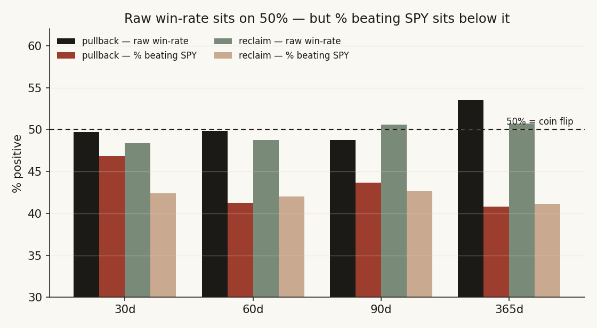
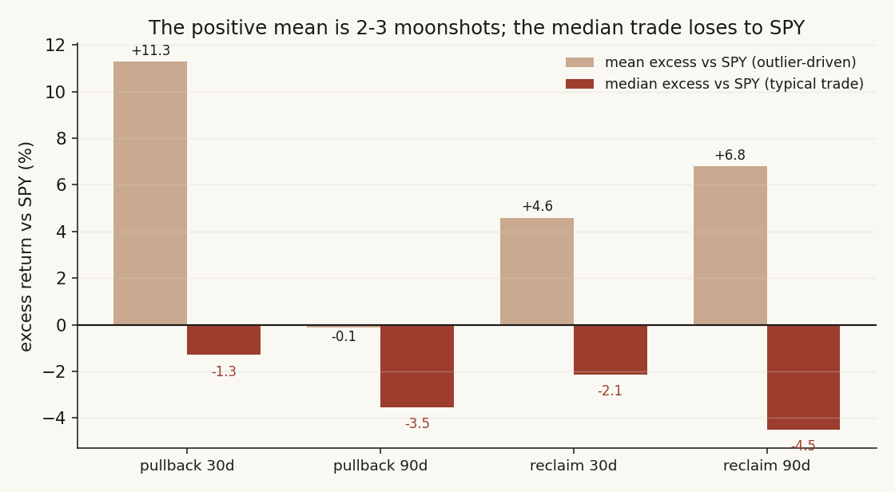
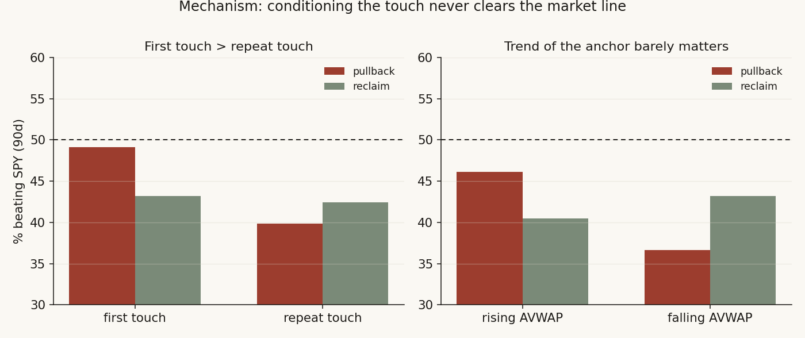

# 02 — Does buying the IPO-anchored VWAP touch beat the market?

**Question.** A popular technical claim: on a recently-IPO'd stock, buying when price pulls back to (or reclaims) the VWAP *anchored to the first trading day* is a high-probability entry. The naive test is the raw win-rate. The sharper question — the one that decides whether the rule is worth anything — is whether the trade **beats the market** the buyer could have owned instead. It does not.

**Finding.** **No, and the deeper test makes it worse.** The raw win-rate is a coin flip (~49%, every cell's bootstrap CI straddles 50%), exactly as a naive look suggests. But that ~49% is *cohort beta in disguise* — the 2022-onward IPO names rode a generally rising tape. Once each trade is measured against SPY over the same window, **fewer than 44% of touches beat the market** at most horizons, the median trade *loses* to SPY (90-day median excess −3.5% pullback / −4.5% reclaim), and the one positive headline number (reclaim mean excess +6.8%) is **2-3 microcap moonshots**, not a repeatable edge. Market-adjusted, the AVWAP touch is a mild *negative*-edge entry.

> Research / backtested. No live capital, no audited track record. The cohort is young IPOs only (2022-10 onward), an unusual regime — treat magnitudes as period-specific.

## Theory and hypothesis

The anchored VWAP from day one is, mechanically, the **volume-weighted average price every holder since the IPO has paid** — the cohort's aggregate cost basis. Practitioner lore (r/Daytrading, r/TechnicalAnalysis) treats it as dynamic support: when price falls back to the line, holders are "back to break-even," supply is supposedly absorbed, and the level should bounce. The trend-confirmation variant says a *reclaim* of the line (crossing back above after a period below) signals the cohort is whole again and momentum resumes.

There is a real economic prior on the other side. Two strands of the literature predict no exploitable edge here. First, **data-snooping in technical rules** (Sullivan, Timmermann & White 1999; Brock, Lakonishok & LeBaron 1992): rules that look compelling in-sample routinely vanish once tested against a proper benchmark and corrected for the many rules one could have tried. Second, the **IPO long-run underperformance puzzle** (Ritter 1991; reproduced on this exact cohort in [study 15](../15-ipo-chase/)): the 2022-onward aftermarket IPO is a base-rate loser versus the index. Any "entry rule" applied inside a losing cohort inherits that drag — so the right benchmark is not 50% (a coin flip) but the *market return over the same window*.

- **H0:** Buying the AVWAP touch produces returns indistinguishable from owning SPY over the same horizon — no market-adjusted edge (% beating SPY = 50%, median excess = 0).
- **H1 (the practitioner claim):** The touch is a high-probability entry — it beats SPY materially more than half the time.
- **H2 (the literature's prior, and what this study finds):** Inside a base-rate-losing cohort, the touch *underperforms* the market — % beating SPY < 50%.

## Method

Each method is chosen to separate **signal from cohort beta** and to keep the statistics honest under the heavy dependence in this kind of event sample.

- **Anchored VWAP** = cumulative Σ(vwap·volume)/Σ(volume) from the first trading day. Two entry signals: *pullback* (price ≥3% above the line recently, then closes within ±0.5% of it) and *reclaim* (price below the line ≥5 days, then closes back above). Forward windows: 30 / 60 / 90 / 365 calendar days. Events de-duplicated (one per 10 bars) so a single drift does not count many times.
- **Market-adjustment** — every trade's return is reported both raw *and* as **excess versus SPY over the identical window**. This is the core fix: the raw win-rate cannot tell signal from a rising tape, so the verdict is built on the excess metric and on the **share of trades beating SPY**.
- **Dependence-adjusted inference** — touch events cluster heavily within names and their forward windows overlap, so naive standard errors are far too tight. All confidence intervals come from a **cluster bootstrap that resamples whole tickers** (5,000 draws), which respects within-name correlation; reported *n* is paired with the **number of independent name-clusters**.
- **Robust central tendency** — IPO returns are fat-tailed, so the mean is dominated by a handful of moonshots. The verdict leans on the **median** and the **% beating SPY**, with a **winsorized mean** to show how much of any "positive mean" is tail-driven; a binomial **sign test** checks whether the share beating SPY differs from 50%.
- **Multiplicity** — eight cells are tested (two signals × four horizons), so raw bootstrap p-values are **Holm-corrected**.
- **Baselines, splits, costs** — a same-names random-entry baseline; a chronological **walk-forward** (in-sample <2025 vs out-of-sample ≥2025) at every horizon; a round-trip **transaction-cost** haircut; and **specification sensitivity** to the pullback band width.

## Data

- **Universe.** 881 IPOs listed since 2022-10 (the full warehouse IPO record for the window); 798 had usable daily price history, and **188 cleared a liquidity gate** (≥60 trading days, median dollar-volume > $1M, median price ≥ $4). *(The sibling [study 15](../15-ipo-chase/) reports 760 names: that count is its post-filter chase sample with a ≥$2 entry-price screen, whereas the 881 here is the raw pre-liquidity-gate universe — the two are the same vintage filtered at different stages.)*
- **Prices.** Split-adjusted daily bars with per-bar VWAP; SPY over the matched windows for market-adjustment.
- **Events.** 332 pullback touches across the liquid names (n=277–316 with a full forward window, 62–127 independent name-clusters per horizon); 495 reclaim events (n=209–467, 78–146 clusters).
- **Gaps disclosed.** The original offer price is unpopulated in the source, so the first-day fill is approximated by the first traded bar (the day-1 *pop* is not captured — consistent with study 15's tape-entry framing). Sector tags resolve for ~439 of 881 names, so the sector cut is indicative only.

## Descriptive — the anchored VWAP is a clean level to look at

The line behaves exactly as the chart-readers describe: price oscillates around its own cumulative cost basis, repeatedly returning to it. As a *descriptive* object the anchored VWAP is genuinely useful — it summarises where the average holder sits. The question is whether *acting* on the touch pays. The rest of this note is the analysis the descriptive picture cannot answer.

## Analysis

### 1. Test — the raw win-rate is a coin flip; the market-adjusted edge is negative

**Claim.** The touch carries no win-rate edge, and on a market-adjusted basis it is a mild loser.

**Evidence.** Raw win-rates sit on 50% across the board, and the cluster-bootstrap CIs straddle it at every cell — confirming the naive null. The market-adjusted view is the one that matters, and it sits *below* the coin-flip line:

| Pullback | n | clusters | raw win-rate [95% CI] | median excess vs SPY | % beating SPY | mean excess vs SPY [95% CI] |
|---|---:|---:|---:|---:|---:|---:|
| 30d | 316 | 127 | 49.7% [44.0, 55.5] | −1.3% | 46.8% | +11.3% [−0.8, +34.6] |
| 60d | 303 | 122 | 49.8% [43.6, 55.9] | −2.8% | 41.3% | +0.8% [−2.9, +4.5] |
| 90d | 277 | 114 | 48.7% [41.5, 55.5] | −3.5% | 43.7% | −0.1% [−4.9, +4.8] |
| 365d | 142 | 62 | 53.5% [42.0, 64.5] | −13.2% | 40.8% | +7.3% [−7.8, +23.6] |

| Reclaim | n | clusters | raw win-rate [95% CI] | median excess vs SPY | % beating SPY | mean excess vs SPY [95% CI] |
|---|---:|---:|---:|---:|---:|---:|
| 30d | 467 | 146 | 48.4% [43.8, 53.2] | −2.1% | 42.4% | +4.6% [+0.6, +9.8] |
| 60d | 433 | 138 | 48.7% [43.4, 54.4] | −4.1% | 42.0% | +5.4% [−0.1, +12.0] |
| 90d | 415 | 132 | 50.6% [44.9, 56.4] | −4.5% | 42.7% | +6.8% [+0.6, +14.1] |
| 365d | 209 | 78 | 50.7% [40.4, 60.9] | +1.0% | 41.1% | +10.3% [−7.0, +29.1] |

The raw win-rate / median / mean cells reconcile with the original study — the new columns are the market-adjustment. Three results stand out. (a) **Every raw win-rate CI spans 50%** — no edge on the naive metric, including the 365-day pullback (53.5% with CI [42.0, 64.5]), which the earlier write-up flagged but did not interval. (b) **% beating SPY sits below 50% at every horizon for both signals**, and the cluster-bootstrap CI on that share *excludes 50%* for reclaim at 30/60/90d (upper bounds 47.1 / 47.3 / 48.2%) and for the 60-day pullback (41.3%, CI excludes 50) — a dependence-adjusted *under*performance. (c) The **median excess is negative** in seven of eight cells; the reclaim 90-day median excess of −4.5% carries a cluster CI of [−8.1, −1.2], entirely below zero. A binomial sign test on the share beating SPY rejects 50% for reclaim 30/60/90d (p = 0.001 / 0.001 / 0.003) and the 60- and 90-day pullback (p = 0.003 / 0.041).

**Caveat.** The two "significant positive" *mean*-excess cells (reclaim 30d p=0.022, 90d p=0.027 before correction) are exactly the cells dismantled in §2 — and after Holm correction across the eight tests both rise to p≈0.086, no longer significant at 5%.

**Verdict.** H1 is rejected. The raw win-rate is a true coin flip; the market-adjusted edge is *negative*, and the cleanest dependence-adjusted statistics (% beating SPY, median excess) reject the coin-flip null in the *losing* direction.

### 2. Mechanism — the only positive number is two moonshots; conditioning the touch does not rescue it

**Claim.** The single positive headline (reclaim mean excess +6.8% at 90d) is a fat-tail artifact, and the practitioner refinements ("only the first touch," "only on a rising anchor") do not lift any subset over the market.

**Evidence.** The mean is the wrong statistic for this cohort. Of the reclaim 30-day summed excess, **two names — TOPW (+723%, one event) and ABVX (+305%, two events) — account for ~63%**; at 90 days TOPW and ABVX account for ~56%. Strip those three events and the reclaim 90-day mean excess falls from +6.8% to +3.0%, while the **median stays −4.6% and only 42% of trades beat SPY**. The winsorized (2.5%) mean excess collapses to ≈+1.5–1.9% — i.e. the positive mean is almost entirely the right tail, while the typical trade loses.

Conditioning on the practitioner refinements does not help. **First touches do beat repeats** (pullback first-touch beats SPY 49.1% of the time at 90d vs 39.9% for repeats; reclaim 43.2% vs 42.4%) — a real, sensible gradient (the first reclaim of a base is the textbook setup) — but *even the best subset still sits below the 50% market line*, with CIs spanning it. The slope of the anchor at the touch (rising vs falling AVWAP) barely moves the result.

**Caveat.** Subgroup *n* shrinks fast (first-touch pullback n=114, 62-name clusters), so the conditioned cells are indicative, not decisive — but none even points above 50%.

**Verdict.** The mechanism behind the lone positive number is tail luck in a few microcaps, not a property of the touch. The fundamental "why" — holders defending their cost basis — does not show up as a market-beating bounce.

### 3. Robustness — null survives walk-forward, costs, and specification

**Claim.** The result is not an artifact of one window, one spec, or pre-cost accounting.

**Evidence.** A chronological **walk-forward** holds: 90-day raw win-rate is 49.1% in-sample (<2025) vs 48.5% out-of-sample (≥2025) for pullback, and 48.6% vs 51.6% for reclaim — there was never an edge to overfit. **Transaction costs** push the pullback 90-day mean excess below zero at every cost level (−0.1% gross → −0.6% at 50 bps → −1.1% at 100 bps); the reclaim's positive mean is, again, the moonshot tail. **Specification sensitivity** to the pullback band confirms stability: widening ±0.5% → ±1.0% → ±2.0% moves the 90-day raw win-rate only from 48.7% to 52.3% to 51.2% — all on the coin-flip line.

| Robustness check | Result |
|---|---|
| Walk-forward 90d win-rate (pullback / reclaim) | IS 49.1% / 48.6% vs OOS 48.5% / 51.6% — stable null |
| Cost haircut, pullback 90d mean excess | −0.1% (0bp) → −0.6% (50bp) → −1.1% (100bp) |
| Pullback band ±0.5% / ±1.0% / ±2.0% (90d win-rate) | 48.7% / 52.3% / 51.2% — coin flip throughout |

**Caveat.** The OOS window (≥2025) is short and its 365-day cells thin (pullback n=38), so the long-horizon split is the weakest leg.

**Verdict.** Robust. The null is not a window or specification artifact, and costs only deepen it.

### 4. Alternatives — ruling out the competing explanations

**Claim.** The result is the touch having no edge, not a benchmark or sampling artifact.

**Evidence, by alternative.**
- *"It's just cohort beta, the signal is fine."* This is the **point**, not a confound — and it cuts against the rule. The raw 365-day pullback mean of +25.4% looks like an edge, but it is the IPO cohort riding the tape: market-adjusted it is +7.3% with a CI of [−7.8, +23.6] spanning zero, and the median excess is **−13.2%**. The raw win-rate's brush with 50% is the cohort's positive drift masking an underperforming entry.
- *"The random baseline shows a small positive edge."* The original same-names random baseline is unreliable at long horizons because it is contaminated by extreme survivors — its 365-day raw mean is +230% (one name up 27,000%+). That is exactly why this upgrade benchmarks against **SPY over the matched window** instead of a random IPO draw; the SPY-excess and %-beating-SPY metrics are immune to that contamination.
- *"Survivorship / look-ahead inflates it."* The anchored VWAP uses only information available up to the touch (cumulative VWAP to date); entries require ≥60 days of history; forward returns use only subsequent bars. Any survivorship in the liquidity gate would bias *toward* a positive result — yet the market-adjusted result is negative, so the bias works against the finding, not for it.

**Caveat.** Sector tags cover ~half the names, so a sector-specific edge in the untagged half cannot be fully excluded — but the tagged sector cells are all thin (n=15–50) and scatter around the market line.

**Verdict.** The competing explanations are ruled out; the residual is a genuine, mild *negative* market-adjusted edge.

## The answer, in the data

**Q: If I buy when price touches the IPO-anchored VWAP, does it beat the market?**
**A: No — and once you strip out the cohort's market beta, it slightly underperforms.** The raw win-rate is a coin flip (~49%, CIs straddle 50%), but that is the rising-tape cohort, not the signal. Market-adjusted, fewer than 44% of touches beat SPY at most horizons, the median trade loses to the index (90-day median excess −3.5% / −4.5%), and the only positive number is a couple of microcap moonshots. The anchored VWAP is a useful *descriptive* level — the cohort's average cost basis — but not a *predictive*, market-beating entry.

| Signal (90d) | n / clusters | Raw win-rate [CI] | % beating SPY | Median excess vs SPY | Verdict |
|---|---:|---:|---:|---:|---|
| Pullback to AVWAP | 277 / 114 | 48.7% [41.5, 55.5] | 43.7% | −3.5% | No edge; market-adjusted negative |
| Reclaim of AVWAP | 415 / 132 | 50.6% [44.9, 56.4] | 42.7% | −4.5% (CI [−8.1, −1.2]) | Underperforms SPY (sign-test p=0.003) |
| Reclaim mean excess (the one "positive") | 415 / 132 | — | — | +6.8% mean | Tail artifact: ~56% from 2 names |
| Best conditioned subset (first touch) | 114 / 62 | — | 49.1% | −0.7% | Still below the market line |

## Caveats

- Sample is young IPOs only (2022-10 onward) — an unusual cohort that rode a specific regime; no pre-2022 IPOs were available, so the *magnitude* is period-specific (the direction matches Ritter's decades of IPO-underperformance evidence).
- Entry is gated on traded price, not the original offer price (offer prices unavailable), so the first-day pop is excluded — by design, since retail buys the tape.
- Tests the *IPO* anchor specifically. A VWAP anchored to a later major high or low is a different question and is not addressed here.
- Returns are gross of costs except where the cost haircut is shown; the median/sign-test verdict is pre-cost (costs only deepen it). Fat-tailed cohort: means are reported but the verdict leans on median, % beating SPY, and cluster-robust CIs.
- The out-of-sample window (≥2025) and the sector cut are both thin — treated as indicative.

## References

- Ritter, J. (1991). *The long-run performance of initial public offerings.* Journal of Finance — the IPO-underperformance base rate this cohort inherits.
- Sullivan, Timmermann & White (1999). *Data-snooping, technical trading rule performance, and the bootstrap.* Journal of Finance — why "obvious" technical rules vanish once benchmarked and multiplicity-corrected.
- Brock, Lakonishok & LeBaron (1992). *Simple technical trading rules and the stochastic properties of stock returns.* Journal of Finance.
- Companion: [study 15 — chasing IPOs](../15-ipo-chase/) — the same cohort's base-rate underperformance versus SPY, the benchmark this note adjusts against.
- Practitioner communities (r/Daytrading, r/TechnicalAnalysis) on anchored-VWAP entries — the prior this note tests and falsifies.
